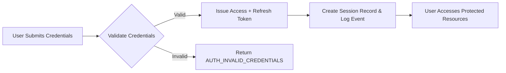
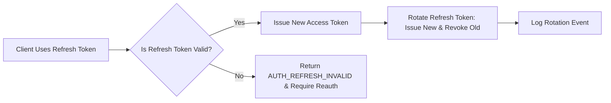

# User Actors and Authentication Requirements — shoppingMall

Scope: Define business-level actor definitions, authentication and session behaviors, authorization expectations, and audit/monitoring requirements for the shoppingMall platform. Audience: backend developers, QA, operations, and product owners.

## Actors and Role Summaries

- customer: Individual shoppers who register, manage shipping addresses and payment methods, place orders, view order history, submit reviews for purchased SKUs, and request cancellations/refunds within policy windows.

- seller: Third-party merchants who register, complete seller onboarding verification, create and manage product listings and SKUs, update SKU inventory, process and fulfill orders for their products, and manage shipment status and tracking.

- admin: Platform administrators who moderate sellers and listings, process escalated refunds and disputes, perform seller suspension/delisting, adjust configuration for platform policies, and access system-wide reporting and audit logs.

- support (business-operator): Customer service agents who may act on behalf of customers for limited operations (view order history, submit refund requests for manual review) and require auditable impersonation with explicit admin approval.

EARS requirement:
- THE platform SHALL treat "support" as a distinct actor with limited impersonation privileges requiring explicit admin authorization and audit trail entries for each impersonation action.

## Authentication Lifecycle Requirements (EARS)

Registration and Verification
- WHEN a new user submits registration information (email and password for customer; email, business name, and contact phone for seller), THE system SHALL create an account in state "email_unverified" and SHALL send a verification email containing a single-use verification token that expires after 24 hours.
  - Acceptance: Verification token email SHALL be issued within 30 seconds of registration in 95% of cases.
- IF the verification token is not used within 24 hours, THEN THE system SHALL mark the account verification as expired and SHALL allow the user to request a new verification token.
- WHERE a user registers as a seller, THE system SHALL place the account into "pending_onboarding" and SHALL prevent product creation until the seller completes required onboarding steps and an admin approves the seller profile.
  - Acceptance: Seller onboarding shall be visible as "pending_onboarding" and sellers SHALL NOT be able to publish SKUs prior to approval.

Login and Authentication
- WHEN a user attempts to log in with valid credentials, THE system SHALL issue an access token and a refresh token and SHALL record the login event in audit logs with timestamp, IP, and device metadata.
  - Acceptance: Successful login SHALL return tokens within 2 seconds (95th percentile) under nominal load.
- WHERE an account is configured to require MFA, THE system SHALL prompt for MFA after credential verification and SHALL not issue tokens until MFA is validated.
  - Acceptance: MFA failures SHALL be counted towards security monitoring and the user SHALL be allowed three MFA attempts before requiring fallback recovery.

Password Reset and Recovery
- WHEN a user requests password reset, THE system SHALL send a single-use reset token to the verified email address that expires after 1 hour and SHALL invalidate any previous reset tokens for that account.
- IF a reset token is used to set a new password, THEN THE system SHALL invalidate all existing refresh tokens for that user within 5 seconds and SHALL require reauthentication for all sessions.

Logout and Session Termination
- WHEN a user performs logout for a device, THE system SHALL revoke the refresh token associated with that device and SHALL mark the session as terminated in the audit log within 5 seconds.
- WHEN a user requests "revoke all sessions", THE system SHALL invalidate all refresh tokens for that user account and SHALL render existing access tokens unusable for refresh purposes within 10 seconds.

Acceptance criteria summary for lifecycle flows:
- Registration -> verification token issuance within 30 seconds (95% cases).
- Login token issuance within 2 seconds (95th percentile).
- Password reset token expiry enforced at 1 hour and revocation of refresh tokens within 5 seconds of password change.

## Token and Session Management (EARS)

Token Types and Lifetimes
- THE system SHALL issue short-lived access tokens and longer-lived refresh tokens.
- THE system SHALL set the default access token lifetime to 15 minutes and the default refresh token lifetime to 14 days for standard sessions.
- WHERE a user selects "Remember this device", THE system SHALL issue a refresh token with lifetime up to 30 days.
- WHERE an account is flagged as high risk, THE system SHALL reduce access token lifetime to 5 minutes and refresh token lifetime to 48 hours.

Token Claims (business-level expectations)
- THE system SHALL include the following claims in tokens: userId (unique identifier), role ("customer"|"seller"|"admin"|"support"), permissions (array of permission strings), issuer (platform identifier), issuedAt, expiry, and where applicable sellerId or tenantId for seller-scoped tokens.

Refresh Token Rotation and Revocation
- WHEN a refresh token is used to obtain a new access token, THE system SHALL rotate the refresh token by issuing a new refresh token and revoking the old refresh token.
- IF a revoked refresh token is presented (replay detected), THEN THE system SHALL revoke all refresh tokens for that user and require full reauthentication, AND SHALL create a high-severity security audit event.
- THE system SHALL provide per-device/session refresh token revocation. WHEN a refresh token is revoked, THE system SHALL ensure any new attempts to use that token are rejected and that an audit record is created.

Session Concurrency and Device Management
- THE system SHALL allow multiple concurrent sessions per user up to a configurable default of 10 simultaneous active sessions.
- WHEN number of active sessions for a user exceeds 10, THE system SHALL notify the user and recommend session cleanup; THE system SHALL not automatically revoke sessions without user action unless configured by policy.
- THE system SHALL provide a session listing to users including device label, issuedAt, lastSeenAt, IP geography (country), and a UI-accessible session-revoke action.

Idempotency and Token Use
- THE system SHALL require idempotency keys for token-consuming operations where appropriate and SHALL ensure refresh token exchanges are idempotent to protect against duplicate token issuance.

Acceptance criteria for token behaviors:
- Refresh token rotation SHALL detect reuse and trigger global revocation within 5 seconds of detection.
- Session listing query SHALL return full session metadata within 500ms for accounts with up to 50 active sessions.

## Authorization, Permissions, and RBAC (EARS)

Permission Model
- THE system SHALL adopt a role-based permission model where roles map to sets of permissions; permission checks SHALL be performed for each protected action.
- WHEN a request is made, THE system SHALL verify the token contains the required permission for the action and SHALL return an "AUTH_FORBIDDEN" error code if the permission is missing.

Permission Matrix (business-level)

| Action | customer | seller | admin | support |
|--------|:--------:|:------:|:-----:|:-------:|
| Register account | ✅ | ✅ | ❌ | ❌ |
| Verify email | ✅ | ✅ | ✅ | ✅ |
| Login | ✅ | ✅ | ✅ | ✅ |
| Manage profile | ✅ | ✅ | ✅ | (view-only) |
| Manage addresses | ✅ | ❌ | ✅ | ❌ |
| Manage payment methods | ✅ | ❌ | ✅ | ❌ |
| Browse product catalog | ✅ | ✅ | ✅ | ✅ |
| Create product listing | ❌ | ✅ | ✅ | ❌ |
| Update own product | ❌ | ✅ (own) | ✅ (global) | ❌ |
| Update inventory per SKU | ❌ | ✅ | ✅ | ❌ |
| View own orders | ✅ | ❌ | ✅ | ✅ (view-only) |
| View seller orders | ❌ | ✅ (own) | ✅ | ❌ |
| Process shipment updates | ❌ | ✅ | ✅ | ❌ |
| Request cancellation/refund | ✅ | ✅ (for own sales) | ✅ | ✅ (create support case) |
| Moderate reviews | ❌ | ❌ | ✅ | ❌ |
| Issue refunds | ❌ | ✅ (within seller limits) | ✅ | ❌ |
| Access reports | ❌ | ✅ (seller-level) | ✅ (global) | ✅ (restricted) |
| Impersonate user | ❌ | ❌ | ✅ (auditable) | ✅ (auditable, limited) |

EARS rules for financial dual-control
- WHEN an admin attempts a refund above the configured "admin_single_approval_limit" (business default: $1,000), THE system SHALL require a second admin approval before processing and SHALL record both approver IDs and reasoning in the audit trail.
- WHEN Operations Admins perform refunds below the single-approval limit, THE system SHALL still record the action in the audit trail including the admin id, amount, target order id, and rationale.

Forbidden actions and enforcement
- IF a seller attempts to modify a product not owned by their sellerId, THEN THE system SHALL reject the action with error code "AUTH_FORBIDDEN" and record the attempted access in audit logs.
- IF a non-admin attempts to access admin-only endpoints or financial operations, THEN THE system SHALL deny the request and increment a per-account suspicious activity counter.

Acceptance criteria for RBAC
- Permission checks SHALL block unauthorized actions and return standardized error codes within 200ms of the request under normal load.
- Dual-control workflows SHALL require and enforce second approver checks for financial actions above thresholds.

## Security Controls and Account Protection (EARS)

Password policy
- THE system SHALL enforce passwords of minimum length 10 characters and SHALL require at least one uppercase letter, one lowercase letter, one digit, and one special character.

Account lockout and brute-force protection
- WHEN failed login attempts for an account reach 5 within a rolling 15-minute window, THE system SHALL lock the account for 15 minutes and SHALL notify the account email with a security warning.
- IF locked account receives suspicious activity (multiple lockouts within 24 hours), THEN THE system SHALL escalate to manual review by Operations Admins.

MFA and high-risk accounts
- WHEN a user opts into MFA or is designated high-risk by fraud signals, THE system SHALL require a second factor (TOTP or equivalent) on login and for sensitive actions (refund initiation, payout detail changes).
- IF MFA device registration attempts exceed 3 failures, THEN THE system SHALL block further attempts for 24 hours and require support intervention.

High-risk account handling
- WHEN a user's behavior triggers high-risk rules (multiple chargebacks, mismatched shipping/billing geographies, or rapid high-value orders), THE system SHALL mark account as "high_risk" and SHALL restrict sensitive operations (new payouts, new listings) until manual review.

Acceptance criteria for security controls
- Account lockout SHALL trigger within 1 second of threshold breach and lock duration SHALL be enforced consistently for 15 minutes.
- MFA-required actions SHALL block token issuance until MFA is validated and SHALL log MFA success/failure events.

## Auditing, Logging, and Monitoring Requirements (EARS)

Audit event fields and retention
- THE system SHALL log the following fields for all security-sensitive events: eventId, eventType, actorId, actorRole, targetEntityId, action, timestamp (ISO 8601), clientIp, userAgent, deviceLabel, correlationId, and an optional free-text reason.
- THE system SHALL retain audit logs for a minimum of 7 years for financial and dispute-related events and 2 years for other security events, subject to jurisdictional overrides.

Audit availability and SLA
- WHEN an audit event is generated, THE system SHALL make the event searchable in admin or audit tools within 60 seconds in 95% of cases.

Required logged events (non-exhaustive)
- Authentication events: login success/failure, logout, refresh token exchange, token rotation, token revocation, MFA enrollment and validation events
- Account lifecycle events: registration, email verification, password reset requests, password changes
- Authorization boundary events: permission grants/revocations, role changes
- Financial-sensitive admin operations: refunds, manual payouts, settlement overrides, and dual-approval records
- Impersonation and support agent actions: start/stop impersonation, reason and admin approver

Monitoring and alerts
- THE system SHALL emit metrics and alerts for: failed login rate > 2% (1-hour window), refresh token rotation reuse detection, number of revoked tokens > threshold (configurable), and audit event ingestion failures.
- WHEN a reuse of rotated refresh token is detected, THE system SHALL create a high-severity security alert and SHALL revoke all refresh tokens for the affected user account within 5 seconds.

Acceptance criteria for auditing/monitoring
- Audit events for login and token rotation SHALL be visible in the admin audit UI within 60 seconds for 95% of events.
- Security alerts for rotated refresh-token reuse SHALL trigger notify-to-ops within 30 seconds of detection.

## Error Handling and Standardized Error Codes

Standardized error codes (examples)
- AUTH_INVALID_CREDENTIALS — invalid username/password
- AUTH_ACCOUNT_LOCKED — account locked due to failed attempts
- AUTH_TOKEN_EXPIRED — access token expired
- AUTH_REFRESH_INVALID — refresh token invalid or revoked
- AUTH_FORBIDDEN — insufficient permissions for attempted action
- AUTH_MFA_REQUIRED — MFA required for this account/action

Error handling rules (EARS)
- IF an access token is expired and a valid refresh token is provided, THEN THE system SHALL return AUTH_TOKEN_EXPIRED for the API response and SHALL accept a refresh flow to issue new tokens.
- IF a refresh token is presented that has been revoked or detected as reused after rotation, THEN THE system SHALL return AUTH_REFRESH_INVALID and SHALL revoke all sessions for that account.
- IF too many failed refresh attempts (>5 within 10 minutes) are observed for a user, THEN THE system SHALL temporarily block refresh operations for that user for 30 minutes and SHALL notify security operations.

Acceptance criteria for error handling
- Token refresh failures due to reuse SHALL be detected and global session revocation initiated within 5 seconds.
- Standardized error responses SHALL be returned within 200ms for auth validation failures under nominal load.

## Performance and SLA Requirements (Authentication-focused)

- Login latency: WHEN a valid login request is submitted under nominal load, THE system SHALL issue tokens within 2 seconds in 95% of requests.
- Refresh latency: WHEN a refresh token exchange is performed, THE system SHALL respond within 1 second in 95% of requests.
- Session listing: WHEN a user requests session listing, THE system SHALL return current sessions within 500ms for accounts with <=50 sessions.
- Token revocation SLA: WHEN a user revokes sessions, THE system SHALL invalidate refresh tokens and prevent further refresh usage within 10 seconds.

## Acceptance Tests and Example Test Cases (Business-facing)

Test A: Registration and Email Verification
- GIVEN a new customer provides a unique email and a compliant password, WHEN they register, THEN the system SHALL create an account in "email_unverified" state and SHALL send a verification token within 30 seconds.
- GIVEN the user clicks the verification link within 24 hours, WHEN the token is valid, THEN the account SHALL transition to "active" and the user SHALL be able to place orders.

Test B: Login and MFA
- GIVEN a user with MFA enabled provides correct credentials, WHEN they complete MFA, THEN the system SHALL issue tokens and record login event; repeated MFA failures (3 attempts) SHALL require support intervention.

Test C: Refresh Token Rotation and Reuse Detection
- GIVEN a refresh token exchange was performed and the old refresh token is later presented again (replay), WHEN the reuse is detected, THEN THE system SHALL revoke all refresh tokens for the user and create a high-severity audit event within 5 seconds.

Test D: Permission Enforcement
- GIVEN a seller attempts to modify another seller's product, WHEN request is made, THEN the system SHALL return AUTH_FORBIDDEN and SHALL log the attempt in the audit trail.

## Mermaid Diagrams

Authentication flow:

Refresh token rotation flow:

## Glossary and Definitions
- Access token: short-lived credential used to authorize API calls (default 15 minutes).
- Refresh token: longer-lived credential used to obtain new access tokens (default 14 days).
- Rotation: replacing a refresh token at the time of exchange and invalidating the previous token.
- Session: a device-bound instance of authentication with associated refresh token and metadata.
- EARS: structured requirement phrasing using WHEN/IF/THE SHALL/THEN to make requirements testable.

## References and Traceability
- Map each EARS requirement above to functional acceptance tests and QA cases. Ensure audit logging and monitoring requirements are enforced by operational tooling and incident processes.

# End of User Actors and Authentication Requirements
