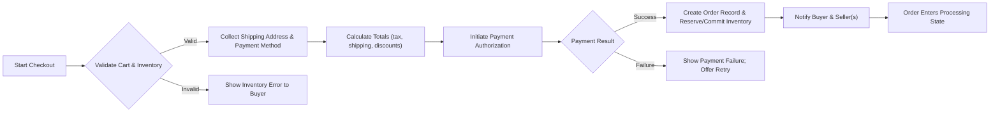
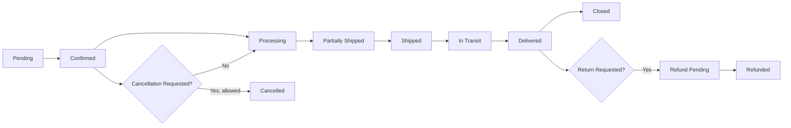
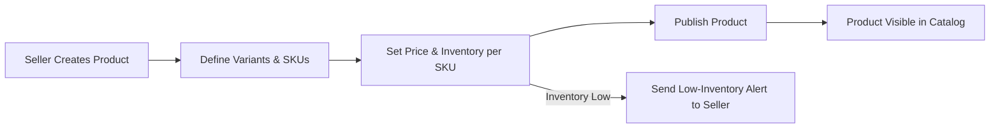
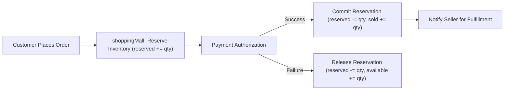

# Functional Requirements — shoppingMall

## Executive summary
shoppingMall connects shoppers and independent sellers in a single marketplace that supports SKU-level variants, per-SKU inventory management, persistent carts and wishlists, secure payments, order lifecycle tracking, seller-managed product catalogs, review moderation, and an admin dashboard for governance. The following requirements describe the expected business behaviors, workflows, validation rules, and acceptance criteria required for implementation. All time windows below use Asia/Seoul (KST) for interpretation; durations are expressed in minutes/hours/days so they remain timezone-agnostic.

## Scope and audience
Scope: core marketplace features required for MVP: user registration and address management, product catalog and search, SKU-level variants, shopping cart and wishlist, checkout and payment flow, order lifecycle and shipping updates, reviews and ratings, seller accounts and inventory management, order history and refund/cancellation flows, and admin/support operations.
Audience: product owners, backend developers, QA engineers, operations, and stakeholder decision-makers.

## Conventions and service prefix
- Service prefix: "shoppingMall" — use consistently in all requirement statements.
- EARS phrasing: all functional requirements use WHEN/IF/THEN/THE/SHALL where applicable and include measurable success criteria.
- Defaults (configurable): address limit = 10 per customer; SKU-per-product combinatorial limit = 500; inventory reservation window = 15 minutes; review window after delivery = 365 days; refund default window after delivery = 14 calendar days; default search page size = 20.

## Roles and permission matrix (business-level)
Roles: guest, customer, seller, supportAgent, admin.

Permission summary (business-readable):
- guest: BrowseCatalog, SearchProducts, ViewProduct, AddTemporaryWishlist
- customer: All guest permissions + Register/Login, ManageProfile, ManageAddresses, CartManagement, PlaceOrder, ViewOwnOrders, RequestCancelRefund, WriteReview (for eligible purchases)
- seller: SellerProductManagement, InventoryManagement, ViewOrdersContainingSellerSKUs, UpdateShippingStatus, RespondToBuyerQuestions
- supportAgent: ViewAllOrders, ProcessRefunds (within delegated limits), UpdateOrderStatus (support actions), ModerateReviews
- admin: AdminFull (all platform-level management, audit, policy enforcement)

Permission notes: seller visibility is limited to orders containing their SKUs; supportAgent and admin may view all orders for troubleshooting and audit.

## Authentication and session management (business requirements)
- WHEN a new user registers, THE shoppingMall SHALL collect email and password, create an account in unverified state, and send a verification message to the provided email address. Verification token expiry default is 72 hours (configurable).
- WHEN a user verifies their email, THE shoppingMall SHALL change account state to Active and permit checkout and other authenticated actions.
- WHEN a user authenticates with valid credentials, THE shoppingMall SHALL create an authenticated session and issue short-lived access credentials and long-lived refresh credentials in accordance with platform policy: recommended access credential lifetime 15–30 minutes and refresh credential lifetime 7–30 days (configurable by policy). Access must be revocable by session invalidation.
- IF an account experiences more than 10 failed authentication attempts within a 15-minute sliding window, THEN THE shoppingMall SHALL apply a temporary lockout of the account for 15 minutes and require password reset or manual intervention.
- WHEN a user requests password recovery, THE shoppingMall SHALL send a single-use recovery token valid for 1 hour and require verification of email ownership before allowing password change. After password change, THE shoppingMall SHALL invalidate existing active sessions.

Authentication acceptance criteria:
- 95% of successful logins shall complete within 2 seconds under normal load. Token revocation shall propagate within 60 seconds across active sessions.

## Conceptual data entities and relationships (business-level)
- User(userId, role, email, verifiedFlag, displayName)
- Address(addressId, userId, recipient, line1, line2, city, postalCode, country, phone, isDefault)
- SellerProfile(sellerId, displayName, status, payoutInfo)
- Product(productId, sellerId, title, description, categoryId, images, status)
- SKU(skuId, productId, attributesMap, price, currency, availableInventory, reservedInventory)
- Cart(cartId, userId or guestToken, items[{skuId, quantity, addedAt, reservedUntil}])
- Order(orderId, buyerId, orderLines[{skuId, quantity, unitPrice, sellerId}], totals, shippingAddressId, state, paymentState, createdAt)
- Shipment(shipmentId, orderId, sellerId, carrier, trackingNumber, status, events[])
- Review(reviewId, skuId, buyerId, rating, text, photos, moderationState)
- RefundRequest(refundId, orderId, requesterId, reason, requestedAt, status)
- InventoryEvent(eventId, skuId, delta, reason, actorId, timestamp)

Relationships: Product owned by SellerProfile; Product contains SKUs; Order contains OrderLines mapping SKUs to Sellers; Shipment maps to seller-level fulfillment for one or more order lines.

## Detailed functional requirements (EARS) and acceptance criteria
All requirements below are testable, measurable, and use EARS phrasing.

### 1. User registration, profile, and address management
- WHEN a new user registers, THE shoppingMall SHALL create an account in unverified state and SHALL send a verification email to the provided address. (acceptance: verification email delivered within 5 minutes for 98% of signups)
- WHEN a verified customer adds an address, THE shoppingMall SHALL allow creation, update, deletion, and designate one default address. Each customer SHALL be permitted up to 10 saved addresses by default (configurable). If the customer attempts to add an 11th address, THEN THE shoppingMall SHALL reject the action with error code "address_limit_reached".
- IF a customer attempts to delete an address that is default for an order in state "Processing" or later where shipping depends on that address, THEN THE shoppingMall SHALL prevent deletion and require the customer to select an alternate address or cancel the pending order.
- WHEN an address is saved, THE shoppingMall SHALL validate presence of required fields (recipient name, line1, city, postalCode, country, phone) and SHALL return field-level validation messages within 2 seconds.

### 2. Product catalog, categories, and search
- THE shoppingMall SHALL present a hierarchical category model and support tags for faceted browsing.
- WHEN a seller publishes a product, THE shoppingMall SHALL index product metadata so that the product becomes searchable and discoverable in category pages within 30 seconds for 95% of publish events.
- WHEN a shopper performs a search query, THE shoppingMall SHALL return paginated results (default page size 20) sorted by configured relevance rules and SHALL respond within 2 seconds for 95% of common queries under normal load.
- IF a product is unpublished or removed, THEN THE shoppingMall SHALL remove it from public search and category listings within 60 seconds.

### 3. Product variants and SKU management
- THE shoppingMall SHALL treat each sellable variant combination as an SKU with its own price, images, and inventory counts.
- WHEN a seller defines variant attribute types (e.g., "color", "size"), THE shoppingMall SHALL generate SKU combinations and SHALL allow the seller to override SKU-level fields (price, images, inventory).
- IF a seller attempts to create more than 500 SKU combinations for a single product, THEN THE shoppingMall SHALL reject additional SKU creation and return error code "sku_limit_exceeded"; admin MAY raise this limit.

### 4. Inventory management and reservation semantics
- WHEN a customer adds an SKU to cart, THE shoppingMall SHALL check availableInventory and create a short-term reservation for the requested quantity for the reservation window (default 15 minutes, configurable). The reservation record SHALL include cart id, reserved quantity, reserve timestamp, and expiry timestamp.
- IF the reservation expires without payment capture, THEN THE shoppingMall SHALL release the reserved quantity to availableInventory and SHALL notify the cart owner on next interaction.
- WHEN payment is confirmed/captured for an order, THE shoppingMall SHALL convert reservations into committed inventory and decrement availableInventory permanently for the ordered quantities within 30 seconds of payment confirmation for 95% of cases.
- IF a seller manually attempts to reduce availableInventory below committed quantities for existing orders, THEN THE shoppingMall SHALL prevent the update and log a reconciliation task for ops.
- WHEN inventory inconsistency is detected (e.g., negative availableInventory due to reconciliation errors), THEN THE shoppingMall SHALL create a reconciliation incident, notify supportAgent, and set affected SKUs to "reconciliation_required" until resolved.

Concurrency acceptance test: Simulate two concurrent checkout attempts for the last available unit of an SKU; exactly one order SHALL succeed and the other SHALL receive an out-of-stock error; reconciliation incidents SHALL not be required.

### 5. Shopping cart and wishlist
- WHEN a guest adds items to a cart, THE shoppingMall SHALL persist a temporary guest cart for 30 days; upon first successful login, THE shoppingMall SHALL offer to merge guest cart items into the customer's persistent cart.
- WHEN an authenticated customer modifies their cart (add/update/remove), THE shoppingMall SHALL validate inventory and present immediate availability feedback within 1 second for 99% of operations.
- WHEN items remain in cart longer than the reservation window, THE shoppingMall SHALL release reservations and SHALL mark cart items as "quantity_unavailable" until user action.

### 6. Checkout, order placement, and payment processing
- WHEN a customer initiates checkout, THE shoppingMall SHALL validate cart contents (SKU existence, prices, promotions), selected shipping address, and shipping method, and SHALL calculate order totals including taxes and shipping.
- IF any line item is unavailable at checkout validation, THEN THE shoppingMall SHALL surface the exact SKU(s) and offer options to reduce quantity, remove item, or wait for restock.
- WHEN payment authorization is requested, THE shoppingMall SHALL attempt authorization and SHALL mark the order paymentState as one of: "authorized", "captured", "failed", or "refunded". Payment provider latency is external; shoppingMall SHALL show clear status and retry options.
- WHEN authorization succeeds and payment is captured (if capture separate), THE shoppingMall SHALL create the final order record with per-seller sub-orders for fulfillment and convert reservations to committed inventory.
- IF payment fails, THEN THE shoppingMall SHALL not finalize the order and SHALL preserve the cart for customer retry. The shoppingMall SHALL release reservations if configured policy dictates or retain for a short retry window (default retry window 15 minutes).

Payment acceptance criteria: For synchronous gateways, 95% of authorization responses SHALL return within 3 seconds under normal load.

### 7. Order lifecycle, shipping updates, and customer notifications
- THE shoppingMall SHALL represent order lifecycle states: "Pending", "Confirmed", "Processing", "Partially Shipped", "Shipped", "In Transit", "Delivered", "Cancelled", "Refunded", "Closed".
- WHEN a seller marks an order-line as shipped and provides carrier and tracking, THE shoppingMall SHALL create a Shipment record and SHALL surface shipment tracking to the buyer within 60 seconds.
- WHEN carrier events are available via integration, THE shoppingMall SHALL reconcile carrier milestones to shipment state and notify customers according to their notification preferences (email by default) within 1 hour of carrier event for 95% of events.
- WHEN an order transitions state due to admin or supportAgent action (refund, cancellation, manual adjustment), THE shoppingMall SHALL log actor id, timestamp, reason, and publish the change to buyer and seller.

### 8. Order history, cancellation, refunds, and returns
- WHEN a customer requests cancellation prior to shipment (state < "Shipped"), THE shoppingMall SHALL permit cancellation and SHALL release inventory and initiate refund if payment captured. Cancellation requests SHALL be acknowledged to customer within 10 minutes.
- WHEN a customer requests a refund after delivery within the configured refund window (default 14 days), THE shoppingMall SHALL record the refund request, route to supportAgent or seller per policy, and SHALL update order-state to "Refund Pending" until resolved.
- WHEN a refund is approved, THE shoppingMall SHALL mark associated order-lines as refunded, SHALL update buyer and seller records, and SHALL restock SKUs per restock policy (configurable: automatic restock for returns marked as "received" by seller).
- IF a refund is over a configured manual threshold (example default $1000), THEN THE shoppingMall SHALL require admin approval before issuing funds.

### 9. Product reviews and rating moderation
- WHEN a buyer of an SKU with delivered state submits a review within the review eligibility window (default 365 days), THE shoppingMall SHALL accept the review and publish it pending automated policy checks.
- IF automated moderation flags the review for prohibited content or fraud, THEN THE shoppingMall SHALL set the review to "Pending Moderation" and SHALL hide it from public view until manual review completes.
- WHEN a review is removed for policy violation, THE shoppingMall SHALL record the moderation action with moderator id, reason code, and timestamp.

### 10. Seller account and product management
- WHEN a prospective seller registers, THE shoppingMall SHALL collect seller profile information and optional verification documents. The seller account SHALL be in "PendingVerification" until required checks complete if verification is mandated for the category.
- WHEN a seller publishes a product, THE shoppingMall SHALL record seller ownership and SHALL permit seller-only edits to price, inventory, images, and SKU attributes. Product visibility rules MAY require admin approval for restricted categories.
- IF a seller deactivates a product with active orders, THEN THE shoppingMall SHALL prevent deletion and SHALL mark the product as "Closed to New Orders" while preserving data for existing order fulfillment.

### 11. Admin dashboard and support workflows
- WHEN an admin or supportAgent performs an action that modifies orders, refunds, or seller status, THE shoppingMall SHALL log an auditable record including actor id, timestamp, action type, and reason. Audit records SHALL be immutable for at least 2 years (legal to confirm).
- WHEN a dispute is escalated to admin, THE shoppingMall SHALL require admin to record a final decision and rationale within 72 hours of escalation and SHALL notify buyer and seller of the resolution.

## Workflows and mermaid diagrams (business flows)

Checkout & Order Creation (graph LR):

Order Lifecycle (graph LR):

Seller Product Management (graph LR):

Inventory Reservation (graph LR):

## Business rules and validation constraints (concise testable rules)
- WHEN a quantity requested exceeds availableInventory, THEN THE shoppingMall SHALL prevent the add-to-cart or checkout and SHALL return a precise message naming the affected SKU(s).
- WHEN an SKU's availableInventory reaches zero, THEN THE shoppingMall SHALL mark the SKU as "Out of Stock" and SHALL remove purchase controls on storefront views.
- IF a seller attempts to adjust inventory that would cause negative availableInventory relative to committed quantities, THEN THE shoppingMall SHALL reject the change and create a reconciliation ticket.
- WHEN refunds are processed, THE shoppingMall SHALL record whether refund is seller-funded or platform-funded and SHALL update seller payout calculations accordingly.

## Non-functional requirements and measurable targets
- Performance: search first-page responses <= 2 seconds for 95% of common queries; product detail render <= 1.5 seconds for 95%.
- Authentication: 95% of successful logins <= 2 seconds under normal load.
- Checkout internal processing (order creation + reservation) <= 3 seconds for 99% of transactions under normal load (payment gateway excluded).
- Availability: core buyer flows target 99.9% monthly availability in primary region.
- Inventory consistency: target oversell incidents < 0.5% of paid orders per month at launch.

## Error scenarios and recovery flows (user-facing)
- Payment failure: inform user with non-technical reason (card_declined, insufficient_funds, gateway_error), preserve cart, and provide retry pathways; release reservation based on retry policy.
- Inventory race: if a concurrent sale reduces availability during checkout, present a line-level conflict message and offer alternatives (reduce quantity, choose different SKU, or remove item).
- Seller unresponsive/failed fulfillment: if seller fails to mark shipped within SLA (default 48 hours for physical goods), THEN THE shoppingMall SHALL notify supportAgent and the buyer and may apply platform remediation per policy.

## Acceptance criteria and example tests
- Concurrency test: simulate 100 concurrent checkout attempts for a single-unit SKU; precisely one order shall succeed; others shall receive out-of-stock errors.
- Publish-to-search test: publish 1,000 sample products; 95% shall be searchable within 30 seconds under normal indexing load.
- Checkout end-to-end success: 99% of valid payment attempts during a controlled load test shall result in order creation and reservation commit within 3 seconds (gateway latency excluded).

## Monitoring, audit, and operational expectations
- Audit trail: all admin/support actions, inventory changes, refunds, and settlement adjustments SHALL be auditable with actor id, timestamp, and reason.
- Alerts: generate alerts for checkout failure spikes (>2% sustained for 3 minutes), payment gateway errors, inventory reconciliation failures, and carrier exception rates above configured thresholds.
- Incident response: incident detection target MTTD <= 5 minutes and MTTR target for critical incidents <= 4 hours during business hours.

## Open decisions for stakeholders
- Payment routing model: platform-collected-and-then-payouts vs. direct split payments to sellers. Stakeholder decision required for accounting and KYC impacts.
- Refund and return policies per category: confirm default refund window, restocking fee policy, and who bears return shipping costs.
- Seller verification policy: define KYC thresholds and whether certain categories require manual approval prior to publishing.
- SKU-per-product combinatorial policy: confirm whether 500 limit is acceptable or should be raised.

## Appendix: glossary and key constants
- reservation_window_default = 15 minutes
- address_limit_default = 10
- sku_limit_default = 500
- review_window_default = 365 days
- refund_window_default = 14 days after delivery

## Developer handoff note
All requirements above are business-level and testable acceptance criteria. Developers shall convert these into technical designs (API contracts, data models, and infra) consistent with security and compliance decisions. Audit and monitoring details must be implemented to satisfy the acceptance and operational expectations above.

# End of Functional Requirements
