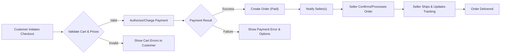
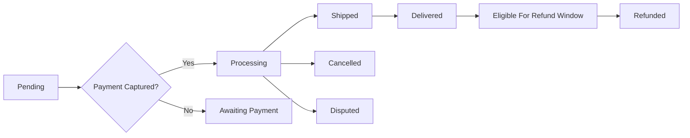
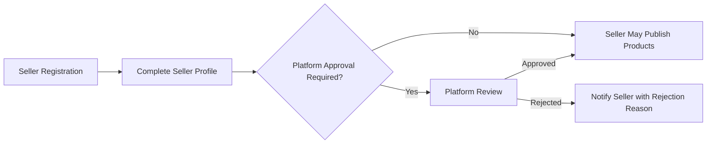

# Functional Requirements — shoppingMall

## 1. Overview and Purpose

Provide business-level functional requirements for the shoppingMall marketplace platform. Requirements are written in EARS format (WHEN, THE, SHALL, IF, THEN, WHERE) and include measurable acceptance criteria, error-handling expectations, and performance SLAs. These requirements define WHAT the platform must do from a business perspective. Implementation details (API design, database schemas, UI) are intentionally omitted.

## 2. Conventions and Assumptions
- EARS conventions are used throughout: WHEN/IF introduce conditions; THE SHALL state mandatory system behavior; THEN indicates expected outcomes.
- Time values are expressed in business-friendly units (minutes, hours, days) and reference Asia/Seoul timezone for time-sensitive operations.
- Performance SLAs use percentile language (e.g., 95th percentile) for measurable targets.
- Actors: customer, seller, admin as business roles. Authentication tokens and session behaviors are described at a business level (see Actor section).

## 3. Actors and Permission Summary (Business Terms)

- customer: Registers, authenticates, manages addresses and payments, places orders, writes reviews, views order history, requests cancellations/refunds.
- seller: Onboards, creates and manages products and SKUs, updates inventory, views and processes orders for their catalog, updates shipping with carriers and tracking.
- admin: Moderates listings and reviews, approves/ suspends sellers, processes escalated refunds, accesses platform reports and audit logs.

EARS permission summary:
- THE system SHALL restrict sellers to manage only their own products and orders. THE system SHALL allow admin to manage global platform entities and to audit all actions.
- WHEN a customer requests an operation on an order, THE system SHALL only allow the operation if the actor is the order owner or an admin acting with appropriate justification.

Permission matrix (business mapping):
- THE system SHALL enable role-specific actions: create product (seller, admin), update inventory (seller, admin), place order (customer), moderate reviews (admin).

## 4. Functional Requirements (EARS-based)
All requirements below are written in business terms and include acceptance criteria and error scenarios where applicable.

### 4.1 Registration and Account Management
- WHEN a prospective customer provides an email and password to register, THE system SHALL create an account in "email_unverified" state and SHALL send a verification link to the provided email address.
  - Acceptance: 95% of verification emails shall be delivered to valid inboxes within 60 seconds of registration under nominal load.
  - Error scenario: IF delivery fails due to bounce, THEN THE system SHALL mark the email as invalid and prompt the user to provide another address.
- WHEN a user completes email verification, THE system SHALL set account state to "active" and SHALL permit order placement.
  - Acceptance: Account activation shall be reflected within 30 seconds of verification.
- THE system SHALL enforce password requirements: WHEN a password is submitted at registration or reset, THE system SHALL require at least 10 characters, one uppercase, one lowercase, one digit, and one special character.
  - Acceptance: 100% of stored passwords must match the policy at time of creation; password strength failures return error code AUTH_PASSWORD_WEAK.
- WHEN a user requests a password reset, THE system SHALL issue a single-use token that expires in 1 hour and SHALL allow password change only after token validation.
- WHEN a seller account is registered, THE system SHALL set seller state to "pending_verification" until required documents are submitted and admin approval is recorded.
  - Acceptance: Admin review shall complete within 5 business days for non-exceptional cases.
- IF a user requests account deletion, THEN THE system SHALL anonymize PII within 30 days while preserving transactional records for 7 years for compliance.

### 4.2 Product Catalog, Categories, and Search
- THE system SHALL model a hierarchical category tree and SHALL allow products to be assigned to multiple categories.
- WHEN a seller publishes a product, THE system SHALL require product title, primary category, at least one SKU, and a default price; missing required fields SHALL trigger validation errors.
- WHEN a customer performs a keyword search, THE system SHALL return results sorted by relevance by default and SHALL support alternative sorts: "price_asc", "price_desc", "newest", "best_seller".
  - SLA: Search queries returning top 20 results shall complete within 300 milliseconds 95% of the time under nominal load.
- IF a product is marked inactive by seller or admin, THEN THE system SHALL exclude it from search and category listings within 60 seconds in 95% of cases.
- WHEN a seller changes inventory to zero for all SKUs of a product, THE system SHALL mark the product as "out_of_stock" and SHALL apply deprioritization rules in search ranking.

### 4.3 Product Variants and SKU Model
- THE system SHALL represent products as collections of SKUs; each SKU SHALL map to a unique combination of variant attributes (e.g., color, size).
- WHEN a seller creates SKUs, THE system SHALL require each SKU to include SKU id, price (in smallest currency unit), and inventory quantity (integer >= 0), and SHALL reject negative quantities.
- IF a SKU price is changed after an order authorization but before capture, THEN THE system SHALL honor the originally authorized price for that order and SHALL record the price-change event timestamp.
- WHEN a seller enables backorder for a SKU, THE system SHALL allow purchase beyond available inventory and SHALL require an expected ship date to be displayed to customers.

### 4.4 Cart and Wishlist
- THE system SHALL maintain a persistent shopping cart tied to authenticated customer accounts that preserves items across devices for 90 days of inactivity.
- WHEN a customer adds a SKU to the cart, THE system SHALL validate requested quantity against available inventory and SHALL prevent adding more than allowed unless the SKU is backorder-enabled.
- THE system SHALL provide a wishlist up to 500 items per customer; wishlist additions SHALL NOT reserve inventory.
- WHEN an anonymous (guest) cart is merged to an authenticated account, THE system SHALL sum quantities of identical SKUs up to a per-SKU purchase limit (configurable, default 99) and SHALL present conflicts to the user.

### 4.5 Checkout, Orders, and Payments
- WHEN a customer initiates checkout, THE system SHALL revalidate cart items for availability and price consistency and SHALL reserve inventory for the configured reservation window (default 15 minutes).
  - Acceptance: Reservation requests shall complete within 5 seconds 95% of the time under nominal load.
- IF any SKU quantity exceeds sellable inventory at checkout, THEN THE system SHALL return an itemized message identifying impacted SKU(s) and SHALL prevent order placement for those items.
- WHEN payment is authorized successfully, THE system SHALL create an order with business state "payment_captured" or equivalent and SHALL record payment provider transaction id for reconciliation.
- THE system SHALL support both authorize-only and immediate-capture payment flows as configurable business options per seller or transaction.
  - SLA: Payment authorization requests to external providers shall return a definitive response within 7 seconds 99% of the time.
- IF an external payment provider times out, THEN THE system SHALL set order state to "payment_timeout_pending" and present retry options to the customer; an operational alert SHALL be raised for provider reliability monitoring.

### 4.6 Order Lifecycle and Shipping
- THE system SHALL enforce the business order lifecycle states: "pending", "authorized", "paid", "processing", "shipped", "delivered", "cancelled", "refunded", "disputed".
- WHEN a seller provides shipment info (carrier and tracking), THE system SHALL transition the associated sub-order state to "shipped" and SHALL publish tracking information to the customer within 60 seconds.
- IF a carrier webhook indicates delay or exception, THEN THE system SHALL notify the customer and flag the order for seller follow-up within 2 hours.
- WHEN tracking indicates delivery, THE system SHALL mark order delivered and SHALL begin the defined refund eligibility window (default 30 days) for returns.

### 4.7 Inventory Management
- THE system SHALL maintain inventory at SKU level per seller with explicit fields for "available", "reserved", and "committed" counts.
- WHEN an order payment is captured, THE system SHALL atomically decrement committed inventory for each SKU to avoid overselling.
- IF inventory decrement fails due to concurrency, THEN THE system SHALL retry up to 3 times with exponential backoff; upon persistent failure, THE system SHALL revert payment capture where possible and open an operations reconciliation case.
- THE system SHALL support manual inventory adjustments by sellers; adjustments >= 10 units or >20% change SHALL require an audit reason to be recorded.
- THE system SHALL perform daily inventory reconciliation and SHALL flag discrepancies greater than a configurable threshold (default 2% of units) for operations review.

### 4.8 Seller Account Features and SLAs
- THE system SHALL collect seller profile data and tax/business identifiers at onboarding and SHALL restrict listing capabilities until required fields are completed.
- WHEN a seller lists a product in restricted categories, THE system SHALL route the listing to a moderation queue and SHALL notify the seller of expected review time (default 48 hours).
- THE system SHALL monitor seller metrics (on-time-shipment, cancellation, refund rates) and SHALL flag sellers exceeding thresholds (configurable; default: refund rate > 5% in 30 days) for review and potential restrictions.
- IF a seller accumulates repeated SLA violations, THEN THE system SHALL apply progressive penalties up to temporary suspension or delisting per policy.

### 4.9 Product Reviews and Ratings
- THE system SHALL allow customers who purchased a SKU to submit a rating (1-5) and a review (10–2000 chars) within 365 days of delivery.
- WHEN a review is submitted, THE system SHALL mark it as "verified_purchase" if purchase records confirm the reviewer bought the SKU.
- IF a review contains abusive or prohibited content (detected by automated filters), THEN THE system SHALL hide the review and route it to moderation; moderation decisions SHALL be completed within 48 hours.
- THE system SHALL allow customers to edit or delete their review within 48 hours of submission; after 48 hours only admins may alter the review.

### 4.10 Order History, Cancellation, Refund Requests
- THE system SHALL retain order history for at least 7 years unless law requires longer retention.
- WHEN a customer requests cancellation, THE system SHALL allow cancellation only while order in "pending" or "authorized" state and within 60 minutes of placement unless seller policy allows otherwise.
- IF cancellation requested after fulfillment has started, THEN THE system SHALL initiate a return flow and follow refund policy timelines; admin escalation SHALL be available for exceptions.
- WHEN a refund is approved, THE system SHALL initiate refund with payment provider and SHALL record provider refund id and timestamps for reconciliation. Refunds SHALL be initiated within 72 hours of approval.

### 4.11 Admin Dashboard and Moderation
- THE system SHALL provide admin capabilities to view and change order states, process refunds, delist products, and suspend/terminate seller accounts; all admin actions SHALL be recorded in an audit trail with admin id and reason.
- WHEN admin suspends a seller, THE system SHALL prevent new listings and disallow new orders for the suspended catalog while preserving in-flight orders for fulfillment.
- THE system SHALL provide reporting dashboards for GMV, refunds, chargebacks, seller performance, and inventory discrepancies and SHALL send alerts when thresholds are breached.

## 5. Business Rules and Validation Requirements
- WHEN a price or discount is applied, THE system SHALL ensure final item price is not negative and SHALL enforce platform-level maximum discount caps where configured.
- THE system SHALL prevent negative inventory values; any attempted operation leading to negative inventory SHALL be rejected with error code INV_NEGATIVE_NOT_ALLOWED.
- WHEN promotions apply, THE system SHALL enforce precedence: item-level coupons override seller-level discounts, which override platform-wide promotions unless overridden by admin policy.
- THE system SHALL validate user contact fields: emails must conform to RFC 5322 patterns and SHALL block known disposable email domains; phone numbers SHALL be E.164 format if provided.
- THE system SHALL express monetary amounts in smallest currency unit and SHALL accept prices in range 0 <= price <= 1,000,000 units.

## 6. Error Handling and User-Facing Recovery Flows (EARS)
- IF authentication fails due to invalid credentials, THEN THE system SHALL return AUTH_INVALID_CREDENTIALS and SHALL increment failed-attempts counter; WHEN failed attempts reach 10 within 15 minutes, THEN THE system SHALL lock the account for 15 minutes (AUTH_ACCOUNT_LOCKED).
- IF payment provider times out, THEN THE system SHALL mark the order "payment_timeout_pending" and SHALL present retry options to the customer; IF provider consistently times out (>=3 outages in 1 hour), THEN THE system SHALL create an operational incident.
- IF inventory inconsistency detected at checkout, THEN THE system SHALL present item-level messages with SKU id, requested quantity, and available quantity and SHALL provide options to reduce quantity or remove item.
- IF refund fails at payment provider, THEN THE system SHALL mark refund as REFUND_FAILED, notify admin, and create reconciliation ticket with provider response code.

## 7. Performance and SLA Expectations (Business-Facing)
- THE system SHALL respond to login and registration within 2 seconds 95% of the time under expected load.
- THE system SHALL return paginated product listing pages (20 items) within 500 milliseconds 95% of the time.
- THE system SHALL return top-20 search results within 300 milliseconds 95% of the time under nominal load.
- Inventory update propagation to customer-facing views SHALL occur within 60 seconds 95% of the time after seller update.
- Background reconciliation jobs (inventory, payments) SHALL complete and provide completion reports within 24 hours of job start.

## 8. Acceptance Criteria and Success Metrics
Each EARS requirement above SHALL be testable. Example acceptance criteria:
- Registration: 95% of valid registration flows complete end-to-end within 3 seconds and result in email verification token issuance.
- Checkout: 99% of normal checkouts SHALL validate cart and complete authorization within 7 seconds.
- Inventory consistency: daily reconciliation error rate SHALL be <0.5% for SKUs with >100 units.
- Seller SLA compliance: 90% of sellers SHALL meet 72-hour shipping update SLA in a rolling 30-day window.

## 9. Edge Cases and Negative Scenarios
- IF multiple concurrent checkouts request the last units of an SKU, THEN THE system SHALL guarantee at-most-once allocation by atomic decrement with retry and compensating actions (refund or backorder) when necessary.
- IF a seller deliberately misrepresents inventory and causes excessive cancellations, THEN THE system SHALL flag the seller, apply penalties, and may suspend the seller after repeated offenses per seller policy.
- IF a customer disputes charges with their bank, THEN THE system SHALL mark order as DISPUTED and retain all evidence for at least 1 year for dispute resolution.

## 10. Workflows and Diagrams (Mermaid - validated)

Checkout Flow (business flow):

Order Lifecycle (business states):

Seller Onboarding (business flow):

Note: All Mermaid labels use double-quoted strings and valid arrow syntax.

## 11. Glossary, Traceability and Related Documents
- SKU: Stock Keeping Unit — variant-level identifier for a sellable unit.
- GMV: Gross Merchandise Volume
- AOV: Average Order Value
- SLA: Service Level Agreement
- PAN: Primary Account Number (payment card number)

Traceability:
- Map of primary features to related documents:
  - Registration & Auth -> 02-user-actors.md
  - Catalog & Search -> 01-service-overview.md and 07-external-integrations.md
  - Orders & Payments -> 08-order-and-payment-workflows.md
  - Inventory & Seller -> 09-inventory-and-seller-management.md
  - Admin & Reporting -> 10-admin-dashboard-and-reporting.md

## 12. Appendix: Example Error Codes and Monitoring Metrics
- AUTH_INVALID_CREDENTIALS: Authentication failed due to invalid credentials
- AUTH_ACCOUNT_LOCKED: Account locked after repeated failures
- PAYMENT_DECLINED: Payment provider declined the authorization
- PAYMENT_TIMEOUT: Payment provider timed out
- INV_NEGATIVE_NOT_ALLOWED: Inventory update would create negative inventory
- SKU_OUT_OF_STOCK: SKU is not available for requested quantity

Monitoring metrics (business-focused):
- Payment authorization latency (95th percentile)
- Search query latency and index freshness
- Inventory reconciliation error rate
- Seller SLA compliance rates

End of functional requirements.