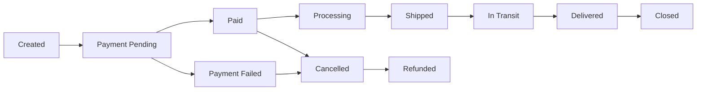
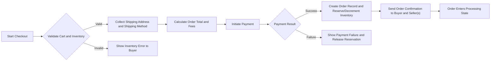
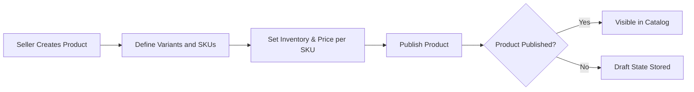

# Functional Requirements Specification — shoppingMall

## Document purpose and scope
This document defines the business-level functional requirements for the shoppingMall e-commerce platform. It translates the requested feature set into testable, measurable requirements and workflows for backend developers, QA, product managers, and operations. This document focuses exclusively on WHAT the platform must do (business rules, user workflows, acceptance criteria), not HOW it must be implemented (no API definitions, no database schemas, no technology choices).

Timezone considerations: all time-related business expectations are stated with the user's timezone in mind (Asia/Seoul). Where relative time windows are indicated (for example refund windows or session expirations), they are expressed in durations (days/hours) so they remain timezone-agnostic when applied.

## Executive summary
Purpose and goals
- Provide a marketplace-style e-commerce platform where customers can find, select, and purchase products offered by sellers, with inventory tracked per SKU.
- Support seller-managed catalogs, accurate per-SKU inventory, order lifecycle management, and a central admin interface for oversight.
- Deliver reliable order processing, payment capture, shipping status updates, and customer service workflows for cancellations and refunds.

Primary objectives
- Enable registered customers to manage profiles and addresses, search and browse product catalogs with variants, add items to carts or wishlists, place orders, and track shipments.
- Enable sellers to create and manage product listings and SKUs, update inventory, and update shipping statuses for orders containing their items.
- Provide admin and support interfaces for order and product moderation, dispute resolution, and reporting.

Success metrics (examples)
- Checkout success rate: >= 98% for valid payment attempts
- Inventory consistency rate: >= 99.9% for SKU stock levels after concurrent updates
- Order-to-fulfillment time: median time from payment to seller-confirmation <= 2 hours (business target)
- Customer rating for delivered orders: average >= 4.2/5 in initial quarters

## User roles and responsibilities (business terms)
- guest: Browse catalog, view product and seller profiles, perform searches, add items to a temporary wishlist. Cannot save addresses, place orders, or view account-specific details.
- customer: Register and authenticate, manage profile and multiple shipping addresses, create and modify persistent shopping carts and wishlists, place orders and payments, track orders, request cancellations/refunds, and write product reviews and ratings.
- seller: Register as a merchant account, create and manage product listings and SKUs (variants like color/size/options), maintain inventory per SKU, view and process orders containing their products, update shipping statuses for their shipments, and respond to customer inquiries about their listings.
- supportAgent: View and update order statuses, process cancellation and refund requests according to platform policies, communicate with customers and sellers about order issues, and access order history for dispute resolution. Limited product editing rights.
- admin: Full platform oversight — manage orders, products, sellers, users, platform configuration, enforcement of business rules, and escalate systemic issues.

## Functional requirements (grouped)
Note: Where applicable the requirements below are written in EARS format (WHEN/WHILE/IF/WHERE/ THE/SHALL). All other requirements are written in clear, testable natural language.

### 1) User registration, authentication, and address management
- WHEN a new user registers, THE system SHALL capture email, password, display name (optional), and require acceptance of terms and conditions and privacy policy.
- IF the registration data is invalid (missing required fields, invalid email format), THEN THE system SHALL return a clear validation error with field-level messages.
- WHEN a registered user attempts to authenticate, THE system SHALL validate credentials and, on success, create an authenticated session for the user that supports persistent login if user selects "remember me". Authentication-related response times for successful logins shall be within 2 seconds under normal load.
- WHEN a user requests password reset, THE system SHALL validate the request and initiate a secure reset process (business-level requirement: verify control of email address before allowing password change).
- WHEN a customer manages shipping addresses, THE system SHALL allow the customer to create, update, delete, and set a default shipping address. Each customer SHALL be able to store multiple addresses; the initial maximum number of stored addresses SHALL be 10 (configurable).
- IF a user attempts to delete an address that is the default for pending orders, THEN THE system SHALL prevent deletion and surface an explanatory message until another address is selected for those pending orders.

Validation rules (address):
- WHEN a customer submits an address, THE system SHALL require recipient name, street address line 1, city, postal code, country, and phone number. Apartment/suite line is optional.
- WHEN a customer saves an address, THE system SHALL normalize common country formats for display but SHALL NOT perform automatic address correction without user confirmation.

Performance and UX expectation (business-level): address CRUD operations SHALL complete within 2 seconds in normal conditions.

### 2) Product catalog, categories, and search
- THE product catalog SHALL allow hierarchical categories and tags to support browsing and filtering.
- WHEN a seller publishes a product, THE system SHALL associate the product with one or more categories and optional tags.
- WHEN a user performs a search or applies category filters, THE system SHALL return relevant product listings sorted by relevance and configured business ranking rules within 2 seconds for typical queries.
- WHERE a product is marked as inactive or removed by a seller or admin, THE system SHALL remove it from public search and browse results within 60 seconds (business eventual consistency requirement for public visibility updates).

Search behavior business rules:
- WHEN a search query contains typos or partial words, THE system SHALL return fuzzy matches and clearly highlight matched terms in results.
- WHERE multiple SKUs exist for a product, THE system SHALL surface a product-level card in search results and allow users to pick specific variants on the product detail page.

### 3) Product variants and SKU management
- THE system SHALL support products with multiple SKUs. Each SKU SHALL represent a unique combination of variant attributes (for example color, size, or custom option) and have its own inventory count and price.
- WHEN a seller creates or updates a product, THE system SHALL allow the seller to define variant attribute types (for example "color", "size") and allowable values.
- WHERE a seller defines variants, THE system SHALL automatically generate SKUs for each permitted combination of variant values and allow sellers to edit SKU-specific fields (price override, inventory, SKU identifier, images).
- IF a seller attempts to create more than 500 SKUs for a single product, THEN THE system SHALL prevent creation and return an error indicating SKU limit exceeded (configurable upper limit to prevent unbounded combinatorial explosion). Note: this limit is a business control and can be changed by admin policy.

### 4) Shopping cart and wishlist
- WHEN a guest adds items to a cart, THE system SHALL maintain a temporary guest cart that persists for 30 days unless cleared by user or conversion to a registered user's cart.
- WHEN a customer is authenticated, THE system SHALL persist the customer's cart across devices and sessions and merge guest cart contents into the customer's persistent cart upon first successful login after adding items as guest.
- WHEN a user adds an SKU to cart, THE system SHALL immediately check available inventory and reserve stock per the inventory reservation rules in the Business Rules section.
- WHEN a user adds items to wishlist, THE system SHALL allow saving items to a persistent wishlist (for registered customers) and to a temporary wishlist (for guests). The wishlist SHALL support item notes and desired quantity tracking.

Business expectations: cart updates and quantity adjustments by the user SHALL reflect available inventory and shall show immediate validation messages if requested quantity exceeds available stock.

### 5) Checkout, order placement, and payment processing
- WHEN a customer initiates checkout, THE system SHALL validate cart contents, pricing, applied promotions, shipping address, and payment method.
- WHEN the customer confirms payment, THE system SHALL create an order record and proceed to payment capture according to configured payment processing rules.
- IF payment authorization fails, THEN THE system SHALL mark the order as payment-failed and provide the customer with actionable messages and retry options.
- WHEN payment is successful, THE system SHALL mark the order as paid and reduce reserved inventory according to the inventory rules.
- THE system SHALL allow partial shipments (orders containing items from multiple sellers), and each seller SHALL be able to update shipping status for the items they fulfill.

Business-level timing expectations:
- Payment attempts SHALL be acknowledged within 5 seconds for synchronous gateways under normal load. Final processing (capture or settlement) timing depends on external integrations and shall be surfaced as business-state updates (e.g., "payment pending", "paid", "payment failed").

### 6) Order lifecycle and tracking
- THE order lifecycle SHALL include at minimum these business-visible states: "Created", "Payment Pending", "Paid", "Processing", "Shipped", "In Transit", "Delivered", "Cancelled", "Refunded", and "Closed".
- WHEN an order transitions state, THE system SHALL record state change timestamp and visible actor (seller/support/admin/system) and shall make these visible to customers in the order history and tracking views.
- WHEN a seller updates shipping information (carrier, tracking number), THE system SHALL associate tracking information with the shipment and propagate shipment state to the customer.

Mermaid diagram: Order lifecycle

### 7) Shipping status updates and notifications
- WHEN a seller marks items as shipped and provides a carrier and tracking number, THE system SHALL update the shipment state to "Shipped" and expose tracking details to the customer.
- WHEN shipment state changes (for example "Shipped" -> "In Transit" -> "Delivered"), THE system SHALL notify the customer by the user's preferred channels (email and in-platform notification). Notification frequency and channels selection are configurable.
- IF external carrier updates are available and integrated, THEN THE system SHALL reconcile carrier status updates with the platform shipment state and surface them to customers.

### 8) Product reviews and ratings
- WHEN a customer purchases and receives an order, THE system SHALL allow the customer to submit a product review and rating for each product in that order subject to moderation rules.
- WHERE reviews are restricted to verified purchasers, THE system SHALL allow only customers who purchased and whose order was delivered to file reviews for that SKU.
- IF a review is flagged for abusive or fraudulent content, THEN THE system SHALL hide the review from public pages and queue it for admin review.

### 9) Seller account management
- WHEN a prospective seller registers, THE system SHALL collect business information, contact details, and accept seller terms. Seller onboarding business checks (identity/business verification) are outside scope of this document and flagged as an open decision.
- WHEN a seller creates product listings, THE system SHALL require product title, description, category, at least one image, and pricing information. Variant and SKU definitions are optional depending on product complexity.
- THE seller SHALL be able to view orders that include their SKUs, update fulfillment status per-order-line, and set shipment tracking details for those lines.
- IF a seller deactivates a product that has pending orders, THEN THE system SHALL prevent changes that would violate existing orders but SHALL hide the product from new customer searches.

### 10) Inventory management per SKU
- THE system SHALL maintain inventory count for each SKU and SHALL enforce inventory checks at cart addition, checkout, and payment capture according to reservation rules.
- WHEN an SKU inventory reaches zero, THE system SHALL mark the SKU as "Out of Stock" and prevent customers from adding it to cart. The product-level page SHALL clearly show which variants remain available.
- WHEN inventory adjustments occur (manual seller adjustment or automated fulfillment), THE system SHALL log the change, actor, timestamp, and reason for auditability.

Inventory reservation rules (summary):
- WHEN a customer adds SKU to cart, THE system SHALL reserve a configurable short-term quantity (suggested default: 15 minutes) to prevent overselling during checkout. Reservation release, decrement, and finalization behavior are detailed in the Business Rules section.

### 11) Order history, cancellation, and refund requests
- WHEN a customer views their order history, THE system SHALL present all orders with basic summary data, state, and links to detail pages.
- IF a customer requests cancellation before the order has entered a "Shipped" or "Processing" state that prevents cancellation per business rules, THEN THE system SHALL allow the cancel request and notify involved sellers and supportAgents.
- IF a customer requests a refund after delivery within the configured refund window (default business recommendation: 14 days after delivery), THEN THE system SHALL accept refund requests subject to business validation rules and flag the request for supportAgent handling.
- WHEN refunds are approved, THE system SHALL mark the order or order-lines as refunded and restock SKUs according to refund/restock rules.

### 12) Admin dashboard and management operations
- THE admin interface SHALL provide business-level operations: view and filter orders, manage seller accounts (suspend/reactivate), moderate product listings, view platform-level KPIs, and manage dispute escalations.
- WHEN an admin suspends a seller, THE system SHALL prevent the seller from publishing new products and shall hide existing products from public listings without affecting ability to fulfill existing orders unless otherwise instructed.
- THE platform SHALL provide audit trails for all admin actions for compliance and dispute resolution.

## Key business rules and constraints
- Inventory and reservation: WHEN an item is reserved for checkout, THE system SHALL decrement available inventory for other users but maintain a reservation record that expires after a configurable window (default 15 minutes). WHEN payment is captured, THE system SHALL convert reservation into a permanent decrement. IF payment fails or reservation expires, THEN THE system SHALL release the reservation back to available inventory.
- Seller ownership: THE seller that created a product listing SHALL be considered the owner of that listing and SHALL be the primary party responsible for inventory, pricing, and fulfillment for that listing unless explicitly transferred by admin.
- Refund and cancellation windows: WHERE not specified by law or special promotion, THE system SHALL support a default refund window of 14 days after delivery for standard returns. Special categories (e.g., perishables) are not in the initial scope and flagged as an open decision.
- Partial refunds: THE system SHALL support partial refunds at the order-line level with clear audit records and shall recalculate customer-facing totals after refund.
- Promotions and pricing: THE system SHALL apply promotions and price rules at checkout and SHALL show applied promotion breakdown to customers prior to final confirmation.
- Review moderation: THE system SHALL allow reporting of reviews by users. Reported reviews SHALL be hidden from public view pending review by supportAgent or admin.

## Primary user stories and use cases (per role)
Each user story lists the primary success criteria and pre/post conditions.

Customer stories:
- Story: Register and Save Address
  - Precondition: Guest has email and password
  - Success criteria: Customer receives verification email and can add address
  - Postcondition: Customer account exists with at least one saved address

- Story: Browse, Select SKU, and Checkout
  - Precondition: SKU is in stock
  - Success criteria: Customer completes payment, order is created, inventory reserved/decremented, and confirmation is delivered in under 2 minutes
  - Postcondition: Order exists in customer order history with status Confirmed

- Story: Request Refund
  - Precondition: Order is delivered and within refund window
  - Success criteria: Refund request recorded and routed; status updated to Pending Refund; customer notified of decision
  - Postcondition: Refund approved or denied; order/payment states updated accordingly

Seller stories:
- Story: Create Product and SKUs
  - Precondition: Seller account is approved
  - Success criteria: Seller can create a product with N SKUs, set price and inventory for each SKU, and product appears in catalog
  - Postcondition: SKUs are visible to shoppers with accurate inventory status

- Story: Process Order and Update Shipping
  - Precondition: Order includes seller's SKU and payment is confirmed
  - Success criteria: Seller marks items as shipped and provides tracking number; buyer sees updated tracking
  - Postcondition: Order status transitions to Shipped and then Delivered after carrier updates

SupportAgent stories:
- Story: Handle Refund Request
  - Precondition: Refund request submitted
  - Success criteria: SupportAgent can view order details and refund history, communicate with seller, and approve or escalate refund per rules
  - Postcondition: Refund state updated and customer notified

Admin stories:
- Story: Moderate a Review
  - Precondition: Review flagged for abuse
  - Success criteria: Admin can hide the review, record a moderation reason, and notify the reviewer
  - Postcondition: Public view no longer shows the review and moderation log is recorded

## Conceptual data entities and relationships (high level)
Note: This is a conceptual model—no database schema is included.
- User (attributes: userId, role, email, verifiedFlag, displayName)
- Address (attributes: addressId, userId, recipientName, street, city, postalCode, country, phone)
- SellerProfile (attributes: sellerId, displayName, status, payoutSettingsReference)
- Product (attributes: productId, sellerId, title, description, categoryId, images)
- SKU (attributes: skuId, productId, attributesMap e.g., color/size, price, inventoryCount)
- Cart (attributes: cartId, userId, lineItems[skuId, quantity])
- Wishlist (attributes: wishlistId, userId or guestToken, skuEntries)
- Order (attributes: orderId, buyerId, orderItems[skuId, quantity, unitPrice, sellerId], orderTotal, shippingAddressId, status, paymentState)
- Shipment (attributes: shipmentId, orderId, sellerId, carrier, trackingNumber, status)
- Review (attributes: reviewId, skuId, buyerId, rating, text, moderatedFlag)
- RefundRequest (attributes: refundRequestId, orderId, requesterId, reason, status)

Relationships (brief):
- User (customer) can have many Addresses, Carts, Wishlists, Orders, and Reviews
- SellerProfile owns Products; Product contains multiple SKUs; SKU belongs to one Product
- Order contains one or more OrderItems referencing SKUs. Each OrderItem is attributable to a Seller
- Shipment is associated with an Order (or subset of OrderItems) and a Seller

## Critical workflows and sequence flows

### Checkout and Order Placement (Business Flow)
Mermaid diagram (graph LR):

### Seller product management

## Non-functional requirements (business-level)
Performance
- Search results and category listings SHALL return within 2 seconds for typical queries under normal load.
- Authentication and address CRUD operations SHALL complete within 2 seconds under normal load.

Availability
- Core ordering flow (placing orders and accepting payments) SHALL be available during business hours and target an availability SLA of 99.5% for MVP. Admin and reporting interfaces may have lower availability targets (e.g., 99%).

Scalability
- The platform SHALL be designed to scale horizontally for product catalog and search workloads. Expected growth assumptions (initial region): 100k products, 10k sellers, 500k monthly active users (assumption for planning; to be validated).

Security and data protection
- The system SHALL authenticate users for protected operations (order placement, address management, review submission).
- The system SHALL log critical security-related events (failed logins, password resets, admin actions) and provide mechanisms for support and audit.

Operational monitoring
- The platform SHALL provide business-level alerts for order failure spikes, payment gateway errors, and notable inventory inconsistency rates.

## Acceptance criteria and EARS-formatted requirements (comprehensive)
This section lists EARS-style requirements covering the features above. Keep EARS keywords in English; action and conditions are in en-US.

- WHEN a guest attempts to add an SKU to cart, THE system SHALL reserve the requested quantity for 15 minutes and return a reservation identifier.
- IF the reserved time expires without payment, THEN THE system SHALL release the reservation and update available inventory immediately.
- WHEN a customer completes payment successfully, THE system SHALL convert reservations into permanent decrements and mark the order as "Paid" within 30 seconds of payment confirmation.
- WHEN a seller updates an SKU inventory count, THE system SHALL record the change with actor and timestamp and SHALL reflect new availability to customers within 60 seconds.
- WHEN a customer requests password reset, THE system SHALL verify ownership of the account via the registered email before allowing a password change.
- WHEN a customer submits a review for a SKU they purchased and which has a delivered state, THE system SHALL accept the review and display it unless it is flagged for moderation.
- IF a customer requests cancellation before the order is marked "Shipped", THEN THE system SHALL allow the cancellation request and notify affected sellers and supportAgents.
- WHEN a seller marks an order-line as "Shipped" with carrier and tracking, THE system SHALL update shipment status to "Shipped" and notify the customer within 60 seconds.
- WHEN product visibility is changed by seller or admin, THE system SHALL update public search and category listings within 60 seconds.
- WHERE a product has more than 500 SKU combinations attempted, THE system SHALL prevent SKU creation and notify seller of SKU limit.

Performance acceptance criteria
- WHEN a user performs a common search query, THE system SHALL return first-page results within 2 seconds 95% of the time under normal operating load.
- WHEN a user authenticates with valid credentials, THE system SHALL respond with authentication success within 2 seconds 95% of the time under normal operating load.

Error handling and user-facing recovery
- IF an inventory conflict occurs at checkout (concurrent purchase reduces available stock), THEN THE system SHALL inform the customer of the conflict, show available alternatives (different SKU or quantity), and allow user to retry or remove the item.
- IF a payment gateway returns an intermittent error, THEN THE system SHALL present an informative message with retry options and shall not create an order in the "Paid" state.

## Open questions and decisions required before implementation
These items require product owner or stakeholder input prior to detailed design and implementation:
1. Payment gateway choice(s) and whether payment capture is synchronous or asynchronous for MVP.
2. Shipping carrier integrations required at launch (real-time tracking vs. manual entry by seller).
3. Exact refund windows and policies for special categories (e.g., electronics, perishables). Default recommended window: 14 days after delivery.
4. Seller onboarding requirements: Will identity/business verification be manual or integrated with third-party providers? Scope and SLA for verification.
5. Promotion and coupon complexity: Will platform support stackable promotions and conditional promotions at launch?
6. Limits and quotas: Confirm SKU-per-product limit, maximum images per product, maximum wishlist items, and address storage limits.
7. Whether reviews require mandatory moderation prior to publication (delayed publishing) or post-publication moderation with reporting.
8. Support for bulk seller operations at launch (CSV import for products and inventory) or deferred to later phase.

## Appendix: glossary and conventions
- SKU: Stock Keeping Unit — represents a unique variant of a product.
- Order-line: The item-level record within an order mapping a SKU to quantity and seller.
- Reservation: A temporary hold on inventory to support checkout flows.

## Implementation boundary statement
This document provides business requirements only. All technical implementation decisions (architecture, APIs, data storage formats, authentication tokens, integration protocols) belong to the development team and are at developers' discretion.
