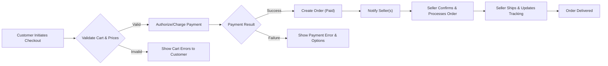
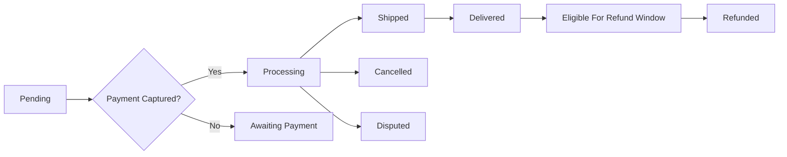
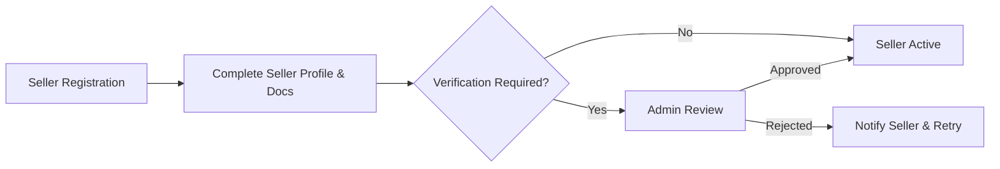
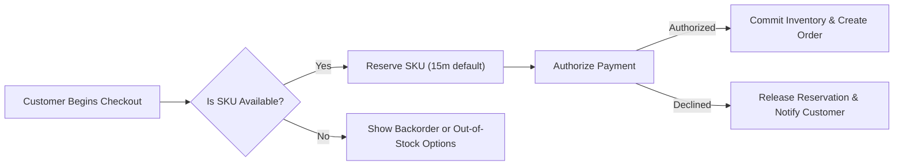

# shoppingMall — Requirements Analysis Report

## Table of Contents
1. Executive Summary and Scope
2. Glossary and Actors
3. Authentication and Session Management (Business Requirements)
4. Permission Matrix
5. Functional Requirements (EARS-format)
   - 5.1 Registration & Account Management
   - 5.2 Address Management
   - 5.3 Product Catalog, Categories & Search
   - 5.4 Product Variants and SKU Model
   - 5.5 Cart and Wishlist
   - 5.6 Checkout, Payments and Capture
   - 5.7 Order Lifecycle and Shipping
   - 5.8 Inventory Management per SKU
   - 5.9 Seller Portal and Onboarding
   - 5.10 Reviews and Ratings
   - 5.11 Cancellation, Returns and Refunds
   - 5.12 Admin Dashboard and Moderation
6. Business Rules and Validation
7. Workflows and Diagrams
8. External Integrations and Non-Functional Requirements
9. Data Retention, Privacy and Compliance
10. Monitoring, Reporting and Acceptance Criteria
11. Edge Cases and Recovery Flows
12. Appendix: Error Codes, Example Messages, Glossary, Related Documents

---

## 1. Executive Summary and Scope
shoppingMall is a multi-seller e-commerce marketplace enabling customers to discover products, select variant-specific SKUs (color, size, options), place orders, and track shipments. Third-party sellers manage product listings, SKUs, and per-SKU inventory. Platform admins moderate content, process escalations and refunds, and monitor marketplace health.

Scope includes: user registration and address management; product catalog and search; multi-attribute SKUs and per-SKU inventory; shopping cart and wishlist; checkout with payment authorization/capture; order lifecycle with shipping/tracking updates; product reviews; seller accounts and dashboards; admin moderation and reporting.

Out of scope: specific API designs, database schema details, and UI mockups.

---

## 2. Glossary and Actors
- SKU: Stock Keeping Unit — a uniquely identifiable variant of a product
- GMV: Gross Merchandise Value
- AOV: Average Order Value
- SLA: Service Level Agreement

Actors (business definitions):
- customer: Authenticated shopper who manages addresses, places orders, writes reviews.
- seller: Merchant account that lists products, manages SKUs and inventory, fulfills orders for their SKUs.
- admin: Platform administrator who moderates listings, approves sellers, processes escalations and refunds, and accesses reports.

---

## 3. Authentication and Session Management (Business Requirements)
- WHEN a user registers, THE system SHALL create an account in "email_unverified" state and SHALL send a verification token to the supplied email that expires in 24 hours.

- WHEN a user completes email verification within the token window, THE system SHALL mark the account as "active" and SHALL allow purchase actions for customers and listing actions for approved sellers.

- THE system SHALL issue short-lived access tokens and longer-lived refresh tokens using JWT semantics. THE business-level defaults SHALL be: access token lifetime = 15 minutes; refresh token lifetime = 14 days. WHERE user selects "Remember this device", THE refresh token lifetime SHALL be 30 days.

- WHEN a refresh token is exchanged for a new access token, THE system SHALL rotate the refresh token and invalidate the previous refresh token. IF refresh token reuse or invalid rotation is detected, THEN THE system SHALL revoke all refresh tokens for that user and require full reauthentication.

- IF an account is suspected of fraud or is flagged, THEN THE system SHALL reduce access token lifetime to 5 minutes and SHALL restrict sensitive actions (payout changes, seller listing) until remediation.

- WHEN a user requests logout for a specific device, THE system SHALL revoke the refresh token associated with that device within 5 seconds.

- WHEN a user revokes all sessions, THE system SHALL invalidate all refresh tokens associated with the account within 5 seconds and force reauthentication on all devices.

- THE system SHALL support optional MFA for sellers and admins; WHERE enabled, THE system SHALL require the second factor before granting tokens that permit seller/product/financial actions.

Audit and logging:
- THE system SHALL log authentication events (login success/failure, token refresh, revocation, password change) with userId, timestamp, IP, and actor role for 2 years.

Performance:
- THE system SHALL respond to login requests within 2 seconds for 95% of requests under nominal load.

---

## 4. Permission Matrix (Business-Level)
- customer: create orders, manage addresses and payment methods, write reviews for purchased SKUs, view order history and track shipments.
- seller: create and update products and SKUs, set inventory per SKU, view and process orders for own items, update shipping/tracking, respond to refunds within SLA.
- admin: moderate products and reviews, approve/suspend sellers, perform refunds beyond seller limits, view platform-wide reports, and access audit logs.

Permission rules (business examples):
- WHEN a seller attempts to update a product, THE system SHALL allow update only for products owned by that seller.
- WHEN an admin performs a financial action greater than configured threshold, THE system SHALL require a second admin approval and record justification.

---

## 5. Functional Requirements (EARS-format)
Each subsection includes EARS statements, measurable acceptance criteria, performance bounds, and common error scenarios.

### 5.1 Registration & Account Management
- THE system SHALL allow users to register as customers or sellers via email and password. Password policy: minimum 10 characters including uppercase, lowercase, digit, and special character.
  - Acceptance: Valid registration returns an email verification token within 2 seconds.

- WHEN a new seller registers, THE system SHALL place the seller account in "pending_verification" until required business documents are provided and validated by admin.
  - Acceptance: Seller may not publish products while in pending_verification.

- IF a user requests password reset, THEN THE system SHALL send a reset link valid for 1 hour.
  - Error: If reset token expired, present error code RESET_TOKEN_EXPIRED and allow re-request.

- THE system SHALL support account deletion requests; WHEN processed, THE system SHALL anonymize PII within 30 days while retaining transactional records for a minimum of 7 years for compliance.

### 5.2 Address Management
- THE system SHALL allow customers to store up to 10 addresses labeled (e.g., "home", "work").
- IF customer attempts to delete an address used by an unshipped order, THEN THE system SHALL reject deletion with error ADDR_IN_USE.
- WHEN address is added, THE system SHALL validate required fields (recipient name, line1, city, postal code, country code) and accept only ISO 3166-1 alpha-2 country codes.

### 5.3 Product Catalog, Categories & Search
- THE system SHALL support hierarchical categories (unlimited depth) and permit products to be assigned to multiple categories.
- WHEN a product is published, THE system SHALL require at minimum: title, primary category, at least one SKU, and a default price.
- THE system SHALL support keyword search with faceted filters: category, price range, brand, availability, SKU attributes (color, size), and seller. Default sorting: relevance; additional sorts: price_asc, price_desc, newest, best_seller.
- Performance: Top 20 search results SHALL return within 300ms 95% of the time under nominal load.

### 5.4 Product Variants and SKU Model
- THE system SHALL model products composed of SKUs where each SKU has its own inventory, optional override price, weight, and dimensions.
- WHEN a seller creates variant attributes for a product, THE system SHALL require attribute names be consistent across the product (e.g., all SKUs use "color" and "size").
- THE system SHALL allow backorder/pre-order per SKU with seller-provided estimated ship date; backordered SKUs SHALL be clearly labeled to customers.

### 5.5 Cart and Wishlist
- THE system SHALL provide a persistent cart tied to authenticated customer accounts that persists across devices and persists for 90 days of inactivity.
- WHEN a customer adds items to cart, THE system SHALL NOT reserve inventory except at checkout unless seller opted into "hold on add-to-cart" with configurable short hold window <= 15 minutes.
- THE system SHALL permit wishlists up to 500 items per customer and SHALL NOT reserve inventory for wishlist items.

### 5.6 Checkout, Payments and Capture
- WHEN a customer initiates checkout, THE system SHALL validate cart SKUs for availability, price consistency, promotions, taxes, and shipping cost.
- IF any SKU quantity exceeds available sellable inventory at checkout, THEN THE system SHALL display itemized messages and prevent order placement for affected items.
- THE system SHALL support both authorize-only and immediate-capture payment flows; payment provider transaction id and refund id SHALL be recorded in the order for reconciliation.
- Payment SLA: Authorization requests SHALL return definitive success/failure within 7 seconds 99% of the time; on timeouts present clear error and mark order state payment_timeout_pending.

### 5.7 Order Lifecycle and Shipping
- THE system SHALL model order states: pending, authorized, paid, processing, shipped, delivered, cancelled, refunded, disputed.
- WHEN seller marks items as shipped, THE system SHALL transition sub-order state to shipped and accept carrier name and tracking number.
- WHEN carrier or seller provides tracking events, THE system SHALL surface updates to customer and update order timeline; webhook-driven updates SHALL be processed within 5 minutes of arrival 90% of the time.
- IF carrier indicates exception, THEN THE system SHALL notify customer and flag order for seller follow-up.

### 5.8 Inventory Management per SKU
- THE system SHALL maintain inventory per SKU for each seller: available, reserved, committed.
- WHEN order payment is captured, THE system SHALL atomically decrement committed inventory for each SKU. Concurrent decrement conflicts SHALL be retried up to 3 times; on persistent failure, payment SHALL be reverted and operations notified.
- THE system SHALL support manual inventory adjustments by sellers and require audit reason for adjustments > 10 units or > 20% change.
- Daily reconciliation job SHALL flag discrepancies > configurable threshold (default 2%).

### 5.9 Seller Portal and Onboarding
- THE system SHALL allow seller registration, profile creation with business name, address, and tax/VAT ID.
- WHEN seller publishes a product, THE system SHALL allow optional moderation requirement: auto-publish, seller-approve, or platform-moderate.
- THE system SHALL provide seller dashboards for sales, pending orders, inventory alerts, refund requests, and performance metrics. Sellers with excessive refund rates shall be flagged per policy.
- Seller SLA: Sellers SHALL update shipping status within 72 hours of payment capture.

### 5.10 Reviews and Ratings
- THE system SHALL allow customers who purchased a SKU to leave one review per SKU per order within 365 days of delivery.
- WHEN review is submitted, THE system SHALL record verified purchase status. If content is flagged for abuse, THE system SHALL mark it pending moderation and hide it until admin review.
- Customers MAY edit or delete review within 48 hours; after 48 hours reviews are immutable except by admin.

### 5.11 Cancellation, Returns and Refunds
- THE system SHALL retain order history for minimum 7 years.
- WHEN customer requests cancellation, THE system SHALL permit cancellation only while order in pending or authorized and within 60 minutes of placement unless seller policy overrides.
- IF cancellation after fulfillment begins, THEN the system SHALL initiate return flow and follow refund policy timelines. Approved refunds SHALL be initiated with payment provider within 72 hours.

### 5.12 Admin Dashboard and Moderation
- THE system SHALL provide admin tools to view and change order states, process refunds, delist products, suspend sellers, and access reports.
- WHEN admin suspends a seller, THE system SHALL prevent new product listings and new orders for the seller catalog while preserving in-flight orders for fulfillment.
- THE system SHALL record audit trails for all admin actions including admin id, timestamp, and reason.

---

## 6. Business Rules and Validation
- THE system SHALL prevent negative inventory. Any update that would produce negative available quantity SHALL be rejected with an itemized error.
- WHEN promotions apply, precedence: item-level coupon overrides seller-level discount, which overrides platform-level promotion; precedence SHALL be configurable.
- THE system SHALL label reviews as "verified_purchase" only when order records show the reviewer purchased that SKU.
- Monetary fields SHALL be represented in smallest currency unit and SHALL be non-negative and <= 1,000,000 units.

Input validation examples:
- Email: RFC 5322-compliant
- Phone: E.164
- Country: ISO 3166-1 alpha-2
- Postal codes: per-country pattern enforcement where available

---

## 7. Workflows and Diagrams
Checkout Flow:

Order Lifecycle (business states):

Seller Onboarding:

Inventory Reservation Flow:

All mermaid labels use double quotes and correct arrow syntax for parser compatibility.

---

## 8. External Integrations and Non-Functional Requirements
Payments:
- THE system SHALL integrate with PCI-DSS-compliant payment providers and SHALL NOT store PANs. Tokenization of cards is required.
- Authorization latency: 95th percentile <= 3s under typical conditions. Retry up to 2 times for transient errors with exponential backoff.

Shipping:
- THE system SHALL accept carrier tracking and process carrier webhooks within 5 minutes of receipt for 90% of events.
- Shipping rate lookups: cached rates within 2s, live rate computations within 5s.

Search & Indexing:
- Catalog changes (inventory/price/visibility) SHALL reflect in search within 60s for 95% of updates.
- Query latency: median <= 150ms; 95th percentile <= 500ms.

Notifications:
- Transactional notifications SHALL be delivered to provider within 60s; providers must support retries and webhooks for delivery receipts.

Availability and scaling:
- Core checkout path SHALL target 99.95% monthly uptime. Platform SHALL scale horizontally for 5x baseline traffic spikes.

---

## 9. Data Retention, Privacy and Compliance
- THE system SHALL retain order and payment records for 7 years for compliance unless law requires longer retention.
- THE system SHALL permit data export and deletion requests subject to retention constraints. WHEN a deletion request conflicts with legal retention, THE system SHALL redact personal fields while preserving transactional integrity.
- THE system SHALL log admin access to PII and retain logs for a minimum of 2 years.
- THE platform SHALL comply with applicable regional privacy laws (GDPR/CCPA) and PCI-DSS requirements for payment processing.

---

## 10. Monitoring, Reporting and Acceptance Criteria
Key metrics:
- GMV, conversion rate, AOV, refund rate, seller SLA compliance, inventory discrepancy rate.
- Alerts: payment failure rate > 2% in 1 hour; refund rate spike > configured threshold; reconciliation mismatch > configured threshold.

Acceptance test examples:
- Registration: 95% of valid registrations receive verification email within 2 seconds.
- Checkout: 99% of authorizations complete within 7s; 95% of successful checkouts complete reservation and order creation within 10s.
- Inventory: inventory changes reflected in storefront within 60s for 95% of updates.

---

## 11. Edge Cases and Recovery Flows
- Concurrent checkout oversell: THE system SHALL use atomic decrement and reservation ordering to ensure at-most-once allocation; losing transactions SHALL receive SKU_OUT_OF_STOCK and suggested remediation.
- Payment provider outage: THE system SHALL queue order attempts and offer alternate payment methods or declined state with clear guidance.
- Seller misrepresentation: repeated inventory mismatches SHALL trigger progressive penalties: warnings -> reduced visibility -> temporary suspension -> delisting.
- Chargebacks: THE system SHALL preserve all evidence for 2 years and SHALL provide operations with a case package within 24 hours of request.

---

## 12. Appendix
Error codes (examples):
- AUTH_INVALID_CREDENTIALS
- AUTH_TOKEN_EXPIRED
- SKU_OUT_OF_STOCK
- ADDR_IN_USE
- PAYMENT_DECLINED
- PAYMENT_TIMEOUT
- RESERVATION_EXPIRED

Example user-facing messages must combine a short error code and a human-friendly explanation.

Related documents (descriptive links):
- Service Overview: ./01-service-overview.md
- User Actors & Permissions: ./02-user-actors.md
- Functional Requirements: ./03-functional-requirements.md
- Order & Payment Workflows: ./08-order-and-payment-workflows.md

Glossary: See top of document.

---

End of shoppingMall Requirements Analysis Report
