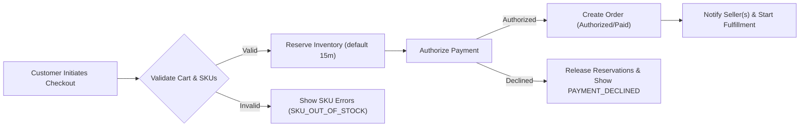
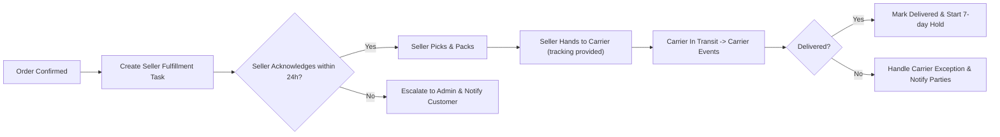
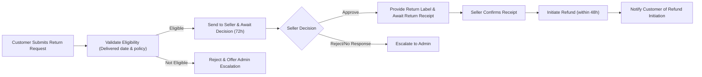
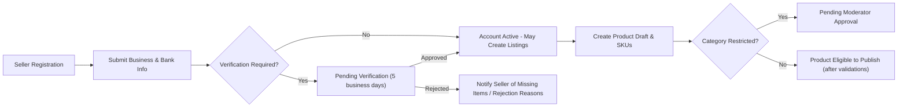

# Checkout and Critical User Flows — shoppingMall

## Scope and Purpose

This file defines business-level user flows and state transitions required for the shoppingMall platform: checkout and payment, order fulfillment and shipping updates, returns and refunds, seller onboarding and product publishing, and address/profile management. All requirements use natural language and EARS-style rules to be testable by QA and actionable by engineering and operations. Technical implementation decisions (APIs, schemas) are left to the development team.

## Actors and Business Responsibilities
- customer: Browses catalog, selects SKUs, manages addresses and payments, initiates checkout, requests cancellations/returns, writes reviews.
- seller: Creates/updates products and SKUs, sets inventory, accepts and fulfills orders for their SKUs, updates shipping and tracking, responds to customer inquiries.
- admin: Moderates listings and reviews, approves or suspends sellers, processes escalated refunds and chargebacks, accesses audit logs and reports.

## Notation and Conventions
- EARS keywords used: WHEN, IF, THEN, THE system SHALL.
- Time windows and SLAs are business-facing and stated explicitly (minutes, hours, days).
- Mermaid diagrams use double-quoted labels for all nodes; arrows use proper syntax (-->).
- All user-facing messages include an error code and short human-readable text.

## 1. Checkout & Payment Flow (Business Steps)

Business goals: validate cart, ensure reservation of inventory, obtain payment authorization, and create an auditable order that triggers seller fulfillment.

EARS requirements (core):
- WHEN a customer initiates checkout, THE system SHALL validate cart contents, SKU availability, applicable promotions, taxes, and shipping options and SHALL produce a final order total within 2 seconds for typical carts.
- WHEN a customer selects a payment method and confirms purchase, THE system SHALL attempt payment authorization with a configured provider and SHALL receive a definitive success/failure within 5 seconds in 95% of cases under normal load.
- IF payment authorization succeeds, THEN THE system SHALL create an order in state "Authorized" (or equivalent) and SHALL reserve inventory for the committed SKUs atomically.
- IF payment authorization fails, THEN THE system SHALL present error code PAYMENT_DECLINED with a recommended set of remediation actions (retry, change payment method, contact bank).

Detailed flow and decision points:
1. Customer reviews cart and selects "Checkout".
2. THE system recalculates totals and validates each SKU quantity against available inventory.
   - IF any SKU quantity is insufficient, THEN THE system SHALL return SKU_OUT_OF_STOCK with current available quantity and suggested alternatives.
3. THE system presents shipping options and tax estimates; customer selects shipping and confirms.
4. THE system places a short-lived reservation on each SKU (default 15 minutes). Reservation details are shown to the customer (remaining hold time).
   - WHEN reservation reaches 2 minutes remaining, THE system SHALL notify the customer with an in-checkout prompt.
5. Customer submits payment; THE system sends an authorization request to payment provider.
   - IF provider times out, THEN THE system SHALL retry up to 2 times with exponential backoff within a 10-second retry window; IF still failing, THE system SHALL mark the transaction PAYMENT_PROVIDER_TIMEOUT and present retry options.
6. ON authorization success: THE system SHALL convert reservation to committed inventory and create an order record with unique order number and status "Authorized" (or "Paid" if immediate capture configured). THE system SHALL notify each seller involved within 30 seconds of order creation.
7. ON authorization failure: THE system SHALL release reservations immediately and present remediation.

Acceptance criteria (QA):
- GIVEN valid cart and payment, WHEN checkout completes, THEN order is created and seller notification occurs within 30 seconds for 95% of cases.
- GIVEN two concurrent checkout attempts for the last unit of SKU X, WHEN both authorize near-simultaneously, THEN at-most-one order is committed and the other receives SKU_OUT_OF_STOCK.

Performance SLA (business-facing):
- Cart validation and total calculation: 2 seconds 95th percentile.
- Payment provider round-trip (authorization): 5 seconds 95th percentile.
- Reservation creation and commit: reservation issued within 5 seconds; commit reflected in storefront within 60 seconds.

Mermaid diagram: Checkout flow

Error handling and recovery:
- IF reservation extension is needed because of external redirection (3DS), THEN THE system SHALL allow a single reservation extension up to seller-configured max (default 72 hours) and SHALL log extension reason and actor.
- IF price recalculation yields a delta greater than 0.5% between initial and final totals, THEN THE system SHALL surface the delta to the customer and require explicit reconfirmation.

## 2. Order Fulfillment and Shipping (Business Flow)

Objectives: ensure sellers receive timely orders, fulfill within SLAs, and keep customers updated with tracking and exception handling.

EARS rules and timelines:
- WHEN an order is created and assigned to a seller, THE system SHALL deliver an order notification to the seller within 30 seconds.
- WHEN a seller marks an order as "Shipped" and provides carrier and tracking, THE system SHALL update customer-facing order timeline and send notification within 60 seconds.
- IF a seller fails to update shipping status within seller SLA (default 72 hours), THEN THE system SHALL escalate to Operations Admin and notify the seller to take corrective action.

Fulfillment steps:
1. Order assigned -> Seller receives fulfillment task.
2. Seller acknowledges within SLA (default 24 hours); acknowledgement updates seller task state to "Accepted".
   - IF seller does not acknowledge within SLA, THEN the system SHALL create an escalation alert and optionally reassign if policy permits.
3. Seller picks, packs, and marks shipment with carrier and tracking number.
4. Carrier events (Pickup, In Transit, Out for Delivery, Delivered) update order line state; THE system SHALL process carrier webhooks and update UI within 5 minutes of event receipt.
5. On "Delivered" event, THE system SHALL start a post-delivery hold (default 7 calendar days) during which returns or disputes may be opened.

Mermaid diagram: Fulfillment flow

Seller obligations and penalties (business-level):
- THE seller SHALL ship paid orders within their advertised handling time; repeated late-shipment incidents (>3 in 30 days) SHALL trigger seller performance actions up to temporary listing suppression.
- THE system SHALL track on-time shipment rate and show it in seller dashboard; sellers below 90% for 30-day rolling window SHALL be flagged.

Notifications and customer experience:
- THE system SHALL send email and in-app updates for major state changes (Accepted, Shipped, Out for Delivery, Delivered) and SHALL provide tracking links when available.
- THE system SHALL send delay/exception alerts within 2 hours of detecting a carrier exception.

## 3. Returns, Refunds, and Disputes

Objectives: provide clear eligibility rules, seller/ admin decisioning windows, and predictable refund settlement timelines.

Eligibility and core rules (EARS):
- WHEN a customer requests a return, THE system SHALL verify Delivered date and seller return policy and SHALL respond with an eligibility decision within 2 minutes.
- IF seller approval is required, THEN THE seller SHALL respond within 72 hours; IF seller rejects or fails to respond, THEN THE case SHALL escalate to Admin automatically.
- WHEN a return is approved, THE system SHALL provide shipping instructions and a return label (if the platform offers return shipping) within 24 hours.
- WHEN returned goods are confirmed received and acceptable, THEN THE system SHALL initiate refund processing within 48 hours of receipt confirmation.

Refund timing and settlement:
- THE system SHALL attempt to process refunds to the original payment method; typical customer-visible refund completion window is 3–10 business days depending on bank/ provider.
- THE system SHALL record refund transaction IDs and link them to order/sub-order and seller payout adjustments.

Mermaid diagram: Return and refund flow

Dispute and chargeback handling:
- WHEN a chargeback is opened by a payment provider, THE system SHALL mark the order as "Disputed/Chargeback" and SHALL preserve all evidence (order, tracking, communications) for at least 180 days.
- THE system SHALL assign a case owner and SHALL respond to provider requests within required timelines (typically 7–30 days depending on scheme).
- Success metrics: aim to win >= 70% of chargebacks with sufficient evidence for delivered orders.

Acceptance criteria (refunds):
- 95% of approved refunds SHALL be initiated to payment provider within 48 hours of approval.
- The platform SHALL notify customer of refund initiation within 2 hours of starting the refund.

## 4. Seller Onboarding & Product Publishing Flow

Steps and verification rules (business-level):
1. Seller registers and submits required business and tax documentation.
2. THE system SHALL place the seller in "Pending Verification" and notify merchant operations.
3. Merchant operations SHALL complete verification within 5 business days OR return an itemized request for missing information.
4. Once verified, seller may create product drafts and SKUs.
   - WHEN product is created, THE system SHALL validate required fields (title, category, at least one SKU, SKU identifier, price, inventory or explicit backorder flag).
   - IF product category triggers manual moderation (restricted categories), THEN the product SHALL be routed to Marketplace Moderator and SHALL remain "Pending Approval" until approved.

Publishing rules and inventory obligations:
- THE seller SHALL provide SKU-level inventory before publishing unless SKU is explicitly flagged as "pre-order" or "backorder" with an expected shipment date.
- IF a seller repeatedly fails to provide accurate inventory resulting in customer-impacting cancellations, THEN THE system SHALL apply progressive penalties (warnings, reduced visibility, suspension).

Mermaid diagram: Seller onboarding

Acceptance criteria (onboarding):
- 95% of non-restricted category seller registrations SHALL complete verification within 5 business days.
- Product validation failures (missing SKU fields) SHALL return structured reasons to seller within the create response.

## 5. Address & Profile Management Flow

Business rules for address validation and critical updates:
- WHEN a customer adds or updates a shipping address, THE system SHALL validate required fields (recipient name, line1, city, postal code, country) and SHALL return specific field validation errors immediately.
- IF external address verification service is unavailable, THEN THE system SHALL accept the address as "Unverified" and SHALL flag it in the UI with recommended verification prior to placing an order.
- WHEN a customer updates critical profile fields (email, bank/settlement info for sellers), THE system SHALL require re-authentication if current session is older than 15 minutes.
- WHEN a default address is deleted while an active unshipped order references it, THEN THE system SHALL prevent deletion and return ADDR_IN_USE with the order id and guidance.

Performance and UX requirements:
- Address save and validation SHALL respond in under 2 seconds 95% of the time.
- Address lookup/autocomplete integrations shall be tolerant of rate limits and fall back gracefully to manual entry.

## 6. Cross-Cutting Rules and Operational Controls

Reservation windows and idempotency:
- THE system SHALL use idempotency keys for critical operations (order creation, payment intent requests) to prevent duplicate charges or duplicate orders.
- Default reservation window: 15 minutes for checkout reservation; extension allowed for special flows (3DS) up to seller-configurable max (default 72 hours).

Audit trails and notifications:
- THE system SHALL record all major state transitions with actor, timestamp, IP (business-level), and reason when manual intervention occurs; audit entries retained per data retention policy.
- THE system SHALL attempt to notify customers of major state changes within 60 seconds of change where possible and within 5 minutes for carrier-delivered webhook events.

Escalation and operational playbooks:
- IF a payment provider failure is detected (exceeding 2% error rate in 10 minutes), THEN THE system SHALL switch to configured secondary provider and alert on-call SRE.
- IF daily reconciliation finds inventory discrepancy > 5% for a seller, THEN THE system SHALL flag seller for manual review and generate an operations ticket.

## 7. Edge Cases and Negative Scenarios

Concurrent inventory depletion
- WHEN multiple concurrent checkouts target the last available unit, THE system SHALL allocate to first reservation and inform subsequent customers of SKU_OUT_OF_STOCK; test coverage required to demonstrate zero oversells in stress tests.

Payment provider timeouts
- IF provider times out during authorization, THEN THE system SHALL retry with exponential backoff up to 2 times and present PAYMENT_PROVIDER_TIMEOUT if all attempts fail.

Seller misrepresentation
- IF seller repeatedly misstates inventory and causes cancellations, THEN THE system SHALL apply penalties and may suspend listings per seller policy.

Fraud and high-risk accounts
- WHEN account exhibits high-risk signals (chargeback spike, mismatched geo/IP), THEN THE system SHALL mark account for review, restrict high-risk actions (new listings, payouts), and require additional verification.

## 8. Acceptance Criteria Matrix & Test Examples

Flow: Checkout
- GIVEN cart with valid SKUs and payment, WHEN checkout is completed, THEN order created and seller notification occurs within 30s for 95% of cases.

Flow: Reservation & concurrency
- GIVEN two users attempt to reserve the last unit simultaneously, WHEN both submit checkout within reservation window, THEN only one order is committed and second receives SKU_OUT_OF_STOCK.

Flow: Returns & refunds
- GIVEN customer return approved and goods received, WHEN seller confirms receipt, THEN refund initiation occurs within 48 hours 95% of time.

Flow: Fulfillment
- GIVEN seller marks shipped with tracking, WHEN tracking posted, THEN customer-visible status updates within 60 seconds 95% of the time.

## 9. Glossary and References
- SKU: Stock Keeping Unit — variant-level sellable item
- Reservation window: time an item is held during checkout (default 15 minutes)
- Authorization vs Capture: authorization obtains hold; capture finalizes charge per payment provider rules
- 3DS: authentication flow that may extend reservation windows for payment completion

Related artifacts: functional requirements, payment workflows, inventory management, external integrations, and admin reporting documents.

## Appendix: Implementation Notes for QA & Ops
- QA should include concurrency stress tests for reservations and payment idempotency checks.
- Ops should define provider failover lists, contact points, and runbooks to handle carrier exceptions and payment provider outages.
- Provide canned messages and error codes for front-end teams to render consistent user guidance (e.g., PAYMENT_DECLINED, RESERVATION_EXPIRED, SKU_OUT_OF_STOCK, ADDR_IN_USE).

# End of file
