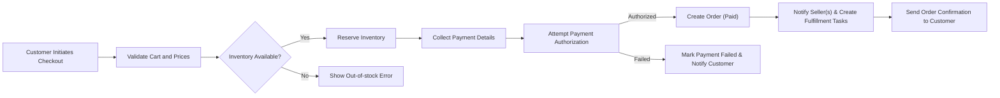
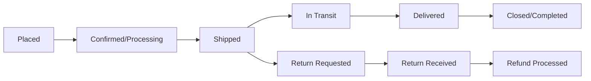

# User Roles & Authentication Requirements for shoppingMall

## Executive Summary
This document defines the complete business-level requirements for user roles, authentication and account lifecycle, address and profile management, token/session expectations, and permission rules for the shoppingMall e-commerce platform. Its purpose is to describe WHAT the platform must do to support secure accounts, role-based access, and consistent user experiences for guests, customers, sellers, support agents, and administrators. This document provides business requirements only; all technical implementation choices (architecture, APIs, database design, token storage mechanics) are the responsibility of the development team.

## Audience and Scope
Audience: Backend developers, security engineers, product managers, QA, and operations.

Scope: Authentication and authorization behaviors for the following roles: guest, customer, seller, supportAgent, admin. This includes registration, login, account verification, address management, token/session lifecycle (business-level expectations), role permission mappings, error handling, and performance expectations tied to authentication-related user actions.

Related documents:
- Service Vision & Overview (for business context)
- Functional Requirements Document (for product behaviors that depend on authentication)
- Workflows and Process Flows (visual sequences for checkout and order lifecycle)

## Summary of Roles and High-Level Responsibilities
All roles listed below are recognized business actors. Each role description emphasizes WHAT the role can do in business terms; permissions appear later in the permission matrix.

- guest: Can browse the product catalog, view categories and product detail pages, use search, view public seller profiles, and add items to a temporary wishlist. Cannot place orders, manage addresses, or access account-only features.
- customer: Registered shopper who can authenticate, manage profile and multiple shipping addresses, create and modify persistent shopping carts and wishlists, place orders and payments, view order history, track orders, request cancellations/refunds, and write product reviews and ratings.
- seller: Merchant account that can authenticate, create and manage product listings and SKUs, manage inventory per SKU, view and process orders containing their products, update shipping statuses for their shipments, and respond to customer inquiries about their listings. Sellers cannot perform global administrative actions.
- supportAgent: Customer support and operations staff who can authenticate, view and update order statuses, process cancellation and refund requests according to platform policies, communicate with customers and sellers about order issues, and access order history. Support agents have limited product editing rights.
- admin: Platform administrator with full privileges to manage orders, products, sellers, user accounts, platform settings, reporting dashboards, and moderation/escalation. Admins enforce business rules and full-platform configurations.

## Authentication and Account Lifecycle Requirements
This section states concrete, testable, business-level requirements for user account creation, authentication, and lifecycle operations. Where applicable requirements are suitable for EARS, they are written using the EARS templates.

### Registration and Onboarding
- WHEN a new user submits a registration request with an email and password, THE system SHALL create an inactive account and send an account verification message (email or equivalent) to the provided email address.
- IF the verification message is not confirmed within 72 hours, THEN THE system SHALL mark the registration token as expired and THE system SHALL prevent that account from placing orders until verification is completed.
- WHEN a registration attempt provides an email that is already associated with an active account, THE system SHALL reject the registration and return a clear user-facing error stating that an account already exists for that email.
- WHERE a user registers as a seller, THE system SHALL collect additional business profile details (business name, contact phone, business address) before enabling seller-only actions such as product creation. The platform MAY require seller approval before the seller can list products (see Open Questions).

Input validation rules for registration fields (business-level):
- WHEN a user supplies an email, THE system SHALL require the email to be a syntactically valid email address and SHALL reject disposable-email domains if the platform elects to block them.
- WHEN a user supplies a password, THE system SHALL require a password that meets minimum strength thresholds: length >= 8 characters and includes at least one letter and one number; additional strength rules are optional and configurable by product policy.

Acceptance criteria:
- A newly registered customer SHALL not be able to place orders until verification is completed or an alternative verification path is completed.

### Login and Authentication
- WHEN a user submits valid credentials, THE system SHALL authenticate the user and create a server-side session or issue session tokens (business-managed) and indicate successful login to the client within 2 seconds under normal operating conditions (see Non-Functional Requirements).
- IF a login attempt fails due to invalid credentials, THEN THE system SHALL return a clear error message and increment a login failure counter for that account to enable rate-limiting and account protection.
- IF an account experiences more than 10 failed login attempts within a 15-minute sliding window, THEN THE system SHALL temporarily block login attempts for that account for 15 minutes and require a password reset or account verification to re-enable login, unless an administrator or support agent intervenes.

Optional multi-factor authentication (MFA):
- WHERE MFA is enabled for an account, THE system SHALL require a second verification factor at login before granting access to account-only functions. MFA enforcement is an optional feature that can be toggled per role or per account.

### Account Recovery and Verification
- WHEN a user initiates password recovery, THE system SHALL send a single-use recovery link or code that expires after a configurable time window (default recommendation: 1 hour).
- IF a recovery link or code is used after expiration, THEN THE system SHALL reject it and require the user to request a new recovery operation.
- WHEN a user successfully resets a password via a recovery flow, THE system SHALL invalidate all existing active sessions for that account and require re-authentication for actions that modify security-sensitive information.

### Address and Profile Management Rules
- WHEN an authenticated customer adds an address, THE system SHALL allow the customer to store up to N addresses by default (business recommendation: 10). This maximum is configurable by platform policy.
- WHEN a customer designates an address as "default shipping address", THE system SHALL use that address as the pre-selected shipping address at checkout unless the customer chooses another address.
- IF a customer deletes a default address and other addresses exist, THEN THE system SHALL set the most recently used address as the new default.
- WHEN a seller updates their business contact information, THE system SHALL require fields necessary for seller identification (business name and contact phone) and SHALL display only approved seller profile fields on public seller pages.

Address validation (business-level):
- WHEN an address is added, THE system SHALL validate that mandatory fields (recipient name, street address line 1, city, postal code, country, and phone) are present and SHALL reject addresses missing mandatory fields.
- WHERE region-specific address formats vary (e.g., domestic vs. international), THE system SHALL allow region-specific fields and SHALL indicate to the user which fields are required for their selected country.

### Session and Token Management (Business Requirements Only)
This section defines expectations for session length, refresh behavior, and token content in business terms. Implementation choices (storage medium, exact token format) are at developer discretion but the platform documents a business expectation that JSON Web Tokens (JWT) are used for access/refresh tokens.

- THE platform SHALL use token-based session management where tokens contain sufficient claims to identify the user, role, and permissions required for authorization decisions.
- THE token payload SHALL include, at minimum, a unique user identifier, role, and a permissions indicator sufficient for role checks. (E.g., "userId", "role", "permissions" in token claims.)
- WHEN an access credential is issued for interactive user sessions, THE system SHALL set token lifetime expectations: access tokens SHALL be short-lived (business recommendation: 15-30 minutes), and refresh tokens SHALL be long-lived (business recommendation: 7-30 days) unless revoked.
- IF a refresh token is used to obtain a new access credential, THEN THE system SHALL verify the refresh token has not been revoked and SHALL issue a new access token with the expected short lifetime.
- IF a user explicitly logs out from an application instance, THEN THE system SHALL invalidate the session tokens associated with that instance and reflect that change in subsequent token validation checks.
- IF a security-sensitive operation occurs (password change, recovery completion), THEN THE system SHALL invalidate existing active sessions and refresh tokens for that account unless explicitly exempted by platform policy.
- WHERE a user opts into a "remember me" or persistent session feature, THE system SHALL require explicit consent and SHALL limit persistent session lifetimes via refresh token expiration policy and additional risk checks.

Notes on token storage (business considerations):
- Developers MAY choose secure storage patterns appropriate for web and mobile platforms; storage approach MUST be selected by the implementation team and is not mandated here. The business requirement is that tokens can be revoked and session invalidation must be enforceable across active sessions.

## Role Permission Matrix (Business-Level)
Permission definitions (business terms):
- BrowseCatalog: View product listings, categories, product detail pages
- SearchProducts: Execute product search queries
- ManageProfile: View and update user profile and addresses
- CartManagement: Create, update, and delete items in a cart
- WishlistManagement: Create and manage wishlist items
- PlaceOrder: Complete checkout and payment actions
- ViewOrder: View orders belonging to a customer
- RequestCancelRefund: Submit cancellation or refund requests
- WriteReview: Submit product reviews and ratings
- SellerProductManagement: Create and update product listings and SKUs
- InventoryManagement: Adjust and view inventory counts per SKU
- ProcessSellerOrder: Mark orders as processed/packed for seller's products
- UpdateShippingStatus: Post shipping/tracking updates for shipments
- SupportOrderUpdate: Support agents can view and update order statuses
- AdminFull: Administrators can perform all management actions

Role-by-action permission matrix (business-readable):

| Action | guest | customer | seller | supportAgent | admin |
|--------|-------|----------|--------|--------------|-------|
| BrowseCatalog | ✅ | ✅ | ✅ | ✅ | ✅ |
| SearchProducts | ✅ | ✅ | ✅ | ✅ | ✅ |
| ManageProfile | ❌ | ✅ | ✅ (seller profile) | ✅ (limited) | ✅ |
| CartManagement | ❌ (temporary local) | ✅ | ✅ (for purchases) | ❌ | ✅ |
| WishlistManagement | ✅ (temporary) | ✅ | ✅ | ❌ | ✅ |
| PlaceOrder | ❌ | ✅ | ✅ (as customer) | ❌ | ✅ |
| ViewOrder | ❌ | ✅ (own orders) | ✅ (orders containing seller's products) | ✅ (all orders for support) | ✅ |
| RequestCancelRefund | ❌ | ✅ | ✅ (for their orders) | ✅ (process) | ✅ |
| WriteReview | ❌ | ✅ | ✅ (on purchased items) | ❌ | ✅ |
| SellerProductManagement | ❌ | ❌ | ✅ | ❌ | ✅ |
| InventoryManagement | ❌ | ❌ | ✅ | ❌ | ✅ |
| ProcessSellerOrder | ❌ | ❌ | ✅ | ✅ (assist) | ✅ |
| UpdateShippingStatus | ❌ | ❌ | ✅ | ✅ (assist) | ✅ |
| SupportOrderUpdate | ❌ | ❌ | ❌ | ✅ | ✅ |
| AdminFull | ❌ | ❌ | ❌ | ❌ | ✅ |

Permission notes:
- A seller's visibility into orders is limited to orders that include products owned by that seller.
- A supportAgent has broad visibility into orders (for support purposes) but limited product editing rights.
- AdminFull implies ability to override seller content, adjust inventory systemically, and manage users.

## Administrative and Support Privileges
- WHEN a supportAgent resolves a customer dispute per policy, THE system SHALL log the action and the supporting evidence provided, and SHALL notify the customer and the seller of the final decision according to notification rules.
- IF an admin performs a platform-wide configuration change affecting seller capabilities, THEN THE system SHALL record the change in an audit log and SHALL notify relevant sellers if the change impacts active listings.
- WHEN an admin disables a seller account for policy violations, THE system SHALL prevent that seller from creating new listings and SHALL optionally mark existing listings as unavailable for purchase until administrative review completes.

## Business Rules and Validation Constraints (Authentication-Related)
- WHEN an order is placed that includes items from multiple sellers, THE system SHALL create a parent order record visible to the customer and SHALL create per-seller sub-orders for seller processing and shipping.
- IF inventory for any SKU in the cart is insufficient at the time of payment authorization, THEN THE system SHALL prevent order creation and shall surface the specific SKU(s) causing failure and provide options to adjust the order.
- WHEN a customer requests cancellation before the order has entered a "Shipped" or "Processing" state that prevents cancellation per business rules, THEN THE system SHALL allow the cancel request and SHALL initiate refund processing according to refund policy (see Open Questions for refund window specifics).
- IF a cancellation is requested after shipping is marked by the seller, THEN THE system SHALL treat the request as a return process initiated by the customer and SHALL present return instructions according to platform policy.
- WHEN a product review is submitted, THE system SHALL verify the reviewer purchased the item within the review-eligibility window or SHALL mark the review as "unverified purchase" if purchase cannot be confirmed.

Validation specifics for authentication and profile fields (business-level):
- WHEN a user updates email, THE system SHALL require re-verification of the new email address before allowing order placement.
- WHEN a user updates phone number that is used for two-factor verification, THE system SHALL require verification of the new phone number.

## Error Handling and User-Facing Recovery Flows
Examples of user-facing errors and recovery expectations (business-level):
- IF login fails due to bad credentials, THEN THE system SHALL display a clear error message and suggest password recovery after 3 failed attempts.
- IF account is locked due to suspicious activity, THEN THE system SHALL present clear instructions for account recovery, including contacting support or initiating identity verification.
- IF address validation fails during checkout, THEN THE system SHALL indicate which fields are missing or invalid and offer options to correct or proceed with manual review.

## Performance and Non-Functional Expectations (Authentication & Roles)
- WHEN a user attempts to log in or refresh a session under normal load, THE system SHALL authenticate and respond within 2 seconds 95% of the time.
- WHEN a user searches the product catalog while authenticated, THE system SHALL return typical search results within 2 seconds for common queries 95% of the time.
- WHEN issuing or refreshing tokens, THE system SHALL process the token operation within 1 second under normal load.
- THE system SHALL enforce rate limits on authentication endpoints to prevent brute-force attacks; rate limiting thresholds are a technical decision but must prevent more than 100 failed authentication attempts per IP per hour.
- THE system SHALL be available for authentication services at a minimum of 99.9% monthly uptime for core authentication endpoints.

## Key User Stories and Use Cases (per Role)
Each story includes success criteria and pre/post conditions.

Customer stories:
- Story: Customer registers, verifies email, and places first order.
  - Precondition: Customer has internet access and a valid email address.
  - Steps: Register → Verify email → Add address → Add items to cart → Checkout → Payment success → Order confirmation.
  - Success criteria: Account verified, order created, confirmation sent, items reserved for purchase.

- Story: Customer requests order cancellation before shipment.
  - Precondition: Order state is "placed" but not yet "shipped".
  - Steps: Customer requests cancellation → System validates eligibility → System initiates cancellation and refund flow.
  - Success criteria: Order canceled, refund initiated, seller notified.

Seller stories:
- Story: Seller lists a product with multiple SKUs and tracks inventory.
  - Precondition: Seller account verified and active.
  - Steps: Create product → Create SKUs (color/size/options) → Set initial inventory per SKU → Publish listing.
  - Success criteria: Product visible in catalog with selectable variants; inventory reductions occur when orders are processed.

SupportAgent stories:
- Story: Support agent views a customer's order and issues a partial refund.
  - Precondition: Support agent authenticated and authorized.
  - Steps: Locate order → Review evidence → Approve partial refund → Initiate refund per policy → Notify customer and seller.
  - Success criteria: Refund recorded in order history, customer notified, seller notified if funds adjust payout.

Admin stories:
- Story: Admin disables a fraudulent seller.
  - Precondition: Evidence for policy violation collected.
  - Steps: Admin disables seller account → System marks seller listings unavailable → Audit log entry created.
  - Success criteria: Seller cannot transact, listings unavailable, audit log recorded.

## Conceptual Data Entities and Relationships (Business-Level)
Note: Entities are conceptual and include representative attributes; this is NOT a database schema.

- User (attributes: userId, email, status [unverified/active/suspended], role, profileSummary)
- Address (attributes: addressId, userId, recipientName, line1, line2, city, postalCode, country, phone, isDefault)
- Product (attributes: productId, sellerId, title, description, category, publishedFlag)
- SKU (attributes: skuId, productId, variantAttributes e.g., "color","size","option", price, inventoryCount)
- Cart (attributes: cartId, userId or guestToken, lineItems, reservedUntil)
- Order (attributes: orderId, buyerId, orderItems[skuId, quantity, unitPrice, sellerId], orderTotal, shippingAddressId, status, paymentState)
- OrderLine (attributes: orderLineId, orderId, skuId, quantity, unitPrice, sellerId, fulfillmentStatus)
- Shipment (attributes: shipmentId, orderId or orderLineIds, sellerId, carrier, trackingNumber, status)
- PaymentRecord (attributes: paymentId, orderId, amount, status, methodHint)
- Review (attributes: reviewId, skuId, buyerId, rating, text, moderatedFlag)

Relationships (business-level):
- A User can have multiple Addresses, one default.
- A Product has one or more SKUs.
- A SKU belongs to exactly one Product and is the unit for inventory management.
- An Order may contain items from multiple sellers; the system represents that as a parent Order and one or more SubOrders mapped to sellers.

## Critical Workflows and Sequence Flows
Below are business-oriented Mermaid diagrams showing key flows. These diagrams focus on business states and actor steps (no API or DB details).

### Authentication Flow
```mermaid
graph LR
  A["Start Login"] --> B{"Is Account Verified?"}
  B --|"Yes"| C["Accept Credentials"]
  B --|"No"| D["Prompt Verification"]
  C --> E["Validate Credentials"]
  E --> F{"Valid?"}
  F --|"Yes"| G["Issue Session Token(s)"]
  F --|"No"| H["Increment Failure Counter"]
  H --> I{"Failure Counter > Threshold?"}
  I --|"Yes"| J["Lock/Temporarily Block Account"]
  I --|"No"| K["Allow Retry"]
  G --> L["Login Success Response"]
  J --> M["Show Recovery Options"]
```

### Checkout and Order Creation Flow


### Order Lifecycle (Customer View)


### Seller Product Management Flow
```mermaid
graph LR
  A["Seller Creates Product Listing"] --> B["Create SKUs with Attributes and Inventory"]
  B --> C["Set Inventory per SKU"]
  C --> D{"Require Approval?"}
  D --|"No"| E["Publish Listing"]
  D --|"Yes"| F["Submit for Admin Review"]
  F --> G["Admin Approves or Rejects"]
  G --|"Approve"| E
  G --|"Reject"| H["Seller Notified for Changes"]
```

## Non-Functional Requirements Recap (Business-Level)
- Authentication responses: 95% within 2 seconds under normal load.
- Token operations (issue/refresh): 95% within 1 second.
- Search responses: typical queries within 2 seconds 95% of the time.
- High availability: authentication services at 99.9% monthly uptime SLA for core endpoints.
- Security: Account lockout and rate-limiting policies to prevent brute-force; session revocation must be enforceable.

## Open Questions and Decisions Required
The following items require stakeholder decisions before implementation. These are presented as business options and recommended defaults where appropriate.

1) Payment gateway selection and refund settlement model. (Recommended: select primary gateway that supports immediate authorization + delayed capture; detail to be decided.)
2) Inventory reservation timing: reserve inventory at checkout initiation or at payment authorization or at order confirmation (Recommended: reserve at payment initiation to avoid overselling, but this requires policies for abandoned payments and reservation expirations).
3) Seller onboarding model: immediate listing vs. admin approval. (Recommended: start with lightweight verification and opt-in approval for high-risk categories.)
4) Refund window and conditions: default full refund allowable within 14 days after delivery for general returns vs. 30 days; recommend 14 days as default but allow seller override for extended windows in listing.
5) MFA enforcement policy: optional vs. required for sellers and support agents. (Recommended: require MFA for seller and supportAgent roles.)
6) Persistent session policy ("remember me") acceptance and maximum lifetime.
7) Limits on number of SKUs per product and maximum seller addresses; system should support configurable limits.
8) Whether reviews require mandatory moderation prior to publication (delayed publishing) or post-publication moderation with reporting.
9) Support for bulk seller operations at launch (CSV import for products and inventory) or deferred to later phase.

## Acceptance Criteria and Success Metrics
- Account registration flow: 98% of valid registration attempts receive verification messages within 5 minutes.
- Login success latency: 95% within 2 seconds.
- Token revocation: 100% of revoked tokens are rejected within 60 seconds across the system (business requirement; implementation-specific achievable SLA).
- Inventory consistency: No oversell incidents allowed during normal order processing; any oversell detected must be resolvable via customer communication and refund within 24 hours.

## Glossary and Acronyms
- SKU: Stock Keeping Unit, variant-level selling unit.
- MFA: Multi-Factor Authentication.
- JWT: JSON Web Token (business-level mention only).

## Document Scope Statement
This document provides business requirements only and defines what the authentication and role system must do. All technical implementation decisions (architecture, APIs, database design, token storage, and vendor choices) are the responsibility of the development team.
