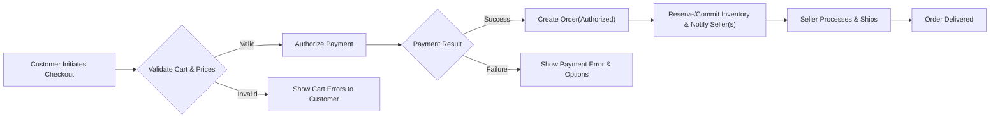
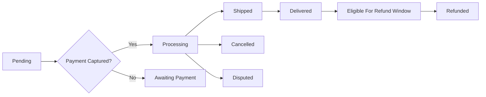
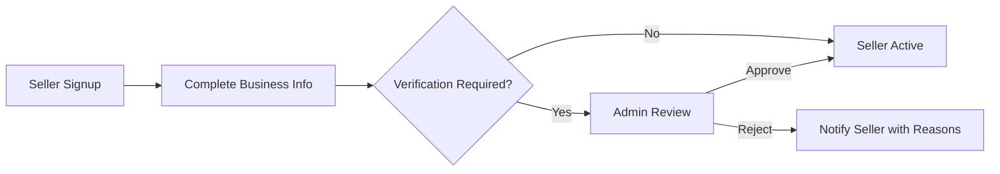

# shoppingMall — Requirements Analysis Report

## Executive Summary and Scope
shoppingMall is a multi-seller e-commerce marketplace that enables customers to discover multi-variant products, place orders, and track shipments while enabling third-party sellers to list, manage SKUs, control inventory, and fulfill orders. The scope includes account lifecycle, product catalog, SKU-level inventory, cart and reservation behavior, checkout, payment authorization and capture, order lifecycle and tracking, returns and refund flows, seller onboarding and performance enforcement, and admin moderation and reporting. Implementation specifics (APIs, schemas, vendor choices) are intentionally out of scope; business-level behaviors are specified in measurable terms.

## Actors and Permissions
Actors:
- customer — purchases items, manages addresses and payment methods, requests cancellations/refunds, writes reviews.
- seller — lists products and SKUs, updates inventory, processes and ships orders for their SKUs, responds to returns and refund requests.
- admin — moderates content and sellers, processes escalated refunds, suspends/delists sellers, and accesses platform reporting.

Permissions (business summary):
- THE customer SHALL act only on own account and orders; public product data and reviews are readable.
- THE seller SHALL manage only products, SKUs, inventory, and orders tied to their seller account.
- THE admin SHALL perform system-wide actions, which SHALL be auditable and require second approval for high-impact financial operations.

Permission matrix (high-level):
- Create product: seller, admin
- Update inventory: seller (own), admin
- Process refunds > threshold: admin (requires dual approval)
- Moderate reviews/listings: admin

## Authentication and Session Management (Business Rules)
- WHEN a user registers, THE system SHALL create an account in "email_unverified" state and SHALL issue no purchase permissions until email verification completes.
- THE system SHALL use JWT tokens for access control in business terms. THE platform SHALL issue short-lived access tokens (business recommendation: 15 minutes) and longer-lived refresh tokens (business recommendation: 14 days) and SHALL support refresh token rotation and revocation.
- WHEN a refresh token is exchanged, THE system SHALL rotate the refresh token and invalidate the previous refresh token; IF refresh token reuse is detected, THEN THE system SHALL revoke all refresh tokens for the user and require reauthentication.
- WHEN a user requests logout or revocation of all sessions, THE system SHALL invalidate all refresh tokens associated with the user within 5 seconds of request.
- WHERE high-risk accounts or admin/seller financial actions occur, THE system SHALL require multi-factor authentication (MFA) before permitting sensitive operations.

Acceptance criteria:
- 95% of valid login flows SHALL return tokens within 2 seconds under nominal load.
- Token revocation SHALL be effective platform-wide within 5 seconds.

## Functional Requirements (EARS format)
Each requirement uses EARS structure and includes acceptance criteria.

### Registration & Account Management
- WHEN a user registers, THE system SHALL accept email and password and SHALL create an inactive account pending email verification; THE verification link SHALL expire within 24 hours.
  - Acceptance: A verification token is delivered within 60 seconds of registration in 95% of attempts.
- THE system SHALL require passwords with minimum 10 characters, including upper, lower, digit, and special character.
- THE system SHALL allow customers to maintain up to 10 shipping addresses and SHALL allow one default address.
- IF a user requests account deletion, THEN THE system SHALL anonymize personal identifiers within 30 days and SHALL retain transaction records for compliance for at least 7 years.

### Product Catalog, Categories & Search
- THE system SHALL support hierarchical categories and multi-category assignments for products.
- WHEN a product is published, THE system SHALL require at least: title, primary category, one SKU, and a default price.
- THE system SHALL allow keyword search and filtering by category, price range, brand, and SKU attributes (color, size), and SHALL return top-20 results within 300ms 95% of the time under nominal load.

### SKU and Variant Model
- THE system SHALL model each sellable variant as a SKU with independent inventory count, optional override price, optional weight/dimensions, and attributes (e.g., color, size).
- WHEN a seller creates SKUs for a product, THE attribute names SHALL be consistent across SKUs for that product.

### Cart, Wishlist & Reservation
- THE system SHALL provide a persistent cart per authenticated customer that persists for 90 days of inactivity and SHALL support guest carts merged on login.
- WHEN a customer initiates checkout, THE system SHALL reserve inventory for the checkout for a configurable reservation window (default 15 minutes) and SHALL release reservations on timeout.
- WHERE a seller opts into "hold on add-to-cart", THE system SHALL honor seller-configured hold windows up to 15 minutes.
- THE system SHALL permit wishlists up to 500 items per customer.

Acceptance: Cart merge operations SHALL complete within 500ms in 95% of cases.

### Checkout, Payment Authorization & Capture
- WHEN checkout is initiated, THE system SHALL validate prices, promotions, and availability. IF any item is unavailable, THEN THE system SHALL abort checkout with per-item error codes.
- THE system SHALL support both authorize-only and immediate-capture payment flows as business-configurable options.
- WHEN payment is authorized, THE system SHALL create an order in "authorized" state and SHALL record the payment provider transaction ID.
- THE system SHALL attempt capture within the configured capture window (default: 7 days) and SHALL retry capture according to provider rules; failures SHALL trigger operations alerts.

Payment behavior SLAs:
- 95% of payment authorizations SHALL complete within 3 seconds under nominal load; 99% within 6 seconds.
- For timeouts, THE system SHALL mark order as "payment_timeout_pending" and present clear retry options.

### Order Lifecycle & Shipping
- THE system SHALL model these states: "pending", "authorized", "paid", "processing", "shipped", "delivered", "cancelled", "refunded", "disputed".
- WHEN a seller marks items shipped, THE system SHALL transition the sub-order to "shipped" and SHALL accept carrier and tracking number.
- WHEN tracking updates occur, THE system SHALL surface shipment events to the customer and update the order timeline within 5 minutes of webhook arrival in 95% of cases.

Seller SLA: Sellers SHALL update shipping status within 72 hours of payment capture; violations SHALL impact seller performance metrics.

### Inventory Management & Reconciliation
- THE system SHALL maintain SKU-level inventory for each seller including counters for "available", "reserved", and "committed".
- WHEN payment is captured, THE system SHALL atomically decrement committed inventory to avoid oversells.
- IF concurrent updates create negative inventory attempts, THEN THE system SHALL retry 3 times; on persistent failure, THE system SHALL revert payment and create an operations ticket.
- THE system SHALL require audit reasons for manual inventory adjustments greater than 10 units or >20% change.
- THE system SHALL run daily reconciliation and flag discrepancies greater than a configurable threshold (default 2%).

### Reviews & Ratings
- THE system SHALL allow customers who purchased a SKU to leave one review per SKU per order and SHALL label reviews with "verified purchase" when purchase evidence exists.
- WHEN a review is flagged for prohibited content, THEN THE system SHALL hide it from public listings and SHALL queue it for admin moderation within 48 hours.
- Customers SHALL be able to edit or delete reviews within 48 hours of submission; after 48 hours, reviews are immutable except by admin.

### Seller Accounts & Onboarding
- WHEN a seller registers, THE system SHALL collect business name, address, and tax/VAT ID, and SHALL place account in "pending_verification" until documents are verified.
- THE system SHALL provide seller dashboards for orders, inventory alerts, returns, and refunds; seller access is limited to their own data.
- IF a seller's refund rate exceeds a configured threshold within 30 days, THEN THE system SHALL flag the seller for review and may limit promotional features until resolved.

### Returns, Cancellations & Refunds
- THE system SHALL allow cancellations while order state is "pending" or "authorized" and within 60 minutes of order placement unless policies state otherwise.
- WHEN refund is approved, THE system SHALL initiate payment-provider refund within 72 hours of approval and SHALL record refund transaction IDs.
- THE system SHALL treat partial refunds per line-item and adjust seller payouts and commission calculations accordingly.

Refund SLA: 95% of approved refunds SHALL be initiated with provider within 72 hours of approval.

### Admin Dashboard, Moderation & Reporting
- THE system SHALL enable admins to suspend/delist sellers, moderate reviews, approve refunds, and access reporting. All admin actions SHALL be auditable with admin id, timestamp, and reason.
- WHEN a seller is suspended, THE system SHALL prevent new listings and purchases from that seller while preserving in-flight orders for fulfillment.
- THE system SHALL provide daily reports for GMV, refunds, chargebacks, seller SLA compliance, inventory discrepancies, and new seller onboarding counts.

## Business Rules and Validation (Examples)
- THE system SHALL prevent negative inventory values; any operation that would result in negative inventory SHALL be rejected with SKU_NEGATIVE_INVENTORY error.
- WHEN discounts apply, THE system SHALL ensure final item price is non-negative and SHALL enforce platform-level maximum discount caps if configured.
- WHERE promotions conflict, THE system SHALL apply precedence: item-level coupons override seller-level discounts which override platform promotions, unless otherwise configured.
- Input validation examples: emails MUST be RFC5322-compliant; phone numbers in E.164 where provided; addresses SHALL include line1, city, postal code, country code (ISO3166-1 alpha-2).

## Error Handling and Recovery Flows
- IF authentication fails due to invalid credentials, THEN THE system SHALL return AUTH_INVALID_CREDENTIALS and lock the account for 15 minutes after 10 failed attempts.
- IF payment provider times out, THEN THE system SHALL show PAYMENT_PROVIDER_TIMEOUT and allow retry or alternative payment methods; orders shall be marked "payment_timeout_pending".
- IF inventory inconsistency occurs at checkout, THEN THE system SHALL present an itemized message indicating which SKUs are unavailable and offer actions (remove, reduce quantity, backorder if supported).
- IF refund processing fails, THEN THE system SHALL mark refund as REFUND_FAILED and create an operations ticket for reconciliation.

Error codes (examples): AUTH_INVALID_CREDENTIALS, AUTH_TOKEN_EXPIRED, SKU_OUT_OF_STOCK, ADDR_IN_USE, PAYMENT_DECLINED, PAYMENT_PROVIDER_TIMEOUT, RESERVATION_EXPIRED, SKU_NEGATIVE_INVENTORY, REFUND_FAILED

## Performance, Monitoring & SLAs
- Authentication: 95% of login attempts SHALL complete within 2 seconds under nominal load.
- Catalog listing: 95% of paginated product listing requests (20 items) SHALL return within 500ms.
- Search: 95% of typical queries (top-20 results) SHALL return within 300ms.
- Reservation: 95% of inventory reservation operations SHALL complete within 200ms.
- Background reconciliation jobs SHALL complete and emit reports within 24 hours of job start.

Monitoring and alerts:
- THE system SHALL alert operations when payment authorization error rate exceeds 1% in 10 minutes, refund rate exceeds configured thresholds, or reconciliation failures exceed 0.5% of SKU volume.

## Acceptance Criteria and Example Test Scenarios
- Registration: Given valid email and password, WHEN registration is submitted, THEN an email verification shall be issued and account status shall be "email_unverified" until verification completes.
- Checkout: Given items with sufficient inventory, WHEN checkout completes and authorization succeeds, THEN an order shall be created and reservation converted to committed inventory atomically.
- Concurrent inventory: WHEN two concurrent checkouts compete for the last unit, THEN at most one order shall commit the unit and the other shall receive SKU_OUT_OF_STOCK.
- Refunds: WHEN a refund is approved, THEN refund initiation to provider shall occur within 72 hours and refund record including provider id shall be persisted.

## Edge Cases and Negative Scenarios
- WHEN external payment provider is partially unavailable, THEN the system SHALL queue payment attempts, inform customers, and allow alternate payment options.
- IF a seller repeatedly reports inaccurate stock leading to cancellations, THEN the platform SHALL apply progressive penalties: warning -> reduced visibility -> payout hold -> suspension.
- IF chargeback occurs, THEN the system SHALL preserve all evidence for at least 2 years and SHALL follow dispute resolution timelines per payment provider rules.

## Workflows and Diagrams
Checkout Flow:

Order Lifecycle:

Seller Onboarding:

Note: All diagram labels use double-quoted text and proper Mermaid syntax.

## External Integrations (Business Expectations)
- Payment providers: Tokenization for card data, idempotent authorization and refund APIs, webhook-driven events, authorization latency target 95% <= 3s.
- Shipping carriers: Support webhook tracking updates; tracking events reflected within 5 minutes for webhook-driven updates.
- Notifications: Transactional notifications (email/SMS/push) shall be attempted immediately with retries and fallbacks; marketing messages require explicit consent.
- Search provider: Near-real-time indexing; product/SKU visibility changes shall reflect in search within 60 seconds for 95% of updates.

## Data Retention, Privacy & Compliance
- Transactional and payment records SHALL be retained for at least 7 years for tax/compliance purposes unless local law requires otherwise.
- THE platform SHALL NOT store full PAN; card data SHALL be tokenized via PCI-certified providers.
- FOR EU/EEA residents, THE platform SHALL honor GDPR requests: acknowledge within 24 hours and fulfill within 30 calendar days, subject to legal exceptions for retained transactional records.
- Admin audit logs SHALL be retained for at least 7 years and SHALL be tamper-evident.

## Reporting, Monitoring & Operations
- Daily reports: GMV, refunds, chargebacks, seller SLA compliance, inventory discrepancies.
- Real-time alerts for: payment error spikes, reconciliation failures, reconciliation deltas > configured thresholds, seller SLA breaches.
- THE platform SHALL provide dashboards for ops and exportable reports for finance.

## Glossary
- SKU: Stock Keeping Unit — variant-level sellable item.
- GMV: Gross Merchandise Value.
- AOV: Average Order Value.
- SLA: Service Level Agreement.
- PAN: Primary Account Number (payment card number).

## Acceptance & Handover Guidance for Developers and QA
- Map each EARS requirement to automated acceptance tests.
- For each external provider, include mock scenarios for success and failure and test webhook replay.
- Validate performance SLAs via load testing scenarios representative of expected production traffic.

## Appendix: Example Error Codes and Messages
- AUTH_INVALID_CREDENTIALS: "Invalid credentials. Consider password reset."
- AUTH_TOKEN_EXPIRED: "Session expired. Please sign in again."
- SKU_OUT_OF_STOCK: "Selected SKU is out of stock; please reduce quantity or choose an alternative."
- PAYMENT_DECLINED: "Payment declined by the issuer. Try another payment method."
- REFUND_FAILED: "Refund attempt failed; operations have been notified."

## Related Documents
- 01-service-overview.md (service vision and KPIs)
- 02-user-actors.md (actor definitions and permission matrix)
- 07-external-integrations.md (provider expectations and SLAs)
- 08-order-and-payment-workflows.md (detailed order lifecycle rules)
- 09-inventory-and-seller-management.md (inventory reconciliation rules)

## Final Notes
All requirements above are provided in clear, testable business terms suitable for translation into technical specifications, APIs, and automated tests by the development team.