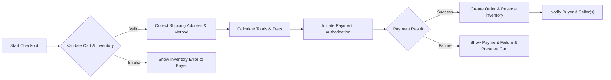
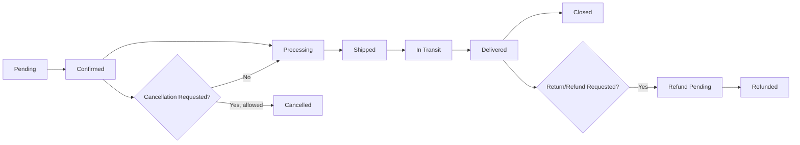
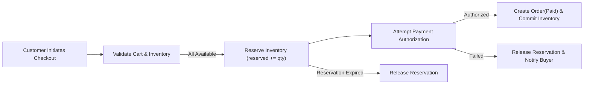
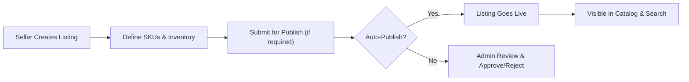

# Functional Requirements Specification — shoppingMall

## Purpose and Scope

The shoppingMall platform enables a multi-vendor marketplace where customers browse and purchase products, sellers manage catalogs and SKUs, and platform admins enforce policy and support operations. The specification below defines business-level functional requirements, business rules, and measurable acceptance criteria for all core features required for the MVP and immediate follow-up releases.

Audience: product owners, backend developers, QA, operations, and support teams.

Primary objectives:
- Enable customers to register, manage multiple shipping addresses, search and select product SKUs, persist carts and wishlists, place orders, and track shipments.
- Enable sellers to onboard, create products and SKUs, manage per-SKU inventory, process orders, and update shipping/tracking information.
- Provide admin and support workflows to moderate content, resolve disputes, and perform platform operations.

Timezone: All business timeframes use Asia/Seoul (KST) for policy cutoffs and SLA calculations unless otherwise indicated.

## Roles and Responsibilities (business-level)

- guest: Browse catalog and categories, view product and seller pages, use a temporary wishlist, and perform searches. Cannot place orders or save addresses.
- customer: Full buyer capabilities: register/login, manage profile and addresses, persistent cart and wishlist, checkout and pay, track orders, request cancellations/refunds, and submit reviews for eligible purchases.
- seller: Create and manage product listings and SKUs, set per-SKU pricing and inventory, view and manage orders that include their products, provide shipping/tracking updates, and respond to customer inquiries.
- supportAgent: View and update orders, process cancellations/refunds within policy, moderate reviews and seller issues, and escalate to admin when necessary.
- admin: Platform-wide control: manage users and sellers, moderate content, override or enforce business rules, access audit logs, and define policy configuration.

## High-Level KPIs and Acceptance Targets

- Checkout success rate: THE shoppingMall SHALL achieve >= 98% success rate for valid payment attempts in normal operating conditions.
- Inventory consistency: THE shoppingMall SHALL maintain inventory accuracy where oversell incidents are < 0.5% of paid orders per month.
- Search latency: THE shoppingMall SHALL return common search first-page results within 2 seconds for 95% of requests under normal load.
- Order-to-shipment time (seller responsiveness): THE shoppingMall SHALL measure median seller acknowledgement time <= 48 hours for physical goods in MVP region.
- Refund processing visibility: THE shoppingMall SHALL reflect refund initiation in customer-facing state within 24 hours of approval.

## Requirements by Feature (EARS format where applicable)

Note: "THE shoppingMall platform" is the authoritative system actor in the requirements below. All requirements are written as business-level obligations.

### 1) User Registration, Authentication, and Address Management

- WHEN a new user submits a registration request with email and password, THE shoppingMall platform SHALL create an inactive account and SHALL send a verification email to the supplied address.
- IF the verification link/token is not confirmed within 72 hours, THEN THE shoppingMall platform SHALL expire the verification token and SHALL prevent the account from placing orders until verification is completed.
- WHEN a registered customer authenticates with valid credentials, THE shoppingMall platform SHALL create an authenticated session and SHALL allow optional "remember me" persistent session behavior subject to configured session lifetime.
- WHEN a customer requests password recovery, THE shoppingMall platform SHALL validate the account ownership via the registered email and SHALL provide a single-use password reset mechanism that expires after 1 hour.
- WHEN a customer manages shipping addresses, THE shoppingMall platform SHALL allow the customer to create, update, delete, and set a default shipping address and SHALL allow up to 10 saved addresses per account (configurable limit).
- IF a customer attempts to delete an address that is associated with any non-finalized orders, THEN THE shoppingMall platform SHALL prevent deletion until orders are updated with an alternate address or orders reach a final state.

Validation rules (business-level):
- WHEN a customer saves an address, THE shoppingMall platform SHALL require recipient name, street address line 1, city, postal code, country, and phone number. Missing required fields SHALL result in a clear field-level error.

Acceptance criteria:
- Successful registration flows produce verification messages in <= 5 minutes for 98% of valid requests.
- Address CRUD operations complete in <= 2 seconds under normal load.

### 2) Product Catalog, Categories, and Search

- THE shoppingMall platform SHALL support hierarchical categories and tags for product discovery and SHALL allow products to be associated with multiple categories where appropriate.
- WHEN a seller publishes a product, THE shoppingMall platform SHALL index the product for search and SHALL make the product discoverable in category listings within 30 seconds for 95% of publish events under normal load.
- WHEN a shopper performs a search, THE shoppingMall platform SHALL return paginated results sorted by configurable business rules (relevance, rating, price) and SHALL support filtering by category, price range, seller, availability, and rating.
- IF a product is unpublished or removed, THEN THE shoppingMall platform SHALL remove it from public search and category listings within 60 seconds.

Search behavior and UI expectations (business-level):
- WHEN the query contains typos or partial words, THE shoppingMall platform SHALL return reasonable fuzzy matches and SHOULD highlight matched terms in the result set.

Acceptance criteria:
- Relevance-adjusted first-page search latency <= 2 seconds for 95% of requests.

### 3) Product Variants and SKU Management

- THE shoppingMall platform SHALL represent each distinct sellable combination (for example color+size+option) as a unique SKU with its own identifier, price, images, and inventory count.
- WHEN a seller defines variant attribute types (e.g., color, size), THE shoppingMall platform SHALL generate SKU records for each valid combination and SHALL allow the seller to edit SKU attributes individually (price overrides, inventory, SKU images).
- IF a seller attempts to create more than 500 SKUs for a single product, THEN THE shoppingMall platform SHALL reject additional SKU creation and SHALL return a business error explaining the SKU limit (configurable limit to prevent combinatorial explosion).

Business rules:
- THE shoppingMall platform SHALL display SKU-level availability on product pages and SHALL prioritize showing in-stock SKUs as the default selection.

Acceptance criteria:
- SKU creation and edits are visible to shoppers within 30 seconds for 95% of operations.

### 4) Shopping Cart and Wishlist

- WHEN a guest adds items to a cart, THE shoppingMall platform SHALL persist a temporary guest cart for 30 days unless the guest clears it or converts it by registering.
- WHEN a customer is authenticated, THE shoppingMall platform SHALL persist the customer's cart across sessions and SHALL merge guest cart contents into the customer's persistent cart at first successful login after guest activity.
- WHEN a user adds an SKU to cart, THE shoppingMall platform SHALL validate requested quantity against available inventory and SHALL return an informative message if requested quantity exceeds availability.
- WHERE a shopping cart contains items from multiple sellers, THE shoppingMall platform SHALL represent the order at checkout as a parent order with sub-orders or fulfillment groups per seller.
- WHEN a user saves items to a wishlist, THE shoppingMall platform SHALL allow persistent wishlists for registered users and temporary wishlists for guests; the platform SHALL permit conversion of temporary wishlists to persistent wishlists during registration within 14 days.

Acceptance criteria:
- Cart merge occurs without duplicating items and within 3 seconds of authentication in 95% of cases.

### 5) Checkout, Order Placement, and Payment Processing

- WHEN a customer initiates checkout, THE shoppingMall platform SHALL validate cart contents, pricing, promotions applied, shipping address, and SKU inventory availability before initiating payment.
- WHEN payment authorization succeeds, THE shoppingMall platform SHALL create an order record that includes order-level totals, per-line SKU data, seller attribution, shipping address, and initial order state, and SHALL reserve the ordered SKU quantities immediately.
- IF payment authorization fails, THEN THE shoppingMall platform SHALL not create a confirmed order and SHALL present retry options to the customer while preserving cart contents.
- WHERE payment capture is separate from authorization, THE shoppingMall platform SHALL clearly record payment state (authorized, captured, refunded) in the order metadata.
- WHEN an order contains items from multiple sellers, THE shoppingMall platform SHALL create per-seller suborders/fulfillment groups so each seller can manage their fulfillment independently.

Timing expectations:
- Payment authorization acknowledgement SHALL be presented to the user within 5 seconds for 95% of synchronous gateway operations.

Acceptance criteria:
- On successful payment, order confirmation is delivered to buyer and affected sellers within 2 minutes for 95% of transactions.

### 6) Order Lifecycle, Tracking, and Shipment Status

- THE shoppingMall platform SHALL expose the following business-visible order states: "Created", "Payment Pending", "Paid", "Processing", "Shipped", "In Transit", "Delivered", "Cancelled", "Refund Pending", "Refunded", and "Closed".
- WHEN a seller marks an order-line or fulfillment group as shipped and provides carrier and tracking number, THE shoppingMall platform SHALL create a shipment record and SHALL surface that tracking information to the buyer and support agents within 60 seconds.
- WHEN carrier or seller updates are received, THE shoppingMall platform SHALL update shipment state and SHALL notify the buyer according to their notification preferences.
- WHEN all fulfillment groups for an order are delivered, THE shoppingMall platform SHALL transition the order to "Delivered" and shall allow the system to move the order to "Closed" after the configured return/claim window expires.

Mermaid diagram — Checkout flow (graph LR):

Acceptance criteria:
- Shipment update latency (seller-entered) <= 60 seconds for 95% of updates.

### 7) Product Reviews and Ratings

- WHEN a customer purchases and receives a product, THE shoppingMall platform SHALL allow that verified purchaser to submit a rating (1–5 stars) and an optional text review for the SKU, subject to moderation rules.
- IF a review is flagged by automated filters or user reports for abusive content, THEN THE shoppingMall platform SHALL set the review to a "Pending Moderation" state and SHALL hide it from public listing until a supportAgent or admin resolves the moderation queue.
- THE shoppingMall platform SHALL restrict one review per SKU per purchaser per review window; updates to an existing review by the purchaser SHALL replace previous content and be versioned in the moderation log.

Acceptance criteria:
- Verified-purchase checks shall prevent reviews from non-buyers; review submission by verified buyers shall succeed in <= 2 seconds.

### 8) Seller Account and Product Management

- WHEN a seller registers, THE shoppingMall platform SHALL collect seller business details and contact information and SHALL record the seller in a "Pending Verification" state if verification is required.
- IF the platform policy requires verification for certain categories or thresholds, THEN THE shoppingMall platform SHALL require seller verification before the seller can publish listings in restricted categories.
- WHEN a seller creates or updates a product listing, THE shoppingMall platform SHALL record the seller as the owner and SHALL prevent changes that would affect already-accepted orders (for example, changing SKU identity after fulfillment has started) without admin intervention.
- IF a seller deactivates a product that has pending orders, THEN THE shoppingMall platform SHALL prevent the product from being purchased again but SHALL allow fulfillment of existing orders.

Acceptance criteria:
- Seller listings that pass validation shall be publishable within 30 seconds for 95% of valid submissions.

### 9) Inventory Management per SKU

- THE shoppingMall platform SHALL maintain AvailableInventory and ReservedInventory per SKU and SHALL log inventory adjustment events with actor and timestamp for auditability.
- WHEN an order payment is authorized, THE shoppingMall platform SHALL move the ordered quantities from AvailableInventory to ReservedInventory for a configured reservation window (default 15 minutes).
- IF payment capture completes successfully, THEN THE shoppingMall platform SHALL convert ReservedInventory to Committed/Sold inventory.
- IF reservation expires or order is cancelled prior to capture, THEN THE shoppingMall platform SHALL release ReservedInventory back to AvailableInventory immediately.
- IF a seller attempts to set AvailableInventory to a value that would make Committed inventory exceed the new AvailableInventory, THEN THE shoppingMall platform SHALL reject the update and SHALL require seller confirmation or admin reconciliation.

Inventory reconciliation and oversell handling:
- WHEN an inventory reconciliation detects negative available quantities or oversell conditions, THEN THE shoppingMall platform SHALL mark affected SKUs for reconciliation, SHALL notify involved sellers and support, and SHALL place impacted orders into "Pending Inventory Reconciliation" until resolved.

Acceptance criteria:
- Reservation window expiration behavior shall release inventory within 5 seconds of expiry in 95% of tests.

### 10) Order History, Cancellation, and Refund Requests

- THE shoppingMall platform SHALL present buyers with a complete order history that includes order-level and line-item statuses, shipment tracking information, payment states, and refund events.
- WHEN a customer requests cancellation before order shipment and within the configured cancellation window, THE shoppingMall platform SHALL accept the cancellation automatically and SHALL release reserved inventory and initiate refund processing where necessary.
- WHEN a customer requests a refund after delivery within the configured refund window (default 14 days following delivery), THE shoppingMall platform SHALL record the refund request and SHALL route it for supportAgent or seller handling based on policy and refund rules.
- IF a refund is approved, THEN THE shoppingMall platform SHALL mark the order or affected order-lines as refunded and SHALL update seller balances and payout calculations to reflect the refund.

Acceptance criteria:
- Cancellation requests that meet automatic cancellation rules shall be resolved in <= 10 minutes and refunds initiated within 24 hours of approval (payment provider timing excluded).

### 11) Admin Dashboard and Management Operations

- THE shoppingMall platform SHALL provide admins with the ability to: view and search orders and sellers, suspend or reactivate seller accounts, moderate product listings and reviews, issue platform-initiated refunds, and view audit logs for critical actions.
- WHEN an admin performs a state-changing action (for example, suspend seller, issue refund), THE shoppingMall platform SHALL record an auditable entry with admin id, action taken, timestamp, and stated reason.
- IF an admin suspends a seller, THEN THE shoppingMall platform SHALL prevent new purchases of that seller's active listings while allowing existing orders to be fulfilled per admin instructions.

Acceptance criteria:
- Admin actions shall be logged and visible in the audit trail within 1 minute of action for 95% of events.

## Workflows and Business Flows (Mermaid diagrams)

Order lifecycle (graph LR):

Inventory reservation flow (graph LR):

Seller product management flow (graph LR):

## Error Handling and Edge Cases (EARS-format)

- IF the payment gateway reports an intermittent failure, THEN THE shoppingMall platform SHALL present a retry option to the buyer and SHALL preserve cart and reservation until reservation expiry.
- WHEN concurrent checkout attempts request the last available unit of a SKU, THEN THE shoppingMall platform SHALL allow only a single successful confirmation and SHALL notify unsuccessful buyers with an "out of stock" message and suggested alternatives.
- IF a carrier reports an exception (lost/delayed), THEN THE shoppingMall platform SHALL create a dispute case and SHALL notify both buyer and seller; supportAgent SHALL be routed the case for investigation within configured SLA.
- WHEN an automated review moderation filter detects prohibited content, THEN THE shoppingMall platform SHALL set the review to "Pending Moderation" and SHALL hide it from public view until resolved by a moderator or approved by policy.

Acceptance criteria:
- Concurrent purchase test: simulate two concurrent purchases for the last item—exactly one order shall succeed and the other shall be failed with explicit out-of-stock error in 100% of test runs.

## Conceptual Data Entities and Relationships (business-level)

- User: { userId, role, email, displayName, verificationState }
- Address: { addressId, userId, recipientName, line1, line2, city, postalCode, country, phone, isDefault }
- SellerProfile: { sellerId, displayName, status, verificationState }
- Product: { productId, sellerId, title, description, categories, defaultSkuId, visibilityState }
- SKU: { skuId, productId, attributes, price, currency, availableInventory, reservedInventory }
- Cart: { cartId, userId or guestToken, items[{ skuId, quantity, addedAt }], reservationId }
- Order: { orderId, buyerId, total, currency, orderState, paymentState, createdAt }
- OrderLine: { orderLineId, orderId, skuId, quantity, unitPrice, sellerId, lineStatus }
- Shipment: { shipmentId, orderId, sellerId, carrier, trackingNumber, shipmentStatus }
- Review: { reviewId, skuId, authorId, rating, text, moderatedState }
- InventoryEvent: { eventId, skuId, delta, reason, actorId, timestamp }

Relationships summary:
- A Product belongs to one SellerProfile and contains many SKUs.
- A User can have many Addresses and Orders; an Order contains OrderLines which link to SKUs and Sellers.
- A Shipment maps to one or more OrderLines for a Seller's fulfillment.

## Non-Functional Expectations (business-level)

Performance and latency:
- WHEN a user performs a common search query, THE shoppingMall platform SHALL return first-page results within 2 seconds for 95% of requests.
- WHEN a user logs in, THE shoppingMall platform SHALL authenticate and respond within 2 seconds for 95% of successful logins.

Availability and reliability:
- THE shoppingMall platform SHALL target monthly availability of 99.5% for core buyer flows in the launch region.

Monitoring and alerts:
- WHEN checkout failure rate exceeds 2% sustained for 3 minutes, THEN THE shoppingMall platform SHALL create a critical alert and notify on-call operations.

## Authentication and Authorization (business-level)

- WHEN a user logs in, THE shoppingMall platform SHALL issue short-lived access credentials and a longer-lived refresh credential (business-managed lifetimes: access token recommended 15–30 minutes, refresh token recommended 7–30 days) and SHALL honor revocation on logout and password change.
- IF an account experiences more than 10 failed login attempts in a 15-minute sliding window, THEN THE shoppingMall platform SHALL temporarily block further login attempts for that account for 15 minutes and SHALL require password reset or supportAgent intervention to lift blocks.
- WHEN high-privilege roles (supportAgent, admin, seller high-volume accounts) are created, THEN THE shoppingMall platform SHALL recommend enabling multi-factor authentication (MFA) and SHALL require MFA for admin by default.

Permission matrix (business-level summary):
- guest: BrowseCatalog, SearchProducts
- customer: BrowseCatalog, SearchProducts, ManageProfile, CartManagement, PlaceOrder, ViewOwnOrders, WriteReview
- seller: SellerProductManagement, InventoryManagement, ProcessSellerOrder, UpdateShippingStatus, ViewOrdersForSeller
- supportAgent: ViewAllOrders, SupportOrderUpdate, ModerateReviews, ProcessRefunds (within policy)
- admin: AdminFull (all platform management capabilities)

Acceptance criteria:
- Token revocation events (logout/password change) shall be enforced across sessions within 60 seconds consistency window.

## Open Questions and Policy Decisions Required

1. Payment routing model: Decide whether the platform will route payments directly to sellers and collect fees (marketplace routing) or act as intermediary and make payouts (platform mediated). The choice impacts KYC, settlement, and accounting.
2. Refund windows: Confirm default refund windows per category (recommended defaults: 14 days post-delivery for general goods, adjustable by category).
3. Seller verification policy: Define thresholds for mandatory seller KYC and whether manual verification will be used in MVP.
4. SKU-per-product hard limit: Confirm the maximum SKU count per product for platform performance (recommended default: 500).
5. Carrier integration scope: Decide which carriers will be integrated with real-time tracking at MVP and which will be manual seller-entered tracking.

## Acceptance Test Examples (selected)

- Inventory concurrency test: Two concurrent checkout attempts for final SKU unit — only one succeeds; the other receives out-of-stock error. 100 iterations must pass.
- Reservation expiry test: Reserve inventory for a cart, do not capture payment, and verify inventory returns to available state within 5 seconds after reservation expiration in 95% of runs.
- Search latency test: Execute representative query workload and verify 95th percentile latency <= 2 seconds.
- Payment failure recovery: Simulate gateway intermittent failure and verify cart preserved and retry flow allows recovery within reservation window.

## Glossary
- SKU: Stock Keeping Unit — variant-level sellable unit.
- Reservation: A temporary hold on inventory for a pending checkout.
- Committed Inventory: Inventory permanently decremented after capture or fulfilled order.
- Suborder/Fulfillment Group: Seller-specific subset of a parent order used for per-seller fulfillment.

## Next Steps and Implementation Handover

- Stakeholders must resolve Open Questions listed above prior to detailed technical design.
- Use the EARS-formatted requirements and acceptance tests above to create developer stories and QA test suites.
- Convert workflows into API designs and data models once vendor/integration decisions (payment/shipping/tax) are locked.

## Appendix: Diagrams and Reference Flows

(See mermaid diagrams embedded in the document for Checkout flow, Inventory reservation flow, Order lifecycle, and Seller product management.)

