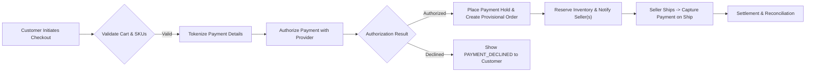
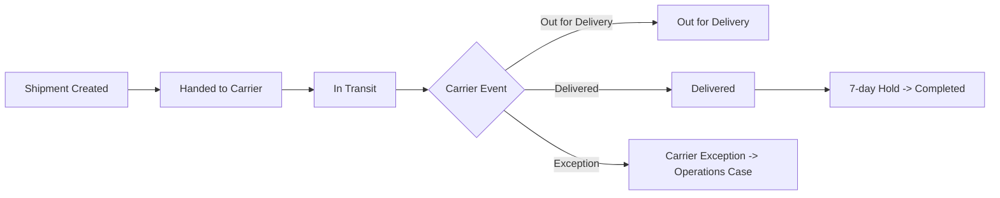
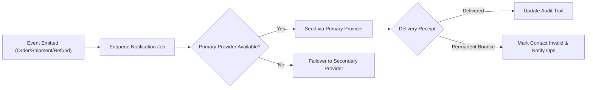

# shoppingMall — External Integrations & Non-Functional Requirements

## Purpose and scope
Provide business-level, testable requirements for all third-party integrations and non-functional behaviors required by shoppingMall. Integrations covered include payments, shipping/carriers, notifications (email/SMS/push), search/indexing, and inventory synchronization. Audience: backend engineers, integration engineers, SRE/ops, merchant operations, and compliance teams.

All functional requirements in this document use EARS-style statements (WHEN, THE, SHALL, IF, THEN) and include measurable acceptance criteria. Technical implementation (API definitions, schemas, vendor selection) is left to the development team.

## Actors and integration touchpoints
- customer: Browses catalog, places orders, views tracking and notifications.
- seller: Publishes products, syncs inventory, provides shipping updates, accepts returns.
- admin: Processes escalations, refunds, dispute evidence, and platform-level reconciliations.

## Core integration principles (business rules)
- THE platform SHALL treat external integrations as fallible: every critical external interaction SHALL support idempotency, retries, circuit-breaker and failover to a secondary provider when available.
- WHEN sensitive data (payment instruments) is exchanged, THE platform SHALL use tokenization via PCI-compliant providers and SHALL NOT store PANs on-platform.
- THE platform SHALL surface clear user-facing messages that map to standardized error codes to aid recovery and support triage by operations.

---

## Payments (Authorization, Capture, Refund, Reconciliation)

Overview: Accept payments securely, support authorization/capture and refund flows, reconcile settlements daily.

Payment EARS requirements (business-level):
- WHEN a customer submits payment details, THE system SHALL tokenize card data via a PCI-certified payment provider and SHALL NOT store PANs on-platform.
  - Acceptance: No PAN values exist in platform persistent stores in audit sampling.

- WHEN a payment authorization request is sent to a payment provider, THE system SHALL receive a definitive success/failure within 3 seconds for 95% of authorizations under nominal load.
  - Acceptance: 95th percentile <= 3s, 99th percentile <= 6s; monitoring must capture latency metrics per provider.

- IF the payment provider returns a transient error (network or 5xx), THEN THE system SHALL retry authorization up to 2 times with exponential backoff (initial 500ms) and SHALL ensure idempotency using an idempotency key.
  - Acceptance: Retries do not create duplicate charges; duplicate-charge incidents <0.001% of transactions.

- WHEN an order requires capture later (authorize-only flow), THE system SHALL capture funds within 7 days of authorization unless business configuration specifies a shorter window.
  - Acceptance: Captures attempted within configured window; any capture attempted post-window triggers re-authorization flow logged for ops.

- WHEN a refund is approved, THE system SHALL initiate refund to the original payment method within 24 hours and SHALL record the refund transaction id. THE system SHALL notify customer of refund initiation within 2 hours.
  - Acceptance: 95% of refunds initiated within 24 hours of approval.

- WHEN payment provider webhooks (authorization, capture, refund, dispute) are received, THE system SHALL validate webhook signature, process the event idempotently, and update order/payment state within 5 minutes of webhook arrival 95% of the time.
  - Acceptance: 95th percentile webhook-to-state-update latency <= 5 minutes.

Operational & reconciliation rules:
- THE system SHALL produce a daily settlement reconciliation report that matches platform ledger to provider settlement files and SHALL flag discrepancies >0.1% of daily GMV for finance review.
- WHEN reconciliation finds discrepancies, THE system SHALL create a high-priority task assigned to Finance within 4 hours.

Error taxonomy and user-facing codes (examples):
- PAYMENT_DECLINED: "Payment declined by issuer. Please try another card or contact your bank." (no provider PII).
- PAYMENT_TIMEOUT: "Payment provider timeout. Please retry or use another payment method." (suggest retry options).
- PAYMENT_PROVIDER_ERROR: "Temporary payment processing issue. Try again in a few minutes." (increment retry counters).

Security & compliance notes:
- THE platform SHALL never persist full card PAN values and SHALL use PCI-certified tokenization. Storage of tokens and payment references SHALL be auditable and restricted to finance roles only.

---

## Shipping and Carrier Integrations

Overview: Provide shipping rates, label creation, tracking ingestion, and exception handling; support multi-carrier routing, polling fallback when webhooks are unavailable.

Shipping EARS requirements:
- WHEN a seller requests shipping rates for an order, THE system SHALL return carrier options with estimated delivery windows and costs within 2 seconds for cached results and within 5 seconds for live calculations (95th percentile).
  - Acceptance: 95th percentile rate lookup latency <= 5s.

- WHEN a seller marks a shipment as "Handed to Carrier" with tracking, THE system SHALL make tracking immediately visible to customers and SHALL attempt carrier tracking verification within 15 minutes.
  - Acceptance: 95% of tracking numbers validated within 15 minutes.

- WHEN carriers send tracking updates via webhook, THE system SHALL validate webhook signatures and update shipment states within 5 minutes of webhook receipt for 90% of events.
  - Acceptance: 90th percentile webhook processing <= 5 minutes.

- IF webhooks are not available from a carrier, THEN THE system SHALL poll the carrier's API at a configurable cadence (default every 6 hours for in-transit shipments) and SHALL escalate to operations if no updates are obtained within 24 hours.

- WHEN a carrier reports an exception (lost/delayed/damaged), THE system SHALL notify customer and seller within 2 hours and SHALL open an operations case for investigation.

Returns and labels:
- WHEN a return is approved and seller provides return label capabilities, THE system SHALL generate and provide a return label within 24 hours of approval.
- IF return shipment is not scanned within 14 days of label issuance, THEN THE system SHALL notify the customer and seller and provide options to reissue label or proceed with compensation per seller policy.

Shipping error codes (examples):
- TRACKING_ERROR: "Tracking information invalid or not found. Seller must verify tracking number." (action: seller update).
- CARRIER_EXCEPTION: "Carrier reported exception - operations investigating." (action: operations case opened).

Carrier selection and business rules:
- THE system SHALL support rule-based carrier selection by seller preference, cost, SLA, and zone.
- WHERE sellers opt into marketplace fulfillment, THE system SHALL map fulfillment SKUs to fulfillment center and carrier combinations and SHALL surface expected SLA accordingly.

---

## Notifications (Email, SMS, Push) — Delivery & Failover

Overview: Deliver transactional notifications reliably; separate transactional from marketing; handle bounces and provider failures with failover.

Notifications EARS requirements:
- THE system SHALL classify all outgoing messages as "transactional" or "marketing" and SHALL require explicit opt-in for marketing; transactional messages SHALL be delivered regardless of marketing consent.

- WHEN a transactional event occurs (order confirmation, shipment update, refund initiation, password reset), THE system SHALL enqueue and attempt delivery to the primary notification provider within 60 seconds.
  - Acceptance: 90% of notification enqueue-to-provider attempts succeed within 60 seconds.

- IF primary provider returns a transient error, THEN THE system SHALL retry up to 3 times with exponential backoff and SHALL failover to a secondary provider if configured after the second retry.
  - Acceptance: Failover executed automatically when primary provider sustained errors exceed threshold (default: 5% error rate in 5 minutes).

- WHEN an email bounces as permanent, THE system SHALL mark the email as invalid and notify operations for possible remediation; transactional retries to that address SHALL cease.

- THE system SHALL support localized templates per market/language; messages SHALL avoid including PII or payment details.

Notification error codes (examples):
- NOTIF_BOUNCED: "Message could not be delivered to the recipient email or phone." (action: mark contact invalid and notify operations).
- NOTIF_PROVIDER_TIMEOUT: "Notification delivery delayed due to provider issues." (action: retry and failover).

Deliverability and reputation rules:
- THE system SHALL track delivery rates and spam complaints; transactional email delivery rate SHALL be >= 98% and spam complaint rate SHALL be < 0.05% per 30-day window.

---

## Search & Catalog Indexing

Overview: Provide near-real-time indexing for product and SKU changes, faceting, and relevance tuning.

Search EARS requirements:
- WHEN a product or SKU attribute (price, availability, visibility flag) changes, THE system SHALL reflect the change in search results within 60 seconds for 95% of updates and within 5 minutes for 99% of updates.
  - Acceptance: Index update latency metrics: 95th percentile <= 60s.

- THE system SHALL support faceted filtering by category, price range, brand, rating, seller, and SKU attributes and SHALL allow deterministic sorting options (relevance default, price_asc, price_desc, newest, best_seller).

- WHEN search provider reports an indexing failure for a change batch, THE system SHALL enqueue failed updates for retry and SHALL provide an operational alert if failed updates exceed 0.1% of change volume within 1 hour.

- THE system SHALL provide nightly full reindex capability and a manual reindex trigger for operations.

Search performance targets:
- Query median latency <= 150ms; 95th percentile <= 500ms for common queries under expected load.

---

## Inventory Sync & Reconciliation

Overview: Support multiple inventory synchronization modes (manual, bulk, push, polling) and provide robust reconciliation to detect discrepancies.

Inventory EARS requirements:
- WHEN a seller pushes an inventory update for a SKU, THE system SHALL validate and apply the update within 5 minutes for push integrations and within 2 hours for bulk CSV uploads under normal conditions.
  - Acceptance: 95% of push updates reflected within 5 minutes.

- THE system SHALL perform daily reconciliation runs that compare committed sales and recorded stock movements. IF reconciliation finds a delta > configurable threshold (default 2% or absolute 10 units for a SKU), THEN THE system SHALL flag the SKU and create a reconciliation ticket for merchant operations.

- WHEN concurrent inventory operations lead to negative stock detection, THE system SHALL automatically trigger a reconciliation alert, revert the inconsistent change if possible, and create a high-priority operations ticket.

Sync modes and rules:
- Push: recommended for high-volume sellers; requires webhook or API publish of inventory changes.
- Polling: available for legacy systems; default cadence configurable but not more frequent than every 5 minutes for high-velocity sellers.
- Bulk: accepted for initial onboarding and periodic updates; platform SHALL validate files and provide a dry-run report prior to commit.

---

## Monitoring, Observability & Alerting

Overview: Emit business telemetry, create dashboards, and alert on predefined thresholds; provide incident runbooks.

Monitoring EARS requirements:
- THE system SHALL emit telemetry for payment attempts (success/failure), webhook latencies, notification delivery rates, index freshness, inventory reconciliation results, and carrier exception events.

- WHEN any critical metric crosses a defined threshold (examples: payment failure rate > 2% over 15 minutes, chargeback rate > 0.5% monthly, inventory reconciliation failure rate > 0.5% daily), THEN THE system SHALL create an incident and notify on-call SRE and appropriate ops roles within 10 minutes.

- THE system SHALL retain logs and traces for critical business events for at least 90 days and transactional logs for at least 1 year to support disputes and reconciliation, with a longer retention (7 years) for financial settlement data where legally required.

Dashboards and runbooks:
- Provide real-time operational dashboard for checkout funnel, payment success, delivery exceptions, and notification health.
- Provide runbooks for: payment provider outage, carrier webhook failures, notification provider degradation, reconciliation failures, and high chargeback incidents.

---

## Security, Privacy & Compliance (GDPR, PCI-DSS, Regional Laws)

Overview: Ensure integrations and data handling comply with PCI-DSS and regional privacy laws; define retention and breach timelines.

Compliance EARS requirements:
- WHEN payment instruments are collected, THE system SHALL tokenize card data using PCI-DSS compliant providers and SHALL NOT store PANs in platform data stores.

- WHEN personal data of EU/EEA residents is processed, THE system SHALL honor GDPR rights: acknowledge DSARs within 24 hours and fulfill requests within 30 days unless an extension or legal hold applies.

- THE system SHALL encrypt sensitive data at rest and in transit (TLS 1.2+). Key management SHALL support rotation without data loss and SHALL be auditable.

- WHEN a data breach affecting EU/EEA resident PII is confirmed, THEN THE system SHALL notify supervisory authority within 72 hours and affected data subjects as required by law.

---

## Error Taxonomy and Standardized Codes

Standard codes and example messages (programmatic and human-readable):
- PAYMENT_DECLINED: "Payment declined by issuer. Try another payment method or contact your bank." (user-facing)
- PAYMENT_TIMEOUT: "Payment request timed out. Please retry or choose another payment method." (user-facing)
- PAYMENT_PROVIDER_ERROR: "Temporary payment processing issue. Please retry later." (user-facing)
- TRACKING_ERROR: "Shipment tracking unavailable. Seller to verify tracking number." (user-facing)
- WEBHOOK_SIGNATURE_INVALID: "Webhook signature invalid. Event discarded and queued for reconciliation." (ops-facing)
- NOTIF_BOUNCED: "Notification could not be delivered. Contact information marked invalid." (ops-facing)
- RESERVATION_EXPIRED: "Your cart reservation expired. Please revalidate your cart and pricing." (user-facing)

Each code SHALL be accompanied by a remediation step and telemetry tag for monitoring and analytics.

---

## Operational Runbooks and Playbooks

Minimum runbooks to include and maintain:
- Payment provider outage: failover steps, idempotency key verification, manual capture procedures, customer communication templates.
- Webhook replay and reconciliation: steps to replay provider events, verify idempotency, and reconcile missed events.
- Carrier webhook failure: polling fallback cadence and carrier contact sequence.
- Notification provider degradation: failover to secondary provider and sender reputation remediation steps.
- Chargeback and dispute handling: evidence collection checklist and provider submission timelines.

Runbook expectations:
- Each runbook SHALL include owner (role), escalation path with contacts, expected response times, and sample templates for customer and seller communications.
- Runbooks SHALL be reviewed quarterly and after any major incident.

---

## Acceptance Criteria and Test Scenarios

Representative acceptance tests (business-level):
1. Payment authorization latency: Simulate normal load; 95% of authorizations complete <= 3s. Verify metrics recorded and alerting triggers when violated.
2. Webhook processing: Simulate webhook delivery; 95% of events reflected into order/payment state within 5 minutes; verify signature validation rejection path and replay behavior.
3. Index freshness: Update SKU availability; 95% of updates visible in search within 60s.
4. Notification failover: Simulate primary provider failures; confirm retries and failover to secondary provider within configured thresholds and check notifications delivered.
5. Inventory reconciliation: Inject inventory mismatch >2%; confirm daily reconciliation flags and creation of operations ticket.

---

## Diagrams

Checkout & Payment Flow:

Shipping State Machine:

Notification & Failover Flow:

---

## Glossary and References
- PAN: Primary Account Number (payment card number)
- GMV: Gross Merchandise Value
- SLA/SLO: Service Level Agreement / Service Level Objective
- DSAR: Data Subject Access Request

Related documents: Service Overview (01-service-overview.md), Functional Requirements (03-functional-requirements.md), Order & Payment Workflows (08-order-and-payment-workflows.md), Inventory & Seller Management (09-inventory-and-seller-management.md), Admin Dashboard (10-admin-dashboard-and-reporting.md).

---

## Appendix: Sample Error Codes Table (JSON-like)

- "PAYMENT_DECLINED": {"message":"Payment declined by issuer","action":"ask user to retry or use different method","severity":"user"}
- "PAYMENT_TIMEOUT": {"message":"Payment timed out","action":"retry with idempotency key or use different method","severity":"user"}
- "WEBHOOK_SIGNATURE_INVALID": {"message":"Webhook signature invalid","action":"queue for reconciliation and alert ops","severity":"ops"}

