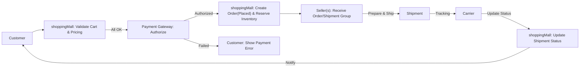
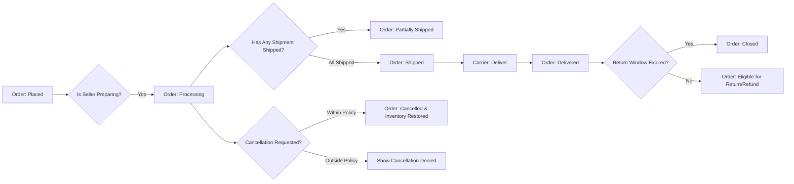
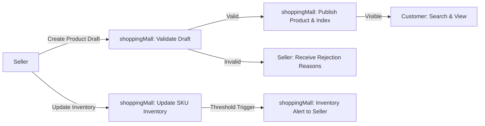
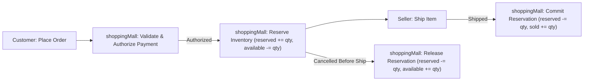
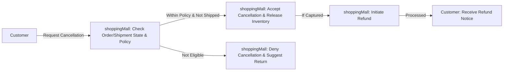
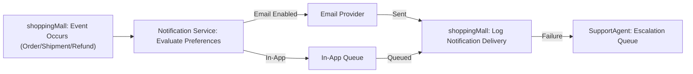

# Workflows and Process Flows for shoppingMall

## Executive Summary and Scope

This document describes the business workflows, step-by-step processes, decision points, and acceptance criteria for the shoppingMall e-commerce platform. It converts the requested features into clear, testable business logic that backend engineering, product management, QA, and operations can use to implement and validate platform behavior. Workflows in this document focus on user-visible states and platform decisions; they intentionally avoid specifying technical implementations (APIs, database schemas, or infrastructure).

This document provides business requirements only. All technical implementation decisions (architecture, APIs, database design) belong to the development team and are outside the scope of this document.

Scope (features covered):
- User registration, login, and address management
- Product catalog, categories, search
- Product variants (SKU) and seller-owned listings
- Shopping cart, wishlist, and checkout
- Order placement, payment processing, order lifecycle and tracking
- Inventory management per SKU and reservation rules
- Product reviews and ratings
- Seller account product management and order handling
- Order history, cancellation, and refund handling
- Admin operations for order/product management

Assumptions (business-level):
- Payment processing is provided by external gateway(s) chosen during implementation.
- Shipping tracking may come from carriers (real-time or periodic updates) depending on integration choices.
- Sellers are onboarded and verified before first product publication unless a manual override is agreed.
- The platform operates primarily in Asia/Seoul timezone (KST); all time-based SLAs and examples reference Asia/Seoul unless otherwise stated.

## Roles and Responsibilities (business view)

- "guest": Browses catalog, views product details and seller profiles, uses a temporary wishlist. Cannot place orders or manage addresses.
- "customer": Manages account, multiple shipping addresses, persistent wishlists and carts, places orders, requests cancellations/refunds, writes reviews.
- "seller": Creates and manages product listings and SKUs, manages inventory per SKU, views/processes orders containing their products, updates shipment status for their shipments.
- "supportAgent": Views and updates order statuses, processes cancellations/refunds subject to rules, communicates with customers and sellers, escalates to admin.
- "admin": Platform administrator with full privileges to manage orders, products, sellers, users, platform settings, reporting, moderation, and escalation.

Authentication notes (business-level):
- Elevated roles (seller, supportAgent, admin) SHOULD be required to use multi-factor authentication (MFA) for elevated actions (e.g., refund, payout, seller suspension). MFA enforcement is a business policy decision and is recommended in this document.
- Session expectations: access tokens shall be short-lived and refresh tokens long-lived in business terms; session revocation and forced logout are required after password change or suspicious activity.

## Relationship to Other Documents

- Functional Requirements: references to detailed feature requirements (04-functional-requirements.md)
- Business Rules: inventory, refund, and review rules (08-business-rules-constraints.md)
- User Roles & Authentication: role permissions and auth lifecycle (05-user-roles-authentication.md)
- Non-Functional Requirements: performance, availability, and SLAs (09-non-functional-requirements.md)
- External Integrations: payments, shipping, tax (10-external-integrations-open-questions.md)

## Key Business Requirements (EARS summary)

- WHEN a customer initiates checkout, THE shoppingMall SHALL validate cart contents, prices, shipping address, and SKU inventory availability before allowing payment.
- WHEN payment is successfully authorized/captured, THE shoppingMall SHALL create an order record and reserve/decrement inventory according to the configured reservation semantics.
- WHEN a seller updates shipping status (carrier/tracking), THE shoppingMall SHALL surface the update to the buyer within the configured SLA (default: 60 seconds) and notify the buyer through configured channels.
- IF a review is flagged for abusive content, THEN THE shoppingMall SHALL hide the review and queue it for admin review.
- WHERE a customer requests a refund within the refund window, THE shoppingMall SHALL record the refund request and route it to supportAgent and/or seller according to platform rules.

## Workflows

Each workflow below includes Preconditions, Normal Flow, Alternative Flows, Failure Modes & Recovery, Postconditions, and Actors/Roles. Acceptance criteria for each workflow are provided after the flow definitions.

### 1) Checkout and Payment Workflow

Purpose: Validate cart, reserve inventory, obtain payment authorization/capture, create order and notify involved sellers and buyer.

Preconditions:
- Customer is authenticated or has provided required guest checkout details.
- Cart contains >=1 SKU with a requested quantity.
- At least one valid shipping address is selected.
- Payment instrument provided and valid per payment provider rules.

Normal Flow (business steps):
1. Customer reviews cart and selects shipping address and shipping method.
2. System validates cart contents, per-SKU available inventory, prices, and promotions.
3. If validation succeeds, system calculates order totals (tax, shipping, fees) and displays confirmation.
4. Customer confirms payment; system initiates payment authorization with chosen gateway.
5. On payment authorization success, system creates order record (Parent Order and SubOrders per seller) and reserves inventory. Reservation semantics default: reserve on authorization for 15 minutes (configurable). Reservation ID is recorded.
6. System notifies buyer via email and in-app that order was placed. System notifies sellers with order lines attributed to them.
7. If capture is separate from authorization, system attempts capture per configured capture policy and updates payment state accordingly.

Alternative Flows:
- If validation fails (price mismatch, inventory shortage): system informs customer with specific SKU-level messages and suggests alternatives (reduce quantity, select other SKU, or remove item).
- If payment authorization fails: system returns a payment-failure response with retry options; reserved inventory (if any) is released immediately.
- If partial authorization occurs in multi-seller orders (rare): system shall handle per-provider behavior and either fail entire transaction or create partial holds per configured business policy.

Failure Modes & Recovery:
- Payment gateway transient error: system retries per retry policy (3 attempts with exponential backoff) and informs customer of progress; if retries fail, cart remains available for retry and any reservation is released.
- Reservation expiry before capture: if reservation expires (default 15 minutes) system releases reserved inventory and informs the buyer to retry or restart checkout.
- Concurrency oversell detected at payment capture: move order to "Pending Inventory Reconciliation"; create a support ticket and notify buyer with remediation options (refund, substitute, backorder). Escalation SLA: supportAgent acknowledges within 24 hours; resolution within 48 hours.

Postconditions:
- Order exists with status depending on payment (e.g., "Placed"/"Payment Pending"/"Paid").
- Reserved inventory is associated with the order and shall be converted to committed inventory on successful capture.

Actors/Roles:
- customer (initiates), paymentGateway (external), shoppingMall system (validation/order creation), seller(s) (fulfillment), supportAgent (escalation)

Acceptance Criteria (measurable):
- WHEN 100 concurrent valid checkouts are submitted in a typical MVP load, THEN >=99% of successful payments shall result in an order record created and an acknowledgement returned to the buyer within 5 seconds of payment success.
- WHEN a SKU quantity is insufficient at validation, THEN the system shall reject the line with a clear SKU-level availability message.
- Reservation default is 15 minutes; reservation expiry events SHALL be auditable in logs with exact timestamps (Asia/Seoul timezone, e.g., "2025-10-08T03:00:00+09:00").

Mermaid diagram (Checkout Flow):

Diagram caption: "Checkout flow from customer cart validation to order creation and notification. Assumes payment gateway authorization completes successfully."

### 2) Order Lifecycle (states and transitions)

Purpose: Define order-level states and transitions including partial shipments, returns, cancellations, and refunds.

Preconditions:
- Order created and recorded in the system.

Normal Flow:
1. Order is created (Placed/Paid depending on payment flow).
2. Order enters "Processing" while sellers prepare items.
3. Sellers ship items; each seller creates shipments and attaches tracking numbers.
4. Order may move to "Partially Shipped" if some sellers have shipped while others have not.
5. Upon delivery confirmation for all items, order moves to "Delivered" and after the return window expires it moves to "Closed".

Alternative flows:
- Customer-initiated cancellation before shipment: order moves to "Cancelled" and reserved inventory is released; refund processed if payment captured.
- Return initiated after delivery: create Return Authorization; seller processes return and upon receipt, refund is issued per refund policy.

Failure Modes & Recovery:
- Carrier exception (lost/delayed): mark shipment as "Exception" and start SupportAgent investigation within SLA.
- Partial fulfillment impossible due to inventory mismatch: open reconciliation ticket and determine refund or substitution.

Postconditions:
- Order closed or refunded with audit entries for all state transitions including actor and timestamp.

Mermaid diagram (Order Lifecycle):

Diagram caption: "Order status transitions from placement through delivery and closure, including cancellation checks and return eligibility."

### 3) Seller Product Management Workflow

Purpose: Define how sellers create listings, define SKUs, set inventory, and publish or unpublish items.

Preconditions:
- Seller account active and verified per onboarding rules.

Normal Flow:
1. Seller creates product draft and defines variant attributes.
2. System generates SKU combinations or allows manual SKU creation.
3. Seller sets SKU-level price, images, and available inventory.
4. Seller publishes product; system indexes product for search and visibility.

Alternative Flows:
- Listing requires admin approval for restricted categories: listing remains "Pending Approval" until admin action.
- Seller edits published listing: edits may go live immediately or require review depending on category/policy.

Failure Modes & Recovery:
- SKU combinatorial explosion attempted: block SKU creation when SKU count exceeds configured limit (default 500) and notify seller.
- Missing required content (images, title): flag listing as incomplete and prevent publish.

Postconditions:
- Published products visible in catalog; product metadata is auditable with author and timestamps.

Mermaid diagram (Seller Product Management):

Diagram caption: "Seller product and SKU lifecycle from draft to publish and inventory updates. Assumes seller verification complete."

### 4) Inventory Update and Reservation Flow

Purpose: Capture reservation, commit, release, and reconciliation flows for SKU-level inventory.

Preconditions:
- SKU has an initial available inventory set by seller.

Normal Flow:
1. Customer places order and payment is authorized; system moves ordered quantity from availableInventory -> reservedInventory and records reservation with timestamp and reservation window expiry.
2. On successful capture and seller shipment, system converts reservedInventory -> committed/sold inventory and decrements reserved count.
3. If order cancelled before shipment or reservation expires, system releases reservedInventory -> availableInventory.

Alternative Flows:
- Manual inventory adjustment by seller that would make available inventory negative: system blocks update and creates reconciliation task.
- Bulk inventory import: process in batched background operations to avoid wide locks; system notifies seller of discrepancies.

Failure Modes & Recovery:
- Race condition oversell: detect and move affected orders to "Pending Inventory Reconciliation", notify supportAgent and affected buyers; resolve by refund or substitution per SLA.
- Reservation expiry while payment is in-flight: hold order in short grace window (e.g., 2 minutes) before fully releasing inventory to allow for slow gateway responses.

Postconditions:
- Inventory events logged with actor, delta, and timestamp. Inventory metrics available for alerts (low stock, reconciliation required).

Mermaid diagram (Inventory Reservation):

Diagram caption: "Inventory reservation lifecycle for an order from authorization to shipment or release."

### 5) Cancellation and Refund Workflow

Purpose: Describe customer- and seller-initiated cancellations and refund processing and routing to supportAgent or admin where needed.

Preconditions:
- Order exists with payment state recorded.

Normal Flow (customer requests cancellation pre-shipment):
1. Customer requests cancellation via order page.
2. System verifies order state is eligible for automatic cancellation (not shipped and within policy window).
3. If eligible, system cancels order, releases reservations, and initiates refund if payment captured.
4. Notify seller(s), supportAgent, and customer of cancellation.

Alternative Flows:
- Cancellation denied (outside policy or already shipped): present return/return-authorization workflow instead and escalate to support if customer disputes.
- Refunds requiring seller approval: route to seller; if seller disputes, escalate to supportAgent.

Failure Modes & Recovery:
- Payment reversal failure: system records refund request and attempts retry; if external provider fails repeatedly, escalate to finance and inform customer of expected manual processing time.
- Refund disputes: place refund on hold and require admin decision if threshold exceeded (e.g., > $1000) or repeat disputes exist.

Postconditions:
- Refund state recorded and reflected in order history; inventory restocked as per refund rules.

Mermaid diagram (Cancellation & Refund):

Diagram caption: "Cancellation checks and refund initiation for orders cancelled before shipment."

### 6) Notification and Communication Flow

Purpose: Ensure buyers, sellers, and support are notified of critical events with retry policies and escalation on permanent failures.

Preconditions:
- Notification preferences configured (email and in-app by default).

Normal Flow:
1. System generates event (order placed, shipped, delivered, refund processed, review flagged).
2. Notification service formats message and attempts delivery to channels (in-app, email). Priority events (payment failed, refund issued) include SMS as optional for high-urgency users if configured.
3. Delivery success is logged; failures are retried with exponential backoff and recorded; after N retries (configurable, default 3) event is escalated to supportAgent queue for manual follow-up.

Alternative Flows:
- Notification bounce (permanent failure): escalate to supportAgent and mark contact method as invalid.
- Notification preference changed: respect new preferences for subsequent notifications; do not retroactively change already queued notifications.

Failure Modes & Recovery:
- Email provider outage: queue notifications and attempt failover to alternative provider where available; for high-priority events alert on-call staff.

Postconditions:
- Notification delivery state and audit log entries are available for support and compliance.

Mermaid diagram (Notification Flow):

Diagram caption: "Notification processing from event emission to delivery and escalation."

## Business Rules & Validation Points

- Reservation default: reserve on authorization with a default 15-minute window; this default is configurable platform-wide.
- SKU limits: prevent SKU creation beyond a configured combinatorial limit (default 500 SKUs per product) to avoid UI and import performance issues.
- Address validation: requiring recipient, street, city, postal code, country, and phone for shipping addresses; reject saves missing mandatory fields.
- Inventory updates: do not allow manual updates that would drive availableInventory negative; instead, require reconciliation task for operators.
- Review moderation: hide flagged reviews pending moderation and surface moderation decisions in audit logs.

## Acceptance Criteria & Test Scenarios

- Checkout load test: Submit 100 concurrent checkouts with unique carts; expectation: 99% success where payment gateway returns success and system creates orders and reservations within 5 seconds.
- Inventory concurrency test: Simulate two concurrent purchases of the final SKU unit; expectation: exactly one order completes and the other receives an out-of-stock error; reconciliation tasks should not be created.
- Reservation expiry test: Start checkout, let reservation expire (15 min), and ensure inventory is released and customer receives clear message upon retry.
- Notification retry test: Force email provider failure and confirm notifications retry and escalate after 3 failed attempts.

## Monitoring, Alerts & Operational Runbooks

Key metrics to monitor (business-level):
- Payment authorization success rate and latency
- Checkout failure rate and per-reservation expiry rates
- Inventory reconciliation task count and time-to-resolve
- Notification delivery failure rate and escalation queue size
- Refund and dispute rates per 1,000 orders

Alert thresholds (business examples):
- Critical: Checkout failure rate > 2% sustained for 5 minutes
- Major: Payment provider 5xx error rate > 1% sustained for 5 minutes
- Warning: Inventory reconciliation task queue > 50 items

Runbook highlights:
- Triage payment gateway failures: check provider status, switch to failover provider if available, notify stakeholders, and create incident ticket.
- Reconcile inventory mismatches: assign to supportAgent, attempt automated reconciliation with seller data, or cancel and refund affected orders within SLA.

## Open Questions & Decisions Required

- Payment capture semantics: should the platform use authorize-then-capture or immediate capture by default? Recommended default: authorize then capture with configurable capture window (to reduce fraud and manage chargebacks).
- Carrier integration at MVP: real-time carrier webhooks for tracking vs. manual tracking number entry by sellers. Recommendation: accept manual tracking entry for MVP and add carrier webhooks post-MVP.
- Refund windows: confirm default refund and return windows (recommended 14 days for returns post-delivery; 30 days for dispute claims and defective items).
- Seller verification policy: which sellers require KYC and which are allowed self-service onboarding.

## Appendix: Glossary and Example Timestamps

- Reservation example in Asia/Seoul (KST): "Reservation created: 2025-10-08T03:00:00+09:00; expires: 2025-10-08T03:15:00+09:00".

---

End of workflow document.
