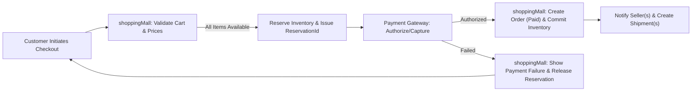
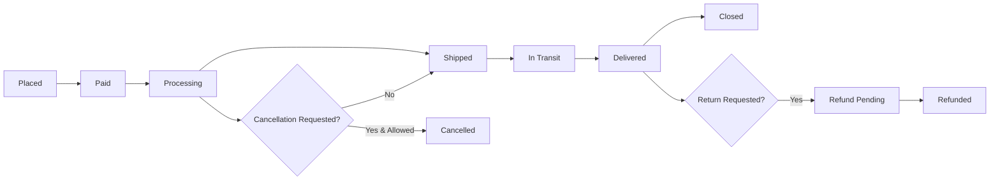
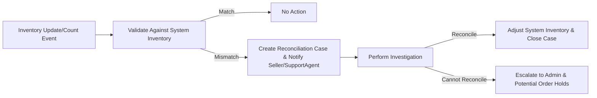

# Business Rules and Constraints — shoppingMall

## Executive summary and scope
The following rules define authoritative business behaviors for inventory, order cancellation and refund handling, seller product ownership, pricing and promotions, review moderation, dispute resolution, and operational error recovery. Stakeholders, product managers, backend developers, QA, and operations shall use these rules to implement, test, and operate the platform. All requirements use EARS phrasing where applicable and are testable with the acceptance criteria provided.

Audience: Product, Engineering, QA, Operations, Legal
Scope: Marketplace features for SKU-level inventory, checkout/reservation, refunds/cancellations, seller account and listing ownership, promotions boundaries, review moderation, and dispute escalation.

## Definitions and key terms
- SKU: Stock Keeping Unit — a distinct sellable item variant (combination of attributes such as color, size, option). Each SKU has a unique identifier and its own inventory records.
- Available Inventory: Quantity available for purchase by shoppers.
- Reserved Inventory: Quantity temporarily held for in-progress checkouts or authorized payments but not yet shipped.
- Committed (Sold) Inventory: Quantity permanently decremented after order capture and shipment fulfillment per policy.
- Reservation Window: The default time period a reservation is held while a customer completes payment (default 15 minutes; configurable).
- Order Line: The per-SKU record within an order reflecting quantity, unit price, seller attribution, and fulfillment state.
- Refund Window (Undelivered): Time window during which undelivered orders may be cancelled and refunded automatically (default 30 calendar days from order date; configurable).
- Return Window (Delivered): Time window after delivery during which returns are permitted by default policies (default 14 calendar days from delivery date; configurable).
- Seller Owner: The seller account that created and controls a listing and its SKUs unless ownership is explicitly transferred with admin approval.

## Roles and responsibilities (business-level)
- guest: Browse-only; can add to temporary wishlist; cannot place orders, cannot reserve inventory.
- customer: Place orders, request cancellations/refunds, submit reviews when eligible, manage addresses and carts.
- seller: Create/manage product listings and SKUs, set inventory counts and prices, acknowledge and fulfill orders for their SKUs, update shipping/tracking for shipments they fulfill.
- supportAgent: View and process refund/cancellation requests, adjudicate disputes up to configured thresholds, request seller evidence, and escalate to admin as needed.
- admin: Perform platform-level actions (suspend/unsuspend seller, transfer listing ownership, force refunds/payout adjustments). All admin actions must be auditable.

## Inventory and reservation rules
### Purpose
Prevent oversell, enable predictable fulfillment, and provide clear reconciliation and audit trails for inventory activity.

### Requirements (EARS)
- WHEN a seller creates an SKU, THE shoppingMall SHALL require and record an initial Available Inventory value for that SKU.
- WHEN a customer initiates checkout for SKU(s), THE shoppingMall SHALL reserve the requested quantities by transferring amount from Available Inventory to Reserved Inventory and SHALL issue a reservation token tied to the cart or order.
- WHEN a reservation is created, THE shoppingMall SHALL persist reservation metadata including reservationId, skuId, quantity, cartId or orderId, reservedAt timestamp, and expirationAt timestamp.
- WHEN a reservation is created, THE shoppingMall SHALL hold the reservation for a configurable Reservation Window; the default Reservation Window SHALL be 15 minutes.
- IF a reservation expires before payment capture, THEN THE shoppingMall SHALL release the Reserved Inventory back to Available Inventory and mark the reservation record as "expired" with timestamp and actor="system".
- WHEN payment is captured within the Reservation Window, THEN THE shoppingMall SHALL convert the Reserved Inventory to Committed Inventory and mark the order/order-line as "Paid" and "Committed".
- IF a payment is authorized but capture is delayed beyond the Reservation Window (external gateway behavior), THEN THE shoppingMall SHALL either maintain reservation for an extended configurable authorization-hold period (stakeholder decision) OR release the reservation and require re-authorization before final capture. Default behavior: maintain reservation up to 24 hours for authorized-but-not-captured transactions if the payment provider indicates an authorization hold, otherwise release after 15 minutes.
- WHEN a seller performs manual inventory adjustments that would make Available Inventory negative considering current Reserved Inventory, THEN THE shoppingMall SHALL reject the manual update and SHALL create a reconciliation task and notification to the seller and supportAgent.
- WHEN concurrent checkouts request the last available unit(s) of a SKU, THEN THE shoppingMall SHALL allow only one successful Reservation/Capture to proceed and SHALL surface an out-of-stock message to other buyers.
- WHEN an order is cancelled prior to capture or while in "Reserved" state, THEN THE shoppingMall SHALL release reserved inventory immediately and notify affected seller(s) and supportAgent.

### Additional inventory rules and constraints
- WHERE a seller updates inventory via bulk upload, THE shoppingMall SHALL validate and apply uploads asynchronously and SHALL reflect visible inventory changes within a measurable SLA (default: 60 seconds for processed updates) and SHALL notify the seller of errors.
- WHEN inventory reconciliation tasks identify mismatches between physical counts and system counts, THEN THE shoppingMall SHALL create a Reconciliation Case with priority settings and SLA rules (default: initial triage within 24 hours, resolution within 72 hours) and SHALL prevent further sales if mismatch exceeds configurable threshold percentage (default 10%).

## Order cancellation and refund policies
### Purpose
Provide predictable, auditable refund handling that protects buyer trust while balancing seller liability.

### Core requirements (EARS)
- WHEN a customer cancels an order before shipment and payment has not been captured, THEN THE shoppingMall SHALL cancel the order immediately, release any reservation, and notify the customer with cancellation confirmation.
- WHEN a customer cancels an order after payment capture but prior to seller shipment and the order meets cancellation policy rules, THEN THE shoppingMall SHALL allow automatic cancellation and initiate a full refund to the original payment method within business rules and payment provider capabilities.
- WHEN a customer requests a refund after delivery within the Return Window (default 14 calendar days from delivery), THEN THE shoppingMall SHALL accept the request subject to return policy checks and SHALL create a Refund Request record linked to the order-line with status "Pending" until review.
- IF a refund is approved by automatic policy or supportAgent, THEN THE shoppingMall SHALL initiate refund processing and SHALL record refundId, amount, reasonCode, initiatorRole, processedAt timestamp, and settlementStatus.
- WHEN refunds exceed a configured auto-approval financial threshold (default $1000), THEN THE shoppingMall SHALL require admin approval before issuing refunds and SHALL log the admin approval action for audit.

### Refund calculation and shipping handling
- WHEN calculating refund amounts, THE shoppingMall SHALL include item price and proportionate taxes and SHALL apply promotion adjustments consistent with the price paid by the customer at the time of order.
- WHEN items were not shipped, THE shoppingMall SHALL refund shipping fees in full.
- WHEN items were shipped and a return is requested, THEN THE shoppingMall SHALL follow the seller's return shipping policy. Where the seller policy requires customer-borne return shipping, THE shoppingMall SHALL charge shipping costs from the refund amount unless platform dispute rules decide otherwise.
- IF a restocking fee is declared in the seller listing and complies with platform policy, THEN THE shoppingMall SHALL deduct the restocking fee from the refund amount and SHALL display the fee to the customer in the refund summary.

### Refund timing and SLA
- WHEN a refund is approved, THE shoppingMall SHALL mark the refund as initiated in platform records within 24 hours and SHALL present an expected settlement timeframe to the customer that reflects external payment provider settlement windows (typical 3–10 business days). The platform shall not promise earlier settlement than provider capabilities.

## Seller product ownership and permissions
### Purpose
Ensure clear ownership, prevent unauthorized modifications, and provide controlled transfer and suspension behaviors that protect buyers and sellers.

### Requirements (EARS)
- WHEN a seller creates a product listing and SKUs, THEN THE shoppingMall SHALL record the seller account as the Owner for that listing and its SKUs and SHALL attribute all sales and inventory responsibility to that Owner until an explicit transfer occurs.
- IF a seller requests a transfer of ownership for a listing to another seller, THEN THE shoppingMall SHALL require admin approval and a transfer record capturing fromSellerId, toSellerId, listingId, transferReason, and transferTimestamp.
- WHEN a seller account is suspended for policy violation, THEN THE shoppingMall SHALL mark that seller's active listings as "Hidden" or "Unavailable for Purchase" per admin decision, but SHALL allow existing in-flight orders to be fulfilled unless admin explicitly cancels them.
- IF a seller attempts to delete a listing that has Active Orders or Reservations, THEN THE shoppingMall SHALL prevent deletion and SHALL require the seller to close new-order acceptance and follow an admin-assisted removal process.

## Pricing and promotions rules
### Purpose
Prevent pricing errors, define promotion stacking behavior, and ensure price consistency for placed orders.

### Requirements (EARS)
- WHEN a customer places an order, THE shoppingMall SHALL honor the price and promotions committed at the time of order placement and SHALL NOT retroactively change the price charged for that order except in case of manifest pricing error as defined below.
- IF a manifest pricing error is detected post-order (e.g., unit price off by more than 90% from historical norms), THEN THE shoppingMall SHALL flag the order for manual review and SHALL notify the customer and seller; refunds and cancellations follow dispute rules.
- WHEN promotions or coupons are configured, THE shoppingMall SHALL prevent stacking of promotions that would result in negative price for any order-line; platform must enforce a lower bound of zero for line totals.
- WHEN a seller updates a SKU price while there are existing Reservations for that SKU, THEN THE shoppingMall SHALL ensure that Reservations retain the price snapshot recorded at reservation/placement time, not the updated price.

## Product reviews and rating moderation rules
### Purpose
Preserve trust in reviews, prevent abuse, and ensure fairness to sellers.

### Requirements (EARS)
- WHEN a customer submits a review for a SKU that the customer purchased and for which delivery status is "Delivered" (or within a configured early-review allowance), THEN THE shoppingMall SHALL accept the review and tag it "Verified Purchase" unless automated policy flags it.
- IF automated content policy detects profanity, hate speech, personal data leakage, or spam patterns in a review, THEN THE shoppingMall SHALL hide the review from public listing and enqueue a moderation task with reason codes for human review.
- WHEN a review is flagged by a user or automated system, THEN THE shoppingMall SHALL mark the review as "Hidden-Pending Review" and SHALL notify moderators; if moderators do not act within 7 calendar days, THEN THE system SHALL automatically unhide the review unless severity indicates immediate removal is required.
- WHEN a review is removed for policy violation, THEN THE shoppingMall SHALL log removalReason, moderatorId, and removalTimestamp and SHALL adjust rating aggregates accordingly.

## Dispute resolution and escalation rules
### Purpose
Provide clear SLA-driven paths for resolving order disputes and fraud investigations.

### Requirements (EARS)
- WHEN a customer creates a dispute for a delivered order, THEN THE shoppingMall SHALL create a Dispute record and assign to a supportAgent; initial response SHALL occur within 24 hours of dispute creation.
- IF the dispute amount is <= $100 and evidence indicates non-delivery or clear seller error, THEN THE shoppingMall SHALL allow supportAgent to auto-approve refund within 48 hours.
- WHEN the dispute amount exceeds $1000 or repeated disputes exist between the same buyer and seller pair within 90 days, THEN THE shoppingMall SHALL escalate to admin review and suspend automatic refunds pending admin decision.
- WHEN fraud is suspected (e.g., high ratio of chargebacks, mismatched identity signals), THEN THE shoppingMall SHALL freeze related payouts for the affected seller orders and SHALL trigger fraud investigation workflows involving operations and legal.

## Error handling, messaging, and recovery
### Purpose
Ensure clear user messaging, preserve audit trails, and provide recoverable fallback behavior.

### Requirements (EARS)
- IF a payment authorization fails during checkout, THEN THE shoppingMall SHALL surface a clear, non-technical error code and suggested next steps (retry, try different card, contact support) and SHALL preserve the cart for the duration of Reservation Window.
- IF inventory inconsistency is detected during finalization, THEN THE shoppingMall SHALL place affected order-lines into "Pending Inventory Reconciliation" and SHALL notify customer with next steps and expected SLA for resolution (default: 48 hours initial estimate).
- WHEN critical automated processes fail (e.g., inventory sync, bulk upload), THEN THE shoppingMall SHALL create an operational incident, notify ops, and SHALL prevent actions that would materially worsen data integrity (e.g., disable new bulk inventory writes until resolved).

## Audit, logging, and traceability
### Purpose
Ensure all critical actions are auditable for compliance, dispute resolution, and reporting.

### Requirements (EARS)
- WHEN a critical action occurs (inventory adjustment, refund approved, admin override, listing ownership transfer, seller suspension), THEN THE shoppingMall SHALL record an audit entry containing: eventId, actorId (user or system), actorRole, eventType, targetId(s) (skuId, orderId, listingId), timestamp (ISO 8601 UTC), reason (free-text or code), previousState, newState, and correlationId when part of a transaction flow.
- WHEN logs are generated for sensitive events (refunds, payments, personal data changes), THEN THE shoppingMall SHALL store logs for an audit retention period defined by legal (recommendation: 7 years) and SHALL provide secure access for authorized auditors.

## Acceptance criteria and test cases
- Oversell race test: WHEN two concurrent buyers attempt to purchase the last available unit of a SKU, THEN exactly one buyer SHALL proceed to confirmed payment/capture and the other SHALL receive an out-of-stock error. Acceptance: run 1,000 concurrent trials; 100% of trials must result in at most one confirmed sale.
- Reservation expiration test: WHEN a reservation is created and payment is not captured, THEN Reserved Inventory SHALL return to Available Inventory after Reservation Window. Acceptance: create reservation, wait Reservation Window + 1s, query inventory; reserved must be zero and available increased accordingly.
- Refund processing test: WHEN a refund is approved and initiated, THEN refund record is created within 24 hours and settlement is initiated with external provider; acceptance: platform record shows refund initiation timestamp and refundId for 100% of tested refunds.
- Review moderation flow: WHEN a review contains a profanity token, THEN automated detection SHALL hide the review and create a moderation task. Acceptance: 100% of seeded profanity-containing reviews are hidden and moderated within 7 days.

## Mermaid diagrams (validated syntax)

Checkout and Reservation flow:

Order lifecycle and shipment states:

Inventory reconciliation flow:

## Open decisions and recommended defaults
- Payment capture vs authorization hold: Decision required whether reservation is maintained for authorized payments longer than Reservation Window. Recommended default: honor payment provider authorization up to 24 hours when gateway indicates hold; otherwise release after 15 minutes.
- Refund/return windows by category: Decision required for category-specific windows (e.g., perishables). Recommended default: Undelivered refund 30 days, Delivered return 14 days; allow category overrides.
- Seller KYC thresholds: Decision required on when mandatory KYC is triggered. Recommended default: require KYC for sellers with cumulative monthly payouts exceeding a configurable threshold (recommendation: $5,000) or upon manual risk triggers.
- Restocking fees: Decision required whether permitted and maximum percentage. Recommended default: permit up to 15% restocking fee with explicit disclosure at listing.
- Payout hold rules for disputes: Decision required whether platform will withhold payouts pending dispute resolution. Recommended default: hold suspected-payouts for disputed orders until resolution for disputes > $500.

## Appendix: glossary, example messages, and references
- Example user-facing error codes: PAYMENT_DECLINED, SKU_OUT_OF_STOCK, RESERVATION_EXPIRED, REFUND_INITIATED, REVIEW_MODERATED
- Example audit retention: 7 years recommended; confirm with legal for jurisdictional differences.
- Related documents: Functional Requirements (04-functional-requirements.md), Workflows (07-workflows-process-flows.md), Roles & Auth (05-user-roles-authentication.md).

