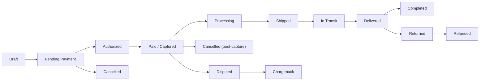

# Order and Payment Workflows — Business Requirements

## 1. Scope and Purpose

This specification defines the business-level rules, state models, and measurable acceptance criteria for order placement, payment authorization and capture, cancellations, refunds, shipping updates, dispute resolution, and chargeback handling for the shoppingMall platform. The requirements are written in business terms and in EARS (WHEN / THE / SHALL / IF / THEN / WHERE) format to be directly testable. Implementation details (APIs, schemas, provider choices) are intentionally excluded and remain the development team's responsibility.

## 2. Audience and Related Documents

Intended readers: backend developers, payments/integration engineers, operations, QA, product owners, legal/compliance.

Related business documents:
- Service Overview (01-service-overview.md)
- Functional Requirements (03-functional-requirements.md)
- External Integrations (07-external-integrations.md)
- Inventory and Seller Management (09-inventory-and-seller-management.md)
- Admin Dashboard and Reporting (10-admin-dashboard-and-reporting.md)

## 3. Actors and Responsibilities (Business Terms)

- customer: Places orders, requests cancellations/returns, opens disputes, receives notifications.
- seller: Manages product SKUs and inventory, acknowledges and fulfills orders for their SKUs, updates shipping/tracking, responds to buyer inquiries and refund requests within SLA.
- admin: Performs escalations, processes platform-level refunds, moderates disputes and seller sanctions, and accesses audit trails for compliance.

EARS statements for actor responsibilities:
- WHEN an order is placed, THE seller(s) who own the ordered SKUs SHALL receive notification and SHALL acknowledge acceptance per seller SLA.
- WHEN a customer files a dispute, THE seller SHALL respond with evidence within 5 business days; IF the seller does not respond, THEN THE case SHALL escalate to admin.

## 4. Executive Goals and Success Metrics

Business goals:
- Prevent oversell and ensure accurate inventory allocation.
- Provide reliable payment flows (authorization and capture) with predictable SLAs.
- Provide transparent customer communications on order and refund status.
- Maintain auditability and evidence to resolve chargebacks and disputes.

Primary success metrics (business-facing):
- Authorization-to-capture success rate >= 99%.
- Refund processing SLA: 95% of refunds initiated within 48 hours of approval.
- Chargeback evidence delivery: 95% of evidence sets provided within provider-required windows.
- Oversell incidents < 0.1% of orders per month.

## 5. Canonical Order Lifecycle and State Model

Canonical states (business names): Draft, Pending Payment, Authorized, Paid/Captured, Processing, Partially Shipped, Shipped, In Transit, Delivered, Returned, Refunded, Cancelled, Disputed, Chargeback, Completed.

EARS requirements defining lifecycle behavior:
- WHEN an order is created and payment is authorized, THE order SHALL be recorded in state "Authorized" and SHALL reserve inventory for the authorized quantities.
- WHEN funds are captured for all payable amounts, THE order SHALL transition to "Paid/Captured" and become eligible for seller processing.
- IF a subset of line-items are shipped, THEN the order SHALL reflect per-line item states and permit partial captures/refunds as business rules require.

Mermaid diagram: Primary order flow

Acceptance criteria for lifecycle:
- GIVEN a successful authorization and inventory reservation, WHEN capture is performed, THEN the order state SHALL move to Paid/Captured within 60 seconds 95% of the time.
- GIVEN a delivered order, WHEN no dispute or return is filed within the 7-calendar-day hold, THEN the order SHALL automatically transition to Completed after the hold elapses.

## 6. Order Placement and Validation Rules

Overview: Order creation must validate product identity, seller ownership, price determinism, tax and shipping calculations, and inventory availability. Orders must be created atomically and idempotently.

EARS requirements and rules:
- WHEN a customer submits an order, THE system SHALL validate that each line-item references an active SKU and that the SKU belongs to the seller claimed for that line-item.
- WHEN a customer submits an order, THE system SHALL calculate final totals (item price, promotions, discounts, taxes, shipping, fees) deterministically and SHALL use the same totals for payment authorization.
- IF any line-item quantity exceeds available sellable inventory, THEN THE order SHALL be rejected with an itemized error listing SKU identifiers and available quantities.
- WHEN the order creation request includes an idempotency key, THE system SHALL ensure repeated requests with the same key and same payload do not create duplicate orders and SHALL return the original order identifier.

Acceptance criteria:
- GIVEN valid SKUs and available inventory, WHEN an order is placed, THEN the order record SHALL be created and an authorization request SHALL be made within 10 seconds in 95% of successful attempts.
- GIVEN a mis-priced item (price changed between customer view and checkout), WHEN order creation is attempted, THEN the system SHALL detect price mismatch, fail the order, and present a price-mismatch error code.

## 7. Payment Authorization and Capture Rules

Business patterns supported:
- Immediate capture (authorize + capture in one step)
- Two-step flow (authorize now, capture later on ship or within configured window)
- Multi-seller orders: prefer per-seller authorizations where provider supports, otherwise single authorization with logical allocation

EARS-format payment rules:
- WHEN an order requires payment, THE system SHALL attempt payment authorization with the selected provider and SHALL record provider reason codes and transaction IDs.
- IF authorization fails due to a transient provider error (5xx, network), THEN THE system SHALL retry authorization up to 2 times with exponential backoff (initial delay 500ms) before returning a payment error to the customer.
- WHEN authorization succeeds, THE system SHALL reserve inventory and create a PaymentAuthorization record linked to the order, including a timestamp and provider reference.
- WHERE capture is deferred, THE system SHALL capture funds at seller-triggered event (e.g., when seller marks order as Shipped) or automatically when the configured capture time window elapses (default 7 days), whichever occurs first.

Multi-seller and partial capture rules:
- WHEN a multi-seller order is processed and the payment provider supports multiple authorizations, THE system SHALL attempt separate authorizations per seller to align settlement and payout.
- IF the provider does not support multiple authorizations, THEN the system SHALL place one authorization and allocate amounts logically among sellers; captures and refunds SHALL be managed per sub-order according to allocation logic and reconciliation rules.
- WHEN partial captures occur, THE system SHALL record the captured amount per sub-order and update order financial state to Partially Paid.

Acceptance criteria for payments:
- Authorization latency: 95% of authorizations SHALL complete in <= 3 seconds under normal load.
- Authorization retry: transient provider failures SHALL be retried up to 2 times; authorization SHALL fail only after retries exhausted.
- Capture window: attempt to capture within 7 days of authorization for deferred captures; if capture fails due to expired authorization, THEN re-authorization SHALL be attempted and the event SHALL be logged and surfaced to operations.

## 8. Inventory Reservation and Allocation During Checkout

Reservation semantics:
- Default reservation window: 15 minutes for checkout sessions; seller-configurable up to 72 hours for special cases (promotions, B2B agreements).
- Reservation effect: reserved quantity decreases available-sellable quantity for other customers while in reservation state.

EARS reservation rules:
- WHEN a customer begins checkout, THE system SHALL reserve the requested SKUs for the configured reservation window and SHALL present the reservation expiry time to the user.
- IF payment authorization extends beyond the reservation window due to external redirections or timeouts, THEN THE system SHALL extend the reservation automatically only if the seller has enabled extended reservations and SHALL log the extension event.
- IF reservation expires before successful authorization, THEN THE system SHALL release reserved quantities back to available and SHALL inform the checkout session with error code RESERVATION_EXPIRED.

Race and concurrency rules:
- WHEN multiple concurrent reservations compete for the same finite SKU quantity, THE system SHALL allocate reserved units on a first-reservation timestamp order; any later reservation requests that exceed remaining available units SHALL be rejected.
- IF concurrent captures lead to a conflict where available committed inventory would fall negative, THEN the platform SHALL enforce atomic decrement with retries up to 3 attempts and, on persistent conflict, SHALL rollback capture and initiate compensation (refund) for the affected order and alert operations.

Acceptance criteria:
- Reservation performance: 95% of reservations SHALL be processed within 200ms under normal load.
- Concurrency safety: In high-contention tests (1,000 concurrent checkout attempts for last unit), THE system SHALL prevent oversell in 100% of test runs.

## 9. Cancellation and Order Modification Rules

Pre-capture cancellations:
- WHEN a customer requests cancellation while order state is Pending Payment or Authorized and before capture, THEN the system SHALL permit immediate cancellation and release reserved inventory.

Post-capture cancellations before shipment:
- WHEN a cancellation is requested after capture but before seller has marked items as Shipped, THEN the system SHALL allow a cancellation request that the seller may accept or reject within 12 hours. IF the seller does not respond within 12 hours, THEN the system SHALL escalate to admin and may auto-approve cancellation per platform policy.
- IF cancellation after capture is approved, THEN THE system SHALL initiate a refund flow and adjust seller settlement and platform commission mathematics accordingly.

Order modifications:
- WHEN a customer requests an address change or quantity change prior to capture, THEN the system SHALL revalidate price, taxes, and inventory and SHALL permit the change only if validations pass.
- IF the requested modification causes inventory shortfall, THEN THE system SHALL reject the modification and present alternatives.

Cancellation fees and business rules:
- WHERE cancellation fees apply (seller or platform policy), THEN THE system SHALL present the fee amount to the customer prior to finalizing cancellation and SHALL record rationale and approval in the audit trail.

Acceptance criteria:
- Cancellation: 95% of pre-capture cancellations SHALL complete within 30 seconds and release inventory within that timeframe.
- Seller response SLA for cancellations: sellers SHALL respond to post-capture cancellation requests within 12 hours; track and escalate non-compliance.

## 10. Refund Policies, Settlement, and Commission Adjustments

Refund types and triggers:
- Full refunds (order-level), partial refunds (line-item), and refunds contingent on returns (receipt required) are supported.

EARS refund rules:
- WHEN a refund is approved by seller or admin, THEN the system SHALL create a Refund record, attempt provider refund within 48 hours, and notify the customer of initiation within 2 hours.
- IF provider rejects refund initiation (provider error or policy limitation), THEN THE system SHALL mark refund as REFUND_FAILED and SHALL queue for manual operations intervention and retry per retry policy.

Settlement and commission adjustments:
- WHEN a refund is issued, THEN the system SHALL adjust seller settlement amounts pro rata and SHALL reflect commission reversals according to configured settlement rules; the change SHALL be recorded in seller settlement ledger.

Refund SLA acceptance:
- 95% of refunds SHALL be initiated at the payment provider within 48 hours of approval.
- Platform shall communicate expected refund receipt times to customers (typical 3-10 business days depending on provider and banking rails).

Financial controls:
- WHEN an admin issues a refund above the configured dual-approval threshold (business default: $1,000), THEN the system SHALL require a second admin approval before executing the refund.

## 11. Shipping, Tracking, Delivery Confirmation and Post-Delivery Hold

Shipping events and obligations:
- Sellers SHALL provide tracking numbers and carrier information when marking shipments; tracked shipments SHALL map to per-line order state changes.

EARS shipping rules:
- WHEN a seller marks items as Shipped and provides tracking info, THEN the system SHALL update the sub-order to Shipped and SHALL surface tracking to the customer within 30 seconds.
- WHEN carrier marks Delivered, THEN the system SHALL place order into a 7-calendar-day post-delivery hold during which returns and disputes are permissible. IF no dispute/request is raised, THEN the order SHALL move to Completed at hold end.

Exception handling:
- IF a carrier reports an Exception (lost, damaged) then THE system SHALL notify customer and seller within 2 hours and open an operations case for remediation.

Acceptance criteria:
- Tracking propagation: 95% of tracking updates received from sellers or carriers SHALL appear in customer-facing tracking UI within 5 minutes.

## 12. Dispute Resolution and Chargebacks

Dispute evidence and timelines:
- WHEN a customer opens a dispute, THEN the system SHALL capture the dispute details and evidence and SHALL notify the seller and admin, requesting seller evidence within 5 business days.
- WHEN a chargeback is received from a payment provider, THEN the system SHALL lock the disputed amount from seller settlement and SHALL assemble and submit evidence to provider within the provider's required timeframe (typically 7-30 days).

Chargeback handling business rules:
- THE platform SHALL preserve order, shipping, and communication records for a minimum of 180 days from dispute open for chargeback response; finance/legal may increase retention per policy.
- IF chargeback resolution favors the platform, THEN the disputed funds SHALL be restored to the seller per settlement policy; IF not, THEN funds SHALL be reversed and seller may be debited or penalized per contract.

Chargeback success metric:
- Target: achieve >= 70% favorable outcome on chargebacks with clear delivery evidence (signed delivery or carrier confirmation).

## 13. Notifications, Audit Trail and Compliance Requirements

Audit trail requirements:
- THE system SHALL record the following on all payment and order state changes: actorId, actorRole, timestamp (ISO 8601), correlationId (request-wide), actionType, previousState, newState, and reasonCode (where applicable).
- Audit entries SHALL be immutable and searchable for compliance and dispute resolution.

Notifications:
- WHEN major order events occur (Authorized, Captured, Shipped, Delivered, Refunded, Chargeback), THEN the system SHALL send transactional notifications (email and in-app) within 5 minutes and SHALL log notification delivery status.

Compliance and retention:
- THE system SHALL retain payment and order records for a minimum of 7 years for financial compliance, subject to regional legal differences. Personal data retention SHALL follow privacy laws and local regulation (see External Integrations document).

## 14. Error Handling and Unwanted-Behavior Requirements

Explicit IF/THEN error rules:
- IF payment provider times out during authorization, THEN THE system SHALL retry up to 2 times with exponential backoff and, if still failing, mark the order as PAYMENT_TIMEOUT and present retry options to the user.
- IF a reservation conflict occurs at capture time due to concurrent commitments, THEN THE system SHALL retry the commit up to 3 times atomically; IF still failing, THEN THE system SHALL cancel the capture, issue a refund, and notify operations with correlation id.
- IF a carrier webhook is missing for >60 minutes for an expected tracking update, THEN THE system SHALL poll the carrier (or seller) for status and create an incident if polling fails.
- IF a refund attempt fails at provider due to invalid funding source, THEN THE system SHALL mark refund as REFUND_FAILED and notify admin and customer with next-step instructions.

## 15. Performance SLAs and Monitoring Requirements

Operational SLAs (business-facing):
- Authorization latency target: 95th percentile <= 3 seconds.
- Reservation latency: 95th percentile <= 200ms.
- Tracking event propagation: 90% within 5 minutes of event arrival.
- Refund initiation: 95% initiated with providers within 48 hours of approval.

Monitoring and alerts:
- THE system SHALL alert operations if payment authorization failure rate exceeds 1% over a rolling 15-minute window.
- THE system SHALL alert operations if refund failure rate exceeds 0.5% of refunds in a 24-hour window.

## 16. Acceptance Criteria and Representative Scenarios

Scenario 1: Successful single-seller immediate-capture
- GIVEN a customer places an order for in-stock SKUs and payment authorization and capture succeed, WHEN seller marks order Shipped, THEN the customer receives tracking and the order transitions to Delivered and then Completed after the hold.

Scenario 2: Multi-seller split capture with partial refund
- GIVEN a multi-seller order where Seller A ships promptly but Seller B cannot fulfill an item, WHEN Seller B's line-item cannot be fulfilled, THEN the platform SHALL issue a partial refund for Seller B's line-item and adjust settlement and commission records accordingly.

Scenario 3: Chargeback with delivery evidence
- GIVEN a customer disputes a delivered order, WHEN the platform submits carrier delivery confirmation and proof of delivery, THEN the platform aims to win the dispute; success rate target >=70% when evidence exists.

## 17. Glossary and Definitions
- Authorization: Temporary hold on funds by a payment provider.
- Capture: Final settlement request to collect previously authorized funds.
- Reservation window: Time items are held during checkout prior to capture.
- Sub-order: Seller-level grouping of items within a customer-facing order.
- Chargeback: Cardholder-initiated reversal via payment provider.

## 18. Appendix: State Transition Table

| From | Trigger/Event | To | Guard/Notes |
|---|---|---|---|
| Draft | Customer submits checkout | Pending Payment | Prices/taxes computed; reservation attempted |
| Pending Payment | Authorization success | Authorized | Provider txn recorded |
| Authorized | Capture completed | Paid/Captured | May be partial per sub-order |
| Paid/Captured | Seller ships | Processing -> Shipped | Tracking required |
| Shipped | Carrier delivered | Delivered | 7-day hold applies |
| Delivered | No disputes after hold | Completed | Financially closed |
| Any payment state | Customer cancels pre-capture | Cancelled | Release reservation |
| Paid/Captured | Refund issued | Refunded | Adjust settlement |

---

