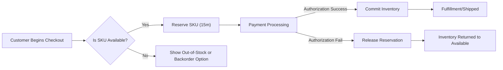
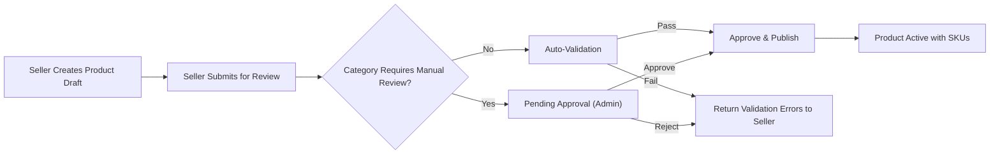
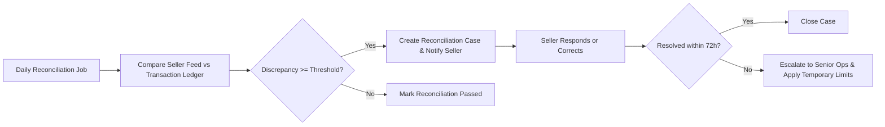

# Inventory and Seller Management — Business Requirements for shoppingMall

## Executive Summary

shoppingMall SHALL maintain accurate, auditable, and seller-accountable SKU-level inventory to prevent oversells, support reliable order fulfillment, and enable transparent reconciliation and remediation. The platform SHALL treat inventory as a business-first concern: each SKU represents a distinct sellable unit with availability, reservation, and commitment semantics. Sellers are responsible for inventory accuracy; the platform SHALL provide reconciliation, monitoring, and progressive enforcement mechanisms to maintain marketplace trust.

## Scope and Audience

This document defines business-level requirements for SKU modeling, inventory state transitions, reservation and allocation rules, synchronization modes, reconciliation processes, seller SLAs, penalties, appeals, monitoring, and acceptance criteria. Audience: backend developers, merchant operations, QA, product managers, and compliance teams. Out-of-scope: API contracts, database schemas, UI design, vendor selection.

## Actors and Permission Matrix (Business Terms)

Actors:
- customer: Purchases SKUs and triggers reservations; cannot mutate inventory.
- seller: Creates products and SKUs, updates SKU attributes and inventory counts for SKUs owned by their seller account, requests reconciliations, and responds to inventory exceptions.
- admin: Performs platform-level inventory corrections, triggers reconciliation runs, applies penalties, and manages delisting or suspension decisions.

EARS requirements for permissions:
- THE system SHALL allow a seller to update inventory quantities only for SKUs owned by the seller.
- IF a seller attempts to update inventory for a SKU they do not own, THEN THE system SHALL reject the operation and return an "AUTH_FORBIDDEN" business error to the actor.
- WHEN an admin updates inventory for any SKU, THE system SHALL require an audit reason and SHALL record admin identity, timestamp, and reason.

Permission matrix (business view):
| Action | customer | seller | admin |
|---|---:|---:|---:|
| Create product draft | ❌ | ✅ | ✅ |
| Create SKU/variants | ❌ | ✅ | ✅ |
| Update SKU inventory | ❌ | ✅ (own SKUs) | ✅ |
| Reserve SKU during checkout | ✅ (through platform) | ❌ | ❌ |
| Commit inventory on capture | ✅ (through platform) | ❌ | ✅ (override) |
| Request reconciliation | ❌ | ✅ | ✅ |
| Manual inventory correction | ❌ | ✅ (with audit for large changes) | ✅ |

## SKU and Variant Model (Business Rules)

SKU semantics:
- THE platform SHALL represent each sellable variant as a distinct SKU with a stable SKU identifier, a set of variant attributes (e.g., color, size), and seller ownership metadata.
- WHEN a seller creates variant attributes for a product, THE platform SHALL require unique attribute combinations per SKU and SHALL reject duplicate attribute combinations for the same product.
- IF a seller changes variant attributes that materially change the SKU identity (e.g., color or size), THEN THE platform SHALL require creation of a new SKU and SHALL NOT allow in-place mutation of the SKU identity.

SKU required business fields (conceptual):
- SKU identifier
- Seller ownership reference
- Price (business-level expectation: present at SKU level)
- Inventory counts for: available, reserved, committed
- Visibility flag and status (active, pre-order, discontinued)

EARS requirements:
- WHEN a seller publishes a product with variants, THE system SHALL require at least one SKU to have a non-null visibility status and a price before the product can be visible to customers.
- IF a seller marks a SKU as "discontinued", THEN THE system SHALL prevent new purchases of that SKU while preserving the SKU for historical order integrity.

## Inventory States and Lifecycle

Canonical inventory quantities (business view):
- Available: Units that may be sold right now
- Reserved: Units temporarily held for an in-progress checkout or other approved reservation
- Committed: Units permanently allocated to a paid/confirmed order
- Shipped: Units associated with shipments in transit
- Returned: Units received back and pending restock determination
- Backorder/Pre-order: Units accepted beyond available stock with a promised ship date
- Archived/Delisted: SKU removed from active sale

State transition rules (EARS):
- WHEN a customer begins checkout and selects SKUs, THE system SHALL reserve requested quantities for the configured reservation window (default 15 minutes) and SHALL decrement Available accordingly into Reserved.
- IF payment is authorized and captured within the reservation window, THEN THE system SHALL convert Reserved quantities to Committed atomically and SHALL decrement Available by the committed amount.
- IF the reservation window expires without successful payment capture, THEN THE system SHALL release Reserved quantities back to Available and SHALL notify the customer in-checkout of expired reservation with code RESERVATION_EXPIRED.
- WHEN an order line is cancelled prior to shipment, THEN THE system SHALL release Committed quantities back to Available within 30 minutes of cancellation processing.

Timing and atomicity:
- THE system SHALL ensure reservation and commit operations are atomic at SKU level to prevent oversell and SHALL retry on transient conflicts up to 3 times before escalating to operations.

## Reservation and Allocation Rules

Reservation window rules:
- THE default reservation window SHALL be 15 minutes for standard checkouts. Sellers MAY configure per-SKU or per-seller reservation windows up to a maximum of 72 hours through agreed business configuration.
- WHEN a checkout flow involves redirection to external providers (e.g., 3DS), THE system SHALL automatically extend the reservation window in a controlled manner using an extension token, with two automatic extensions allowed up to the seller-configured maximum.

Allocation semantics:
- THE platform SHALL allocate inventory on a first-reservation-wins basis based on reservation timestamp ordering.
- WHEN multiple concurrent reservation requests exceed available stock, THEN THE system SHALL allocate to the earliest reservations and SHALL return explicit SKU-level allocation failures to later attempts.

Partial fulfillment and split shipments:
- IF an order can only be partially fulfilled due to available inventory, THEN THE system SHALL offer the customer options: (a) accept partial shipment now and remaining items later, (b) cancel unfulfillable lines, or (c) backorder remaining lines if seller permits. The customer decision SHALL be recorded and govern capture and shipment behavior.

EARS requirements (reservation):
- WHEN a reservation is created, THE system SHALL record reservationId, expiry timestamp, related checkout/session id, and the originating actor for auditability.
- IF a seller manually adjusts inventory that conflicts with existing reservations, THEN THE system SHALL notify affected reservations and SHALL attempt to reallocate or notify customers per the conflict resolution rules.

Performance acceptance criteria:
- THE system SHALL place reservations within 200 milliseconds 95% of the time under normal operating load for single-SKU reservations.
- THE system SHALL handle 1,000 concurrent reservation attempts for the same SKU and SHALL prevent oversell in 100% of tested runs.

## Backorder, Pre-order and Partial Fulfillment Rules

Backorder/pre-order acceptance and disclosure:
- WHERE a seller enables backorder or pre-order for a SKU, THE system SHALL require the seller to provide an estimated ship date or lead time.
- WHEN a customer purchases a backordered SKU, THE system SHALL display a "Backorder" or "Pre-order" label and the estimated ship date prominently during checkout.
- IF the seller fails to ship within 7 calendar days of the estimated ship date for domestic markets (or 14 days for international), THEN THE system SHALL notify affected customers and offer remedial options: refund, extended delivery, or alternate SKU options.

Partial fulfillment capture rules:
- WHEN a multi-line order results in partial fulfillment, THE system SHALL capture payment only for the fulfilled lines (if capture policy is per-shipment) and SHALL refund or void the remainder per payment provider rules.
- IF the payment provider does not allow per-line capture, THEN THE system SHALL capture the full amount and process seller-level refunds for unfulfilled lines within the refund SLA.

## Seller Product Lifecycle and Publishing Requirements

Publishing validation rules:
- WHEN a seller submits a product to publish, THE system SHALL validate required fields: product title, primary category, at least one SKU with price and inventory, and at least one image. Validation SHALL fail with structured error codes for missing fields.
- IF a product is in a restricted category, THEN THE system SHALL set the product to "Pending Approval" and SHALL require admin review to publish. Admin review SHALL complete within 48 hours under normal operations; if not completed, the product SHALL be auto-escalated.

Seller obligations at publishing time:
- THE seller SHALL maintain accurate SKU inventory and SHALL not knowingly publish incorrect quantities. Repeated misrepresentation SHALL trigger penalties per the penalties section.

Product visibility rules:
- WHEN all SKUs of a product are either Out-of-Stock and not backorderable OR marked Discontinued, THEN THE system SHALL mark the product as Out-of-Stock and SHALL not list it in promotional placements.

## Stock Synchronization and Integration Modes

Supported synchronization modes (business expectations):
- Manual portal updates for small sellers
- Bulk CSV/flat-file uploads for medium sellers (processed in batch)
- Push-based webhooks or API integrations for high-volume sellers
- Scheduled polling for partners that do not support push

EARS rules for incoming updates:
- WHEN an inventory update arrives from a seller integration, THE system SHALL validate format, SKU existence, and quantity bounds. IF validation fails, THEN THE system SHALL reject the update and SHALL return structured error details to the seller.
- IF an update conflicts with active reservations or committed quantities, THEN THE system SHALL flag the conflict, queue the update for manual reconciliation, and notify the seller of affected orders and reservations.

Sync frequency expectations:
- High-volume sellers SHALL publish inventory changes in near-real-time (max 5 minutes propagation business expectation).
- Low-volume sellers SHALL be allowed hourly syncing with a maximum acceptable propagation latency of 60 minutes.

Bulk imports and backfill rules:
- WHEN bulk imports are processed, THE system SHALL generate a reconciliation report indicating delta per SKU and highlight conflicts above a configurable alert threshold (default: 5% of units changed for active SKUs).

## Reconciliation Processes and Reporting

Daily reconciliation workflow (EARS):
- THE system SHALL run a daily reconciliation job for each seller that compares recent transactions, reserved/committed quantities, and incoming seller-reported balances to detect mismatches.
- IF the reconciliation job finds discrepancies >= 2% of SKU movement for the day OR absolute delta >= 10 units per SKU, THEN THE system SHALL flag the SKU and create a reconciliation case for merchant operations and the seller to investigate.
- WHEN a reconciliation case is created, THE system SHALL notify the seller and merchant operations within 2 hours and SHALL require a seller response or correction within 72 hours.

Reconciliation escalation rules:
- IF the seller does not respond within 72 hours or the discrepancy remains unresolved after 72 hours, THEN THE system SHALL escalate the case to senior operations and MAY impose temporary sell limits for the affected SKU until resolution.

Reconciliation reports and dashboards:
- THE system SHALL provide sellers a daily reconciliation summary showing SKU-level changes, exceptions, and recommended corrective actions and SHALL provide operations a cross-seller reconciliation dashboard highlighting high-severity discrepancies.

## Seller SLAs, Monitoring, Penalties and Appeals

Monitoring metrics (business-level):
- Stock accuracy: percentage of SKUs where reported available quantity matches reconciled transactional record over 30 days (target: >= 97% for seller-managed inventory)
- On-time shipping rate: percentage of orders marked shipped within seller SLA (target: >= 95%)
- Cancellation rate due to stockouts: percentage of paid orders cancelled due to inventory (target: < 1.5%)

Penalty tiers (progressive enforcement):
- Warning: First minor violation (single incident) — automated warning email and suggested remediation steps.
- Probation: More than 2 minor violations within 30 days or one medium violation (e.g., >5% inventory delta) — seller placed on probation, reduced visibility in search, mandatory inventory accuracy training.
- Financial hold & limits: More than 3 medium violations or any single severe violation (e.g., repeated misrepresentation causing chargebacks) — temporary hold on payouts for affected SKUs for 14 days, limits on new listings.
- Suspension: Repeated severe violations or failure to remediate per probation terms — temporary suspension of seller account for 30 days pending corrective plan.
- Delisting: Persistent non-compliance after suspension or severe fraud — permanent delisting of seller's catalog and potential termination per marketplace policy.

Appeals workflow (EARS):
- WHEN a seller receives a penalty, THE system SHALL provide an appeals window of 14 days during which the seller may submit supporting evidence.
- IF a seller submits an appeal within 14 days, THEN THE system SHALL acknowledge receipt within 48 hours and SHALL resolve the appeal within 14 calendar days of submission.
- IF the appeal is successful, THEN THE system SHALL reverse the penalty action and SHALL record the reversal reason and approver in the audit trail.

## Error Handling, Edge Cases and Dispute Scenarios

Negative scenarios and EARS responses:
- IF a seller attempts to set inventory to a negative value, THEN THE system SHALL reject the update with error code INVENTORY_NEGATIVE_NOT_ALLOWED and SHALL require an explicit inventory adjustment action with a reason for adjustments greater than 10 units or 20% of existing stock.
- IF concurrent checkout attempts exceed available inventory, THEN THE system SHALL apply first-reservation-wins and SHALL notify losing customers with a clear message and options to reattempt or join waitlist; oversell SHALL be prevented in 100% of controlled tests.
- IF inventory sync fails due to provider/network errors, THEN THE system SHALL queue the update for retry, notify merchant operations if retries exceed three attempts, and create an incident ticket for manual review.
- IF a bulk import produces widespread deltas (>=10% of SKUs changed), THEN THE system SHALL flag the import for manual review before publishing changes to the storefront and SHALL provide a dry-run reconciliation report to the seller.

Dispute and customer remediation flows:
- WHEN a customer experiences a stockout after order placement and cancellation occurs, THE system SHALL prioritize refund issuance per refund SLA and SHALL provide the customer compensation options as defined in marketplace customer experience policy (e.g., coupon or expedited shipping for replacement items).
- IF investigation determines seller malfeasance, THEN THE system SHALL apply penalties up to suspension and SHALL compensate impacted customers per platform policy.

## Performance and Operational Metrics

Operational targets:
- Reservation latency: 95th percentile <= 200ms for single SKU reservations under normal load.
- Inventory propagation: 95% of seller-initiated inventory updates reflected in storefront/search within 60 seconds for near-real-time integrations; 99% within 5 minutes.
- Reconciliation job completion: Daily reconciliation jobs SHALL complete within the platform's off-peak maintenance window (business expectation: complete within 4 hours of start).
- Oversell tolerance: zero permitted oversells in production; acceptance tests SHALL demonstrate 0 oversells across 1000+ concurrent reservation simulation runs.

## Acceptance Criteria and Testable Scenarios

Scenario 1 — Concurrent reservation for the last unit:
- GIVEN 1000 concurrent checkout attempts reserving the single remaining unit of SKU-XYZ,
- WHEN the reservation process runs, THEN exactly one reservation SHALL succeed, all others SHALL receive explicit allocation failures, and no oversell SHALL occur.

Scenario 2 — Bulk import reconciliation alert:
- GIVEN a bulk import that changes inventory for 10,000 SKUs,
- WHEN the import completes, THEN the system SHALL produce a reconciliation report highlighting SKUs with deltas >= 5% and SHALL flag the import for manual review if total changed SKUs exceed 2% of active SKUs.

Scenario 3 — Reconciliation escalation:
- GIVEN a reconciliation case with a delta >= 2% or >= 10 units per SKU,
- WHEN the seller does not respond within 72 hours, THEN the system SHALL escalate to senior operations and MAY impose temporary sell limits for affected SKUs.

Scenario 4 — Seller appeal resolution:
- GIVEN a seller appeals a probation penalty within 14 days,
- WHEN evidence is submitted, THEN the system SHALL acknowledge within 48 hours and SHALL resolve the appeal within 14 days and record outcome in audit trail.

## Notifications, Audit Trails and Data Retention

Audit rules (EARS):
- WHEN any admin or seller performs an inventory-affecting operation that adjusts available or committed quantities by more than 10 units or more than 20% of a SKU's available quantity, THE system SHALL require an explicit reason and SHALL record actor id, timestamp, reason, and correlation id.
- WHEN an audit record is created, THE system SHALL retain the record for a minimum of 7 years for financial and compliance purposes unless a legal hold requires longer retention.

Notification rules:
- WHEN a reconciliation case is created, THE system SHALL notify the seller and merchant operations via configured channels within 2 hours.
- WHEN a SKU experiences repeated inventory conflicts (3 conflicts within 7 days), THE system SHALL notify the seller of a potential SLA breach and provide remediation guidance.

Data retention and legal hold:
- THE system SHALL retain reconciliation records, sync logs, and inventory audit trails for at least 7 years. WHERE jurisdictional law requires longer retention, THE system SHALL comply and record the jurisdiction in the case metadata.
- IF a legal hold is applied to a seller or SKU, THEN THE system SHALL mark related records and SHALL prevent purging until the legal hold is released, recording hold reason and owner in the audit trail.

## Mermaid Diagrams

Inventory reservation and commit flow:

Seller product lifecycle and approval flow:

Reconciliation workflow:

All diagram labels use double-quoted node text and standard arrow syntax.

## Glossary
- SKU: Stock Keeping Unit — distinct variant-level sellable unit.
- Available: Units available for sale.
- Reserved: Units temporarily held for checkout or other authorized reservations.
- Committed: Units permanently allocated to paid orders.
- Backorder/Pre-order: Accepted orders beyond current available stock with promised ship date.
- Reconciliation: The process of comparing recorded inventory against transactional evidence and seller reports.
- Oversell: Sale of more units than exist or are available.

## Appendix: Example business rules and sample acceptance tests

Acceptance test example (API-agnostic):
- GIVEN a SKU with Available=1,
- WHEN 1000 concurrent reservations are attempted, THEN exactly one reservation SHALL succeed and Available SHALL become 0 while Reserved shall reflect the successful reservation.

- GIVEN a reconciliation run that finds a delta >= 2% for a seller,
- WHEN the case is created, THEN the seller SHALL be notified within 2 hours and SHALL have 72 hours to respond before escalation.

