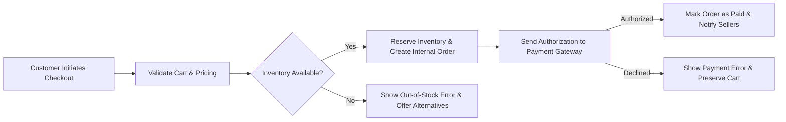
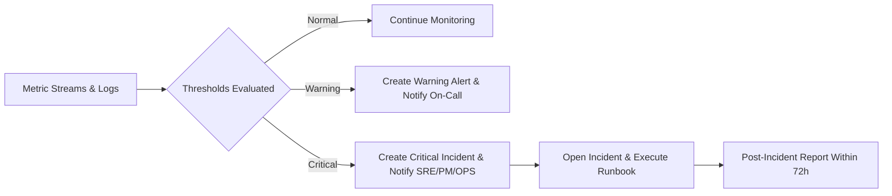
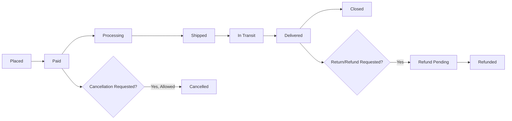

# 09 - Non-Functional Requirements

## Document Version
- Version: 1.0
- Audience: Engineering leadership, SRE, Security, Product Management, QA, Operations
- Locale: en-US; Timezone context: Asia/Seoul (KST)

## Executive Summary
shoppingMall requires clear, business-level non-functional requirements to guarantee user experience, operational stability, and regulatory compliance at launch and as the platform scales. These requirements define measurable performance targets, availability SLAs, capacity guidance, security expectations, monitoring and alerting responsibilities, and compliance and retention rules. The purpose is to enable engineering and operations to design systems that meet business expectations and to provide QA with testable acceptance criteria.

## Scope and Audience
This document covers non-functional expectations for public-facing buyer experiences (search, product pages, checkout), seller experiences (seller dashboard, product management), order processing flows (checkout, payment, shipment updates), admin operations, and backend operational capabilities (monitoring, incident handling). It is intended for engineering leads, SRE, security, product owners, QA, and operations.

## Relationship to Other Documents
- Functional Requirements: 04-functional-requirements.md — outlines WHAT features must work; this document states HOW well they must perform.
- Workflows and Process Flows: 07-workflows-process-flows.md — describes sequence and business states used to define monitoring points.
- Business Rules: 08-business-rules-constraints.md — contains operational rules that affect availability and recovery.
- External Integrations: 10-external-integrations-open-questions.md — dependencies that materially affect non-functional behavior (payments, carriers, tax services).

## Terminology and Timezone Considerations
- Normal load: Typical hourly traffic profile for a non-peak day (to be finalized with product projections). Default planning assumption: 100k daily active users (DAU) for first 6 months; replace with stakeholder values when available.
- Peak load: Sustained load during promotional events; default planning multiplier: 10x normal load for a 10-minute sustained window.
- Percentile notation: P95 indicates the 95th percentile latency; P99 indicates 99th percentile.
- SLA measurement window: Monthly, using Asia/Seoul timezone for calendar calculations.
- KST references: Any calendar-day or timed SLA references use KST by default.

## Performance Requirements (Business-Level, Measurable)
Intent: Ensure user-visible operations meet responsiveness expectations that preserve conversion and seller throughput.

EARS-formatted performance requirements:
- WHEN a user performs a typical product search query, THE shoppingMall SHALL return the first page of search results (20 items) within 2.0 seconds at P95 under normal load.
- WHEN a user opens a product detail page for a single product and SKU, THE shoppingMall SHALL render core product data (title, price, availability, primary images, variant selector) within 1.5 seconds at P95 under normal load.
- WHEN a user adds an SKU to cart, THE shoppingMall SHALL acknowledge the operation and update cart summary within 1.0 second at P99 under normal load.
- WHEN a user initiates checkout and the system validates cart, THE shoppingMall SHALL complete internal order-creation and inventory reservation within 3.0 seconds at P99 under normal load (payment gateway latency excluded).
- WHEN an authenticated user logs in with valid credentials, THE shoppingMall SHALL establish a usable session and present account dashboard content within 2.0 seconds at P95 under normal load.
- WHEN token refresh is requested, THE shoppingMall SHALL issue a refreshed access token within 1.0 second at P95 under normal load.

Definitions and testability notes:
- Normal load baseline must be replaced with explicit DAU and concurrency numbers from product planning before final capacity testing.
- Acceptance tests: Synthetic monitoring and load tests must assert the percentiles above using production-like datasets and typical query patterns.

## Availability and Reliability Targets (Business SLAs)
Intent: Differentiate between browsing availability and critical commerce availability and provide exclusion rules for scheduled maintenance.

EARS-formatted availability requirements:
- WHILE the platform operates in production, THE shoppingMall SHALL maintain monthly availability of at least 99.9% for public browsing endpoints (catalog listing, product search, product detail) during business hours in the primary market.
- WHILE the platform operates in production, THE shoppingMall SHALL maintain monthly availability of at least 99.95% for critical commerce endpoints (cart modifications, checkout initiation, order placement, payment state transitions) during business hours in the primary market.
- IF a scheduled maintenance window is announced at least 72 hours in advance and is executed during the announced window, THEN THE resulting downtime SHALL be excluded from monthly availability calculations provided notifications are logged and stakeholders are informed.

Clarifications and measurement:
- "Availability" is measured as the percentage of successful (2xx or expected response codes) requests for the endpoint group over the measurement window, penalizing prolonged 5xx error spikes.
- Business hours for availability measurement default to 09:00–21:00 KST for the primary market; adjust per stakeholder agreement.

## Scalability and Capacity Planning (Business-Level)
Intent: Provide clear capacity planning guidance and operational constraints for growth and promotional events.

Requirements and guidance:
- WHEN platform traffic grows, THE shoppingMall SHALL scale horizontally such that the performance percentiles in Performance Requirements are preserved at up to 10x the normal concurrent shopper baseline for short-term promotional bursts (sustained up to 10 minutes) and 3x for sustained peak-day load.
- WHEN bulk seller operations occur (bulk inventory updates, CSV uploads), THE shoppingMall SHALL process these operations with rate-limiting and backpressure such that critical commerce endpoints are unaffected; bulk ops SHALL be throttled to ensure checkout availability targets remain met.
- THE shoppingMall SHALL support configurable throttles for seller operations and provide visibility to sellers when operations are delayed due to rate limits.

Capacity placeholders for planning (business to confirm):
- Planning baseline (replace with stakeholder numbers): DAU=100,000; peak concurrency=2,000 active users/sec; average orders/day=50,000; expected average order size 1.8 items. These numbers MUST be validated and replaced before engineering finalizes capacity design.

## Security and Data Protection (Business Expectations)
Intent: Protect user and seller data, require role-based controls, and define incident response obligations.

EARS-formatted security requirements:
- WHEN a user logs in, THE shoppingMall SHALL validate credentials and create short-lived access tokens; token issuance SHALL occur within business response time targets in Performance Requirements.
- WHEN a password reset or email-change is requested, THE shoppingMall SHALL verify control of the associated email address before allowing the sensitive change.
- IF an account experiences more than 10 failed login attempts within a 15-minute window, THEN THE shoppingMall SHALL temporarily block further login attempts for that account for 15 minutes and require password reset or account verification to resume login.
- WHERE high-risk roles exist (supportAgent, seller, admin), THE shoppingMall SHALL require multi-factor authentication (MFA) at login or for sensitive actions; MFA requirement scope is a stakeholder decision but recommended for seller and admin roles at minimum.

Data protection and compliance expectations:
- THE shoppingMall SHALL not persist raw cardholder data in platform-controlled storage unless required and compliant with PCI obligations; payment providers or tokenization SHOULD be used to minimize PCI scope.
- THE shoppingMall SHALL retain order and transaction records for a minimum of 7 years or as required by applicable law in the launch jurisdictions; legal MUST confirm jurisdictional variations.
- WHEN a user requests account deletion, THEN THE shoppingMall SHALL allow deletion of personal data while preserving non-personal transactional records required for legal and tax compliance; the process SHALL be documented and auditable.

Incident response and breach notification:
- WHEN a suspected data breach affecting PII occurs, THEN THE shoppingMall SHALL follow the incident response playbook: detect → contain → assess → notify internal stakeholders within 4 hours → notify affected users and regulators per legal obligations within required statutory windows.

## Operational Monitoring and Alerting (Business-Level)
Intent: Define the critical KPIs to monitor, alert thresholds, and expected operational response times.

Key monitored KPIs and thresholds (examples):
- Checkout Failure Rate: Threshold = 2% sustained over 3 minutes → Critical Alert
- Payment Gateway Error Rate: Threshold = 1% of payment attempts over 5 minutes → High Alert
- Inventory Reconciliation Failures: Any reconciliation failure that causes negative available inventory → Critical Alert
- Carrier Exception Rate: >5% exceptions for shipments in a rolling 24-hour window → Medium Alert
- API Error Rate (5xx) for critical endpoints: >0.5% for 5 minutes → High Alert

EARS-formatted monitoring and alerting requirements:
- WHEN the Checkout Failure Rate exceeds 2% sustained for 3 minutes, THE shoppingMall SHALL generate a critical alert to on-call SRE and notify Product and Ops teams, and an incident SHALL be opened within 5 minutes.
- WHEN the Payment Gateway Error Rate exceeds 1% over 5 minutes, THE shoppingMall SHALL escalate to Ops and enable any configured payment gateway failover or mitigation playbook.

SLA for operational response:
- MTTD (Mean Time to Detect): <= 5 minutes for critical alerts
- MTTA (Mean Time to Acknowledge): <= 10 minutes during business hours for critical alerts
- MTTR (Mean Time to Resolve): Target <= 4 hours for critical incidents (initial target; refine with SRE)

Runbook expectations and escalation:
- The platform SHALL maintain runbooks for common failures (payment provider outage, database connectivity, inventory reconciliation mismatch, carrier outage). Runbooks SHALL include immediate mitigation steps, owners, and communication templates.
- Significant incidents SHALL be recorded in a post-incident report within 72 hours including impact (customers affected, revenue estimate), root cause, remediation steps, and preventive actions.

## Maintainability and Operational Readiness (Business Requirements)
Intent: Ensure manageable rollouts, safe migrations, and clear rollback procedures.

Business rules:
- WHEN deploying changes that affect schema or contracts, THE shoppingMall SHALL follow a migration strategy that supports backward compatibility for at least one prior client release and SHALL provide rollback procedures that can restore service to the pre-deployment state within the agreed MTTR.
- WHEN a major data migration is required, THE shoppingMall SHALL perform migration in stages with validation steps and a canary rollout; rollbacks and remediation procedures SHALL be pre-defined.
- WHILE performing emergency rollback or hotfixes, THE shoppingMall SHALL communicate expected user impact and estimated recovery time to stakeholders and affected sellers within 30 minutes of decision to rollback.

Testing and operational readiness:
- Pre-release requirements: Each release to production SHALL pass automated regression tests, performance tests that validate P95/P99 response times for critical endpoints, and a staged canary rollout.
- Disaster recovery testing: THE shoppingMall SHALL execute annual failover and disaster recovery drills and SHALL document results and remediation.

## Compliance, Privacy and Data Retention (Business-Level)
Intent: Meet legal obligations, preserve audit trails, and provide defined user data control.

EARS-formatted compliance requirements:
- WHILE operating in launch jurisdictions, THE shoppingMall SHALL retain transaction and order records required for tax and accounting for a minimum of 7 years unless legal counsel specifies otherwise.
- WHEN a user exercises data deletion rights (subject to legal exceptions), THEN THE shoppingMall SHALL delete or anonymize personal data while retaining transactional records required for compliance; the system SHALL record the deletion event in an audit trail.

Data access and auditability:
- THE shoppingMall SHALL maintain tamper-evident audit logs for key actions: order state changes, refunds, payouts, inventory adjustments, admin actions. Logs SHALL include actor id, timestamp (KST), and reason where applicable.

## Acceptance Criteria, KPIs and Testable Metrics
Intent: Provide QA and SRE with concrete acceptance tests and measurable KPIs.

Representative acceptance tests:
- Search Performance Test: Execute 1,000 representative search queries and assert 95% complete within 2.0 seconds.
- Checkout Concurrency Test: Simulate N concurrent checkout initiations (N to be defined by capacity baseline) and assert 99% of internal order creation completes within 3.0 seconds.
- Inventory Race Condition Test: Simulate two concurrent checkout attempts for the last SKU unit; exact behavior: exactly one order succeeds and the other receives an out-of-stock error and cart preserved.
- Failover Test: Simulate primary payment gateway outage and assert system successfully fails over to backup gateway (where configured) and continues accepting payments per business routing rules.

Key ongoing KPIs to report:
- Conversion rate (cart→order)
- Checkout failure rate
- Payment decline reasons and top failure categories
- Average time-to-first-shipment per seller
- Refund rate and average refund processing time
- Inventory mismatch events per 1,000 orders

## Risks, Assumptions and Mitigations
Key risks and recommended mitigations:
- Payment provider latency or outage — Mitigation: select gateway with robust SLA, implement failover, monitor error rate and alert.
- Inventory oversell due to race conditions — Mitigation: implement reservation semantics and atomic inventory operations; include reconciliation tasks and alerts.
- Carrier tracking unreliability — Mitigation: allow seller-provided tracking, display carrier-provided timestamps, and provide fallback UPSERT status when carrier data missing.
- Rapid adoption exceeding capacity — Mitigation: staged rollout with canary, runbook for scaling, pre-purchase on-demand capacity.

Assumptions (business):
- Initial DAU and orders/day will be finalized by Product before capacity design is frozen.
- Payment and carrier partners will provide required APIs for integration in agreed timelines.

## Open Questions and Required Stakeholder Decisions
Priority decisions required before final implementation:
1. Confirm baseline DAU and peak multipliers for capacity planning (CRITICAL).
2. Decide payment routing model (platform-mediated payouts vs direct seller settlement) (CRITICAL).
3. Select primary payment gateway(s) and backup(s) (CRITICAL).
4. Confirm required carrier coverage for MVP (regional carriers vs global) (HIGH).
5. Confirm legal retention durations for transactional records in each launch jurisdiction (LEGAL).
6. Decide MFA enforcement policy for seller and admin roles (SECURITY).
7. Decide SMS vs email-only notification policy at launch (PRODUCT/OPS).

## Appendices

### Appendix A — Mermaid Diagrams

Checkout Performance Flow

Monitoring and Alerting Flow

Order Lifecycle (Business View)

### Appendix B — Example SLA Calculation (Business Illustration)
- For browsing endpoints: 30 days × 24 hours × 3600 seconds = total seconds in window. Availability measured as successful request count / total request count.
- Example: If out of 1,000,000 browsing requests in month, 999,200 succeeded, availability = 99.92%.

### Appendix C — Glossary
- DAU: Daily Active Users
- P95/P99: 95th/99th percentile latency
- MTTD/MTTR/MTTA: Mean Time to Detect/Acknowledge/Resolve
- SLA: Service Level Agreement

---

End of non-functional requirements content. All requirements above are business-level; detailed technical design, APIs, and implementation are delegated to engineering and operations teams.