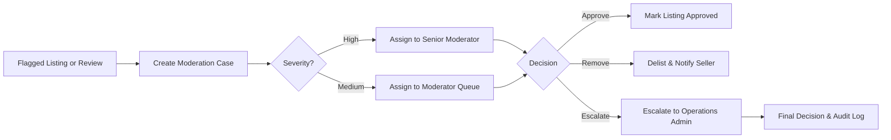
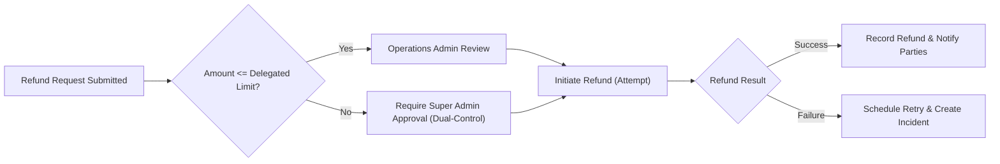
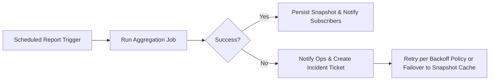

# Admin Dashboard and Reporting — Business Requirements

## Executive Summary

Provide platform administrators with the tools, workflows, and measurable rules necessary to operate, govern, and defend the marketplace. The admin capabilities described here prioritize auditability, separation of duties, timely financial controls, moderation accuracy, and operational readiness. All actions that affect orders, funds, seller status, or PII SHALL be auditable, role-protected, and follow explicit approval or escalation rules.

Scope: order and refund management, seller and listing moderation, reporting and analytics, audit trails, PII export controls, dual-control financial operations, incident handling, and admin performance SLAs.

## Audience and Related Documents

Audience: Super Admins, Operations Admins, Marketplace Moderators, Reporting Analysts, backend developers, SRE/operations, and compliance officers.

Related documents:
- Service Overview: ./01-service-overview.md
- Functional Requirements: ./03-functional-requirements.md
- User Actors and Authentication: ./02-user-actors.md
- Order & Payment Workflows: ./08-order-and-payment-workflows.md
- Inventory & Seller Management: ./09-inventory-and-seller-management.md
- External Integrations: ./07-external-integrations.md

## Admin Role Taxonomy and Responsibilities (EARS)

- THE platform SHALL support the following admin role types: "super_admin", "operations_admin", "marketplace_moderator", and "reporting_analyst". Role assignment SHALL be auditable with assignment timestamp and author.

- WHEN an admin account is provisioned, THE platform SHALL record the provisioning actor, role, reason, and required training completion date (if applicable) and SHALL prevent assignment of elevated roles until training and background checks complete for risk-sensitive roles.

Role responsibilities (business terms):
- WHEN a Super Admin acts, THE system SHALL treat the action as high-privilege and log it with mandatory rationale; Super Admin SHALL be able to perform all administrative actions including policy management and emergency overrides.
- WHEN an Operations Admin acts, THE system SHALL permit order and refund processing up to configured financial limits and create audit entries; Operations Admin SHALL NOT be permitted to change platform policies.
- WHEN a Marketplace Moderator acts, THE system SHALL permit review and moderation of listings and reviews, and SHALL require escalation to Operations Admin for financial actions.
- WHEN a Reporting Analyst acts, THE system SHALL permit read-only access to aggregated data and configurable exports that exclude PII unless explicit export permission is granted and justified.

## Permission Matrix (Business-level)

| Action | super_admin | operations_admin | marketplace_moderator | reporting_analyst |
|---|---:|---:|---:|---:|
| View orders (all) | ✅ | ✅ | ✅ (limited) | ✅ (aggregated) |
| Modify order state | ✅ | ✅ (within limits) | ❌ | ❌ |
| Issue refunds | ✅ | ✅ (within delegated limit) | ❌ | ❌ |
| Force-capture payments | ✅ | ✅ (requires justification) | ❌ | ❌ |
| Suspend/delist seller | ✅ | ✅ (escalation) | ✅ (recommendation) | ❌ |
| Approve seller onboarding | ✅ | ❌ | ✅ (review) | ❌ |
| Moderate reviews/listings | ✅ | ✅ | ✅ | ❌ |
| Export PII-containing datasets | ✅ (with reason) | ✅ (with justification & audit) | ❌ | ✅ (restricted, aggregated) |
| Impersonate user (auditable) | ✅ | ✅ (limited) | ❌ | ❌ |

Notes:
- "Modify order state" for Operations Admins is limited by configurable thresholds (daily aggregate and per-transaction limits). Operations Admin financial actions above thresholds SHALL require second-approval by a Super Admin.
- Actions that change money movement (refunds, captures, payout holds) SHALL require documented rationale and an audit record.

## Approval and Dual-Control Workflows (EARS)

- WHEN an admin requests a financial operation (refund, manual capture, payout override) where the amount exceeds the configured individual threshold (default: $1,000), THEN THE system SHALL require a second admin approval (dual-control) before processing.
  - Acceptance: Dual-control approvals SHALL include approver id, timestamp, justification, and correlation id; the operation SHALL not proceed without both approvals.

- WHEN an admin initiates a suspension of a seller that would impact in-flight orders, THEN THE system SHALL require an operations-signoff and SHALL notify affected customers within 1 hour of suspension.

- IF a Super Admin overrides a dual-control requirement for an emergency, THEN THE system SHALL require that the Super Admin provide an explicit written rationale in the audit log within 24 hours and THAT rationale SHALL be included in the compliance report for the relevant period.

## Order and Refund Management (EARS)

- WHEN an admin views any order, THE system SHALL display order audit history including payments, state transitions, seller actions, and admin interventions for at least 7 years.

- WHEN a customer requests a refund and the seller cannot resolve, THEN THE system SHALL route the request to Operations Admin and THE Operations Admin SHALL respond within 72 hours with approval, partial approval, or rejection.

- WHEN an Operations Admin approves a refund BELOW the delegated limit (default: $1,000), THEN THE system SHALL initiate the refund within 24 hours and SHALL log refund initiation details.

- WHEN a refund is approved ABOVE the delegated limit, THEN THE system SHALL require Super Admin approval before initiating the refund.

- IF a refund fails at the payment provider, THEN THE system SHALL record a "REFUND_FAILED" event, retry according to the retry policy up to 3 times, and create an operations incident if retries fail.

Acceptance criteria:
- 95% of admin-initiated refunds within delegated limits SHALL begin processing within 24 hours of admin approval.
- Dual-control approvals SHALL be enforced in 100% of cases where thresholds are exceeded.

Error handling:
- IF an admin attempts to refund an amount greater than the captured amount, THEN THE system SHALL reject the action with error code ADMIN_REFUND_EXCEEDS_CAPTURE and require manual reconciliation.

## Product and Seller Moderation Workflows (EARS)

- WHEN a listing is flagged by automated rules or user reports, THE system SHALL create a moderation case and assign severity (low, medium, high) based on predefined criteria (safety, counterfeiting risk, financial impact).

- WHEN a moderation case is created, THE system SHALL notify Marketplace Moderators and SHALL require initial review within 24 hours for high severity and 72 hours for medium/low severity.

- IF moderator removes a listing, THEN THE system SHALL notify the seller with a standardized removal reason code, provide an editable remediation checklist, and allow the seller to appeal within 14 days.

- IF a seller appeals a removal, THEN THE system SHALL record the appeal with appeal id, capture seller evidence, and route to Senior Moderator or Super Admin for final decision within 14 calendar days.

Sanctions and progressive enforcement:
- WHEN a seller accrues repeated policy violations (configurable threshold, default: 3 serious violations in 90 days), THEN THE system SHALL apply progressive sanctions: 1) Warning and required training, 2) Temporary reduction in visibility and holding of promotional privileges, 3) Temporary suspension of listing permissions and partial hold on payouts, 4) Delisting and account suspension for severe or repeated non-compliance.

Acceptance criteria:
- 90% of automated flags SHALL be triaged within 24 hours during business days.
- Appeals SHALL be resolved within 14 days in 95% of cases.

## Reporting and Analytics Requirements (EARS)

Required reports and cadence:
- THE system SHALL produce the following reports with indicated cadence and freshness:
  - Daily Sales Summary (GMV, orders, refunds, net revenue) — daily snapshot at 02:00 local time; retention 7 years.
  - Real-time Operational Dashboard (orders in last 15 minutes, payment failures, shipping exceptions) — near-real-time (<=60s latency).
  - Seller Performance Report (sales, fulfillment rate, cancellation rate) — daily and 30-day rolling window.
  - Refund & Chargeback Report (counts, reasons, outcomes) — daily; alerts for chargeback rate > 0.5% monthly.
  - Moderation Queue Report (open cases, average resolution time) — hourly.
  - Inventory Health (stockouts, reconciliation deltas) — daily.

- WHEN a scheduled report fails to generate, THEN THE system SHALL notify Operations Admins within 15 minutes and SHALL create a remediation ticket.

Ad-hoc reporting and exports:
- WHEN an admin requests an ad-hoc export that includes PII, THEN THE system SHALL require declared business purpose and SHALL log the requester, purpose, time, and intended retention; exports containing PII SHALL be delivered via secured, auditable channels and SHALL be deleted per declared retention.

Access controls:
- WHEN a Reporting Analyst requests access to sensitive reports, THEN THE system SHALL grant read-only access by default and require elevated permission for exports that include PII.

Performance and SLA:
- 95% of ad-hoc aggregated queries for dashboards shall complete within 30 seconds for datasets up to 100k rows.
- Synchronous exports of aggregated reports shall complete within 2 minutes; large asynchronous exports shall be delivered within 24 hours and include retrieval links and audit records.

Acceptance criteria:
- Real-time dashboard freshness SHALL be <= 60 seconds 95% of the time.
- Daily snapshots SHALL be produced at scheduled time with >99% success rate over rolling 30-day windows.

## Audit Trails, Tamper Evidence, and Retention (EARS)

- THE system SHALL record the following fields on every admin action: adminId, role, actionType, targetEntityId, timestamp (ISO8601), sourceIP, justificationText (if action changes financial state), correlationId, and caseId where applicable.

- WHEN an admin action modifies financial state (refund, capture, payout hold), THEN THE system SHALL require justificationText and SHALL store the justification in the immutable audit trail.

- THE platform SHALL retain audit logs for a minimum of 7 years by default and SHALL support jurisdiction-specific overrides to meet local legal obligations.

- WHEN a legal hold is placed, THEN THE system SHALL prevent deletion or anonymization of related records and SHALL record the hold event with issuer id and reason. Legal holds SHALL be auditable and reversible only by Super Admins.

Immutability and tamper evidence:
- THE system SHALL employ append-only audit logs and SHALL store cryptographic checksums or signatures for daily audit snapshots to provide tamper evidence. The exact technical approach is left to implementers but the business MUST be able to demonstrate tamper evidence to auditors.

Access logging:
- THE system SHALL record read-access events for sensitive entities (order payment details, PII exports, admin impersonation) and SHALL surface read-access reports to compliance teams on demand.

## Data Export, PII Handling and Compliance (EARS)

- WHEN an admin requests PII export for a user or order, THEN THE system SHALL require a declared business purpose and SHALL acknowledge the export request within 24 hours; THE system SHALL deliver the export within 30 calendar days unless additional legal review is required.

- THE system SHALL classify data by sensitivity (PII, financial, operational) and SHALL apply stricter access controls and retention for PII and financial records.

- THE system SHALL support data subject requests (access, deletion) consistent with GDPR: acknowledge within 24 hours and fulfill within 30 days unless a legal exemption applies.

- THE platform SHALL not store full PAN values and SHALL rely on tokenization via PCI-DSS-compliant providers for card data; any storage of payment references SHALL be limited to non-sensitive tokens and provider references.

## Error Handling, Operational Runbooks and Incident Management (EARS)

- WHEN an automated refund fails due to provider error, THE system SHALL retry up to 3 times with exponential backoff and SHALL open an operations incident if all retries fail.

- WHEN daily reconciliation jobs fail or produce mismatch deltas > configured thresholds (e.g., 5% inventory delta or >$10,000 settlement discrepancy), THEN THE system SHALL escalate to Operations Admins and create a high-priority incident with root-cause workflow.

- THE platform SHALL maintain runbooks for critical incidents including payment provider outage, mass carrier failures, moderation backlog spikes, and data export incidents. Runbooks SHALL include failover steps, communication templates, and required approvals.

## Performance and Operational KPIs for Admin Functions (Business SLAs)

- Dual-control enforcement: 100% of financial actions above threshold shall require second approval.
- Refund processing: 95% of approved refunds within delegated limits shall initiate within 24 hours.
- Moderation SLA: 90% of high-severity cases triaged within 24 hours; 95% of appeals resolved within 14 days.
- Reporting freshness: real-time dashboard <= 60s; daily snapshot produced at scheduled time with >99% success over rolling 30 days.
- Audit log retention: minimum 7 years; legal hold changes recorded immediately.

## Acceptance Criteria and Example Test Cases

AC-01: Dual-control enforcement
- GIVEN an admin initiates a $5,000 refund (threshold $1,000), WHEN the admin submits the refund request, THEN the system SHALL require a second approver and the refund SHALL not execute until approved by a Super Admin. Verify audit entries exist for both approver ids and timestamps.

AC-02: Moderation appeal
- GIVEN a seller listing removed by moderator, WHEN the seller appeals within 14 days, THEN the appeal shall be routed, and the final decision SHALL be recorded within 14 days in 95% of tests.

AC-03: PII export governance
- GIVEN a Reporting Analyst requests PII export without justification, WHEN the request is submitted, THEN the system SHALL reject the request and provide the error code EXPORT_PII_NO_PURPOSE. If purpose provided, the request SHALL be acknowledged within 24 hours.

AC-04: Report generation
- GIVEN daily sales snapshot job scheduled at 02:00, WHEN job runs for 30 consecutive days, THEN 99% of generated snapshots must exist and be retrievable via the admin UI or export endpoint.

## Mermaid Diagrams

### Moderation Case Lifecycle

### Refund Approval Flow

### Report Generation and Failure Handling

## Glossary
- Dual-control: Requirement for two distinct admin approvals for sensitive financial actions.
- PII: Personally Identifiable Information.
- Delegated Limit: Configurable monetary threshold below which Operations Admins may act without Super Admin approval.
- Audit Trail: Immutable log of system and admin actions with required metadata.

## Appendix
- Example audit record fields: adminId, role, actionType, targetId, timestamp, sourceIP, justification, correlationId, caseId.
- Recommended default thresholds (business defaults; configurable by policy): Delegated refund limit $1,000; Dual-control emergency exception logging within 24 hours; Moderation severity triage 24 hours for high.

