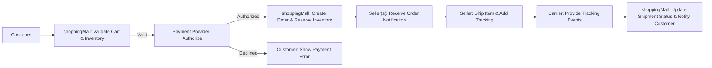

# External Integrations, Open Decisions, and Rollout Plan for shoppingMall

## 1. Executive Summary
The shoppingMall marketplace requires reliable integrations with payment processors, shipping carriers, tax engines, notification services, and optional identity/fraud providers to operate an efficient multi-seller platform. These integrations materially affect conversion, seller onboarding velocity, refund and dispute handling, and customer trust. This document captures business-level integration requirements, measurable acceptance criteria, an evaluation checklist for vendors, and a prioritized set of open decisions required for MVP launch.

How to use this document
- Use the Integration-by-Integration sections to evaluate vendor capabilities and draft RFPs.
- Use the Open Decisions table to track stakeholder commitments and owners.
- Use Acceptance Criteria and Test Cases during integration and QA phases.

Related documents
- 01-service-vision-overview.md (Business goals)
- 04-functional-requirements.md (Order, inventory, and payment flows)
- 07-workflows-process-flows.md (Checkout and lifecycle flows)

Timezone note
- Business time windows and SLA expectations use Asia/Seoul (KST) for all date/time calculations and acceptance tests.

---

## 2. Integration Overview and Business Context
Why integrations matter
- Payments determine conversion and dispute exposure; slow or unreliable authorization reduces completed orders.
- Shipping integrations determine tracking accuracy and post-purchase confidence; carrier data influences refund/dispute outcomes.
- Tax engines ensure correct price presentation and provide necessary reporting for sellers and finance.
- Notification systems deliver time-sensitive messages that reduce support load and improve retention.
- Identity verification and fraud tools reduce chargebacks and protect marketplace liquidity.

KPIs tied to integrations
- Payment authorization success rate: target >= 98% for supported methods
- Payment authorization latency (95th percentile): <= 3s
- Carrier event reflection SLA: 95% of carrier updates reflected within 1 hour
- Order confirmation email delivery: 95% within 60s
- Refund processing initiation: 95% started by platform within 48 hours of approval

---

## 3. Payments
Business expectations
- Accept major card networks and at least one local popular payment method in the target region for MVP.
- Support authorization, capture, partial and full refunds, chargeback notifications, and settlement reporting.
- Provide reconciliation files/data to finance enabling per-seller and per-order accounting.

EARS-formatted requirements
- WHEN a customer submits payment information and requests payment authorization, THE payment provider SHALL return an authorization decision (approved/declined) within 3 seconds for 95% of card transactions under normal load.
- WHEN a refund is approved in the platform, THE payment provider SHALL accept refund initiation requests via API and SHALL return a refund acknowledgement within 48 hours for 95% of refund requests.
- IF a chargeback is issued by the card issuer, THEN THE payment provider SHALL notify the platform within 24 hours of the provider receiving chargeback information.

Acceptance criteria & KPIs
- Authorization success rate >= 98% for accepted payment methods
- 95th percentile authorization latency <= 3 seconds
- Refund initiation API acknowledged within 48 hours 95% of the time
- Chargeback notifications received within 24 hours

Test cases
- Positive: Authorize a valid card transaction; expect approval within 3s and order created in "Placed"/"Paid" state.
- Failure: Simulate a declined card and verify the platform shows a clear, actionable error and preserves the cart.
- Refund: Approve a refund and verify platform records refund start and receives acknowledgement from provider within 48 hours.

Vendor evaluation checklist
- Support for authorization/capture and refunds
- Settlement reporting (per-transaction breakdown)
- Webhook support and notification latency
- Dispute and chargeback handling and documentation
- PCI-compliance scope reduction options (tokenization)
- Pricing model (per-transaction, monthly fees, refund/chargeback costs)

Risks and mitigations
- Risk: Payment provider onboarding delays. Mitigation: Have secondary provider or fallback plan and begin contractual discussions early.
- Risk: High declines from local cards. Mitigation: Include popular local method provider in MVP.

Operational notes
- Decide payout model (see Open Decisions): platform-collected vs. routed payments; this affects KYC and reconciliation.

---

## 4. Shipping & Tracking
Business expectations
- Allow sellers to enter tracking manually and/or use carrier integrations to provide real-time tracking updates.
- Support shipment-level statuses (Prepared, Shipped, In Transit, Out for Delivery, Delivered, Exception).

EARS-formatted requirements
- WHEN a seller marks items as "Shipped" with carrier and tracking number, THE platform SHALL record the tracking information and make it visible to the buyer within 10 seconds.
- WHEN a carrier posts a status update, THE platform SHALL reflect that status to buyer and seller within 1 hour for 95% of carrier events.

Acceptance criteria & KPIs
- Seller-entered tracking visible within 10 seconds
- Carrier event reflection within 1 hour for 95% of events
- On-time delivery rate measured per carrier (baseline to be determined per region)

Test cases
- Manual tracking: Seller adds tracking number; customer sees tracking in order details and receives notification.
- Carrier webhook: Simulate carrier webhook update; platform reflects status change within 1 hour.

Vendor evaluation checklist
- Coverage of regional carriers
- Real-time webhooks vs. polling capabilities
- Rate calculation APIs for checkout
- Label generation / shipment booking (if required in later phases)

Risks and mitigations
- Risk: Carrier coverage gaps in target markets. Mitigation: Start with primary carriers covering the primary region; document gaps and timeline for expansion.
- Risk: Inconsistent carrier event quality. Mitigation: Use carrier-agnostic status mapping and surface 'carrier-provided' timestamps to users.

---

## 5. Tax Calculation & Compliance
Business expectations
- Provide tax estimates at checkout broken down per order line according to shipping address and product taxability.
- Provide seller-facing reports including tax breakdown by jurisdiction for bookkeeping.

EARS-formatted requirements
- WHEN checkout is initiated with a shipping address, THE platform SHALL calculate and display estimated tax within 2 seconds for 95% of common address queries.
- IF a product is tax-exempt for the shipping jurisdiction, THEN THE platform SHALL apply exemption and record exemption metadata in the order for seller and finance reporting.

Acceptance criteria & KPIs
- Tax estimate latency: 95th percentile <= 2s
- Tax metadata present in order records for finance reconciliation

Test cases
- Taxable product checkout: Verify tax line computation and order metadata
- Tax-exempt product: Verify exemption applied and recorded

Vendor evaluation checklist
- Jurisdiction coverage
- Real-time tax calculation latency
- Reporting exports for finance and sellers
- Support for tax-exempt entities and VAT handling

Risks and mitigations
- Risk: Incorrect tax treatment across jurisdictions. Mitigation: Use reputable tax engine and confirm regulatory requirements with legal.

---

## 6. Notifications & Messaging
Business expectations
- Deliver transactional messages (order confirmation, shipping, refunds) via email and in-app; optionally support SMS for critical alerts in Phase 2.

EARS-formatted requirements
- WHEN an order is confirmed, THE platform SHALL send an order confirmation email and an in-app notification within 60 seconds for 95% of confirmations.
- IF an email delivery permanently fails, THEN THE platform SHALL mark the notification as failed and escalate to support within 1 business hour.

Acceptance criteria & KPIs
- Email delivery within 60 seconds for 95% of transactions
- Retry policy and escalation documented and exercised in tests

Test cases
- Send order confirmation and verify delivery receipts from provider; simulate bounce/failed messages and verify retry and escalation.

Vendor evaluation checklist
- Throughput and latency SLAs
- Delivery reporting and bounce handling
- Internationalization support and templates

Risks and mitigations
- Risk: Deliverability issues for certain domains. Mitigation: Validate provider deliverability and implement monitoring; provide fallbacks for critical alerts.

---

## 7. Identity Verification (KYC) and Fraud Detection
Business expectations
- Implement seller KYC for high-risk or high-volume sellers and use fraud detection to identify suspicious buyer behavior.

EARS-formatted requirements
- WHEN a seller exceeds configured thresholds (for example monthly gross sales greater than a defined amount), THE platform SHALL set the seller account to "verification required" and prevent new listings until verification completes.
- WHEN fraud signals exceed defined thresholds for an order, THE platform SHALL flag the order for manual review and, if necessary, delay payout to the seller pending investigation.

Acceptance criteria & KPIs
- KYC initiation for sellers exceeding threshold within 24 hours of threshold breach
- Fraud detection alerts reviewed within 24 hours

Test cases
- Simulate threshold breach and confirm seller account state transitions and notifications.

Vendor evaluation checklist
- API latency and reliability
- Document verification coverage (types of documents, countries supported)
- False positive/negative rates and integration model

Risks and mitigations
- Risk: High friction in seller onboarding. Mitigation: Start KYC as manual for MVP and automate as thresholds and trust grow.

---

## 8. Analytics, Monitoring, and Observability
Business expectations
- Provide near-real-time metrics for payment failures, carrier exceptions, refund rates, and inventory reconciliation errors.

EARS-formatted requirements
- WHILE platform is in production, THE platform SHALL generate real-time alerts when critical KPIs exceed thresholds (for example payment failure rate > 2% sustained for 3 minutes).

Acceptance criteria & KPIs
- Alerts fired for threshold breaches and delivered to on-call operations within 5 minutes
- Dashboards for payment, shipping, and refund KPIs available to operations and product teams

Test cases
- Inject payment failure spikes in staging and verify alerting and incident creation flows.

Vendor evaluation checklist
- Metric and log integration (export formats)
- Alerting and incident integration (PagerDuty, Slack)

---

## 9. Open Decisions and Recommended Defaults
Table of open decisions (priority, recommended default, owner, target date)

| Decision | Priority | Recommended Default | Owner | Target Date |
|---|---:|---|---|---:|
| Payment routing model (platform-collected vs routed) | High | Platform-collected payouts (platform holds funds and pays sellers) | Finance/Product | 2025-10-21 |
| Payment methods for MVP | High | Cards + 1 local wallet | Product/Finance | 2025-10-14 |
| Tax remittance responsibility | High | Sellers remit; platform provides reporting | Legal/Finance | 2025-10-21 |
| Carrier coverage for MVP | Medium | Regional carriers for primary market only | Ops/Logistics | 2025-10-14 |
| KYC thresholds | Medium | Manual KYC for sellers until X monthly GMV | Ops/Finance | 2025-10-28 |
| SMS notifications at launch | Low | Defer to Phase 2, email + in-app only | Product/Marketing | 2025-11-04 |

---

## 10. MVP Scope and Phased Rollout
Phase 1 (MVP):
- Payments: Cards + one local method; platform-collected payments (recommended default)
- Shipping: Seller-entered tracking + 1–2 regional carrier integrations
- Tax: Estimate-only calculations and reporting for sellers
- Notifications: Email + in-app
- KYC: Manual verification for early sellers; automated KYC deferred

Phase 2:
- Add routed payments or split-payment support if needed
- Expand carrier integrations and add label purchase functions
- Add SMS notifications and richer notification templates
- Add automated KYC for sellers crossing thresholds

Phase 3:
- Fulfillment and warehouse integrations; multi-region tax remittance; advertising and promoted listings

Phase gate criteria (example)
- Payment gateway integrated and reconciliation validated in sandbox
- At least one carrier integrated and tracking updates validated
- End-to-end checkout success rate >= 98% in staging tests
- Refund initiation flows validated with payment provider

---

## 11. Integration Testing & Rollout Plan
Pre-launch checklist
- Obtain sandbox credentials and run authorization/load tests with payment provider
- Validate webhook reliability and latency for carriers and payment provider
- Validate tax calculations against sample addresses
- Test notifications, bounce handling, and retry logic
- End-to-end smoke tests for purchase → fulfillment → delivery → review

Rollout strategy
- Start with a closed beta (limited sellers and buyers) for 2–4 weeks
- Monitor KPIs and expand geographies/sellers in phased increments
- Maintain rollback plan and incident runbooks for each external provider

---

## 12. Acceptance Criteria and KPIs (Consolidated)
- Payment authorization success rate >= 98% for accepted methods
- 95th percentile authorization latency <= 3s
- Carrier event reflection: 95% within 1 hour
- Order confirmation email delivery: 95% within 60s
- Refund initiation: 95% initiated within 48 hours of approval
- End-to-end checkout success rate (staging): >= 98%

---

## 13. Next Steps and Action Items
- Product: Confirm payment methods for MVP and decide payment routing model (owner: Product/Finance) — due 2025-10-14
- Legal/Finance: Confirm tax remittance responsibility and compliance constraints — due 2025-10-21
- Ops: Identify and secure contracts with 1–2 regional carriers for MVP — due 2025-10-14
- Engineering: Prepare integration sandbox plans and run initial connectivity tests — due 2025-10-10

---

## 14. Appendices
Appendix A — Checkout and Payment Flow (Mermaid — corrected syntax)

Appendix B — Glossary
- GMV: Gross Merchandise Value
- KYC: Know Your Customer
- SLA: Service Level Agreement
- PCI: Payment Card Industry

Appendix C — Vendor RFP Checklist (example)
- Latency and reliability guarantees
- Refund and chargeback support
- Integration methods and webhook reliability
- Reporting and reconciliation exports
- Pricing and fee schedule

---

End of document.
