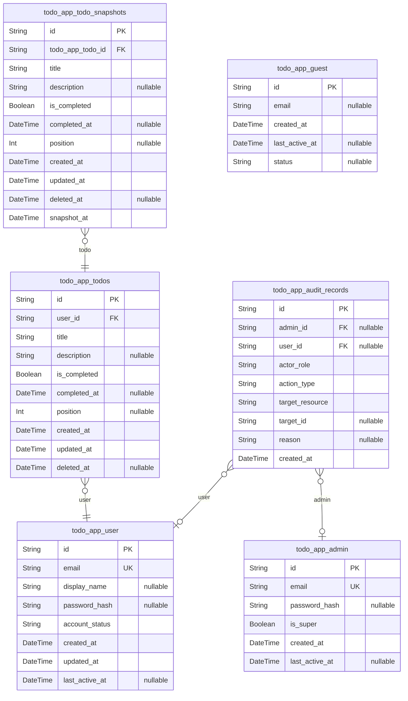

# Prisma Markdown

> Generated by [`prisma-markdown`](https://github.com/samchon/prisma-markdown)

- [Todos](#todos)

## Todos

### `todo_app_todos`

Primary Todo items for the minimal Todo app. Stores raw task data for
quick capture and lifecycle management (active, completed, deleted). Each
todo is owned by a user (owner) to ensure data isolation. Temporal fields
support audit and soft-delete semantics. Related snapshots are captured
in {@\link todo_app_todo_snapshots.id}.

Properties as follows:

- `id`: Primary Key.
- `user_id`: Owner user. {@\link todo_app_user.id}.
- `title`
  > Short task title. Required business field used for display and quick
  > capture.
- `description`: Optional longer description or notes for the todo item.
- `is_completed`: Whether the todo is completed. Used for filtering and UI state.
- `completed_at`: Timestamp when the todo was marked completed. Null if not completed.
- `position`: Optional manual ordering position used by client for custom sort orders.
- `created_at`: Record creation timestamp.
- `updated_at`: Record last modification timestamp.
- `deleted_at`: Soft-delete timestamp. Null when item is active or completed.

### `todo_app_todo_snapshots`

Snapshot history for todos. Captures point-in-time copies of a todo item
for audit and historical queries. Each snapshot references the source
{@\link todo_app_todos.id} and records snapshot_at when the snapshot was
taken.

Properties as follows:

- `id`: Primary Key.
- `todo_app_todo_id`: Referenced todo item. {@\link todo_app_todos.id}.
- `title`: Snapshot of todo.title at snapshot time.
- `description`: Snapshot of todo.description at snapshot time.
- `is_completed`: Snapshot of completion flag at snapshot time.
- `completed_at`: Snapshot of completed_at (if set on source).
- `position`: Snapshot of position for ordering.
- `created_at`: Original created_at from source todo at snapshot time.
- `updated_at`: Original updated_at from source todo at snapshot time.
- `deleted_at`: Original deleted_at from source todo at snapshot time.
- `snapshot_at`: Timestamp when this snapshot was created.

### `todo_app_audit_records`

Append-only audit records for administrative and system actions. Records
actor (admin or system), action type, target resource, optional reason,
and timestamp for forensic and compliance purposes. Actor references are
nullable to preserve system-initiated events. Foreign-key delete behavior
must not cascade to preserve audit history.

Properties as follows:

- `id`: Primary Key.
- `admin_id`: Acting admin's {@\link todo_app_admin.id}. Nullable for system actions.
- `user_id`
  > Referenced user affected by the action. {@\link todo_app_user.id}.
  > Nullable when not applicable.
- `actor_role`: Role of the actor performing the action (e.g., 'admin','system').
- `action_type`: Type of action performed (e.g., 'suspend_user','restore_todo','purge').
- `target_resource`: Logical resource type affected by the action (e.g., 'todo','user').
- `target_id`
  > Optional identifier of the target resource (e.g., todo id) for quick
  > lookup.
- `reason`: Optional reason provided by the actor for the action.
- `created_at`: Timestamp when the audit record was created.

### `todo_app_guest`

Lightweight record for unauthenticated or ephemeral visitors. Kept
minimal per component guidance; useful for analytics or short-term
session tracking. Managed as a subsidiary support table.

Properties as follows:

- `id`: Primary Key.
- `email`: Optional visitor-provided email address (nullable).
- `created_at`: Record creation timestamp for the guest entry.
- `last_active_at`: Last observed activity for the guest (nullable).
- `status`
  > Optional status for administrative housekeeping (e.g.,
  > 'active','bounced').

### `todo_app_user`

User accounts for the application. Users are independently managed
business entities (registration, authentication, profile). This model is
intentionally included but todos do not require a mandatory user relation
in this MVP shape.

Properties as follows:

- `id`: Primary Key.
- `email`: Primary email for the user account. Used for login and communication.
- `display_name`: Optional display name for the user.
- `password_hash`: Password hash for authentication (nullable if external auth used).
- `account_status`: Account lifecycle status (e.g., 'active','suspended').
- `created_at`: Account creation timestamp.
- `updated_at`: Last update timestamp for the account.
- `last_active_at`: Last activity timestamp (nullable).

### `todo_app_admin`

Administrative accounts with elevated privileges used for support and
maintenance. Admin actions are audited in {@\link
todo_app_audit_records.id}. This model is primary since admins require
independent management and auditability.

Properties as follows:

- `id`: Primary Key.
- `email`: Admin account email used for login and notifications.
- `password_hash`: Password hash for admin authentication (nullable if external SSO used).
- `is_super`: Flag indicating super-admin privileges.
- `created_at`: Admin account creation timestamp.
- `last_active_at`: Last activity timestamp for the admin (nullable).
