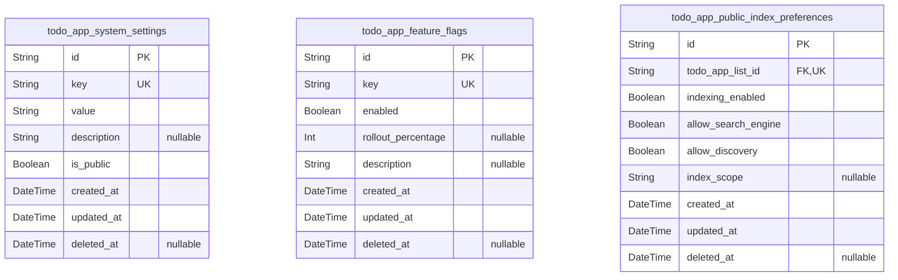
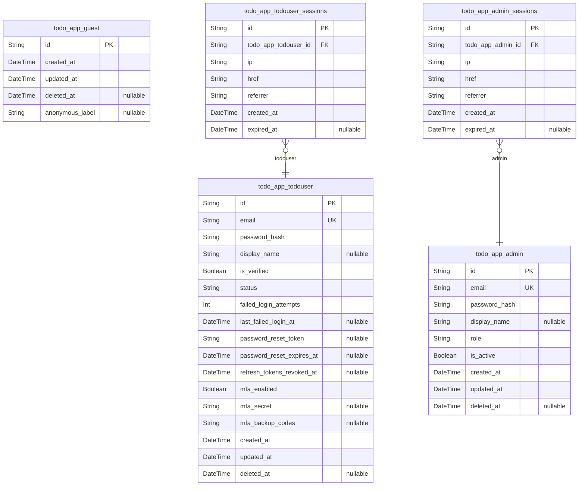
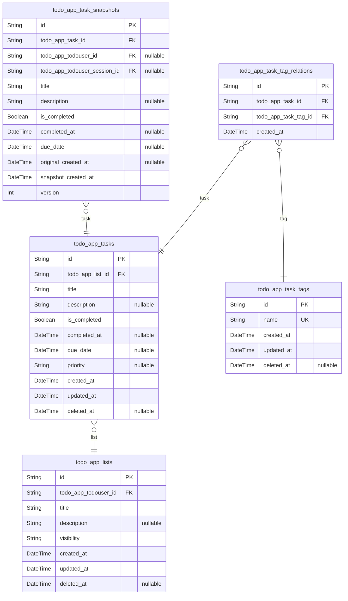
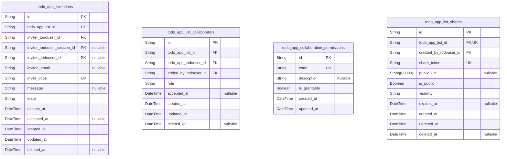
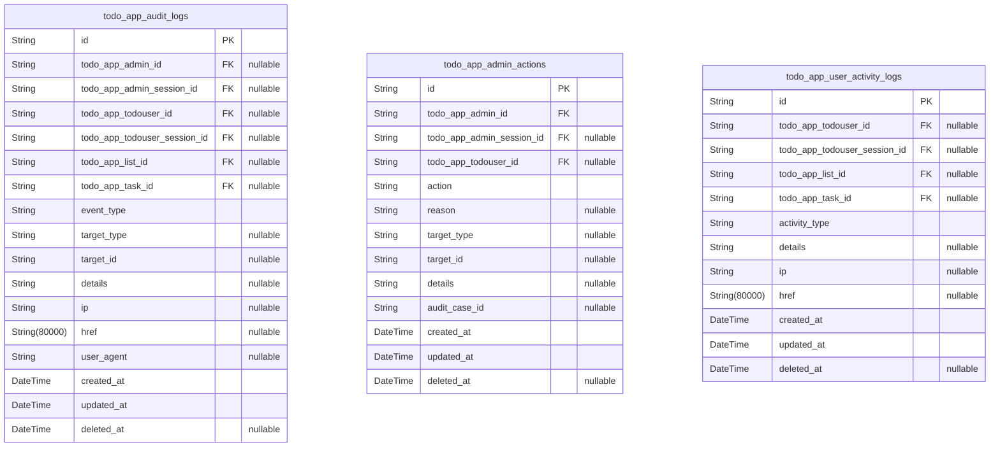

# Prisma Markdown

> Generated by [`prisma-markdown`](https://github.com/samchon/prisma-markdown)

- [Systematic](#systematic)
- [Actors](#actors)
- [Todos](#todos)
- [Collaboration](#collaboration)
- [Audit](#audit)

## Systematic

```mermaid
erDiagram
"todo_app_system_settings" {
  String id PK
  String key UK
  String value
  String description "nullable"
  Boolean is_public
  DateTime created_at
  DateTime updated_at
  DateTime deleted_at "nullable"
}
"todo_app_feature_flags" {
  String id PK
  String key UK
  Boolean enabled
  Int rollout_percentage "nullable"
  String description "nullable"
  DateTime created_at
  DateTime updated_at
  DateTime deleted_at "nullable"
}
"todo_app_public_index_preferences" {
  String id PK
  String todo_app_list_id FK,UK
  Boolean indexing_enabled
  Boolean allow_search_engine
  Boolean allow_discovery
  String index_scope "nullable"
  DateTime created_at
  DateTime updated_at
  DateTime deleted_at "nullable"
}
```

### `todo_app_system_settings`

Global system configuration key-value pairs used to control
platform-level behavior (feature toggles, operational thresholds, and
public defaults). Settings are administrated by platform operators and
can be queried for runtime configuration. Does not duplicate domain
prefixes. Temporal fields provided for audit and soft-delete.

Properties as follows:

- `id`: Primary Key.
- `key`
  > Canonical setting key (unique). Examples: "maintenance_mode",
  > "default_list_visibility".
- `value`
  > Serialized setting value stored as string. Consumers are responsible for
  > interpretation (boolean, JSON, numeric) based on the key.
- `description`
  > Human-friendly description explaining purpose and acceptable values for
  > the setting. Useful for admin UIs and audit.
- `is_public`
  > Whether this setting is visible to non-admin audiences (e.g., public
  > telemetry or informational flags).
- `created_at`: Record creation timestamp.
- `updated_at`: Record last modification timestamp.
- `deleted_at`: Soft-delete timestamp; null when active.

### `todo_app_feature_flags`

Feature flags used by the platform to gate functionality. Each flag has a
canonical key and rollout controls. Administrators can search,
enable/disable, and partially roll out flags. Descriptions support
full-text search for admin UX.

Properties as follows:

- `id`: Primary Key.
- `key`: Canonical feature flag key (unique). Example: "new_onboarding_flow".
- `enabled`: Whether the feature flag is currently enabled (global on/off).
- `rollout_percentage`
  > Optional staged rollout percentage (0-100) used by rollout systems to
  > progressively enable features.
- `description`
  > Administrative description and notes for the feature flag; used in admin
  > UIs and searchable by maintainers.
- `created_at`: Record creation timestamp.
- `updated_at`: Record last modification timestamp.
- `deleted_at`: Soft-delete timestamp; null when active.

### `todo_app_public_index_preferences`

Per-list public indexing preferences that control whether an individual
list is discoverable or indexed by platform discovery and external
search. Each preferences row is a 1:1 subsidiary record tied to a list
[todo_app_lists.id](#todo_app_lists). Managed via list-level operations or admin UI.

Properties as follows:

- `id`: Primary Key.
- `todo_app_list_id`: Belonged list's [todo_app_lists.id](#todo_app_lists).
- `indexing_enabled`
  > Whether platform-level indexing is enabled for this list (controls
  > discovery pipeline).
- `allow_search_engine`
  > Whether to allow external search engines to index the public list
  > content. Only applicable if the list is public.
- `allow_discovery`: Whether the list may be surfaced in internal discovery (search/explore).
- `index_scope`
  > Optional administrative scope tag for indexing (e.g., "global",
  > "region:eu", or custom collection) to help routing indexing pipelines.
- `created_at`: Record creation timestamp.
- `updated_at`: Record last modification timestamp.
- `deleted_at`: Soft-delete timestamp; null when active.

## Actors

```mermaid
erDiagram
"todo_app_guest" {
  String id PK
  DateTime created_at
  DateTime updated_at
  DateTime deleted_at "nullable"
  String anonymous_label "nullable"
}
"todo_app_todouser" {
  String id PK
  String email UK
  String password_hash
  String display_name "nullable"
  Boolean is_verified
  String status
  Int failed_login_attempts
  DateTime last_failed_login_at "nullable"
  String password_reset_token "nullable"
  DateTime password_reset_expires_at "nullable"
  DateTime refresh_tokens_revoked_at "nullable"
  Boolean mfa_enabled
  String mfa_secret "nullable"
  String mfa_backup_codes "nullable"
  DateTime created_at
  DateTime updated_at
  DateTime deleted_at "nullable"
}
"todo_app_todouser_sessions" {
  String id PK
  String todo_app_todouser_id FK
  String ip
  String href
  String referrer
  DateTime created_at
  DateTime expired_at "nullable"
}
"todo_app_admin" {
  String id PK
  String email UK
  String password_hash
  String display_name "nullable"
  String role
  Boolean is_active
  DateTime created_at
  DateTime updated_at
  DateTime deleted_at "nullable"
}
"todo_app_admin_sessions" {
  String id PK
  String todo_app_admin_id FK
  String ip
  String href
  String referrer
  DateTime created_at
  DateTime expired_at "nullable"
}
"todo_app_todouser_sessions" }o--|| "todo_app_todouser" : todouser
"todo_app_admin_sessions" }o--|| "todo_app_admin" : admin
```

### `todo_app_guest`

Representation of an unauthenticated visitor (guest) for audit,
preferences, and lightweight identification. Guests are not authenticated
actors and therefore do not have session records in this schema. Used for
recording guest-specific metadata, referral tracking, and limited audit
trails. Relates indirectly to lists and public interactions via other
components. [todo_app_lists.id](#todo_app_lists).

Properties as follows:

- `id`: Primary Key.
- `created_at`: Record creation timestamp.
- `updated_at`: Last update timestamp.
- `deleted_at`: Soft-delete timestamp; null when active.
- `anonymous_label`: Optional transient label for display purposes (non-authenticated).

### `todo_app_todouser`

Authenticated end-user account for todoApp. Extended to include
authentication lifecycle and security fields required by business rules:
failed login counters, last failed timestamp, password reset tokens and
expiry, refresh token revocation marker, and optional MFA metadata. These
additions enable DB-level support for lockout (5 attempts/15min),
password-reset-driven token invalidation, and MFA opt-in while preserving
existing relationships to lists, sessions, invitations, collaborators,
and audit logs.

Properties as follows:

- `id`: Primary Key.
- `email`
  > Primary email address used for login and notifications; unique per
  > account.
- `password_hash`: Hashed password for authentication; never store plaintext.
- `display_name`: User-facing display name for search and UI.
- `is_verified`: Whether the user has verified their email address.
- `status`
  > Account lifecycle status (e.g., pending_verification, active, suspended,
  > pending_deletion, deleted).
- `failed_login_attempts`
  > Rolling count of recent failed login attempts. Application logic should
  > reset this on successful authentication or after lockout window
  > expiration.
- `last_failed_login_at`
  > Timestamp of the most recent failed authentication attempt; used to
  > enforce rolling lockout windows (e.g., 5 attempts within 15 minutes).
- `password_reset_token`
  > Opaque token issued for password reset flows. Null when no reset is
  > pending.
- `password_reset_expires_at`: Expiry timestamp for the password reset token.
- `refresh_tokens_revoked_at`
  > Timestamp after which previously issued refresh tokens are considered
  > revoked. Set when password changes or admin revokes sessions to force
  > re-authentication across devices.
- `mfa_enabled`
  > Whether multi-factor authentication is enabled for the account (opt-in).
  > Defaults to false.
- `mfa_secret`
  > Encrypted or reference to MFA secret/seed for the account. Nullable when
  > MFA is not enabled; secure storage and access controls required.
- `mfa_backup_codes`
  > Serialized, encrypted backup codes for MFA recovery; stored only when MFA
  > is enabled.
- `created_at`: Account creation timestamp.
- `updated_at`: Last account modification timestamp.
- `deleted_at`: Soft-delete timestamp; null when active.

### `todo_app_todouser_sessions`

Session records for todo_app_todouser. Each row represents a single
session/connection for an authenticated todo user. Sessions are
subsidiary and intended for audit, session listing, and revocation flows.
Fields strictly follow Actors component session pattern. Relation
enforces referential integrity to todo_app_todouser.id.

Properties as follows:

- `id`: Primary Key.
- `todo_app_todouser_id`: Belonged todo user [todo_app_todouser.id](#todo_app_todouser).
- `ip`: IP address of the session actor.
- `href`: Connection URL (href) where the session originated.
- `referrer`: Referrer URL for the session.
- `created_at`: Session creation time.
- `expired_at`
  > Session expiry time; nullable for sessions that do not have a pre-set
  > expiry.

### `todo_app_admin`

Administrative actor accounts for platform moderation and operational
tasks. Admins have elevated privileges for moderation and must be
auditable. Store authentication fields as hashes and record lifecycle
timestamps. Admin actions and audit logs are recorded in other
components. [todo_app_admin_actions.id](#todo_app_admin_actions).

Properties as follows:

- `id`: Primary Key.
- `email`
  > Administrator email used for login and official communications; unique
  > per admin account.
- `password_hash`: Hashed password for admin authentication.
- `display_name`: Admin display name for audit and UI.
- `role`: Admin role or scope identifier (e.g., moderator, support, superadmin).
- `is_active`: Whether the admin account is active and allowed to authenticate.
- `created_at`: Account creation timestamp.
- `updated_at`: Last modification timestamp.
- `deleted_at`: Soft-delete timestamp; null when active.

### `todo_app_admin_sessions`

Session records for todo_app_admin. Each session references a single
admin actor and contains connection context for auditing and session
revocation. Adheres exactly to the session table pattern required by the
Actors component.

Properties as follows:

- `id`: Primary Key.
- `todo_app_admin_id`: Belonged admin [todo_app_admin.id](#todo_app_admin).
- `ip`: IP address of the admin session.
- `href`: Connection URL (href) for the admin session.
- `referrer`: Referrer URL for the session.
- `created_at`: Session creation time.
- `expired_at`
  > Session expiry time; nullable when session is indefinite or managed
  > externally.

## Todos

```mermaid
erDiagram
"todo_app_lists" {
  String id PK
  String todo_app_todouser_id FK
  String title
  String description "nullable"
  String visibility
  DateTime created_at
  DateTime updated_at
  DateTime deleted_at "nullable"
}
"todo_app_tasks" {
  String id PK
  String todo_app_list_id FK
  String title
  String description "nullable"
  Boolean is_completed
  DateTime completed_at "nullable"
  DateTime due_date "nullable"
  String priority "nullable"
  DateTime created_at
  DateTime updated_at
  DateTime deleted_at "nullable"
}
"todo_app_task_tags" {
  String id PK
  String name UK
  DateTime created_at
  DateTime updated_at
  DateTime deleted_at "nullable"
}
"todo_app_task_tag_relations" {
  String id PK
  String todo_app_task_id FK
  String todo_app_task_tag_id FK
  DateTime created_at
}
"todo_app_task_snapshots" {
  String id PK
  String todo_app_task_id FK
  String todo_app_todouser_id FK "nullable"
  String todo_app_todouser_session_id FK "nullable"
  String title
  String description "nullable"
  Boolean is_completed
  DateTime completed_at "nullable"
  DateTime due_date "nullable"
  DateTime original_created_at "nullable"
  DateTime snapshot_created_at
  Int version
}
"todo_app_tasks" }o--|| "todo_app_lists" : list
"todo_app_task_tag_relations" }o--|| "todo_app_tasks" : task
"todo_app_task_tag_relations" }o--|| "todo_app_task_tags" : tag
"todo_app_task_snapshots" }o--|| "todo_app_tasks" : task
```

### `todo_app_lists`

User-owned todo lists. Stores list metadata and visibility. Each list is
owned by a user in the Actors component ([todo_app_todouser.id](#todo_app_todouser)).
Lists are primary business entities enabling independent CRUD and sharing
operations.

Properties as follows:

- `id`: Primary Key.
- `todo_app_todouser_id`: Owner user reference. [todo_app_todouser.id](#todo_app_todouser).
- `title`: List title. Non-empty user-provided name for the list.
- `description`: Optional list description or notes.
- `visibility`: List visibility setting (e.g., 'private','shared-invite-only','public').
- `created_at`: Creation timestamp.
- `updated_at`: Last update timestamp.
- `deleted_at`: Soft-delete timestamp; null when active.

### `todo_app_tasks`

Tasks that belong to a todo list. Each task references its parent list
([todo_app_lists.id](#todo_app_lists)). Tasks are primary business entities with
lifecycle and completion metadata. Added optional priority field
(business enum: 'low','medium','high','urgent') to satisfy functional
requirements.

Properties as follows:

- `id`: Primary Key.
- `todo_app_list_id`: Parent list reference. [todo_app_lists.id](#todo_app_lists).
- `title`
  > Task title. Required short text for the task (1..200 chars enforced at
  > application layer).
- `description`
  > Optional detailed description of the task (max 4000 chars enforced by
  > application).
- `is_completed`: Completion flag.
- `completed_at`: When the task was completed; null if not completed.
- `due_date`: Optional due date for scheduling and sorting.
- `priority`
  > Optional priority value. Business enum: 'low','medium','high','urgent'.
  > Nullable if not provided.
- `created_at`: Creation timestamp.
- `updated_at`: Last update timestamp.
- `deleted_at`: Soft-delete timestamp; null when active.

### `todo_app_task_tags`

Canonical tag dictionary for tasks. Tags are managed independently to
enable consistent tagging across tasks and lists.

Properties as follows:

- `id`: Primary Key.
- `name`: Tag name. Case-normalization is recommended at application level.
- `created_at`: Creation timestamp.
- `updated_at`: Last update timestamp.
- `deleted_at`: Soft-delete timestamp; null when active.

### `todo_app_task_tag_relations`

Junction table for many-to-many relationship between tasks and tags.
Enforces one assignment per (task, tag) via a composite unique
constraint. Managed as a subsidiary table.

Properties as follows:

- `id`: Primary Key.
- `todo_app_task_id`: Referenced task. [todo_app_tasks.id](#todo_app_tasks).
- `todo_app_task_tag_id`: Referenced tag. [todo_app_task_tags.id](#todo_app_task_tags).
- `created_at`: Assignment creation timestamp.

### `todo_app_task_snapshots`

Append-only snapshots capturing the point-in-time state of tasks for
audit and historical queries. Each snapshot references the original task
([todo_app_tasks.id](#todo_app_tasks)). Added optional actor and session attribution
to support auditable change traceability.

Properties as follows:

- `id`: Primary Key.
- `todo_app_task_id`: Original task reference. [todo_app_tasks.id](#todo_app_tasks).
- `todo_app_todouser_id`
  > Optional acting user who caused the snapshot. {@link
  > todo_app_todouser.id}.
- `todo_app_todouser_session_id`
  > Optional acting session that triggered the snapshot. {@link
  > todo_app_todouser_sessions.id}.
- `title`: Task title at snapshot time.
- `description`: Task description at snapshot time.
- `is_completed`: Completion flag at snapshot time.
- `completed_at`: Completion timestamp captured in the snapshot, if any.
- `due_date`: Due date captured in the snapshot, if any.
- `original_created_at`: Original task created_at value for historical reference.
- `snapshot_created_at`: Timestamp when the snapshot was taken.
- `version`: Monotonic snapshot version number for the task.

## Collaboration

```mermaid
erDiagram
"todo_app_invitations" {
  String id PK
  String todo_app_list_id FK
  String inviter_todouser_id FK
  String inviter_todouser_session_id FK "nullable"
  String invitee_todouser_id FK "nullable"
  String invitee_email "nullable"
  String invite_code UK
  String message "nullable"
  String state
  DateTime expires_at
  DateTime accepted_at "nullable"
  DateTime created_at
  DateTime updated_at
  DateTime deleted_at "nullable"
}
"todo_app_list_collaborators" {
  String id PK
  String todo_app_list_id FK
  String todo_app_todouser_id FK
  String added_by_todouser_id FK
  String role
  DateTime accepted_at "nullable"
  DateTime created_at
  DateTime updated_at
  DateTime deleted_at "nullable"
}
"todo_app_collaboration_permissions" {
  String id PK
  String code UK
  String description "nullable"
  Boolean is_grantable
  DateTime created_at
  DateTime updated_at
}
"todo_app_list_shares" {
  String id PK
  String todo_app_list_id FK,UK
  String created_by_todouser_id FK
  String share_token UK
  String(80000) public_url "nullable"
  Boolean is_public
  String visibility
  DateTime expires_at "nullable"
  DateTime created_at
  DateTime updated_at
  DateTime deleted_at "nullable"
}
```

### `todo_app_invitations`

Invitation records for list collaboration. Captures inviter, optional
invitee (registered user), invitee email, an opaque invite_code, human
message, lifecycle state (pending/accepted/declined/expired), expiry
timestamp (14-day business rule), and audit timestamps. Adjusted to
enforce uniqueness for registered-user invites to prevent duplicate
invitations to the same user for the same list.

Properties as follows:

- `id`: Primary Key.
- `todo_app_list_id`: Target list. [todo_app_lists.id](#todo_app_lists).
- `inviter_todouser_id`: Inviter user. [todo_app_todouser.id](#todo_app_todouser).
- `inviter_todouser_session_id`: Inviter session for audit/tracing. [todo_app_todouser_sessions.id](#todo_app_todouser_sessions).
- `invitee_todouser_id`
  > Invitee when the invited user is already registered. {@link
  > todo_app_todouser.id}.
- `invitee_email`
  > Email address used to send the invitation when invitee is not yet
  > registered.
- `invite_code`: Opaque invite code used for acceptance links. Business-unique token.
- `message`: Optional human message included with the invitation.
- `state`
  > Invitation lifecycle state: 'pending', 'accepted', 'declined', 'expired'.
  > Consider enforcing as enum at application/DB level.
- `expires_at`: Expiration timestamp enforcing the 14-day expiry business rule.
- `accepted_at`: When the invitation was accepted (if accepted).
- `created_at`: Record creation time.
- `updated_at`: Last update time.
- `deleted_at`: Soft-delete timestamp for recoverable audit.

### `todo_app_list_collaborators`

Collaborator membership records linking a registered user to a list.
Enforces one membership per (list, user), stores assigned role
(read-only/read-write), acceptance timestamp, who added the collaborator,
and audit timestamps. Added a list-scoped composite index to optimize
list->collaborators queries.

Properties as follows:

- `id`: Primary Key.
- `todo_app_list_id`: Referenced list. [todo_app_lists.id](#todo_app_lists).
- `todo_app_todouser_id`: Collaborator user. [todo_app_todouser.id](#todo_app_todouser).
- `added_by_todouser_id`: User who added the collaborator. [todo_app_todouser.id](#todo_app_todouser).
- `role`
  > Collaborator role: 'read-only' or 'read-write'. Consider enforcing as
  > enum.
- `accepted_at`
  > When a pending collaborator accepted membership (nullable if added by
  > owner and not pending).
- `created_at`: Record creation time.
- `updated_at`: Last update time.
- `deleted_at`: Soft-delete timestamp.

### `todo_app_collaboration_permissions`

Canonical permission definitions used by collaboration features. Stores
permission code, human description, and metadata. Supporting table used
by application logic to validate and present permission choices.

Properties as follows:

- `id`: Primary Key.
- `code`: Permission code (e.g., 'list.read', 'list.write').
- `description`: Human-friendly description of the permission.
- `is_grantable`: Whether this permission can be granted to collaborators.
- `created_at`: Creation time of the permission record.
- `updated_at`: Last update time.

### `todo_app_list_shares`

Public share metadata for lists. Stores share token, optional public URL,
visibility flags, expiry, and audit timestamps. One-to-one with {@link
todo_app_lists.id} to represent the list's public share entry.

Properties as follows:

- `id`: Primary Key.
- `todo_app_list_id`: Referenced list for the public share. [todo_app_lists.id](#todo_app_lists).
- `created_by_todouser_id`: User who created the public share. [todo_app_todouser.id](#todo_app_todouser).
- `share_token`: Opaque token used to validate share access (unique).
- `public_url`: Optional public URL for the list (consumer-facing).
- `is_public`: Flag indicating whether the list is currently public.
- `visibility`: Visibility semantic ('public'|'shared' etc.) for application use.
- `expires_at`: Optional expiry for the public share.
- `created_at`: Creation timestamp.
- `updated_at`: Last update timestamp.
- `deleted_at`: Soft-delete timestamp.

## Audit

```mermaid
erDiagram
"todo_app_audit_logs" {
  String id PK
  String todo_app_admin_id FK "nullable"
  String todo_app_admin_session_id FK "nullable"
  String todo_app_todouser_id FK "nullable"
  String todo_app_todouser_session_id FK "nullable"
  String todo_app_list_id FK "nullable"
  String todo_app_task_id FK "nullable"
  String event_type
  String target_type "nullable"
  String target_id "nullable"
  String details "nullable"
  String ip "nullable"
  String(80000) href "nullable"
  String user_agent "nullable"
  DateTime created_at
  DateTime updated_at
  DateTime deleted_at "nullable"
}
"todo_app_admin_actions" {
  String id PK
  String todo_app_admin_id FK
  String todo_app_admin_session_id FK "nullable"
  String todo_app_todouser_id FK "nullable"
  String action
  String reason "nullable"
  String target_type "nullable"
  String target_id "nullable"
  String details "nullable"
  String audit_case_id "nullable"
  DateTime created_at
  DateTime updated_at
  DateTime deleted_at "nullable"
}
"todo_app_user_activity_logs" {
  String id PK
  String todo_app_todouser_id FK "nullable"
  String todo_app_todouser_session_id FK "nullable"
  String todo_app_list_id FK "nullable"
  String todo_app_task_id FK "nullable"
  String activity_type
  String details "nullable"
  String ip "nullable"
  String(80000) href "nullable"
  DateTime created_at
  DateTime updated_at
  DateTime deleted_at "nullable"
}
```

### `todo_app_audit_logs`

Centralized audit log capturing system-level and domain events
(visibility changes, exports, deletions, moderation flags). Append-only
snapshot of events for forensic analysis and compliance. References
actors (admins or users), sessions, and optional domain targets such as
lists or tasks. FK relations intentionally use non-cascading behaviors to
preserve audit records when referenced entities are removed.

Properties as follows:

- `id`: Primary Key.
- `todo_app_admin_id`
  > Acting administrator [todo_app_admin.id](#todo_app_admin). Nullable so audit
  > persists when admin account removed.
- `todo_app_admin_session_id`
  > Admin session used for the action [todo_app_admin_sessions.id](#todo_app_admin_sessions).
  > Nullable to preserve record when session removed.
- `todo_app_todouser_id`
  > Acting user (owner or collaborator) [todo_app_todouser.id](#todo_app_todouser).
  > Nullable so audit persists when user account removed.
- `todo_app_todouser_session_id`
  > User session used for the action [todo_app_todouser_sessions.id](#todo_app_todouser_sessions).
  > Nullable to preserve record when session removed.
- `todo_app_list_id`
  > Referenced list (when applicable) [todo_app_lists.id](#todo_app_lists). Nullable so
  > audit persists when lists are deleted or purged.
- `todo_app_task_id`
  > Referenced task (when applicable) [todo_app_tasks.id](#todo_app_tasks). Nullable so
  > audit persists when tasks are deleted or purged.
- `event_type`
  > Canonical event type (e.g.,
  > 'export','delete','visibility_change','moderation_action').
- `target_type`
  > Polymorphic target type when applicable (e.g.,
  > 'list','task','invitation').
- `target_id`: Polymorphic target id when applicable.
- `details`
  > Free-text details or JSON payload (stored as text) describing the event
  > for forensic analysis.
- `ip`: Source IP address for the event.
- `href`: Optional request URL or resource href associated with the event.
- `user_agent`: User agent string captured at time of event.
- `created_at`: Event ingestion time (snapshot timestamp).
- `updated_at`: Record last-updated time for operational corrections.
- `deleted_at`
  > Soft-delete timestamp for the audit record (rare; used for legal
  > redaction).

### `todo_app_admin_actions`

Detailed record of administrator moderation actions and policy
operations. Each record is authored by an admin and captures reason,
target, and related session for compliance review and audit trails. Admin
FK uses non-cascading semantics to preserve records.

Properties as follows:

- `id`: Primary Key.
- `todo_app_admin_id`
  > Acting administrator [todo_app_admin.id](#todo_app_admin). Required. Use Restrict on
  > delete to preserve moderation history and prevent accidental removal.
- `todo_app_admin_session_id`
  > Admin session that initiated the action {@link
  > todo_app_admin_sessions.id}. Nullable to preserve record when session
  > removed.
- `todo_app_todouser_id`
  > Optional affected user account [todo_app_todouser.id](#todo_app_todouser). Nullable to
  > preserve record when affected account removed.
- `action`
  > Administrative action code (e.g.,
  > 'suspend_account','remove_public_list','apply_legal_hold').
- `reason`: Admin-supplied reason or policy code for the action.
- `target_type`
  > Polymorphic target type for the admin action (e.g.,
  > 'list','task','account').
- `target_id`: Polymorphic target id for the admin action.
- `details`
  > Free-text details, investigative notes, or references to external case
  > ids.
- `audit_case_id`: Optional internal case identifier linking related moderation records.
- `created_at`: Action timestamp.
- `updated_at`: Last modification time for the record (e.g., annotation added).
- `deleted_at`: Soft-delete timestamp for redaction or legal expiry.

### `todo_app_user_activity_logs`

Append-only activity log capturing user interactions and behavioral
events (login, logout, invitation responses, import/export requests).
Designed for auditing, behavioral analysis, and security investigations.
All actor FKs are nullable and use non-cascading semantics to preserve
history even when source objects are removed.

Properties as follows:

- `id`: Primary Key.
- `todo_app_todouser_id`
  > Actor user [todo_app_todouser.id](#todo_app_todouser). Nullable to retain activity logs
  > when user account is removed.
- `todo_app_todouser_session_id`
  > User session for this activity [todo_app_todouser_sessions.id](#todo_app_todouser_sessions).
  > Nullable to preserve records when session removed.
- `todo_app_list_id`
  > Optional list context for the activity [todo_app_lists.id](#todo_app_lists).
  > Nullable to preserve logs when lists are purged.
- `todo_app_task_id`
  > Optional task context for the activity [todo_app_tasks.id](#todo_app_tasks).
  > Nullable to preserve logs when tasks are purged.
- `activity_type`
  > Activity code (e.g.,
  > 'login','logout','invite_accept','import_request','export_request').
- `details`
  > Optional free-text or structured payload (stored as text) describing the
  > activity.
- `ip`: Source IP address for the activity.
- `href`: Optional associated URL or request href.
- `created_at`: Activity timestamp.
- `updated_at`: Record last-updated time for operational corrections.
- `deleted_at`: Soft-delete timestamp for the log entry (used rarely for redaction).
