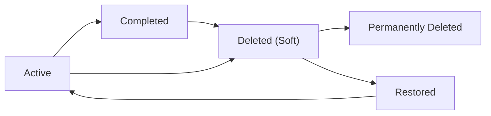
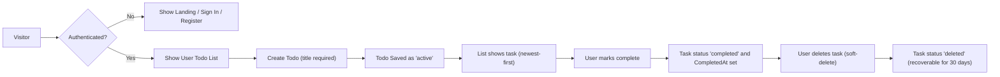

# todoApp — Requirements Analysis (Minimal Todo List MVP)

## Executive Summary

todoApp provides a minimal, single-user task list that enables quick task capture, reliable persistence for authenticated users, and a simple, auditable admin interface for maintenance. The MVP focuses on low friction for task entry and clear task lifecycle semantics: create → active → complete → deleted (soft-delete) → purge. Acceptance targets prioritize responsiveness (primary actions visible within 2 seconds) and data isolation (users only see their own todos).

## Scope and Assumptions

In-scope (MVP):
- Account authentication and per-user persistence (user role)
- Create, read (list/detail), update, mark complete/uncomplete, soft-delete with recovery window, and permanent purge workflow
- Basic optional attributes per todo: description (optional), due date (optional), priority (optional: low/medium/high)
- Admin role with account suspend/reactivate and auditable maintenance actions

Out-of-scope (MVP):
- Collaboration or sharing, tags, subtasks, attachments, recurring tasks, push notifications, or integrations beyond optional email for account recovery

Assumptions:
- The product targets individual users who value a simple task list and privacy by default
- Soft-delete retention default: 30 days (configurable by product)
- Access to email for password reset is available in the deployment environment (product to confirm)

## User Roles and Permission Matrix

Roles (business terms):
- guest — view public landing/help only; cannot create or persist todos
- user — create, view, update, mark complete/uncomplete, delete (soft-delete) own todos; manage own account
- admin — suspend/reactivate accounts; perform data maintenance; may read other users' data for support but such access SHALL be logged and auditable

Permission matrix (high-level):
- Create todo: guest ❌ | user ✅ | admin ✅ (audited)
- Read own todos: guest ❌ | user ✅ | admin ✅ (audited)
- Update own todos: guest ❌ | user ✅ | admin ✅ (audited)
- Delete/soft-delete: guest ❌ | user ✅ | admin ✅ (audited)
- Suspend/reactivate accounts: guest ❌ | user ❌ | admin ✅

## Primary User Scenarios and Acceptance Criteria

Scenario: Register and sign in (if authentication is enabled)
- WHEN a visitor registers with valid credentials, THE system SHALL create an account and allow authentication.
- Acceptance: A new user can register, sign in, create a todo, sign out, sign in again, and see the previously created todo within 2 seconds in normal conditions.

Scenario: Quick task capture
- WHEN an authenticated user enters a non-empty title and submits create, THE system SHALL persist a new todo with status "active" and CreatedAt timestamp.
- Acceptance: Created todo appears in the default list (newest-first) within 2 seconds in 95% of typical cases.

Scenario: Edit a todo
- WHEN an authenticated user updates fields for a todo they own, THE system SHALL apply changes and update UpdatedAt.
- Acceptance: Changes are visible to the same user within 2 seconds.

Scenario: Mark complete/uncomplete
- WHEN a user marks a todo complete, THE system SHALL set status "completed" and set CompletedAt; when uncomplete, THE system SHALL set status "active" and clear CompletedAt.
- Acceptance: Completed items are distinguishable and can be toggled back to active within 2 seconds.

Scenario: Delete and recover
- WHEN a user deletes a todo, THE system SHALL soft-delete the item (status "deleted") and retain it for 30 days for possible recovery; after 30 days THE system SHALL purge the item.
- Acceptance: Deleted items are removed from active lists immediately and can be restored by owner within retention window.

Admin scenario: Suspend/reactivate
- WHEN an admin suspends a user, THE system SHALL prevent that user from authenticating and SHALL retain the user's data for administrative review; admin action SHALL be recorded in audit logs.
- Acceptance: Suspended users cannot authenticate and audit entries contain admin id, action, and timestamp.

## Functional Requirements (EARS Format)

Authentication and account
- WHEN a visitor registers with valid credentials, THE system SHALL create a new account and allow the user to authenticate.
- WHEN a user submits valid credentials, THE system SHALL authenticate the user and grant a session.
- IF an unauthenticated actor attempts a todo-management action, THEN THE system SHALL deny the request and return an authorization error.

Todo lifecycle
- WHEN an authenticated user submits a create-todo request with a non-empty title, THE system SHALL create a TodoItem with status "active", set CreatedAt to current timestamp, associate the item with the user's account, and return the created item in the response.
- IF a create or update request contains an empty or whitespace-only title, THEN THE system SHALL reject the request and return a validation error stating "Title is required and must be 1-250 characters." 
- WHEN a user marks a todo complete, THE system SHALL set status to "completed" and set CompletedAt to current timestamp; WHEN a user unmarks a completed todo, THE system SHALL set status back to "active" and clear CompletedAt.
- WHEN a user updates a todo, THE system SHALL permit edits only on todos owned by that user and SHALL reject updates attempting to modify another user's todo.
- WHEN a user deletes a todo, THE system SHALL set status to "deleted", set DeletedAt timestamp, and remove the item from default active list; THE system SHALL retain deleted items for 30 days before purge.

Admin and audit
- WHEN an admin performs any action that accesses or modifies user data, THE system SHALL record an audit entry with admin identifier, target user, action type, timestamp, and (optionally) reason.
- WHEN an admin suspends a user, THE system SHALL prevent new authentications for that account and invalidate refresh tokens.

Optional (WHERE):
- WHERE export is enabled, THE system SHALL provide a user-level export of todos in CSV format containing state timestamps.

## Authentication and Session Management (Business Terms)

Authentication model: token-based sessions for API access (business guidance recommends JWTs).
- Access token lifetime (recommended business default): 20 minutes.
- Refresh token lifetime (recommended business default): 14 days.
- WHEN a refresh token is revoked (user or admin action), THE system SHALL prevent issuance of new access tokens using that refresh token and shall require re-authentication for further access.
- WHEN a user requests password reset, THE system SHALL send a time-limited reset link to the account email that expires after 24 hours.
- WHEN an account is suspended by an admin, THE system SHALL invalidate active refresh tokens within 30 seconds and deny authentication attempts.

Security & privacy (business-level):
- All user-created todos are visible only to the owning user unless an admin accesses them for support; admin accesses SHALL be auditable.

## Data Model (Conceptual, Non-technical)

TodoItem (conceptual attributes): todoId, ownerId, title (required), description (optional), createdAt, updatedAt, dueDate (optional), priority (optional: low|medium|high), completedAt (optional), status (active|completed|deleted), deletedAt (optional).

UserAccount (conceptual attributes): accountId, email, displayName, accountStatus (active|suspended), createdAt.

AuditRecord (conceptual attributes): actorId, actorRole (admin|user), actionType, targetResource, timestamp, reason (optional).

## Data Lifecycle and Retention

Lifecycle states: Active -> Completed -> Deleted (soft) -> Permanently Deleted

Mermaid lifecycle diagram:

Retention rules (business defaults):
- Deleted items retained for 30 days before eligible for permanent purge.
- Audit records retained for 365 days.
- Backups retained per operations policy; recommended RPO <= 1 hour and RTO <= 4 hours for critical incidents.

## Non-Functional Requirements (Measurable)

Performance and responsiveness:
- WHEN a user performs create/read/update/delete on individual todo, THE system SHALL reflect the result in the UI within 2 seconds for 95th percentile under typical MVP load.
- WHEN a user requests their todo list (<= 50 items), THE system SHALL return results within 1 second median and <= 2 seconds at 95th percentile under typical load.

Availability:
- Target availability for MVP: 99.9% monthly uptime excluding scheduled maintenance.

Scalability and rate limiting:
- Recommend write limit of 10 write requests per minute per user for MVP; WHEN exceeded, THE system SHALL return a rate-limit error with Retry-After guidance.

Security and compliance:
- Account lockout after 10 failed attempts in 15 minutes; admin review or password reset required to restore.
- Data subject export and deletion support: exports provided within 7 days, deletion processed within 30 days unless legal hold applies.

Monitoring and operations:
- WHEN production error rate exceeds 1% for 5 continuous minutes, THE system SHALL alert on-call and create an incident ticket.

## Error Handling, Secondary Scenarios and Conflict Resolution

Offline behavior (optional):
- WHEN a client is offline and a user performs create/update actions, THE client SHALL queue actions and present "pending sync" indicators; WHEN connectivity is restored, THE client SHALL sync queued changes within 30 seconds and present any conflicts.

Conflict handling (business-level):
- WHEN concurrent updates to the same field occur, THE system SHALL surface a conflict and provide the user options: "Keep My Version", "Keep Server Version", or "Merge Manually". For MVP, last-writer-wins is acceptable, but conflicts SHALL be detectable and surfaced.

Validation error messaging:
- IF a user submits invalid input (empty title, invalid date, invalid priority), THEN THE system SHALL return a clear field-level validation error and preserve user input for retry.

Undo and recovery:
- WHEN a user deletes a todo, THE system SHALL show an immediate "Undo" action for 30 seconds to restore the item to its previous state.

Admin recovery procedures (business-level):
- Admins may restore soft-deleted items within retention window via an auditable restore action; restoration SHALL be logged with admin id and reason.

## Acceptance Criteria and Test Checklist

- Core actions (create/read/update/delete) shall pass functional acceptance tests 95% of the time under representative loads.
- Security tests: account lockout, password reset flow, admin audit logging must be verified.
- Data isolation tests: users cannot access other users' todos; admin access is audited.
- Retention tests: delete -> restore within 30 days works; restore after 30 days is not possible.
- Performance tests: list <=50 items returns within 1s median in staging tests.

## KPIs and Success Metrics (90-day launch window)

- Activation: >= 40% of new accounts create at least one todo within 7 days.
- Retention: 7-day retention >= 25%; 30-day retention >= 10% (benchmarks to validate product-market fit).
- Reliability: create request success rate >= 99.5% under typical load.
- Performance: 95th percentile response times for primary actions <= 2 seconds.

## Mermaid Diagrams (User Session Flow)

## Open Decisions and Recommendations

- Confirm whether email verification is mandatory at registration for MVP (recommended: optional with verification recommended for trustworthiness).
- Confirm whether dueDate and priority are required in MVP or deferred to post-MVP (recommended: optional behind "Add details").
- Confirm retention durations for soft-delete and archived items; recommended defaults: 30 days (deleted), 365 days (archived).
- Clarify whether JWTs are mandated or if session cookies are acceptable; business guidance recommends JWT patterns with short-lived access tokens and refresh tokens as described above.

## Appendices

A: Glossary — definitions for terms used (Active, Completed, Deleted, Purge, RTO, RPO)

B: Change Log Template
- Document: todoApp Requirements Analysis
- Version: 1.0
- Date: YYYY-MM-DD
- Author: [Name]
- Summary: Initial MVP requirements

C: QA Checklist (quick)
- Register/login flows
- Create/edit/delete/complete flows and validations
- Soft-delete retention and restore
- Admin suspend/reactivate and audit entries
- Performance and rate-limit tests

