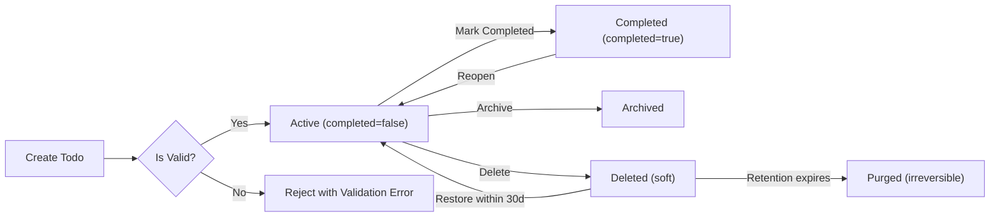
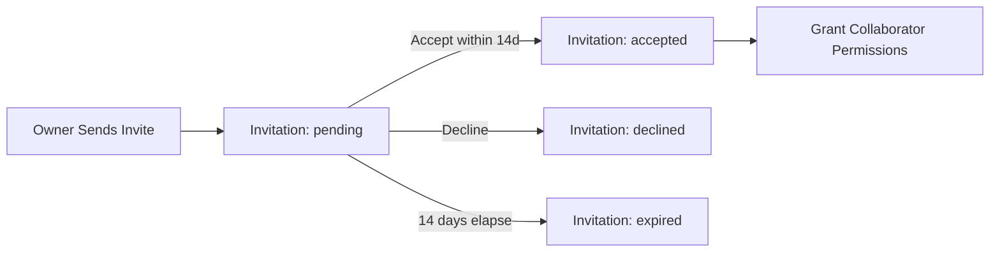

# TodoApp Requirements Analysis

## Version
- Document version: v1.0
- Last updated: 2025-10-31
- Author: Product Owner
- Review status: Approved

## Change Log
| Date | Version | Author | Change Summary |
|------|---------|--------|----------------|
| 2025-10-31 | v1.0 | Product Owner | Initial approved requirements for TodoApp MVP |

## Table of Contents
- Executive summary and scope
- Actors and authentication
- Permission matrix
- Functional requirements (EARS-formatted)
- Validation rules and error messages
- State transitions and Mermaid diagrams
- Non-functional requirements
- Security and privacy commitments
- Operational requirements
- Acceptance criteria and test scenarios
- Glossary
- Change log and owners

## Executive summary and scope

TodoApp delivers a minimal, production-ready Todo list backend that supports persistent user accounts, personal lists, todo items, marking complete/incomplete, simple sharing and collaboration, and basic administrative moderation. The initial scope focuses on core behaviors required for everyday task capture and completion. Optional integrations and advanced collaboration are explicitly out of scope for the MVP unless otherwise noted in feature flags.

In-scope (MVP):
- Account registration, authentication, and account lifecycle (suspend/reactivate/delete)
- Create/read/update/delete (CRUD) for lists and todos
- Mark todos complete/incomplete and record timestamps
- List visibility: private (default), shared-invite-only, public
- Invite and accept collaborator workflow (permission levels: read-only, read-write)
- Soft-delete with a 30-day retention window and restore capability

Out-of-scope (MVP):
- Push notifications, calendar sync, attachments, complex conflict merge UI, enterprise admin dashboards

## Actors and authentication

Actors (business definitions):
- Guest: Unauthenticated visitor. Capabilities: view public lists only. Restrictions: cannot create or modify persistent content.
- TodoUser: Authenticated end user. Capabilities: own lists and todos, invite collaborators, change visibility, archive, delete, restore within retention windows.
- Collaborator: A TodoUser invited and accepted to a list. Capabilities depend on granted role (read-only or read-write).
- Admin: Platform operator for moderation and user lifecycle actions (suspend/reactivate/delete). Admin actions must be auditable.

Account lifecycle states (business terms): pending_verification, active, suspended, deactivated, pending_deletion, deleted.

Authentication business rules (EARS):
- WHEN a guest registers, THE system SHALL create an account in "pending_verification" and SHALL send a verification instruction within 5 seconds.
- WHEN a user verifies their email, THE system SHALL transition the account to "active" and SHALL allow standard authenticated actions.
- WHEN a user requests password reset, THE system SHALL send reset instructions and SHALL invalidate refresh tokens upon successful password change.
- IF an account has 5 failed login attempts within 15 minutes, THEN THE system SHALL require additional verification before allowing further credential attempts.

Session and token expectations (business-level):
- THE system SHALL use short-lived access tokens and longer-lived refresh tokens as business concepts.
- THE business SHALL define access token lifetime of ~20 minutes and refresh token lifetime of 14 days as default expectations; a "Remember this device" option SHALL extend refresh token validity up to 30 days.
- WHEN a user logs out or changes their password, THE system SHALL revoke active refresh tokens for that account within 1 minute.
- WHEN an admin suspends an account, THE system SHALL revoke active sessions and block new token issuance immediately.

## Permission matrix

| Action | Guest | Owner (TodoUser) | Collaborator (read-only) | Collaborator (read-write) | Admin |
|---|---:|---:|---:|---:|---:|
| View public list | ✅ | ✅ | ✅ | ✅ | ✅ |
| View private list | ❌ | ✅ | ✅ (if accepted) | ✅ (if accepted) | ✅ (for moderation) |
| Create list | ❌ | ✅ | ❌ | ❌ | ✅ (moderation only) |
| Delete list | ❌ | ✅ | ❌ | ❌ | ✅ (moderation) |
| Create todo | ❌ | ✅ | ❌ | ✅ | ✅ (moderation) |
| Edit todo | ❌ | ✅ | ❌ | ✅ | ✅ (moderation) |
| Delete todo | ❌ | ✅ | ❌ | ✅ | ✅ (moderation) |
| Mark complete/incomplete | ❌ | ✅ | ❌ | ✅ | ✅ (moderation) |
| Change visibility | ❌ | ✅ | ❌ | ❌ | ✅ (policy override) |
| Invite collaborator | ❌ | ✅ | ❌ | ❌ | ✅ (audit only) |
| Transfer ownership | ❌ | ✅ (requires acceptance) | ❌ | ❌ | ✅ (legal/ops) |

Notes:
- Admin actions that touch user content must be logged with reason and are subject to audit review.
- Collaborator permissions are set per-invite and default to read-only unless the owner explicitly grants read-write.

## Functional requirements (EARS-formatted)

Ubiquitous requirements:
- THE system SHALL associate each list and todo with an owner identity.
- THE system SHALL persist creation and last-updated timestamps for lists and todos.
- THE system SHALL maintain auditable records for invitations, ownership transfers, and admin moderation actions.

List lifecycle and visibility:
- WHEN a todoUser creates a list, THE system SHALL require a non-empty name (max 250 characters) and SHALL set visibility to "private" by default.
- WHEN a todoUser sets a list visibility to "public", THE system SHALL allow guests to view the list and SHALL record the visibility change event.
- WHEN a todoUser deletes a list, THE system SHALL move the list to "soft-deleted" and SHALL retain it for 30 days during which the owner may restore it.

Todo item behaviors and validations:
- WHEN a todoUser creates a todo, THE system SHALL require a non-empty title of 1..200 characters and SHALL record creation timestamp and owner.
- IF a todo title is empty or whitespace-only, THEN THE system SHALL reject the creation with error code VALIDATION_TITLE_REQUIRED and message "title is required".
- IF a due date is provided in the past relative to the user's timezone, THEN THE system SHALL reject the operation with error code VALIDATION_DUE_DATE_PAST and message "due date must be today or in the future".
- WHEN a todoUser marks a todo as complete, THE system SHALL set completed=true and SHALL record a completion timestamp.
- WHEN a todoUser reopens a todo, THE system SHALL set completed=false and SHALL clear the completion timestamp.

Collaboration and invitations:
- WHEN an owner invites a collaborator, THE system SHALL create an invitation in state "pending" and SHALL send a notification to the invitee.
- IF the invitee accepts within 14 days, THEN THE system SHALL set invitation state to "accepted" and SHALL grant permissions per the invitation (read-only or read-write).
- IF an invitation remains pending for more than 14 days, THEN THE system SHALL expire the invitation and notify the owner.
- WHEN an owner revokes collaborator access, THE system SHALL immediately remove collaborator permissions and SHALL record the revocation event in audit logs.

Sharing and public access:
- WHEN a list is public, THE system SHALL permit read-only access to guests and authenticated users.
- IF a guest attempts to perform any write action on a public list, THEN THE system SHALL deny the request and return error code AUTHENTICATION_REQUIRED with a human-readable message.

Bulk operations and import/export:
- WHEN a todoUser requests a bulk operation (bulk complete, bulk delete, bulk priority change) on up to 200 items, THE system SHALL accept the request and SHALL return per-item results within 30 seconds; partial failures SHALL be reported with reasons.
- WHERE a user imports up to 10,000 items, THE system SHALL accept the import request and SHALL process it asynchronously, providing a job handle and completion notification; validation errors per item SHALL be reported in an import summary.

Soft-delete and restore:
- WHEN a user deletes a todo or list, THE system SHALL mark the resource as "soft-deleted" and SHALL allow restoration by the owner during the 30-day retention window.
- IF the retention window expires, THEN THE system SHALL permanently delete the resource from user-visible stores and mark it eligible for background purge per legal retention rules.

Concurrency and conflict behavior:
- WHEN concurrent updates occur for the same todo, THE system SHALL apply last-writer-wins as the default business rule and SHALL record the author and timestamp of the last successful update; the system SHALL preserve a change history for audit purposes.

Error handling and standardized responses:
- IF validation fails, THEN THE system SHALL return structured errors with field-level keys and error codes (e.g., VALIDATION_TITLE_REQUIRED, VALIDATION_TAGS_LIMIT).
- IF a user attempts an action without permission, THEN THE system SHALL return an authorization error with code AUTHORIZATION_DENIED and a human-readable reason.

## Validation rules and error messages

Field constraints and messages:
- title: string, required, 1..200 characters -> VALIDATION_TITLE_REQUIRED / "title is required"; VALIDATION_TITLE_MAX_LENGTH / "title must be 200 characters or fewer"
- description: optional, string, max 4000 characters -> VALIDATION_DESCRIPTION_MAX_LENGTH / "description must be 4000 characters or fewer"
- tags: optional array of strings, max 10 items, each 1..50 chars -> VALIDATION_TAGS_LIMIT / "no more than 10 tags"; VALIDATION_TAG_LENGTH / "tag must be 50 characters or fewer"
- dueDate: optional ISO 8601 date or date-time -> VALIDATION_DUE_DATE_PAST / "due date must be today or in the future"
- priority: optional enum ["low","medium","high","urgent"] -> VALIDATION_PRIORITY_INVALID / "invalid priority value"

Standardized error response shape (business-level):
- code: error code string
- message: human-readable message
- fieldErrors: optional object mapping field name to message

## State transitions and Mermaid diagrams

Todo lifecycle (conceptual):

```mermaid
graph LR
  A["Create Todo"] --> B{"Is Valid?"}
  B -->|"Yes"| C["Active (completed=false)"]
  B -->|"No"| D["Reject with Validation Error"]
  C -->|"Mark Completed"| E["Completed (completed=true)"]
  C -->|"Archive"| F["Archived"]
  C -->|"Delete"| G["Deleted (soft)"]
  E -->|"Reopen"| C
  G -->|"Restore within 30d"| C
  G -->|"Retention expires"| H["Purged (irreversible)"]
```

Invitation lifecycle (conceptual):

```mermaid
graph LR
  I["Owner Sends Invite"] --> J["Invitation: pending"]
  J -->|"Accept within 14d"| K["Invitation: accepted"]
  J -->|"Decline"| L["Invitation: declined"]
  J -->|"14 days elapse"| M["Invitation: expired"]
  K --> N["Grant Collaborator Permissions"]
```

## Non-functional requirements (user-perceived)

Performance:
- WHEN a todoUser performs a common CRUD action (create, update, mark complete), THE system SHALL respond within 500 ms for 95% of requests under normal load.
- WHEN a todoUser retrieves a list of up to 1,000 items, THE system SHALL return results within 1,000 ms for 95% of requests.

Availability and scalability:
- THE system SHALL target an initial availability of 99.9% and SHALL plan capacity to scale from 10,000 MAU to 100,000 MAU without functional degradation of the MVP features.

Backup and retention:
- THE system SHALL retain soft-deleted resources for 30 days before purge.
- THE system SHALL aim for a business Recovery Point Objective (RPO) of 4 hours and a Recovery Time Objective (RTO) of 24 hours for catastrophic restores (business goal).

Operational metrics and KPIs:
- 95th percentile latency for CRUD actions
- Monthly uptime percentage
- Daily new user registrations and active user counts
- Mean time to detect and mean time to acknowledge critical incidents

## Security and privacy commitments (business-level)

Privacy posture and user rights:
- THE business SHALL not sell user todo content to third parties and SHALL provide a clear privacy dashboard describing data use.
- WHEN a user requests an export of their data, THE system SHALL provide a machine-readable export within 30 calendar days.
- WHEN a user requests deletion, THE system SHALL complete deletion from primary user stores within 30 calendar days unless a legal hold applies.

Regulatory commitments:
- WHEN a qualifying data breach affecting EU residents occurs, THE organization SHALL notify the relevant supervisory authority within 72 hours of becoming aware, and SHALL notify affected users without undue delay as required by law.

Audit logging:
- THE system SHALL log authentication events, authorization denials, admin moderation actions, sharing changes, invitation events, and data export/deletion requests for at least 365 days.

Admin access controls:
- WHEN an admin accesses private user content for moderation, THE system SHALL record the admin id, timestamp, and reason and SHALL surface these records in periodic audit reviews.

## Operational requirements

Monitoring and alerting:
- WHEN error rate for core user transactions exceeds 1% for 5 continuous minutes, THE system SHALL trigger an operational alert.
- WHEN availability for core user flows falls below 99.5% for a 30-minute window, THE system SHALL create a severity-1 incident and notify stakeholders.

Maintenance and communication:
- Planned maintenance that may impact users SHALL be announced at least 48 hours in advance and SHALL be limited to a single maintenance window per month where possible.

Incident response expectations:
- WHEN a severity-1 incident occurs, THE on-call engineer SHALL acknowledge within 2 minutes and SHALL post an initial public status update within 15 minutes of detection.
- AFTER resolution of severity-1 incidents, THE organization SHALL publish a post-incident report within 72 hours.

## Acceptance criteria and example test scenarios

Scenario 1 — Create and complete todo (happy path):
- GIVEN an authenticated TodoUser
- WHEN they create a todo with title "Buy milk" and due date tomorrow
- THEN the system SHALL persist the todo with completed=false, return creation timestamp, and the item SHALL be visible in the owner's list within 500 ms for 95% of attempts.
- WHEN the user marks the todo complete
- THEN the system SHALL set completed=true and record completion timestamp.

Scenario 2 — Invite and accept collaborator:
- GIVEN an owner invites a registered user to a private list
- WHEN the invitee accepts within 14 days
- THEN the system SHALL set invitation state to accepted and SHALL grant the invited permissions per the invite (verified by a permission check).

Scenario 3 — Soft-delete and restore:
- GIVEN an owner deletes a list
- WHEN the owner restores it within 30 days
- THEN the system SHALL restore the list and contained todos to active state preserving timestamps and history.

Scenario 4 — Input validation failure:
- GIVEN an authenticated user attempts to create a todo with empty title
- WHEN the request is submitted
- THEN the system SHALL return VALIDATION_TITLE_REQUIRED and SHALL NOT create the todo.

## Glossary
- TodoUser: Authenticated owner of lists and todos.
- Guest: Unauthenticated visitor who may view public lists.
- Collaborator: Invited user with assigned permission level on a list.
- Admin: Platform operator for moderation and lifecycle actions.
- Soft-delete: Temporarily hidden state allowing restore within retention window.

## Owners and contact
- Product Owner: product@example.com
- Engineering Lead: englead@example.com
- Security Lead: security@example.com

