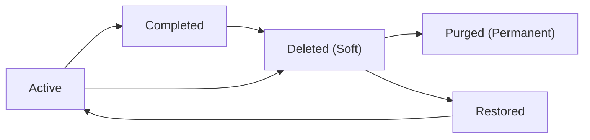
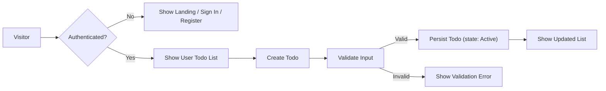

# todoApp — Requirements Analysis Report (Minimal MVP)

## Executive Summary

todoApp delivers a minimal, reliable personal todo list for individuals who want fast task capture and simple lifecycle management. The MVP prioritizes: (1) frictionless task entry, (2) reliable per-user persistence, (3) clear task states (active/completed/deleted) with soft-delete recovery, and (4) basic administrative controls for support and data maintenance. The product is privacy-first: todos are private to their owner by default.

Primary success criteria for MVP:
- Create/List/Update/Delete actions are reflected to the user within 2 seconds (95th percentile) under normal load.
- Soft-delete retention window: 30 days; ability to recover during that period.
- Authentication with session management and auditable admin actions.

## Scope and Assumptions

In-scope for MVP:
- Authenticated user accounts (user role) that persist todos across sessions
- Core todo management: create, read (list/detail), update, mark complete/uncomplete, delete (soft-delete) and recover
- Basic optional attributes: description (optional), due date (optional), priority (optional: low/medium/high)
- Admin abilities: suspend/reactivate accounts, perform permanent purge, view audited admin actions

Out-of-scope for MVP:
- Collaboration/sharing, tags, subtasks, attachments, recurring tasks, push notifications, and third-party integrations (except optional email for password reset)

Assumptions:
- Users will primarily operate on single-user lists; sharing is deferred.
- Email delivery for password reset is available via an external provider.

## Audience and Goals

Primary audience: product owner (non-technical), backend developers (business rules), QA engineers, and operations. Goals: provide clear, testable requirements and acceptance criteria so developers can implement business logic and QA can validate behaviors.

## User Roles and Permission Matrix

Roles (business terms):
- guest: view public landing and help content only. Cannot create or persist todos.
- user: authenticated account holder; can create, view, update, complete/uncomplete, soft-delete and recover their own todos.
- admin: operational role; can suspend/reactivate user accounts, permanently purge data, and perform maintenance. Admin actions must be auditable.

Permission matrix (business view):
- Create todo: guest ❌, user ✅, admin ✅ (audited)
- Read own todos: guest ❌, user ✅, admin ✅ (audited for support)
- Update own todos: guest ❌, user ✅, admin ✅ (audited)
- Delete todo (soft): guest ❌, user ✅, admin ✅ (audited)
- Permanent purge: guest ❌, user ❌, admin ✅ (audited)
- Manage users: admin ✅

EARS requirement (role separation):
- WHEN a user is authenticated, THE system SHALL allow only that user to access their todos and SHALL deny access to other users' todos.

## Personas

- Quick-Capture Quinn: needs one-tap entry and immediate feedback. Primary metric: time-to-first-task <= 2 minutes.
- Sync Sam: wants persistence across devices; expects create and later retrieval after sign-in.
- Support Sam (admin): needs auditable actions and ability to suspend/reactivate accounts.

## Primary User Scenarios (Happy Paths)

Scenario: Register and Sign In
- WHEN a visitor registers with valid credentials, THE system SHALL create a new user account and allow authentication.
- Acceptance: user can sign in and create a todo that persists across sign-outs.

Scenario: Create a Todo (Quick Capture)
- WHEN an authenticated user submits a new todo with a non-empty title, THE system SHALL create the todo with state "active" and record createdAt timestamp.
- Acceptance: new todo appears in the user's list within 2 seconds in typical conditions.

Scenario: Edit a Todo
- WHEN an authenticated user updates a todo they own, THE system SHALL apply changes and set updatedAt to the time of change.
- Acceptance: edits are visible to the user and subsequent reads within 2 seconds.

Scenario: Mark Complete / Uncomplete
- WHEN a user marks a todo complete, THE system SHALL set state to "completed" and set completedAt.
- WHEN a user marks a completed todo as incomplete, THE system SHALL set state back to "active" and clear completedAt.

Scenario: Delete and Recover
- WHEN a user deletes a todo, THE system SHALL set state to "deleted" (soft-delete) and set deletedAt; THE item SHALL be recoverable for 30 days.
- Acceptance: deleted items disappear from active lists immediately and can be restored within retention window.

Scenario: Admin Suspend
- WHEN an admin suspends a user account, THE system SHALL prevent the user from authenticating and SHALL log the suspension action.

## Secondary Scenarios and Exceptions

Offline and Sync
- WHEN a user performs actions while offline, THE client SHALL queue actions locally and THE system SHALL synchronize queued actions when connectivity is restored. The user SHALL see "pending sync" indicators for queued items.

EARS: WHEN connectivity is lost, THE system SHALL allow queued local changes that will be synchronized upon reconnection and report conflicts if they occur.

Concurrency and Conflicts
- IF concurrent edits modify the same field, THEN THE system SHALL surface a conflict and provide options: keep local, keep remote, or merge manually. For MVP, last-writer-wins is acceptable for non-conflicting fields; same-field conflicts SHALL require user resolution.

Rate Limiting and Abuse Protection
- WHEN a user exceeds 10 write requests per minute, THE system SHALL rate-limit further write attempts and return a retry-after guidance.

Partial Failures and Retry
- IF persistence fails due to transient storage errors, THEN THE system SHALL inform the user, preserve client-side input where possible, and allow retry.

## Functional Requirements (EARS-format)

Authentication & Account
- WHEN a visitor registers with a valid email and password, THE system SHALL create a user account and record createdAt.
- WHEN a user requests a password reset, THE system SHALL send a time-limited reset mechanism to the user's email.
- WHEN credentials are invalid during sign-in, THEN THE system SHALL deny access and return a generic authentication error message.

Todo CRUD and Ownership
- WHEN an authenticated user submits a create-todo with a non-empty title (<=250 chars), THE system SHALL create a todo in state "active" and return the created item.
- IF a create/update request violates validation (empty title, title >250 chars, invalid due date format), THEN THE system SHALL return a field-level validation error explaining the rule.
- WHEN a user requests their todo list, THE system SHALL return todos owned by that user, ordered newest-first by default, and support an optional filter by state (active/completed/deleted).
- WHEN a user marks a todo complete, THE system SHALL set completedAt and state "completed".
- WHEN a user requests delete, THE system SHALL set state to "deleted" and set deletedAt; THE system SHALL retain deleted items for 30 days before permanent purge.

Admin & Audit
- WHEN an admin performs any action that affects user data or account state, THE system SHALL record an auditable event containing admin identifier, action type, target user, timestamp, and optional reason.

Export (Optional)
- WHERE export is enabled, THE system SHALL provide a user-initiated export of their todos including lifecycle timestamps in CSV format.

Validation Summary
- Title: required, non-empty after trimming, maxLength 250 characters.
- Description: optional, maxLength 4000 characters.
- Due date: optional, ISO 8601 date or date-time; if supplied, accept and validate format.
- Priority: optional, allowed values {"low","medium","high"}.

## Authentication and Session Management (Business-Level)

Session model (business guidance):
- Use JWT for access tokens (business guidance only). Defaults: access token expiry 20 minutes; refresh token expiry 14 days.
- WHEN an access token expires and a valid refresh token is presented, THE system SHALL issue a new access token without user credential entry.
- WHEN a user requests "revoke all sessions", THE system SHALL invalidate all refresh tokens for that user and require re-authentication across devices within 30 seconds.
- WHEN an admin suspends a user, THE system SHALL invalidate active refresh tokens to prevent continued access.

Security and audit
- ALL admin elevated actions SHALL be auditable with actor id, timestamp, and action description.
- Password policy (business default): minimum 8 characters with at least one letter and one number.

## Data Flow and Lifecycle

States: Active -> Completed -> Deleted -> Purged

Mermaid (lifecycle):

Retention policy (business defaults):
- Deleted items retained for 30 days then eligible for purge.
- Audit logs retained for 365 days.
- Backups retained per operations policy; business-level RPO <=1 hour, RTO <=4 hours for critical restores.

EARS: WHEN a deleted item reaches 30 days since deletedAt, THE system SHALL mark the item eligible for permanent purge and schedule it for removal according to operations windows.

## Non-Functional Requirements (Business-Level)

Performance
- WHEN a typical user performs CRUD operations, THE system SHALL respond and reflect changes in the UI within 2 seconds for 95% of requests under normal load.
- WHEN listing up to 50 items, THE system SHALL return results with median latency <=300 ms and 95th percentile <=2 seconds under normal load.

Availability and Monitoring
- Target availability: 99.9% monthly for core user flows (subject to ops agreements).
- THE system SHALL emit metrics for request rates, error rates, latency, backup success, and auth failures for operations monitoring.

Backup and Recovery
- Business RPO: <=1 hour. Business RTO: <=4 hours for critical restores.
- THE system SHALL perform quarterly restore tests to validate backup integrity.

Security & Privacy
- User data is private by default and only accessible to the owner and authorized admins (audited). Data export and deletion flows SHALL honor user requests consistent with privacy obligations.

## Error Handling and User-facing Messages

Standard user messages (examples):
- Validation error: "Please enter a title (1–250 characters)."
- Auth required: "Please sign in to manage your todos."
- Session expired: "Your session expired. Sign in again to continue; your changes are preserved for retry." 
- Offline save: "You're offline. Your changes are saved locally and will sync when your connection returns." 
- Rate limit: "You're making requests too quickly. Please wait and try again."
- Permanent delete: "This item has been permanently deleted and cannot be recovered. Contact support if you need assistance."

EARS: IF a create/update fails due to transient storage error, THEN THE system SHALL inform the user and allow retry while preserving client-side input.

## Acceptance Criteria and Test Cases

Acceptance example: Create todo
- GIVEN an authenticated user, WHEN they submit a todo with title "Buy milk", THEN the system SHALL return success and the todo SHALL appear in the user's list within 2 seconds.

Acceptance example: Delete and recover
- GIVEN an authenticated user with a todo, WHEN they delete it, THEN the item SHALL be in "deleted" state and recoverable for 30 days; AFTER 30 days the item SHALL be eligible for purge.

QA checklist
- Registration/login success and failure flows
- Create validation: empty title, overlength title
- Edit and ownership: cannot edit others' todos
- Complete/uncomplete toggles and timestamps
- Soft-delete, undo, and 30-day recovery
- Admin suspend and audit record creation
- Rate limit enforcement and messages

## Mermaid Diagrams (user flow)

## Open Decisions

- Confirm if email verification is mandatory at registration for MVP (recommended: optional to reduce friction).
- Confirm whether due date and priority are included in MVP or deferred.
- Confirm exact retention windows and RPO/RTO targets with operations.
- Confirm whether offline-first (full client queuing) is required for MVP or can be deferred.

## Appendix

Glossary: todo item, active, completed, deleted, purged, audit log, RPO, RTO.

KPIs (example):
- Activation: % of new users creating at least one todo within 7 days (target >=40%).
- Retention: Day-7 and Day-30 retention metrics for users who created a todo.
- Reliability: Create/List/Update/Delete success rate >=99.5%.

