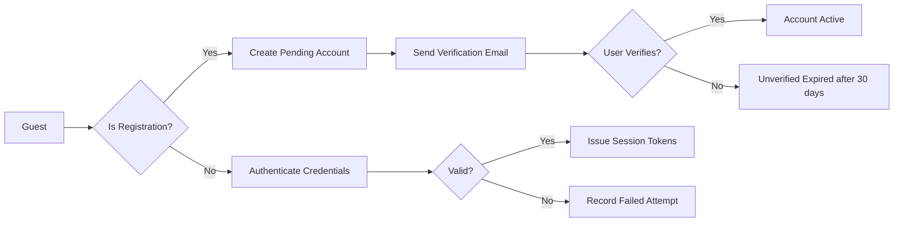
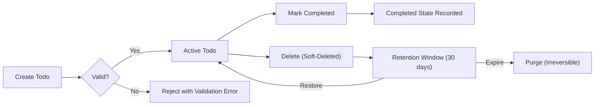

# Functional Requirements and Requirements Analysis — todoApp

Version: v1.0
Last updated: 2025-10-31
Author: Product Manager
Review status: Draft

## Executive Summary and Vision

todoApp provides a minimal, fast, and privacy-first Todo list service that enables individuals to capture, organize, and complete tasks reliably. The initial release will focus on the smallest set of features required for useful task management: persistent user accounts, multiple lists per user, basic sharing (invite and public), core todo item lifecycle (create/read/update/delete, complete/uncomplete), and safe deletion/restore. Advanced features (attachments, complex recurrence, deep integrations) are intentionally out of scope for the initial release.

Primary launch objective: deliver a reliable backend supporting core behaviors with measurable acceptance criteria to validate product-market fit.

## Scope and Assumptions

In-scope for MVP:
- Account registration and authentication
- Create, update, delete todo lists and todo items
- Mark todo as complete/incomplete
- Optional metadata per todo: due date, priority (low/medium/high), tags
- List visibility: private (default), shared-invite-only, public
- Invite collaborators with roles: read-only, read-write
- Soft-delete and restore with 30-day retention
- Basic admin moderation: suspend/reactivate accounts, remove abusive public lists

Out-of-scope for MVP:
- Push notifications, calendar two-way sync, attachments, advanced analytics, enterprise team management

Assumptions:
- Implementation will support timezones but timezone handling details are out of scope; business rules assume server-normalized timestamps with user-local interpretation.
- Persistence and API design are implementation details; requirements describe business behaviors and acceptance tests only.

## Actors and Permission Model

Actors:
- Guest: Unauthenticated visitor. Can view public lists only.
- todoUser: Authenticated user who owns lists and todos.
- Collaborator: Registered user invited to a specific list with explicit permission level.
- Admin: Platform operator who may moderate content and manage accounts.

Permission matrix (business-level):

| Action | Guest | Owner | Collaborator (read-only) | Collaborator (read-write) | Admin |
|---|---:|---:|---:|---:|---:|
| View public list | ✅ | ✅ | ✅ | ✅ | ✅ |
| View private list | ❌ | ✅ | ✅ (if accepted) | ✅ (if accepted) | ✅ (moderation) |
| Create list | ❌ | ✅ | ❌ | ❌ | ✅ (moderation) |
| Delete list | ❌ | ✅ | ❌ | ❌ | ✅ (moderation) |
| Create todo | ❌ | ✅ | ❌ | ✅ | ✅ (moderation) |
| Edit todo | ❌ | ✅ | ❌ | ✅ | ✅ (moderation) |
| Mark complete | ❌ | ✅ | ❌ | ✅ | ✅ (moderation) |
| Invite collaborator | ❌ | ✅ | ❌ | ❌ | ✅ (audit) |
| Change visibility | ❌ | ✅ | ❌ | ❌ | ✅ (audit) |

Business note: Admin actions that touch user content must be auditable and justified; admins should only act under moderation or legal requirements.

## Functional Requirements (EARS-formatted)

Ubiquitous requirements:
- THE todoApp SHALL associate a single owner with every persistent list and todo item.
- THE todoApp SHALL preserve creation and last-updated timestamps for all lists and todos.
- THE todoApp SHALL record audit events for sharing changes, ownership transfers, and admin moderation actions.

Event-driven requirements:
- WHEN a todoUser creates a new list, THE todoApp SHALL require a non-empty list title of up to 250 characters and SHALL set visibility to "private" by default.
- WHEN a todoUser creates a new todo, THE todoApp SHALL require a non-empty title (1..200 characters) and SHALL persist optional due date, optional priority (low/medium/high), and creation timestamp.
- WHEN an owner invites a collaborator to a list, THE todoApp SHALL create an invitation in state "pending" and SHALL expire the invitation after 14 days if not accepted.
- WHEN an invited collaborator accepts an invitation, THE todoApp SHALL grant the collaborator the permission level specified in the invitation and SHALL record the acceptance event.
- WHEN a todo is marked completed, THE todoApp SHALL set a completed timestamp and mark the completed flag as true.

State-driven requirements:
- WHILE a list or todo is in the "soft-deleted" state, THE todoApp SHALL prevent guests and non-owner collaborators from viewing it and SHALL allow the owner to restore it within the retention window.
- WHILE an account is suspended, THE todoApp SHALL prevent create/update/delete actions by that account but SHALL retain data for reactivation or deletion processes.

Unwanted behavior requirements:
- IF a user submits a create or update request with invalid data (empty title, too-long title, invalid tag set), THEN THE todoApp SHALL reject the request and return a structured validation error identifying offending fields and reasons.
- IF an unauthenticated guest attempts to create or modify data, THEN THE todoApp SHALL deny the action and return an authentication-required error.

Optional/conditional requirements:
- WHERE an owner transfers list ownership to another registered user, THE todoApp SHALL require explicit acceptance by the new owner before the transfer becomes effective.

## Validation Rules and Business Constraints
- Titles: required, 1..200 characters, whitespace-only titles invalid.
- Description: optional, up to 4,000 characters.
- Tags: optional, up to 10 tags per todo, each tag 1..50 characters.
- Due date: optional; if provided, the business rule SHALL encourage future dates; past dates are allowed but shall mark the item "past-due" and surface a warning to the user.
- Limits: THE todoApp SHALL limit lists per user to 100 by default and items per list to 5,000 by default; these are business-configurable limits.

## Authentication and Account Lifecycle (business-level)

Registration and verification:
- WHEN a guest registers an account, THE todoApp SHALL create an account in "pending_verification" and SHALL send a verification instruction to the registered email within 5 seconds for 95% of attempts under normal load.
- WHEN the user verifies their email, THE todoApp SHALL transition the account to "active".

Password and lockout rules:
- WHEN a user sets a password, THE todoApp SHALL require a minimum length of 8 characters.
- IF an account accumulates 5 failed authentication attempts within a rolling 15-minute window, THEN THE todoApp SHALL require additional verification before allowing further credential attempts (e.g., captcha or temporary lockout) and SHALL notify the account owner per notification policy.

Session and token business rules:
- THE system SHALL use short-lived access credentials for interactive operations (business default: access token logical expiry 20 minutes) and longer-lived refresh credentials for session continuation (business default: refresh token logical expiry 14 days; optional "remember device" up to 30 days).
- WHEN a user logs out or changes credentials (password reset), THE todoApp SHALL invalidate active refresh credentials and require re-authentication for devices within 1 minute of the event.
- WHEN an admin suspends an account, THE todoApp SHALL immediately revoke active sessions and prevent issuance of new credentials until reactivation.

Account states and transitions (EARS):
- WHEN a registration occurs, THE todoApp SHALL create a "pending_verification" account.
- IF a pending account is not verified within 30 days, THEN THE todoApp SHALL mark it as "unverified-expired" and prevent authentication until re-verification.
- WHEN a user requests deletion, THE todoApp SHALL mark the account for deletion, retain data for 30 days for recovery, and permanently delete data after the retention window unless a legal hold is in place.

## Data Lifecycle and Retention (business rules)
- WHEN a list or todo is deleted by the owner, THE system SHALL soft-delete the resource and preserve it for 30 calendar days, during which restoration by the owner is permitted.
- IF the retention window elapses without restoration, THEN THE system SHALL purge the resource from active stores; backups and legal holds may preserve data beyond that for compliance purposes.
- WHEN a legal hold is applied, THEN THE system SHALL suspend purging for the specified resources and SHALL record hold metadata and justification in audit logs.

Backup and restore expectations (business-level):
- THE organization SHALL be able to restore user-visible data from backups with an RPO goal of 4 hours and an RTO goal of 24 hours for major recovery scenarios (business target; operational runbooks define technical steps).
- WHEN a user requests restore of a soft-deleted resource within the retention window, THE system SHALL complete the restore within 24 hours for normal requests.

## Non-functional Requirements (user-perceived)
- THE todoApp SHALL respond to common interactive CRUD actions (create/read/update/delete a todo) within 500ms for 95% of requests under normal load.
- THE todoApp SHALL return list views (metadata + first page of items) within 800ms for 95% of requests.
- THE todoApp SHALL aim for availability of 99.9% as a business target for launch; exact SLA subject to operations decisions.
- THE todoApp SHALL scale to support growth from 1,000 initial DAU to 100,000 MAU without degrading core user-perceived latency targets (business expectation; capacity planning required).

## Security, Privacy and Compliance (business obligations)
- THE service SHALL not sell user task content to third parties and SHALL document this in the privacy policy.
- WHEN a data breach affecting personal data is discovered, THEN THE organization SHALL notify affected users and regulators per applicable laws (e.g., GDPR: supervisors within 72 hours when required).
- WHEN a user requests data export, THE system SHALL provide a machine-readable export within 30 calendar days.
- WHEN a user requests deletion, THE system SHALL honor deletion within 30 calendar days absent legal holds.
- THE system SHALL retain security-relevant logs for at least 365 days for investigation and compliance.

## Collaboration, Sharing and Invitation Flows
- WHEN an owner invites a collaborator, THE system SHALL record an invitation in state "pending" and SHALL expire it after 14 days if not accepted.
- WHEN a collaborator accepts, THE system SHALL grant permissions specified in the invitation and SHALL record the acceptance in audit logs.
- WHEN a list is set to public, THE system SHALL allow guest read-only access while preserving owner rights; owners may opt-out of search indexing for public lists.
- WHERE collaborator permissions are revoked, THE system SHALL immediately prevent further modification by the revoked actor and log the revocation.

## Error Handling and Recovery Scenarios
- IF input validation fails, THEN THE todoApp SHALL return structured errors with field-level messages and remediation guidance.
- IF a transient error prevents a create operation from completing, THEN THE todoApp SHALL support idempotent retry semantics or provide a client-visible idempotency token mechanism (implementation detail) to avoid duplicate items.
- IF conflicting concurrent edits occur, THEN THE todoApp SHALL apply deterministic resolution (default: last-writer-wins) and SHALL preserve an audit trail; optional conflict-merge UI is out of scope for MVP.

## Acceptance Criteria and Example Scenarios

Scenario 1 — Quick capture and completion:
- GIVEN an authenticated todoUser
- WHEN they create a new todo in an existing list with title "Buy milk"
- THEN the todoApp SHALL persist the todo with completed=false and creation timestamp and the todo SHALL be visible in the list within 500ms for 95% of attempts.

Scenario 2 — Public list viewing:
- GIVEN a list owner sets a list to public
- WHEN an unauthenticated guest requests the list
- THEN the todoApp SHALL return a read-only view of the list; mutation attempts by the guest SHALL be denied with an authentication-required error.

Scenario 3 — Soft-delete and restore:
- GIVEN an owner deletes a list
- WHEN the owner restores the list within 30 days
- THEN the todoApp SHALL reinstate the list and todos with preserved timestamps and completion statuses.

## Mermaid Diagrams (business flows)

Authentication and account lifecycle:

```mermaid
graph LR
  A["Guest"] --> B{"Is Registration?"}
  B -->|"Yes"| C["Create Pending Account"]
  C --> D["Send Verification Email"]
  D --> E{"User Verifies?"}
  E -->|"Yes"| F["Account Active"]
  E -->|"No"| G["Unverified Expired after 30 days"]
  B -->|"No"| H["Authenticate Credentials"]
  H --> I{"Valid?"}
  I -->|"Yes"| J["Issue Session Tokens"]
  I -->|"No"| K["Record Failed Attempt"]
```

Todo lifecycle and soft-delete:

```mermaid
graph LR
  A["Create Todo"] --> B{"Valid?"}
  B -->|"Yes"| C["Active Todo"]
  B -->|"No"| D["Reject with Validation Error"]
  C --> E["Mark Completed"]
  E --> F["Completed State Recorded"]
  C --> G["Delete (Soft-Deleted)"]
  G --> H["Retention Window (30 days)"]
  H -->|"Restore"| C
  H -->|"Expire"| I["Purge (Irreversible)"]
```

## Governance, Versioning and Change Log
- THE Document Governance Board SHALL review material changes to requirements affecting acceptance criteria, actor permissions, or non-functional targets and SHALL approve within 5 business days prior to publication.
- WHEN a document is updated and published, THE system SHALL notify stakeholders (product owner, engineering leads, security lead, operations lead) within 24 hours.

Change log template:
| Date | Version | Author | Change Summary |
|------|---------|--------|----------------|
| 2025-10-31 | v1.0 | Product Manager | Initial requirements and acceptance criteria for MVP |

## Appendix

Glossary:
- todoUser: Authenticated user owning lists and todos.
- Guest: Unauthenticated visitor.
- Collaborator: Invited user with list-scoped permissions.
- Owner: Creator of a list or todo with primary control.

KPIs (business-level):
- 95% of CRUD operations complete <500ms
- Availability target: 99.9% monthly
- Soft-delete retention: 30 days

Audit and support notes:
- Admin moderation actions SHALL be logged with actor, timestamp, reason, and action taken.
- Support SHALL have access to change logs and audit trails to assist with user restoration and disputes.

# Change Log
| Date | Version | Author | Notes |
|------|---------|--------|-------|
| 2025-10-31 | v1.0 | Product Manager | Initial publication of requirements analysis for the todoApp MVP |

