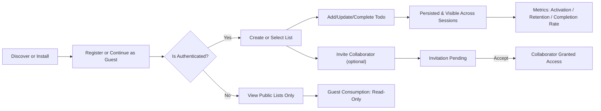

# Problem Definition and Business Model — todoApp

## Version
- Document version: v1.1
- Last updated: 2025-10-31
- Author: Product Management
- Review status: Approved (business-level)

## Executive Summary

Provide a minimal, privacy-first todo service that makes capturing, organizing, and completing small tasks effortless. The core product must minimize entry friction, preserve user trust with default privacy settings, and enable lightweight sharing for casual collaboration. The initial release focuses on a lean feature set to validate product-market fit and gather quantitative signals for monetization decisions.

Primary business objectives:
- Deliver an MVP supporting persistent personal todo lists, simple sharing, and reliable task completion tracking within 8 weeks of a committed sprint schedule.
- Validate product-market fit by achieving measurable adoption and retention KPIs described below.
- Preserve user trust through privacy-by-default settings and transparent retention policies.

Scope for MVP (business boundaries):
- IN SCOPE: user registration and basic authentication flows, persistent lists and todos, due date and priority metadata, mark complete/incomplete, list visibility control (private/public), invite-based collaboration, soft-delete and restore, basic admin moderation.
- OUT OF SCOPE (initial): push notifications, calendar two-way sync, advanced conflict resolution, attachments, and multi-tenant enterprise administration.

## Problem Statement

Many users need a fast, uncluttered way to capture and track small tasks. Existing products either:
- Provide too many features which increase cognitive load and reduce task capture speed, or
- Are too primitive and lack cross-device persistence and simple sharing.

Business impact of the problem:
- Friction in task capture reduces daily active usage and lowers retention.
- Unclear sharing and privacy defaults lead to accidental exposure and user churn.
- Lack of trust in data handling reduces adoption by privacy-conscious users.

EARS-driven problem framing:
- WHEN an individual needs to capture a task quickly, THE system SHALL enable the user to create a persistent todo in under 5 seconds of interaction time from the first interaction intent.
- IF a user is unable to find a lightweight and privacy-respecting todo solution, THEN the user may abandon the product within 7 days, reducing retention metrics.

## Market and Competitive Landscape

Competitive segments:
- Minimal local lists and notes (fast entry, limited sync)
- Feature-rich task managers (deep features, higher complexity)
- Productivity suites and notebooks (flexible but heavy weight)

Differentiation strategy:
- Simplicity-first UX combined with privacy-by-default settings (lists private unless explicitly made public).
- Predictable, testable behaviors and fast performance for primary flows.
- Lean collaboration model: invite-based, role-lite collaborator permissions to satisfy casual sharing use cases.

Competitive risks and mitigations:
- Risk: Large incumbents copy simplified features. Mitigation: focus on brand, early community, and tight privacy messaging.
- Risk: Network effects favor larger ecosystems. Mitigation: emphasize unique privacy and speed benefits and iterate on user hooks (sharing templates, public snippet embedding).

## Target Users and Personas

Primary persona — Solo Organizer
- Description: Individual who needs a lightweight tool to capture daily tasks and small projects.
- Key jobs-to-be-done: capture tasks quickly, mark completion, review today’s tasks.
- Success indicators: frequent quick captures, repeated daily use.

Secondary persona — Casual Collaborator
- Description: Small households or ad-hoc teams (2–5 users) who occasionally share lists.
- Key jobs-to-be-done: create and share a list with collaborators, coordinate small tasks.
- Success indicators: adoption of invite features, low friction collaboration.

Tertiary persona — Privacy-Conscious User
- Description: Users who prioritize data handling and prefer default private settings.
- Key jobs-to-be-done: ensure personal tasks are not exposed inadvertently.
- Success indicators: adoption by privacy communities, low churn after privacy audits.

## Jobs-to-be-done and Key Use Cases

Primary JTBDs:
- Capture a todo from anywhere quickly and reliably.
- Mark tasks complete and track completion history.
- Share a list for casual collaboration with clear ownership and permissions.

Key use cases mapped to business outcomes:
- Quick capture reduces the time-to-first-todo metric to under 30 seconds and increases activation rate.
- Sharing increases retention for collaborative use cases by at least 10% relative to solo users.

## Core Value Proposition and Minimal Feature Set

Value propositions:
- Fast capture: "capture-first" interactions that minimize friction.
- Privacy-first defaults: lists are private by default and public sharing requires explicit confirmation.
- Predictable collaboration: simple invite-and-accept model with two collaborator permission tiers: read-only and read-write.

Minimal feature set (business terms):
- Account creation and basic authentication
- Multiple lists per user; set list visibility
- Create, edit, delete todos; mark complete/incomplete
- Optional due date and priority metadata
- Invite collaborators (accept/decline/expire lifecycle)
- Soft-delete (30-day retention) and restore
- Admin moderation (suspend/reactivate accounts, remove abusive content)

## Business Model and Monetization Options

Primary recommended model — Freemium subscription:
- Free tier: core features, default sensible limits (e.g., 500 active todos per account, 100 lists per account).
- Paid tier: increased limits, longer retention history for completed items, export/backups, priority support, and advanced sharing features.

Optional monetization channels (label as OPTIONAL):
- Enterprise/team offering with administrative controls and billing.
- Paid integrations (calendar sync, single-sign-on) as premium add-ons.

EARS statements relevant to monetization planning:
- WHEN a free user reaches the free-tier limit, THE system SHALL provide an upsell path and explanatory guidance on cost/benefits.
- WHERE premium features are enabled, THE business SHALL ensure they materially increase retention or ARPU before large investment.

Pricing considerations and revenue sensitivity:
- Target ARPU range: $3–$6/month for paid individuals; conversion target 2–3% in year 1 contingent on product-market fit.
- Example revenue sensitivity: 50,000 users with 3% conversion at $3.99/mo yields ~ $5,985/mo — pricing or conversion must scale for profitability.

## Measurable KPIs and Success Metrics

Initial launch KPIs (0–6 months):
- New registrations: 10,000
- Activation (time-to-first-todo): median ≤ 30 seconds
- Day-7 retention: ≥ 15%
- DAU/MAU ratio: ≥ 10%
- Feature adoption: % of users creating at least one list within 7 days ≥ 60%

Medium-term KPIs (6–12 months):
- Registered users: 50,000
- Day-30 retention: ≥ 25%
- Conversion to paid tier (if enabled): 2–3%
- Performance: 95% of core CRUD operations < 500ms

Operational KPIs:
- Monthly uptime: ≥ 99.9%
- Incidents affecting core flows: ≤ 1 per quarter
- Average time to resolve user-facing incidents: < 24 hours business time

## EARS-formatted Business Requirements

Ubiquitous requirements:
- THE todoApp SHALL persist user-created todo lists and todo items across sessions and devices.
- THE todoApp SHALL treat new lists as private by default.

Event-driven requirements:
- WHEN an unauthenticated guest attempts to create or modify a persistent resource, THE todoApp SHALL deny the action and provide a clear error indicating authentication is required.
- WHEN an authenticated user creates a todo, THE todoApp SHALL store the item with title, optional due date, optional priority, and creation timestamp.
- WHEN an owner invites a collaborator, THE todoApp SHALL create an invitation in state "pending" and the invitation SHALL expire after 14 calendar days if not accepted.

State-driven requirements:
- WHILE an account is suspended, THE todoApp SHALL prevent creation, modification, and deletion of lists and todos by that account until reactivation.
- WHILE a list is public, THE todoApp SHALL allow read access to guests and SHALL prevent write operations by guests.

Unwanted behavior (IF/THEN):
- IF a user submits a todo without a title, THEN THE todoApp SHALL reject the submission and return an explicit validation error: "title is required".
- IF a user sets a due date before the server's current date, THEN THE todoApp SHALL reject the value and respond with "due date must be today or later".

Monetization & quota rules:
- THE free tier SHALL cap active todos per account to 500 by default.
- WHEN a free user reaches the limit, THE todoApp SHALL provide an explanatory upsell prompt describing benefits of the paid tier.

Retention & deletion rules:
- WHEN a user deletes a todo or list, THE todoApp SHALL soft-delete the resource and retain it for 30 calendar days for possible restoration.
- IF a user requests permanent deletion, THEN THE todoApp SHALL schedule permanent purge within 7 calendar days unless a legal hold applies.

## Operational Considerations and Cost Structure (Business-level)

Assumptions for early budgeting:
- Initial engineering payroll: $15k–$25k/month
- Infrastructure and hosting (initial): $1k–$5k/month
- Support and moderation staffing: $3k–$8k/month
- Marketing and user acquisition: $2k–$10k/month
- Misc (legal, payments): $1k/month

Scaling expectations and headroom:
- Plan for 10k MAU in first 6 months and capacity to scale to 100k MAU within 12 months while maintaining user-perceived responsiveness.
- Graceful degradation policies should prioritize read access to previously saved data when write operations are limited by load.

## Risk Analysis and Mitigation Strategies

Top risks and mitigations:
- Low paid conversion: run pricing experiments, add clear premium value (e.g., extended retention, export) and targeted cohorts.
- Data exposure via public lists: default private setting, explicit confirmation for public visibility, and audit logs for visibility changes.
- Abuse and moderation burden: implement report queue, admin review SLAs, and automated heuristics for obvious abuse patterns.

EARS mitigations examples:
- WHEN content is reported for abuse, THEN THE system SHALL place the item in a moderation queue and notify admin; moderation decisions SHALL be made within 14 calendar days.
- IF an account is found to be abusive, THEN THE admin SHALL be able to suspend the account and prevent further modifications pending review.

## Go-to-Market Roadmap and Early Priorities

Phase 0 — Pre-launch (0–2 months):
- Finalize MVP scope, privacy policy, and measurement plan.  
- Prepare marketing assets and documentation for launch.

Phase 1 — Launch (2–6 months):
- Launch to early adopters, measure activation (time-to-first-todo), Day-7 retention, and feature adoption.
- Iterate onboarding to reduce time-to-first-todo to target.

Phase 2 — Growth (6–12 months):
- Introduce paid tier if conversion signals justify it; expand integrations and organic growth channels.
- Harden moderation and support processes as user base grows.

## Acceptance Criteria and Example Scenarios

Scenario 1 — Quick capture and completion:
- GIVEN an authenticated todoUser
- WHEN they create a list and add a todo with title "Buy groceries" and due date tomorrow
- THEN the todoApp SHALL persist the list and item, and the item SHALL appear in list view with status "incomplete" and creation timestamp recorded.
- PERFORMANCE: Each action SHALL complete within 500ms for 95% of attempts under normal load.

Scenario 2 — Public list view by guest:
- GIVEN a list owner sets visibility to public
- WHEN a guest requests the list
- THEN the todoApp SHALL allow read-only access and SHALL not display owner-only controls.

Scenario 3 — Invitation lifecycle and expiry:
- GIVEN an owner invites a collaborator
- WHEN the invitation is not accepted within 14 calendar days
- THEN the invitation SHALL expire and the owner SHALL be notified  of expiration.

Scenario 4 — Invalid input handling:
- WHEN a user attempts to create a todo with an empty title
- THEN THE todoApp SHALL reject the request with an error "title is required" and no todo SHALL be created.

## Conceptual Value Flow (Mermaid)

## Glossary
- todoApp: the service name referenced throughout the business model and requirements.
- todoUser: authenticated end user who owns lists and todos.
- guest: unauthenticated visitor who can view public lists only.
- owner: account that created a resource and holds authority to change visibility or delete.
- collaborator: user invited to a shared list with role-scoped permissions.

## Change Log and Ownership
| Date | Version | Author | Summary |
|------|---------|--------|---------|
| 2025-10-31 | v1.0 | Product Manager | Initial publication of problem and value analysis |
| 2025-10-31 | v1.1 | Product Manager | Enhancement: added EARS requirements, detailed KPIs, acceptance criteria, and operational guidance |

## References
- See related documents for detailed functional, authentication, security, and operational requirements: User Actors, Functional Requirements, Data Flow and Lifecycle, Non-functional Requirements, Security and Compliance.

