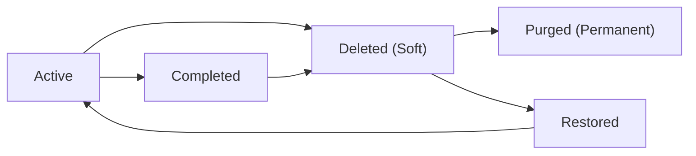
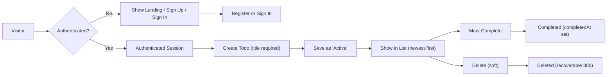

# todoApp — Requirements Analysis

## Purpose and scope
Provide concise, implementation-ready business requirements for the minimal todoApp MVP. Audience: backend developers, QA engineers, and product owners. The scope includes authenticated user task management (create, read, update, complete/uncomplete, soft-delete/restore), basic admin maintenance (suspend/reactivate accounts, audit), and measurable non-functional targets required to validate the MVP. Out of scope: collaboration, advanced recurrence, attachments, and complex project/task hierarchies.

## In-scope (MVP)
- Authenticated user accounts with per-user todo persistence
- Todo CRUD: create (title required), read (list/detail), update (title, description, dueDate, priority), complete/uncomplete
- Soft-delete with recoverability (30-day retention) and admin-initiated permanent purge
- Admin functions: suspend/reactivate account, audit admin actions
- Basic export (optional: CSV) as an optional feature

## Out-of-scope
- Sharing/collaboration, subtasks, tags, attachments, push/email reminders (deferred)

## Roles and personas
Roles (business definitions):
- guest: reads public landing and help content only; cannot create or persist todos.
- user: authenticated owner of their todos; can create/read/update/delete their todos and recover soft-deleted items within retention.
- admin: operational role that may suspend/reactivate users, perform maintenance, and view audit logs; admin actions are auditable and time-stamped.

Personas:
- "Quick-Capture" individual: needs one-tap capture and immediate persistence.
- "Sync" user: wants cross-device persistence via simple account.
- Support admin: needs audit trails and restore capability for support requests.

### Permission matrix (business-level)
- Create todo: user ✅, guest ❌, admin ✅ (audited)
- Read own todos: user ✅, guest ❌, admin ✅ (audited support access)
- Update own todos: user ✅, guest ❌, admin ✅ (audited)
- Delete own todos: user ✅, guest ❌, admin ✅ (audited)
- Suspend/reactivate accounts: admin ✅ only
- View aggregate metrics: admin ✅ only

## Authentication and session management (business-level)
- WHEN a visitor registers with valid credentials, THE system SHALL create a new user account and allow sign-in according to verification policy.
- WHEN a user authenticates, THE system SHALL issue short-lived access tokens and longer-lived refresh tokens for API access (business guidance: access token ~20 minutes, refresh token ~14 days).
- WHEN a user logs out or requests session revocation, THE system SHALL invalidate the refresh token(s) associated with that session.
- WHEN an admin suspends a user, THE system SHALL prevent authentication and SHALL invalidate active sessions for that user.
- Password reset: WHEN a user requests a password reset, THE system SHALL send a time-limited reset mechanism to the user's verified email; reset tokens SHALL expire within 24 hours.

Notes (business): Token formats and cryptographic choices are an implementation decision, but session revocation and auditability are mandatory.

## Primary functional requirements (EARS format)
All requirements below are testable, measurable, and expressed in EARS style.

1) WHEN an authenticated user submits a create-todo request with a non-empty title, THE system SHALL create a TodoItem with state "active", set createdAt to the current timestamp, and return the created item to the user.

2) IF a create/update request contains an empty or whitespace-only title, THEN THE system SHALL reject the request and return a validation error that explains "title is required" and includes a machine-readable error code.

3) WHEN an authenticated user marks a todo complete, THE system SHALL set state to "completed", set completedAt to the current timestamp, and preserve createdAt.

4) WHEN an authenticated user marks a completed todo as uncompleted, THE system SHALL set state to "active" and clear completedAt.

5) WHEN an authenticated user updates attributes (title, description, dueDate, priority) for a todo they own, THE system SHALL apply the changes and update updatedAt; THE system SHALL reject modifications to non-owned todos with an authorization error.

6) WHEN an authenticated user deletes a todo, THE system SHALL set state to "deleted", set deletedAt to the current timestamp, and remove it from the default active list; THE system SHALL retain deleted todos for 30 days for user recovery.

7) IF a deleted todo is not restored within 30 days, THEN THE system SHALL mark the todo eligible for permanent purge and SHALL remove it during a scheduled cleanup process.

8) WHEN an admin performs any action that changes another user's data or account state, THE system SHALL create an audit record containing actorId, actorRole, actionType, targetResource, timestamp, and optional reason.

9) WHILE a user is authenticated, THE system SHALL return only todos owned by that user for list and read operations; THE system SHALL never expose another user's todos in normal operations.

10) WHEN a request fails due to a transient server error, THEN THE system SHALL return a clear retryable error message and preserve client-side input where possible to allow retry.

### Input validation (business constraints)
- Title: required, trimmed, min 1 character, max 250 characters.
- Description: optional, max 4000 characters.
- Due date: optional; accept ISO 8601 date or date-time; server validates well-formedness.
- Priority: optional enum {"low","medium","high"}.

## Secondary requirements and exceptions
- WHEN a user performs operations while offline, THE client SHALL queue changes locally and mark them as "pending sync"; WHEN connectivity resumes, THE client SHALL synchronize queued changes and surface any conflicts to the user for resolution.
- IF two conflicting edits occur to the same field, THEN THE system SHALL surface both versions and require user resolution. For MVP the system MAY implement last-write-wins for non-conflicting fields and explicit resolution for same-field conflicts.
- WHEN a user exceeds write rate limits (business default: 10 writes/min), THEN THE system SHALL throttle requests and return a rate-limit error with a recommended retry-after interval.

## Data lifecycle and retention
- States: "active" -> "completed" -> "deleted" (soft) -> "purged".
- WHEN a todo is deleted, THE system SHALL allow restore by owner for 30 days.
- WHEN the 30-day retention elapses, THE system SHALL purge the item permanently; admin restore after purge requires backup restore processes and is not guaranteed.

Mermaid lifecycle diagram:

## Non-functional requirements (business-level)
- Performance: WHEN a user performs core actions (create/read/update/delete), THE system SHALL reflect the result in the UI within 2 seconds for 95th percentile under typical MVP load. Median response targets: read <=300ms, write <=500ms.
- Availability: Target monthly uptime 99.9% for core user flows.
- Backup & Recovery: RTO <=4 hours, RPO <=1 hour (business guidance for MVP backups). Quarterly restore tests required.
- Security & Privacy: User todos visible only to owner; admin access audited. Personal data deletion requests honored within 30 days.
- Monitoring & Alerts: WHEN error rate for primary actions exceeds 1% for 5 continuous minutes, THE operations team SHALL be alerted and triage initiated.

## Error handling and user messaging
Standardized user-facing messages (examples):
- Validation error (title): "Title is required. Please add a short title and try again." 
- Offline queuing: "You're offline. Your change is saved locally and will sync automatically when your connection returns." 
- Rate limit: "Too many requests. Please wait <X> seconds and try again." 
- Authorization: "You are not authorized to perform this action." 
- Delete undo: "Todo deleted. Undo" (visible for 30 seconds)

Undo and recovery
- WHEN a user deletes an item, THE system SHALL present an "Undo" affordance for 30 seconds that, if invoked, SHALL restore the item to its previous state.

## Admin procedures and audit
- Admin actions must be logged with actorId, timestamp, actionType, and reason.
- Admins may restore soft-deleted items within the 30-day retention period; permanent purges require a documented admin request and are recorded.
- Support playbook: collect userId, todoId, approximate timestamp, and action history for recovery requests.

## Acceptance criteria and test cases
Primary acceptance criteria (measurable):
- Create/List/Update/Delete actions complete and visible to the user within 2 seconds (95th percentile) under typical MVP load.
- Validation: Attempts to create todos with empty titles are rejected with proper error messages and codes.
- Isolation: Two users never see each other's todos in list or read operations.

Simple QA test cases:
- Register -> Create todo (title only) -> Logout -> Login -> Verify todo persists.
- Create todo -> Mark complete -> Verify completedAt present -> Toggle incomplete -> Verify completedAt cleared.
- Delete todo -> Verify removal from active list -> Use Undo within 30s -> Verify restore.
- Attempt to edit another user's todo -> Expect authorization error.

## Diagrams (primary flow)

## Open decisions and assumptions
- Email verification on registration: optional; recommend requiring verification for production but may be optional for internal MVP testing.
- Priority and dueDate: optional for MVP; include as optional fields if implementation effort is small.
- Conflict resolution: recommend last-write-wins for non-overlapping fields and explicit user resolution for same-field edits.

## Glossary and versioning
- TodoItem: conceptual task record owned by a user.
- Soft-delete: status where item is removed from primary lists but recoverable for retention window.
- Purge: permanent irreversible deletion from user-visible storage.

Version: 1.0 — Initial requirements analysis for todoApp MVP.