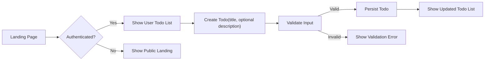

# 03 - Core Value Proposition for todoApp

## Document purpose and scope
This document defines the core value proposition and the minimal set of features required to deliver the todoApp minimum viable product (MVP). It translates business intent into concise, testable business requirements and acceptance criteria so product owners and backend developers can align on scope and priorities. This document contains business-level requirements only; all technical implementation choices (architecture, APIs, database design, etc.) are left to the development team.

## Executive one-line value proposition
A simple, personal task list service that lets an authenticated individual capture, organize, and complete small tasks quickly and reliably.

## Business justification (WHY)
- Problem addressed: People need a frictionless, reliable place to capture short tasks and reminders; existing general-purpose tools are heavy or require setup. The todoApp fills the gap for users who want a fast, no-friction single-user task list that is immediately useful.
- Market niche: Individuals (students, freelancers, professionals) seeking a minimal single-user todo experience without feature bloat.
- Differentiation: Focus on minimalism, speed, and privacy for single-user workflows—no social features, no project/team collaboration in MVP.

## Core value statement (WHAT the product delivers)
- The core value for users: a trustworthy, always-available place to capture and manage short tasks so they can reduce cognitive load and track completion.
- Minimal success metrics for validating the value: first-week retention of users who create at least one todo, number of active users creating and completing tasks daily, and low error rate on core actions (create/update/complete/delete).

## Key minimal features that realize the value
Only features essential to delivering the core value are included. Optional/advanced features are explicitly excluded from MVP.

1. Account and basic authentication (minimal): allow users to have a persisted personal list.
2. Create a todo item with a mandatory short title and optional description.
3. Read/list user's todos in one chronological or status-sorted view.
4. Update a todo's title, description, due date (optional), priority (optional), and completion status.
5. Delete (soft delete or archive) a todo.
6. Mark todo as completed and unmark as incomplete.
7. Persist user data reliably with basic backup/retention policy.
8. Basic admin capabilities to inspect usage and manage user accounts (suspend/reactivate) for operation and support purposes.

Explicit exclusions for MVP:
- No sharing or multi-user collaboration
- No complex tagging, search indexing, or bulk operations beyond per-item edit/delete
- No email reminders, push notifications, or integrations (these are optional future features)

## User roles and minimal permissions (business view)
Roles are defined to keep scope minimal and map to operational responsibilities. Each role description describes WHAT they can and cannot do from a business perspective.

- guest
  - What they CAN do: view the public landing page and help content
  - What they CANNOT do: create, view, modify, or delete todos; cannot authenticate or store persistent personal data

- user
  - What they CAN do: register, authenticate, and manage their own todos (create, read, update, delete, mark complete/incomplete); set optional due date and priority per todo
  - What they CANNOT do: access other users' todos or administrative functions

- admin
  - What they CAN do: authenticate as an administrator, view aggregate usage metrics, suspend or reactivate user accounts, and perform data maintenance operations as needed.
  - What they CANNOT do: bypass audit logging or invisibly alter user activity history without an auditable record

Permission summary (business matrix):
- Create todo: user ✅, guest ❌, admin ✅ (admin may act as a user but all admin actions audited)
- Read own todos: user ✅, guest ❌, admin ✅ (for support only, audited)
- Update own todos: user ✅, guest ❌, admin ✅ (audited)
- Delete own todos: user ✅, guest ❌, admin ✅ (audited)
- Manage users: admin ✅, user ❌, guest ❌

## Conceptual data entities and attributes (business-level)
These are conceptual entities and attributes to clarify business behavior and acceptance criteria. This is not a database schema.

- Todo item (conceptual attributes)
  - owner: the user who owns this todo (business identifier)
  - title: short text (required) — single-line summary of the task
  - description: longer text (optional) — optional details or notes
  - createdAt: timestamp when item was created
  - updatedAt: timestamp when last modified
  - dueDate: optional date/time for the task (optional feature)
  - priority: optional enumeration (low, medium, high) (optional feature)
  - completed: boolean flag indicating completion state
  - archived: boolean flag for soft-deleted or archived items

- User account (conceptual attributes)
  - accountId: business identifier
  - status: active|suspended|deleted
  - createdAt: timestamp
  - lastActiveAt: timestamp of last activity

- Administrative audit record (conceptual attributes)
  - actor: user or admin performing the action
  - actionType: e.g., "suspendUser", "deleteTodo", "adminLoginAsUser"
  - timestamp: when the action occurred
  - details: short text explaining reason/context (for support)

## Business rules and constraints (EARS-formatted where applicable)
Below are testable business rules written in EARS templates. EARS keywords remain in English; the rest is written in English (user locale).

1. WHEN a registered user submits a create-todo request, THE todoApp SHALL create a new todo item that is visible only to that user and set createdAt to the time of creation.

2. WHEN a user attempts to create a todo with an empty or whitespace-only title, THE todoApp SHALL reject the creation and present a validation message indicating "Title is required".

3. WHEN a user updates a todo's completion flag from false to true, THE todoApp SHALL set completed to true and set updatedAt to the time of the change.

4. WHEN a user requests their list of todos, THE todoApp SHALL return only the todos owned by that user sorted with incomplete items first and newest items first within each group.

5. IF a user attempts to access a todo that they do not own, THEN THE todoApp SHALL deny access and present an authorization error message.

6. THE todoApp SHALL retain soft-deleted (archived) todos for a configurable retention period; AFTER the retention period expires, THE todoApp SHALL permanently purge archived todos according to the retention policy.

7. WHERE admin audit is enabled, THE todoApp SHALL record any admin action that affects user accounts or data along with the admin's identifier and timestamp.

8. WHEN a user marks a todo as completed or modifies a todo, THE todoApp SHALL reflect the change within 2 seconds under normal operating conditions (response & persistence visible to the user).

9. WHEN a user performs create/update/delete operations at low scale (single user usage), THE todoApp SHALL complete the operation within 2 seconds 95% of the time.

10. IF data persistence fails during a create/update operation, THEN THE todoApp SHALL surface a clear user-facing error message and preserve client-side input where possible to allow retry.

## Acceptance criteria and measurable success conditions
Each acceptance criterion below is measurable and tied to core features.

- Create todo acceptance:
  - Given a registered user with a non-empty title, WHEN the user submits create, THEN a todo with that title is stored and visible in the user's list within 2 seconds.

- Validation acceptance:
  - Given a user submits a create or update with an empty title, THEN the system rejects the operation and returns a visible validation message; no todo is created or modified.

- Isolation acceptance:
  - WHEN a user lists todos, THEN only that user's todos are present; no todo owned by other users is visible.

- Completion acceptance:
  - WHEN a user marks a todo completed, THEN the completed flag is true and the item moves to the completed group in the list view within 2 seconds.

- Admin audit acceptance:
  - WHEN an admin performs an account suspension or acts as a user, THEN an auditable record exists with timestamp and actor identifier.

## Primary user stories and example flows
The examples below are written as short, testable business stories.

- User story: Register & create
  - GIVEN an unauthenticated person who registers and confirms an account, WHEN they create their first todo with a title, THEN the todo appears in their list and is persisted.

- User story: Quick capture
  - GIVEN a logged-in user, WHEN they enter a short title and save, THEN the todo is created and visible immediately for quick capture use.

- User story: Manage and complete
  - GIVEN a logged-in user with existing todos, WHEN they toggle completion on a todo, THEN the todo's completed state updates and the updatedAt timestamp changes.

Mermaid flow for the primary happy path (left-to-right):

## Minimal non-functional expectations (MVP level)
- Performance: WHEN a user performs create/read/update/delete on an individual todo, THE todoApp SHALL reflect the change in the UI within 2 seconds 95% of the time under expected load for an MVP (small user base).
- Availability: For MVP scale, the service SHALL be available during business hours with low acceptable downtime; target uptime for initial release: 99% monthly availability (subject to adjustment by operations).
- Persistence & durability: THE todoApp SHALL persist user data so that created todos survive service restarts and standard operational events. Backups of user data SHALL be taken at least once per day (business-level requirement).
- Security & privacy: Tasks are private by default and visible only to their owner. Admins may access data only for maintenance and must have actions recorded in audit logs.

## Primary user stories and example flows

- User story: Register & create
  - GIVEN an unauthenticated person who registers and confirms an account, WHEN they create their first todo with a title, THEN the todo appears in their list and is persisted.

- User story: Quick capture
  - GIVEN a logged-in user, WHEN they enter a short title and save, THEN the todo is created and visible immediately for quick capture use.

- User story: Manage and complete
  - GIVEN a logged-in user with existing todos, WHEN they toggle completion on a todo, THEN the todo's completed state updates and the updatedAt timestamp changes.

## Open decisions and recommended defaults
The following items should be explicitly confirmed by product stakeholders before development/implementation:

- Authentication approach: Require email verification prior to first use or allow immediate use after registration? (impact: registration/verification acceptance criteria)
- Priority enum: Use {"low","medium","high"} or a boolean "important" flag? (impact: data model, UI)
- Soft-delete retention duration: Recommended default 30 days; confirm desired retention.
- Export formats: Whether export is MVP or deferred.

## Appendix: Business-level non-functional expectations
- Persistence: User-created tasks SHALL persist across sessions and devices for authenticated users. Data durability expectations: user-visible changes shall survive service restarts and typical operational events.
- Backups & retention (business-level): Backups are recommended per the retention policy: soft-deleted items retained for 30 days; backups retained for at least 90 days for recovery purposes (implementation detail left to operations team).
- Availability: For MVP scale, THE todoApp SHALL target availability of 99% monthly uptime.
- Security & privacy (business-level): Tasks are private by default and visible only to their owner. Admins may access data only for maintenance and must have actions recorded in audit logs.

