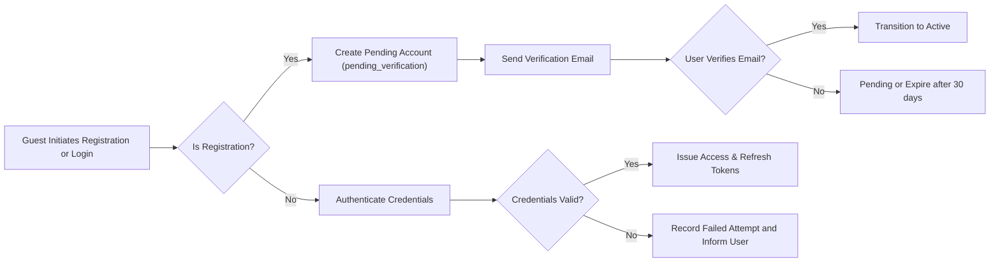
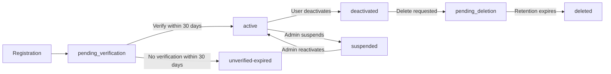

# User Actors and Authentication Requirements

## Purpose and Scope

Define the business-level actors, authentication and session expectations, permission boundaries, and account lifecycle states for the todoApp service. The content focuses on WHAT the system must provide in business terms, including measurable SLAs and testable behavior. Implementation details (specific tokens, cryptography, or libraries) are intentionally excluded.

## Audience

Intended readers: product managers, backend developers, security architects, QA engineers, and operations teams who need unambiguous, testable business requirements for authentication and actor-based authorization.

## Actors and Business Capabilities

1. Guest
- Capabilities: view public lists and sample content; register for an account; initiate password recovery.
- Restrictions: cannot create, modify, or delete persistent lists or todos; cannot accept collaborator invitations.

2. todoUser (Owner)
- Capabilities: register, authenticate, create/modify/delete lists and todos they own, set list visibility, invite collaborators, transfer ownership, request export or deletion of account data.
- Restrictions: cannot perform system-level administrative actions (suspension, global configuration) unless explicitly granted by business policy.

3. Collaborator (Read-only / Read-write)
- Capabilities: read-only collaborators may view list contents and comments (if enabled). Read-write collaborators may add, edit, complete/uncomplete, and delete todos per owner-granted permissions.
- Restrictions: collaborators may not change list visibility or transfer ownership unless the owner explicitly delegates that right.

4. Admin
- Capabilities: suspend/reactivate accounts, remove abusive content, review audit logs, perform moderation actions and legal-hold operations. Admin actions MUST be auditable.
- Restrictions: admin access to private user content is restricted to justified moderation or legal reasons and MUST be logged and reviewed.

## Business-Level Authentication Workflows

EARS-formatted, measurable requirements for core authentication flows:

- WHEN a guest registers, THE system SHALL create a user account in state "pending_verification" and SHALL send an email verification instruction to the provided email address within 30 seconds for 95% of registrations under normal operating conditions.

- WHEN a user verifies their email, THE system SHALL transition the account to "active" and SHALL enable full functionality (sharing, inviting collaborators, making lists public) within 5 seconds of verification being processed.

- WHEN a user attempts to authenticate with credentials, THE system SHALL validate credentials and respond to the authentication request within 2 seconds for 95% of attempts under normal load.

- IF a user attempts to authenticate with invalid credentials, THEN THE system SHALL record the failed attempt for anti-abuse monitoring and SHALL present a non-revealing error message such as "Invalid email or password".

- IF an account accumulates 5 failed authentication attempts within a 15-minute rolling window, THEN THE system SHALL require an additional verification step (captcha, email step-up, or equivalent) before permitting further credential attempts and SHALL notify the account owner of suspicious activity via email within 30 minutes.

- WHEN a user requests password reset, THE system SHALL send password reset instructions to the verified account email within 30 seconds for 95% of attempts, and SHALL log the event for audit.

- WHEN a password reset completes, THE system SHALL invalidate existing refresh tokens and require re-authentication for other devices within 1 minute of the reset event.

- WHERE optional, THE system SHALL offer multi-factor authentication (MFA) as a user opt-in security enhancement; if enabled, THE system SHALL require MFA during token issuance flows that grant prolonged access.

## Session and Token Business Rules (High-level)

- THE system SHALL use two logical token types: an "access token" for short-lived operations and a "refresh token" for renewing access without re-entering credentials. These are business concepts; precise format is an implementation detail.

- THE system SHALL set the default access token expiry to 20 minutes and the default refresh token expiry to 14 days. WHERE a user selects "Remember this device", THE system SHALL extend refresh expiry to up to 30 days.

- WHEN a user explicitly logs out, THE system SHALL immediately revoke the refresh token associated with that session and SHALL prevent its further use to obtain new access tokens.

- WHEN account credentials change (password reset or credential update), THE system SHALL revoke all active refresh tokens for that account and SHALL require re-authentication across devices within 1 minute of the credential change.

- IF an account is suspended by admin, THEN THE system SHALL revoke active sessions immediately and SHALL not permit issuance of new tokens until reactivation.

- THE system SHALL provide users with a device/session management interface (business requirement) that lists active sessions, issuance times, device labels, and allows revocation of specific sessions. Session revocation SHALL take effect within 60 seconds of the user's revocation action.

- THE system SHALL consider a session inactive after 14 days of inactivity and SHALL require re-authentication or refresh-token-based revalidation to resume protected operations. WHERE a user selected "Remember this device," inactivity expiration may be up to 30 days but SHALL remain revocable by the user at any time.

## Permission Matrix (Business Mapping)

| Action / Capability | Guest | Owner (todoUser) | Collaborator (read-only) | Collaborator (read-write) | Admin |
|---------------------|:-----:|:----------------:|:------------------------:|:-------------------------:|:-----:|
| View public list | ✅ | ✅ | ✅ | ✅ | ✅ |
| View private list | ❌ | ✅ | ✅ (if accepted) | ✅ (if accepted) | ✅ (for moderation) |
| Create list | ❌ | ✅ | ❌ | ❌ | ✅ (audit-only) |
| Delete list | ❌ | ✅ | ❌ | ❌ | ✅ (moderation) |
| Create todo | ❌ | ✅ | ❌ | ✅ (if granted) | ✅ (moderation) |
| Edit todo | ❌ | ✅ | ❌ | ✅ (if granted) | ✅ (moderation) |
| Delete todo | ❌ | ✅ | ❌ | ✅ (if granted) | ✅ (moderation) |
| Mark complete/incomplete | ❌ | ✅ | ❌ | ✅ (if granted) | ✅ (moderation) |
| Invite collaborator | ❌ | ✅ | ❌ | ❌ | ✅ (audit) |
| Change visibility | ❌ | ✅ | ❌ | ❌ | ✅ (policy override) |
| Transfer ownership | ❌ | ✅ (requires acceptance) | ❌ | ❌ | ✅ (legal/operational only) |

Notes: Admin actions that touch private content SHOULD be limited to moderation or legal needs and MUST be recorded in audit logs with reason codes and reviewer identities.

## Account Lifecycle States and EARS Transitions

Defined states: "pending_verification", "active", "suspended", "deactivated", "pending_deletion", "deleted".

- WHEN a user registers, THE system SHALL create the account in state "pending_verification" and SHALL send verification instructions to the account email within 30 seconds for 95% of requests.

- WHEN a user verifies email, THE system SHALL transition the account to "active" and SHALL allow full functionality within 5 seconds.

- WHEN an admin suspends an account, THE system SHALL transition the account to "suspended", revoke active sessions immediately, and SHALL prevent the account from performing create/update/delete operations until reactivation.

- WHEN a user requests account deletion, THE system SHALL transition the account to "pending_deletion" and SHALL retain user data for a configurable retention period (default 30 days) to permit recovery. AFTER the retention period expires and no legal hold applies, THE system SHALL transition the account to "deleted" and SHALL permanently remove personal data from user-visible stores.

- IF a legal hold applies, THEN THE system SHALL prevent purge actions for held items and SHALL record the hold reason and retaining authority in audit logs.

## Error Handling, Idempotency, and Recovery (Business Expectations)

- IF a user submits a create request with missing required fields (e.g., email or password), THEN THE system SHALL reject the request with a precise validation message indicating the missing fields and SHALL not create partial accounts.

- IF a transient server error occurs during authentication, THEN THE system SHALL return a clear error code and message and SHALL allow client-side safe retries; idempotency of account creation SHOULD be supported via client-supplied idempotency tokens (implementation detail) so duplicate accounts are not created on retry.

- IF a token refresh attempt uses an expired or revoked refresh token, THEN THE system SHALL require full re-authentication and SHALL return a standardized error code indicating "session_expired" or equivalent.

- WHEN concurrent credential updates occur (e.g., simultaneous password resets), THE system SHALL enforce a deterministic outcome: the most recent verified credential change SHALL be authoritative and THE system SHALL log the sequence of changes for audit and recovery.

## Audit and Logging Requirements (Business-level)

- THE system SHALL record the following event types with actor id, target resource, timestamp, and reason where applicable: successful login, failed login, password reset requests, password resets completed, session revocations, token issuances, token revocations, invitation sends/accepts/declines, admin suspensions/reactivations, account deletion requests, and legal holds.

- THE system SHALL retain security-relevant logs for at least 365 days to support investigations and compliance obligations.

- WHEN an admin accesses private user content for moderation, THEN THE system SHALL log admin id, the reason code for access, timestamp, and resource identifiers and SHALL surface these records during quarterly audit reviews.

- IF a user requests export or deletion of their data, THEN THE system SHALL log the request, the verification steps performed, and the completion status with timestamps.

## Acceptance Criteria and Example Scenarios (Testable)

Scenario 1 — Registration and Activation
- GIVEN a guest provides a valid email and password
- WHEN registration completes, THEN the account SHALL be in "pending_verification" and a verification email SHALL be sent within 30 seconds for 95% of cases
- WHEN the user verifies the email, THEN the account SHALL become "active" and the user SHALL be able to set a list public within 5 seconds

Scenario 2 — Login and Lockout
- GIVEN an active user
- WHEN the user provides valid credentials, THEN authentication SHALL succeed within 2 seconds for 95% of attempts
- IF 5 failed attempts occur within 15 minutes, THEN the system SHALL require step-up verification and notify the user within 30 minutes

Scenario 3 — Password Reset and Session Invalidation
- WHEN a user resets their password, THEN all existing refresh tokens SHALL be invalidated within 1 minute and existing sessions SHALL require re-authentication

Scenario 4 — Admin Suspension
- WHEN an admin suspends an account, THEN active sessions SHALL be revoked immediately and the account SHALL be prevented from performing write actions until reactivation

Scenario 5 — Unauthorized Access
- IF a guest or unauthorized user attempts to modify a private list, THEN THE system SHALL deny the action and return a standardized authorization error with an explanation appropriate for users (e.g., "You do not have permission to perform this action").

## Mermaid Diagrams (Compliant Syntax)

## Glossary and Definitions
- Access token: Short-lived credential used for authenticated requests (business concept).
- Refresh token: Longer-lived credential used to obtain new access tokens without re-entering credentials (business concept).
- Session: A distinct user interaction context often tied to a device or browser instance.
- Owner: User who created a resource and has owner-level privileges.
- Collaborator: User explicitly invited to a list who may have read-only or read-write rights.

## EARS Requirements Index (QA Reference)
- WHEN a guest registers, THE system SHALL create a pending account and send verification within 30 seconds for 95% of registrations.
- WHEN an account verifies email, THE system SHALL transition the account to "active" and enable sharing features within 5 seconds.
- WHEN authentication succeeds, THE system SHALL respond within 2 seconds for 95% of attempts.
- IF 5 failed login attempts occur within 15 minutes, THEN THE system SHALL require step-up verification.
- WHEN a password reset completes, THE system SHALL invalidate refresh tokens and require re-authentication within 1 minute.
- WHEN an admin suspends an account, THE system SHALL revoke sessions immediately and prevent write actions by that account.

# End of User Actors and Authentication Requirements
