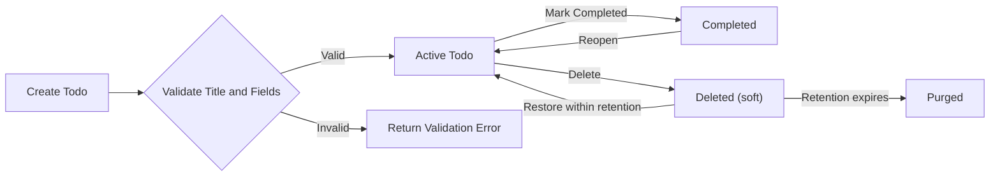
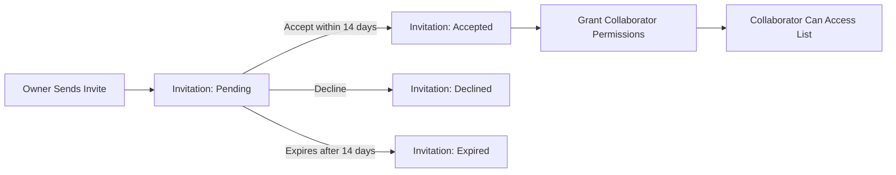

# Functional Requirements — todoApp

## Revision
- Document: Functional Requirements (04-functional-requirements.md)
- Version: v1.1
- Last updated: 2025-10-31
- Owner: Product
- Review status: Approved

## Executive Summary and Purpose

The functional requirements below define, in business language, the complete set of behaviors the todoApp backend MUST provide for the initial minimal release. Requirements are stated to be precise, measurable, and testable. All actor permissions, validation rules, lifecycle transitions, and error behaviors are expressed using EARS-style phrasing (WHEN, THE, SHALL; IF, THEN; WHERE, THE SHALL; WHILE, THE SHALL). Implementation details (APIs, database schemas, cryptography, libraries) are out of scope.

## Scope and Assumptions

- In scope: account-bound todo lists, todo items, list visibility controls (private/shared-invite-only/public), collaborator invitations and acceptance, owner-controlled visibility and ownership transfer, soft-delete and restore, basic audit logging of owner and admin actions, bulk operations (complete/delete), basic import/export concepts, and admin moderation actions.
- Out of scope: push notification implementations, calendar sync implementation, attachments, advanced conflict-merge UIs, and analytics dashboards for end users.
- Assumptions: every persistent resource has a single owner; authentication and session management exist per the User Actors document and are treated here as business-level prerequisites.

## Actors and Permission Matrix

Actors (business terms):
- guest — Unauthenticated visitor; can view public lists only.
- todoUser — Authenticated user; owns lists and todos and may invite collaborators.
- collaborator — Authenticated user granted explicit access to a shared list.
- admin — Platform operator with moderation privileges; admin actions are auditable.

Permission matrix (business-level):

| Action | guest | owner | collaborator (read-only) | collaborator (read-write) | admin |
|---|---:|---:|---:|---:|---:|
| View public list | ✅ | ✅ | ✅ | ✅ | ✅ |
| View private list | ❌ | ✅ | ✅ (if accepted) | ✅ (if accepted) | ✅ (for moderation) |
| Create list | ❌ | ✅ | ❌ | ❌ | ✅ (admin moderation) |
| Delete list | ❌ | ✅ | ❌ | ❌ | ✅ |
| Create todo | ❌ | ✅ | ❌ | ✅ | ✅ |
| Update todo | ❌ | ✅ | ❌ | ✅ (if granted) | ✅ |
| Delete todo | ❌ | ✅ | ❌ | ✅ (if granted) | ✅ |
| Mark complete/incomplete | ❌ | ✅ | ❌ | ✅ (if granted) | ✅ |
| Change visibility | ❌ | ✅ | ❌ | ❌ | ✅ |
| Invite collaborator | ❌ | ✅ | ❌ | ❌ | ✅ (audit-only) |
| Transfer ownership | ❌ | ✅ (must be accepted) | ❌ | ❌ | ✅ (policy override) |

Notes:
- Admin actions that alter user content must be recorded in audit logs with reason and timestamp. The owner retains ultimate authority over list lifecycle unless a legal or moderation hold is applied.

## Core Functional Requirements (EARS-formatted)

Ubiquitous requirements (always true):
- THE todoApp SHALL associate every list and todo with an owner identifier and SHALL persist creation and last-updated timestamps for audit purposes.
- THE todoApp SHALL preserve an audit record for actions that change visibility, ownership, or moderation state including actor id and timestamp.
- THE todoApp SHALL present a default of "private" visibility for newly created lists.

Event-driven requirements (WHEN):
- WHEN a todoUser creates a list, THE todoApp SHALL require a non-empty title and SHALL create the list with visibility "private" by default.
- WHEN a todoUser creates a todo item, THE todoApp SHALL persist the item with title, optional description, optional due date, optional priority, creation timestamp, and last-updated timestamp.
- WHEN a todoUser marks a todo as complete, THE todoApp SHALL set the completed flag and record a completed timestamp.
- WHEN a todoUser invites another registered user to a private list, THE todoApp SHALL create an invitation in state "pending" and SHALL notify the invitee via the configured notification channel.
- WHEN an invited user accepts an invitation within the configured invitation window, THE todoApp SHALL change the invitation state to "accepted" and SHALL grant collaborator permissions defined by the invitation.
- WHEN an owner changes a list's visibility to "public", THE todoApp SHALL make the list readable by guests and authenticated users and SHALL record that visibility change in the audit log.

State-driven requirements (WHILE):
- WHILE a list is in "soft-deleted" state, THE todoApp SHALL prevent guests and non-owner collaborators from viewing the list and SHALL allow only the owner and admin to restore or permanently delete the list.
- WHILE a user account is suspended, THE todoApp SHALL prevent the suspended account from creating, modifying, or deleting lists and todos but SHALL retain data for possible reactivation per retention rules.

Unwanted behavior requirements (IF/THEN):
- IF a guest attempts to create or modify a persistent resource, THEN THE todoApp SHALL deny the action and return an actionable error indicating authentication is required.
- IF a user submits a todo with an empty or whitespace-only title, THEN THE todoApp SHALL reject the submission and return an error with message "title is required" and a validation error code.
- IF a user submits a due date that is earlier than the server's current date (past), THEN THE todoApp SHALL reject the submission and return an error with message "due date must be today or in the future".
- IF an authenticated user attempts to access or modify a resource for which they lack permission, THEN THE todoApp SHALL deny access and return an authorization failure code and message.

Optional/conditional requirements (WHERE):
- WHERE the owner invites collaborators, THE todoApp SHALL allow the owner to choose collaborator permission levels of "read-only" or "read-write"; the default granted permission upon acceptance SHALL be "read-only" unless specified otherwise by the owner.
- WHERE an owner requests immediate permanent deletion, THE todoApp SHALL provide a confirmatory step and SHALL comply with legal hold exceptions before irreversible purge.

## Lists: Behaviors and Rules

- WHEN a list is created, THE todoApp SHALL assign the creating user as the owner and SHALL initialize the list metadata (title, description optional, visibility default "private").
- WHEN a list title exceeds 250 characters, THEN THE todoApp SHALL reject the creation or update and return a validation error specifying the field and the maximum allowed length.
- IF an owner deletes a list, THEN THE todoApp SHALL move the list to "soft-deleted" state and SHALL retain it for a default retention period of 30 calendar days during which the owner may restore it; after retention expiration, THE todoApp SHALL permanently purge the list unless a legal hold applies.
- WHEN a list is marked "public", THE todoApp SHALL include a persistent visibility indicator for the owner and SHALL allow guests to read list items but not modify them.

## Todos: Attributes and Validation

Required and optional fields (business-level):
- title: required, 1..200 characters, cannot be whitespace-only.
- description: optional, max 4,000 characters.
- dueDate: optional, ISO-8601 date or datetime; if present, THE todoApp SHALL validate it is today or in the future.
- priority: optional, enum "low" | "medium" | "high" | "urgent".
- tags: optional array of up to 10 non-empty strings, each max 50 characters.

Validation rules (EARS):
- WHEN a todoUser submits a create or update request, THE todoApp SHALL validate each field and SHALL reject the request with a structured list of field errors if any validation rule is violated.
- IF tags exceed 10 items or a tag exceeds 50 characters, THEN THE todoApp SHALL reject the action and provide a per-tag error explaining the violation.

Bulk operations:
- WHEN a todoUser issues a bulk operation (complete/uncomplete/delete/update priority) targeting N items, THE todoApp SHALL process each item independently and SHALL return a per-item success/failure list; for bulk sets exceeding 500 items, THEN THE todoApp SHALL reject the operation and instruct the user to split the work or use an asynchronous bulk job.

## Collaboration and Invitations

Invitation lifecycle (EARS):
- WHEN an owner invites a registered user to a private list, THE todoApp SHALL create an invitation in state "pending" and SHALL set an expiration time of 14 calendar days for the invitation.
- IF the invited user accepts within 14 days, THEN THE todoApp SHALL set the invitation to "accepted" and SHALL grant collaborator-level permissions as specified in the invitation.
- IF an invitation remains pending beyond 14 days, THEN THE todoApp SHALL set the invitation state to "expired" and SHALL notify the owner of expiration.
- WHEN an owner revokes a pending or accepted invitation, THEN THE todoApp SHALL revoke the collaborator's access immediately and SHALL record the revocation in the audit log.

Ownership transfer (EARS):
- WHEN an owner initiates a transfer of ownership to another registered user, THE todoApp SHALL create a pending transfer that requires explicit acceptance by the target user; upon acceptance THE todoApp SHALL change the owner field and SHALL record the transfer event in the audit log.
- IF the target user does not accept the transfer within 7 calendar days, THEN THE todoApp SHALL cancel the transfer automatically.

## Concurrency and Conflict Resolution

- WHEN concurrent updates occur to the same todo by multiple authorized actors, THE todoApp SHALL apply a deterministic last-writer-wins (LWW) policy by default and SHALL record the author and timestamp of the applied change in the resource history.
- WHERE silent data loss would be possible under LWW for optional major edits (e.g., large description changes), THE todoApp SHOULD (WHERE implementable) preserve the overwritten version in a short-term version history for potential restoration; this is optional for MVP but is a recommended future feature.
- IF a client detects that the local state differs from the server state after an attempted update, THEN THE client SHALL surface a conflict notice to the user explaining that another change occurred and indicating the last-modified timestamp.

## Error Handling and Recovery (EARS IF/THEN)

- IF a request fails due to client validation, THEN THE todoApp SHALL return a structured validation error listing fields and error messages and SHALL not mutate server state.
- IF a request fails due to authorization, THEN THE todoApp SHALL return a standardized authorization failure code and user-facing message and SHALL log the attempted action for audit.
- IF an internal server error occurs while processing a user action, THEN THE todoApp SHALL return a stable error code indicating a transient failure, log the full diagnostic information, and SHALL surface a user-facing message suggesting retry after a short delay.
- IF a create operation fails at the client but the server eventually succeeds (idempotency concerns), THEN THE todoApp SHALL provide idempotent operation support via client-supplied idempotency tokens or server-side deduplication policies (implementation detail) so the user does not observe duplicate items.

## Soft-delete, Retention, and Restore

- WHEN a user deletes a todo or list, THE todoApp SHALL mark the resource as "Deleted" and SHALL retain it in soft-deleted state for a default of 30 calendar days during which the owner may restore it.
- IF a resource is restored within the retention window, THEN THE todoApp SHALL transition it back to its prior active state and SHALL preserve prior timestamps and metadata.
- IF the retention window expires and no legal hold applies, THEN THE todoApp SHALL permanently purge the resource and SHALL ensure it is no longer recoverable by standard user flows.
- WHEN a legal hold or regulatory hold is applied, THE todoApp SHALL suspend purge for the affected resources and SHALL record the hold reason and owner in the audit log.

## Audit, Moderation, and Admin Actions

- WHEN an admin performs a moderation action that affects user content (suspend/reactivate account, remove public content), THEN THE todoApp SHALL record the admin id, action, reason, and timestamp in an immutable audit trail.
- IF a content removal is performed for abuse, THEN THE todoApp SHALL notify the content owner with the reason and instructions for appeal unless legal constraints prevent notification.

## Performance and User-Perceived Responsiveness

- WHEN a todoUser performs primary CRUD actions (create, update, mark complete/incomplete), THE todoApp SHALL respond within 500 ms for 95% of requests under normal load conditions.
- WHEN returning a list view with up to 1,000 items, THE todoApp SHALL respond within 1,000 ms for 95% of requests under normal load conditions.
- WHEN a bulk operation is accepted for asynchronous processing, THE todoApp SHALL return an acknowledgement within 3 seconds and SHALL provide per-item results within 30 seconds for bulk sets up to 500 items.

## Acceptance Criteria and Example Scenarios

Scenario 1 — Create and Complete (happy path):
- GIVEN an authenticated todoUser
- WHEN they create a list "Daily" and add a todo with title "Buy groceries" and due date tomorrow
- THEN THE todoApp SHALL persist the list and item, and the item SHALL appear in the list view with completed=false
- WHEN the user marks the todo as complete
- THEN THE todoApp SHALL set completed=true and record a completion timestamp
- PERFORMANCE: Each action SHALL meet the 500 ms 95th percentile target.

Scenario 2 — Public List Read (guest):
- GIVEN an owner sets a list visibility to public
- WHEN a guest views the list
- THEN THE todoApp SHALL return the list contents in read-only mode and SHALL not expose owner-only controls

Scenario 3 — Invalid Input (error path):
- GIVEN an authenticated user
- WHEN they attempt to create a todo with title equal to an empty string
- THEN THE todoApp SHALL reject the request with error "title is required" and SHALL not create a resource

Scenario 4 — Invitation Lifecycle:
- GIVEN an owner invites a registered user
- WHEN the invitee accepts within 14 days
- THEN THE todoApp SHALL grant collaborator access and record acceptance timestamp

Scenario 5 — Soft Delete and Restore:
- GIVEN an owner deletes a list
- WHEN the owner restores the list within 30 days
- THEN THE todoApp SHALL return the list to active state and preserve contained todo items and timestamps

## Mermaid Diagrams (correct syntax with double-quoted labels)

Todo lifecycle:

Invitation flow:

## Glossary
- todoUser: Authenticated user who creates lists and todos.
- guest: Unauthenticated visitor allowed to view public lists.
- owner: The creator and primary controller of a list or todo.
- collaborator: A user granted explicit access to a shared list.
- soft-delete: A non-permanent deletion state where the owner may restore the resource within a retention window.
- purged: Irreversible removal from standard user recovery mechanisms after retention expiry.

## EARS Requirements Index (for QA)
- WHEN a todoUser creates a list, THE todoApp SHALL require a non-empty title and SHALL set visibility to "private" by default.
- WHEN a todoUser creates a todo, THE todoApp SHALL persist title, optional description, optional due date, optional priority, and timestamps.
- WHEN a todoUser marks a todo as complete, THE todoApp SHALL set completed flag and record completed timestamp.
- IF a guest attempts to create or modify a resource, THEN THE todoApp SHALL deny the action and return an authentication-required error.
- IF a todo title is empty, THEN THE todoApp SHALL reject the create/update and return "title is required".
- WHEN an owner invites a collaborator, THE todoApp SHALL create a pending invitation with 14-day expiry and SHALL grant access upon acceptance.
- WHILE a list is soft-deleted, THE todoApp SHALL prevent non-owner access and SHALL allow restore by owner during retention window.

