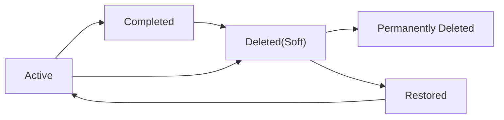
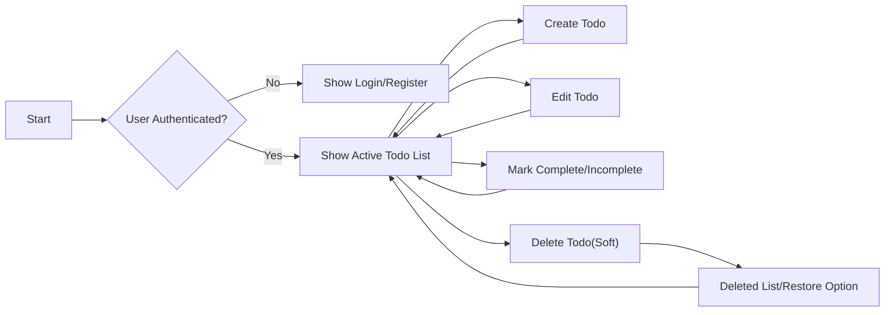
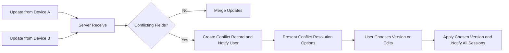

# 04 - Service Operation Overview for todoApp

## Purpose and scope

todoApp is a single-user-focused, lightweight todo list service intended to provide the essential capability to capture, track, and manage short-lived personal tasks. The minimal product allows an authenticated user to create, view, update, and delete their own todos and includes a basic account lifecycle (register, authenticate, reset password). Admins exist for operational control (account suspension/reactivation and audits). The service prioritizes clarity, reliability, and minimal complexity.

This file prescribes business-level operational behavior and acceptance criteria for backend implementation. It does not include database schemas or API contracts; developers are free to design technical interfaces that satisfy the business rules and acceptance tests specified here.

## Audience and how to use this document

This document is intended for backend developers, QA engineers, support staff, and product managers. Use this document to:
- Derive API behaviors and acceptable response semantics for user-visible operations.
- Create acceptance tests and QA plans for primary and secondary user scenarios.
- Inform operational runbooks for backups, retention, and admin maintenance.

Read the functional requirements and user roles documents first when designing access controls and authentication flows.

## Top-level user journeys (happy paths)

Each journey below describes the user's steps, expected system behavior, and clear acceptance criteria expressed in business terms.

### Create a todo (quick capture)

Narrative: A registered user captures a single task quickly with optional fields for due date and priority.

EARS requirements:
- WHEN a registered user submits a new todo with at least a title, THE todoApp SHALL create a todo item owned by that user with status "active", set createdAt to the current timestamp, and return the created item for the user's view within 2 seconds in normal conditions.
- IF the submitted todo title is empty or exceeds 250 characters, THEN THE todoApp SHALL reject the creation and return a user-facing validation error specifying the constraint.

Business details:
- Minimal required field: title (short text, non-empty, trimmed).
- Optional fields: description (optional text), dueDate (optional ISO date), priority (optional enum: "low","medium","high").
- Creation is immediate and visible in the user's active list. The default sort is newest-first among active items.

Acceptance criteria:
- GIVEN an authenticated user who submits a valid title, WHEN the request completes, THEN the created todo is visible in the user's list within 2 seconds.

### Read / List todos

Narrative: A user opens the app and sees their active todos.

EARS requirements:
- WHEN a registered user requests their todo list, THE todoApp SHALL return the user's active todos ordered newest-first by createdAt by default and support optional filters by state and pagination at a configurable page size (default page size = 50).

Business details:
- Default list shows active items. Completed items may be shown in a separate view accessible through a filter. Deleted (soft-deleted) items are not shown in default lists.

Acceptance criteria:
- GIVEN a user with existing todos, WHEN they request the list, THEN the list response contains only those todos owned by the user and is returned within 2 seconds for up to 50 items.

### Update a todo (edit content, mark complete/incomplete)

Narrative: A user edits a todo's text, due date, or priority and can mark it complete or incomplete.

EARS requirements:
- WHEN a registered user edits a todo they own, THE todoApp SHALL apply the permitted changes and set updatedAt to the current timestamp; THE todoApp SHALL return the updated item within 2 seconds.
- WHEN a registered user marks a todo as complete, THE todoApp SHALL set status to "completed", set completedAt to the current timestamp, and retain createdAt unchanged.
- WHEN a registered user marks a completed todo as incomplete, THE todoApp SHALL set status to "active" and clear completedAt.

Business details:
- Users can edit their own todos without an enforced time window for edits in the MVP.
- Only the owner may modify a todo; admin actions that affect user data must be audited.

Acceptance criteria:
- GIVEN ownership and valid input, WHEN the user updates, THEN the changes are present in subsequent reads within 2 seconds.

### Delete a todo (soft-delete and recovery)

Narrative: A user deletes a todo; deletion is non-permanent for a configurable retention period to allow recovery.

EARS requirements:
- WHEN a registered user deletes a todo they own, THE todoApp SHALL set status to "deleted", set deletedAt to the current timestamp, remove the item from the default active list immediately, and make the item recoverable by the owner for 30 calendar days.
- IF the owner does not restore the deleted todo within the retention window, THEN THE todoApp SHALL make the item eligible for permanent purge by a scheduled admin process.

Business details:
- Soft-delete protects against accidental loss and supports an undo affordance in the UI.
- Permanent purge is performed as a scheduled background operation; admins may perform targeted purges subject to audit rules.

Acceptance criteria:
- GIVEN the deletion action, WHEN it completes, THEN the item is absent from the active list and appears in a recoverable deleted list for 30 days.

### Basic account management (register, login, password reset)

Narrative: A user registers and authenticates with the system and can recover access via email when necessary.

EARS requirements:
- WHEN a visitor registers an account with valid credentials, THE todoApp SHALL create an account record with accountStatus "active" (or "unverified" if email verification is required by policy) and record createdAt.
- WHEN a user requests password reset, THE todoApp SHALL issue a time-limited reset token via the user's registered email and SHALL accept the token to complete password change within the token validity window.

Business details:
- Email verification may be required by product policy; if required, account must be verified before the user can create todos.
- Admins can suspend/reactivate accounts; suspended accounts cannot authenticate nor perform write actions but their data is retained for review.

Acceptance criteria:
- GIVEN a registered user, WHEN the user requests password reset, THEN the reset email is delivered within expected provider latency (business-level expectation: within 60 minutes) and the reset token validity is enforced (e.g., 24 hours).

## Day-to-day operations and common flows

### Typical user session flow

- User opens the app.
- If unauthenticated and the product requires authentication for todo management, the user is presented with login/register choices.
- After authentication, the user's active todo list is displayed.
- User creates, updates, marks complete, or deletes tasks as needed.
- User logs out to end the session.

EARS requirements:
- WHEN a user completes authentication, THE todoApp SHALL present the user's current active todo list within 2 seconds in normal conditions.

Performance expectation:
- Core operations (create, list, update, delete) shall be visible to the user within 2 seconds at MVP scale in normal conditions (95th percentile constraint for typical load).

### Background processes and scheduled operations (business-level)

- Retention cleanup: schedule background job to permanently purge soft-deleted items older than retention window.
- Backup snapshot creation: perform regular backups to meet RPO objectives.
- Admin audit and maintenance operations: periodic maintenance processes for orphaned data and system hygiene.

EARS requirements:
- WHEN a deleted item passes the retention period, THEN THE todoApp SHALL schedule the item for permanent purge during the next maintenance window and record the purge action for audit.

## Account lifecycle and user data lifecycle

### Account states (business-level)
- active: Account may perform normal operations.
- suspended: Account is disabled from authenticating and performing write operations; data is preserved.
- deleted: Account is scheduled for removal subject to retention policy and legal holds.

EARS requirements:
- WHEN an admin suspends a user account, THE todoApp SHALL reject subsequent authentication attempts for that account and SHALL invalidate refresh tokens associated with the account to prevent further API access within 30 seconds of suspension.
- WHEN a user requests account deletion, THE todoApp SHALL mark the account for deletion and initiate data removal per retention policy.

### Todo item lifecycle (business states)

Business notes:
- Completion is reversible. Deleted state is recoverable within retention window. Permanent deletion removes the item from user view and backups per retention rules.

## Business rules and validation (detailed)

### Ownership and access
- WHEN a user attempts an action on a todo item, THE todoApp SHALL permit the action only if the user is the owner of the todo or if an admin performs an authenticated audited maintenance action.
- IF a non-owner attempts access, THEN THE todoApp SHALL deny the request and return an authorization error without revealing private details about the resource.

### Input validation rules
- WHEN a user submits a title, THE todoApp SHALL require a non-empty title trimmed of whitespace and SHALL accept titles up to 250 characters; THE todoApp SHALL reject titles longer than 250 characters.
- WHEN a user submits a description, THE todoApp SHALL accept strings up to 4,000 characters and shall trim leading/trailing whitespace for presentation.
- WHEN a user supplies a dueDate, THE todoApp SHALL accept ISO 8601 date-only or date-time values and shall validate that the value parses; the system shall warn on past dates but not prevent them by default.
- WHEN a user supplies a priority, THE todoApp SHALL accept only "low","medium", or "high".

### Concurrency and conflict handling (business-level)
- IF two updates for the same todo are submitted concurrently, THEN THE todoApp SHALL apply deterministic resolution and shall surface conflict information to users where overwrites would cause data loss. For MVP, last-write-wins is an acceptable default but the system SHALL record modification timestamps to help users and support resolve conflicts.

### Audit and admin behavior
- WHEN an admin performs any action that affects user data or accounts, THE todoApp SHALL record an audit entry including admin identifier, action type, target resource, timestamp, and optional reason.
- IF an admin uses impersonation to act on behalf of a user, THEN THE todoApp SHALL annotate the audit entry to indicate admin-originated action.

## Authentication and session management (business-level)

### Token guidance and session behavior
- THE todoApp SHALL use token-based sessions for authenticated API access. JSON Web Tokens (JWT) are recommended for representing access tokens in the API model.
- THE todoApp SHALL use short-lived access tokens and longer-lived refresh tokens to balance usability and security.

EARS requirements:
- WHEN the system issues tokens, THE todoApp SHALL issue access tokens with a recommended default expiration of 20 minutes and refresh tokens with a recommended default expiration of 14 days (product-configurable).
- WHEN a user logs out or requests session revocation, THE todoApp SHALL invalidate the associated refresh token and prevent further token refresh operations. Token revocation SHALL propagate to other sessions within 30 seconds where possible.
- WHEN an admin suspends an account, THE todoApp SHALL invalidate refresh tokens for the account to prevent further authenticated requests and SHALL record the suspension in audit logs.

### Registration, verification, and password reset
- WHEN a visitor registers with email and password, THE todoApp SHALL create an account in a pending or active state per product policy and SHALL send a verification email if verification is required.
- WHEN a user requests password reset, THE todoApp SHALL send a time-limited reset token to the registered email address and SHALL reject expired tokens.

Acceptance criteria:
- GIVEN valid credentials, WHEN a user authenticates, THEN the system SHALL return access and refresh tokens within 2 seconds under normal conditions.
- GIVEN a password reset request, WHEN the reset token is valid, THEN the system SHALL accept the token and allow password change within the token validity window.

## Error handling and user-facing recovery scenarios

### Validation errors
- IF a request contains invalid fields (empty title, exceeding length limits, invalid date format), THEN THE todoApp SHALL return a validation error with a user-friendly message explaining the correction.

### Authorization errors
- IF an actor attempts an action they are not authorized to perform, THEN THE todoApp SHALL return an authorization error and log the attempt for security monitoring.

### Transient operational errors
- IF an operation fails due to transient backend errors (storage unavailable, timeout), THEN THE todoApp SHALL surface a retryable error message and the client SHOULD preserve user input where possible for retry.

### Offline and sync behavior
- WHEN a client performs actions while offline, THE todoApp SHALL allow the client to queue changes locally and synchronize when connectivity returns; queued changes SHALL be sent in order and the client SHALL handle conflict notifications if server-side conflicts arise.
- WHEN connectivity is restored, THE todoApp SHALL synchronize queued operations within 30 seconds and SHALL notify the user of sync success or conflicts.

### Conflict resolution
- IF a conflict occurs for the same field from multiple concurrent edits, THEN THE todoApp SHALL present both versions in the client and allow the user to choose which version to keep or perform an edit; for MVP, last-write-wins may be used as a default but the conflict SHALL be recorded in logs for support.

User-facing messages (examples):
- "Please add a title to your todo before saving." (validation empty title)
- "Your change could not be saved right now. Try again in a few moments." (transient error)
- "You must be signed in to manage todos. Sign in or create an account to continue." (authorization)
- "This todo was changed elsewhere. Review changes and choose which version to keep." (conflict)

## Performance and operational expectations (user-facing SLAs)

EARS performance requirements:
- WHEN a registered user performs a create, update, delete, or list operation under typical load, THE todoApp SHALL reflect the result and show updated data to the user within 2 seconds for 95% of requests measured over a rolling 1-hour window.
- WHEN scheduled cleanup runs for permanent deletion, THE todoApp SHALL complete the cleanup batches within the agreed maintenance window.

Availability and backup expectations:
- THE todoApp SHALL target 99.9% monthly availability for core user flows for the MVP and SHALL implement backups sufficient to meet RPO <= 1 hour and RTO <= 4 hours for critical failures.

Rate limiting and abuse protection:
- THE todoApp SHALL enforce per-user rate limits to protect service health; default MVP limit: 10 write requests per minute per user. Exceeding the limit SHALL return a rate-limit error with a suggested retry time.

## Administrative and maintenance processes

### Admin roles and audit
- Admins may view aggregated usage metrics and perform user account management functions such as suspension and reactivation.
- WHEN an admin performs data-affecting operations, THE todoApp SHALL record detailed audit entries including admin id, action, target resource, timestamp, and reason.

### Manual recovery steps (business-level)
- TO recover a soft-deleted item within the retention window, an admin or the owner may restore the item via the restore flow; THE todoApp SHALL record the restore action in audit logs.
- TO recover items beyond retention windows, THE todoApp SHALL rely on backups; the recovery SHALL be coordinated per incident response procedures and documented in a post-incident report.

### Maintenance and scheduled tasks
- THE todoApp SHALL run scheduled maintenance tasks (backup, retention purge) during defined maintenance windows to minimize user impact.
- Maintenance windows SHALL be communicated to stakeholders in advance.

## Acceptance criteria and success metrics

Primary acceptance criteria:
- Core flows (create/list/update/delete) must function for authenticated users and meet the 2-second visibility requirement in 95% of normal requests.
- Users must not be able to access other users' todos in any normal or edge-case scenario tested by QA.
- Deleted items must be recoverable by their owner within the 30-day retention window.
- Admin actions that affect user data must be auditable with sufficient detail.

KPIs for MVP launch:
- Activation: percent of new accounts that create at least one todo within 7 days (target >= 40%).
- Retention: percent of users who return and create tasks in 7-day and 30-day windows (7-day >= 25%, 30-day >= 10%).
- Reliability: create success rate >= 99.5% under normal load.

## Diagrams and flows (Mermaid syntax validated)

User session and primary operations:

Lifecycle diagram:

Conflict resolution flow:

## Open decisions and assumptions

- Confirm whether email verification is required for account creation in MVP or optional.
- Confirm retention windows for deleted and archived items; default: 30 days (deleted), 365 days (archived).
- Confirm whether offline-first synchronization with complex conflict resolution is required, or whether last-write-wins is acceptable for MVP.
- Confirm exact SLAs and availability targets with operations; defaults suggested above are for MVP planning only.

## Appendix: Contact points and change log template

- Product Owner: [name placeholder]
- Engineering Lead: [name placeholder]
- QA Lead: [name placeholder]

Change log template:
- Document: 04-service-operation-overview.md
- Version: 1.0
- Date: YYYY-MM-DD
- Author: [name]
- Summary of change: [one-paragraph description]

