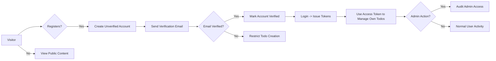
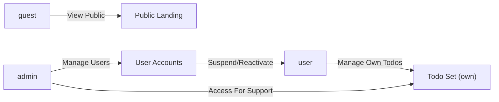

# 05-user-roles-and-personas.md — User Roles and Personas for todoApp

## Executive summary and document purpose
This document defines the business-level user roles, authentication expectations, and persona-driven needs for the minimal todoApp. It describes who will use the system, what each role is allowed to do, the authentication lifecycle from a user's viewpoint, and precise, testable business requirements (using EARS syntax) that guide backend implementation. This document does not prescribe implementation details such as database schemas, API contracts, or deployment architectures; it prescribes WHAT the system must do in business terms.

## Scope and assumptions
- Scope: Minimal single-user Todo application that supports account registration and per-user todos. The scope intentionally excludes collaboration features (shared lists), complex tagging, attachments, and integrations beyond optional email for account recovery.
- Multi-user support: The system will support multiple distinct user accounts; each user's todos are private to that user unless an administrative action is taken.
- Authentication: Authenticated access is required for creating, modifying, and deleting todos. Guests can view public landing pages and help content only.
- Minimal feature set for todo items: title (required), description (optional), completed flag, created timestamp, optional due date, optional priority (low/medium/high). These item attributes are described conceptually in other documents; here we reference them only as inputs to role and permission rules.
- Security assumptions: Basic account security measures (passwords stored safely, account verification) are required; implementation specifics are left to developers.

## Business model context (concise)
- Why this service exists: Provide individuals with a lightweight, reliable place to record and manage simple tasks. The minimal app targets users who want an uncluttered task list with basic reminders and persistence across devices.
- How the service supports value: By providing reliable per-user storage, quick task capture, and simple task lifecycle management (create → complete → delete/archived).
- Success metric (relevant to roles/auth): Successful authentication and task operations should enable users to complete their primary task flows with high reliability (see Acceptance Criteria section).

## User roles: definitions and business permissions
Three roles are defined for the minimal todoApp and must be implemented in the system: guest, user, and admin. Each role is described in business terms and mapped to actions in the Permission Matrix section.

Role: guest
- Business description: Unauthenticated visitor who can view public landing information, help content, and FAQ. Guests cannot create or access any todo data and cannot call authenticated APIs.
- Persistence: Guests have no persistent personal data in the app.
- High-level permissions (business terms): read-only access to public content; no todo-related privileges.

Role: user
- Business description: Authenticated account holder who can create and manage their own todos. The user owns personal todos and optionally sets due dates and priorities.
- High-level permissions: create, read, update, delete, and toggle complete/incomplete only for todos they own.
- Limitations: Cannot access other users' todos or perform administrative functions.

Role: admin
- Business description: Elevated account for operational tasks. Admins can view aggregate usage metrics and manage user accounts (suspend/reactivate). Admins may also act as a regular user for troubleshooting but such admin-initiated user actions must be audited.
- High-level permissions: All user actions (on their own account) plus elevated abilities to manage user accounts and perform data maintenance operations as needed.
- Audit requirement: Administrative actions that affect user data or account state must be logged and attributable to the admin performing them.

## Authentication requirements and flows (business-level)
This section describes the required authentication lifecycle in business terms. Implementation choices (e.g., how tokens are stored client-side, which hashing algorithm to use for passwords) are left to the development team, except where explicitly mandated by project-level rules.

Authentication features (conceptual list):
- User registration with email and password
- Email verification for new accounts (recommended minimal flow)
- Login (credential validation)
- Logout (session termination)
- Password reset (email-based recovery)
- Password change (authenticated)
- Revoke access from all devices (session revocation)
- Token-based session model (business guidance requires JWT usage; see Token Management)

### Token management (business guidance)
- Token type: THE system SHALL use JSON Web Tokens (JWT) to represent authenticated sessions for API access.
- Token expiry guidance: Access tokens should be short-lived and refresh tokens longer-lived to balance security and usability. The following business-level default values are recommended and must be considered authoritative unless product leadership decides otherwise:
  - Access token expiration: 20 minutes (business default; acceptable range 15–30 minutes)
  - Refresh token expiration: 14 days (business default; acceptable range 7–30 days)
- Token payload (business-level): THE JWT SHALL include an identifier for the user, the user's role, and a permissions indicator sufficient to enforce the Permission Matrix. Exact token fields and cryptography are implementation details for developers.
- Session revocation: THE system SHALL support revoking refresh tokens so that an admin or a user may force sign-out across devices. The user-facing behavior is described in Error and Recovery Scenarios.

## Personas and primary user needs
Persona 1: Solo Organizer (primary user)
- Profile: Individual who tracks a small number of tasks for personal productivity.
- Goals: Quickly add tasks, mark tasks complete, and remove tasks when no longer needed. Minimal friction in authentication—wants reliable access across devices.
- Expectations: Stable account persistence, quick create/complete actions, ability to recover account when password is forgotten.

Persona 2: Casual Visitor (guest)
- Profile: Browsing user evaluating the service or seeking help content.
- Goals: Understand what the app does and sign up if it meets needs.
- Expectations: Clear sign-up CTA and explanation of privacy and data rules.

Persona 3: Support Administrator (admin)
- Profile: Support or operations staff who manage accounts and investigate issues.
- Goals: Suspend/reactivate accounts, audit admin actions, and assist users in recovery scenarios.
- Expectations: Clear audit trails and role-based separation between admin and user activities.

## Permission matrix mapping roles to actions
The following table maps business actions in the minimal Todo app to the three roles. '✅' means the role is permitted to perform the action; '❌' means the role is not permitted.

| Action | guest | user | admin |
|--------|-------|------|-------|
| View public landing/help | ✅ | ✅ | ✅ |
| Register account | ✅ | ❌ | ❌ |
| Authenticate (login) | ❌ | ✅ | ✅ |
| Create todo (own) | ❌ | ✅ | ✅ |
| Read todo (own) | ❌ | ✅ | ✅ |
| Update todo (own) | ❌ | ✅ | ✅ |
| Delete todo (own) | ❌ | ✅ | ✅ |
| Toggle complete/incomplete (own) | ❌ | ✅ | ✅ |
| View other user's todos | ❌ | ❌ | ✅ (only for admin maintenance/audit) |
| Suspend/reactivate user account | ❌ | ❌ | ✅ |
| Revoke user sessions | ❌ | ✅ (self) | ✅ (admin) |
| View aggregate usage metrics | ❌ | ❌ | ✅ |

Notes on admin "view other user's todos": Admins may access other users' data strictly for maintenance or support and such access MUST be auditable (see EARS business rules below).

## EARS-formatted business requirements for roles and authentication
All requirements that can be expressed in EARS are written below. Each requirement is specific, measurable, and testable.

1) Core access rules
- THE system SHALL restrict unauthenticated users to public pages and help content only.
- WHEN a user successfully authenticates, THE system SHALL allow the user to perform create/read/update/delete operations on todos that the user owns.
- WHEN an admin authenticates, THE system SHALL allow the admin to perform user account management actions and to perform read-only or maintenance access on other users' todos for troubleshooting subject to audit logging.

2) Registration and verification
- WHEN a visitor completes registration with an email and password, THE system SHALL create a new user account in an unverified state.
- WHEN a new user account is created in an unverified state, THE system SHALL send a verification email that allows the user to confirm the account.
- IF email verification is not completed within 14 days, THEN THE system SHALL mark the account as unverified and restrict todo creation until verification is performed.

3) Authentication lifecycle
- WHEN a user submits credentials to sign in, THE system SHALL validate credentials and, ON SUCCESS, issue an access token and refresh token to enable authenticated actions.
- IF a user presents an expired access token and a valid refresh token, THEN THE system SHALL allow token renewal to provide a new access token without requiring credential entry.
- WHEN a user logs out from an interface, THE system SHALL invalidate the refresh token used by that interface such that continued use of that refresh token is disallowed.

4) Password reset and recovery
- WHEN a user requests a password reset, THE system SHALL send a time-limited password reset link to the email address on file.
- IF the password reset token is expired or invalid, THEN THE system SHALL reject the reset attempt and instruct the user to request a new reset.

5) Session and token revocation
- WHEN a user requests to revoke all sessions, THE system SHALL invalidate all refresh tokens associated with the user's account and require re-authentication on all devices.
- WHEN an admin suspends a user account, THE system SHALL prevent new logins for that user and SHALL invalidate active refresh tokens so that existing sessions cannot continue.

6) Admin audit requirements
- WHEN an admin performs any action that accesses or modifies user data, THE system SHALL create an audit record containing: admin identifier, timestamp, target user identifier, action type, and reason (if provided).
- IF an admin acts as a regular user for troubleshooting, THEN THE system SHALL clearly annotate the audit entry so that admin-originated user actions are distinguishable from normal user activity.

7) Privacy and data separation
- THE system SHALL ensure that user data is logically private; users SHALL not see other users' todos except as allowed to admins for maintenance as described above.

8) Error handling (EARS for common failures)
- IF a user provides invalid credentials during sign-in, THEN THE system SHALL deny access and present the user-facing message "Invalid email or password" and log the attempt for rate-limiting analysis.
- IF a user attempts to use an expired refresh token, THEN THE system SHALL deny token renewal and require the user to authenticate with credentials.

9) Optional features (WHERE)
- WHERE users opt in to email notifications, THE system SHALL send optional task reminder emails according to user-set preference. (This is optional and not required for the minimal product.)

## Acceptance criteria for authentication-related features
Each acceptance criterion below is written to be measurable and testable.

Registration and account creation
- AC-REG-01: GIVEN a visitor submits a valid email and password, WHEN the registration request completes, THEN the system SHALL create a user record in an unverified state and SHALL send a verification email within 30 seconds.
- AC-REG-02: GIVEN a user clicks the verification link within 14 days, WHEN the link is valid, THEN the system SHALL mark the account as verified and allow todo creation.

Authentication (login/logout)
- AC-AUTH-01: GIVEN valid credentials, WHEN the user submits them, THEN the system SHALL respond with a valid access token within 2 seconds (business-level expectation) and allow the user to create a todo.
- AC-AUTH-02: GIVEN invalid credentials, WHEN attempted more than 5 times within 10 minutes, THEN the system SHALL enforce throttling measures that prevent further attempts for a cooldown period (business default: 15 minutes).
- AC-AUTH-03: GIVEN an authenticated user, WHEN the user chooses to logout, THEN the system SHALL invalidate the refresh token used by that session within 5 seconds.

Token renewal and revocation
- AC-TOK-01: GIVEN an expired access token and a valid refresh token, WHEN renewal is attempted, THEN the system SHALL issue a new access token within 2 seconds.
- AC-TOK-02: GIVEN a request to revoke all sessions, WHEN completed by the user, THEN all refresh tokens SHALL be invalidated within 30 seconds and subsequent attempts to use those tokens SHALL fail.

Admin actions and audit
- AC-ADM-01: GIVEN an admin suspends a user, WHEN the action completes, THEN new authentication attempts by the target user SHALL be rejected immediately and an audit record SHALL be created.
- AC-ADM-02: GIVEN an admin views another user's todos for support, WHEN such an access occurs, THEN the action SHALL be recorded with an "admin_access" audit flag and admin identifier.

## Error and recovery scenarios (user-facing)
Describe user-visible failure modes and recovery behavior.

1) Forgot password
- User-facing behavior: WHEN a user requests a password reset, THE system SHALL send a reset link to the user's email. The link SHALL expire after 24 hours. If the user does not receive the email, the help page SHALL provide steps to request a new reset.

2) Unverified account trying to create todos
- User-facing behavior: IF an unverified user attempts to create a todo, THEN THE system SHALL prevent creation, inform the user that email verification is required, and provide a simple retry action to re-send the verification email.

3) Suspended account
- User-facing behavior: IF a suspended user attempts to authenticate, THEN THE system SHALL deny access and show a message that the account is suspended with directions to contact support. The system SHALL log suspension attempts for support review.

4) Concurrent login conflict (simple rule)
- User-facing behavior: WHEN a user logs in from a new device, THE system SHALL allow the new login and maintain existing sessions unless the user explicitly requests revocation of other sessions.

## Performance and non-functional expectations (business-level)
- THE system SHALL respond to common authentication actions (login, token refresh, logout) within 2 seconds under normal load (business expectation for user experience).
- THE system SHALL process account creation and send verification email within 30 seconds of registration completion in typical conditions.
- THE system SHALL invalidate revoked sessions within 30 seconds of revocation action.
- THE system SHALL store audit records in a manner that supports retrieval for support investigations; retention policy is specified in Non-Functional Requirements document.

## Diagrams
Authentication flow (high-level)

Role-permission overview (stateful view)

Note: Diagrams are conceptual; nodes and arrows use double-quoted labels per documentation rules.

## Open decisions and recommended defaults
The following items are business choices that must be confirmed by product stakeholders before development begins. Recommended defaults are provided to avoid blocking initial development.

1) Email verification strictness
- Recommendation (default): Require email verification before allowing todo creation. Rationale: reduces spam accounts and supports account recovery.

2) Password complexity policy
- Recommendation (default): Minimum 8 characters with at least one letter and one number. Rationale: balance between user friction and basic security for a minimal app.

3) Session concurrency policy
- Recommendation (default): Permit multiple concurrent sessions and provide a "Revoke all sessions" action for users who wish to sign out everywhere.

4) Optional notification features
- Recommendation (default): Do not implement in MVP; flag as optional feature (WHERE requirement above).

## Related documents
- For overall operation flows and primary scenarios, see the Service Operation Overview document ("Top-level user journeys for a single-user Todo experience" at ./04-service-operation-overview.md).
- For EARS-formatted functional requirements across the product, see the Functional Requirements document ("High-priority functional requirements in EARS format" at ./08-functional-requirements.md).
- For non-functional details such as retention, backup, and compliance, see the Non-Functional Requirements document ("Performance expectations and availability targets" at ./09-non-functional-requirements.md).

## Final statements (scope and developer autonomy)
This document provides business requirements only. All technical implementation decisions — including architecture, APIs, database design, and operational tooling — are the responsibility of the development team and are not prescribed here.
