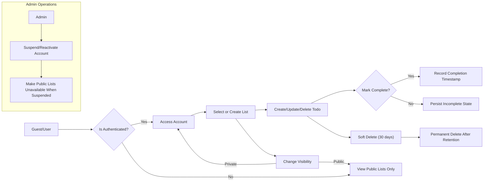

# Todo List Application — Requirements Analysis

## Executive Summary

todoApp provides a minimal, dependable service for individuals to capture, organize, and complete tasks. The following requirements define the minimal viable backend behaviors needed for launch: account lifecycle and authentication, persistent todo lists, todo item CRUD, list visibility and basic collaboration, soft-deletion and recovery, and measurable non-functional targets. All requirements are stated in business language and use EARS format where applicable to be testable by QA.

## Scope

In-scope:
- User registration, authentication, and account lifecycle (activate, suspend, delete)
- Create/read/update/delete (CRUD) for lists and todos
- Mark todo complete/incomplete and record completion timestamps
- List visibility: private (default), shared-invite-only, public (read-only for guests)
- Invite and accept collaborators with "read-only" or "read-write" roles
- Soft-delete (30-day retention) and restore
- Basic admin moderation: suspend/reactivate accounts, remove public content

Out-of-scope for MVP:
- Push notifications, calendar sync, attachments, advanced conflict merging, analytics dashboards

## Actors and Permission Matrix

Actors (business terms): guest, todoUser (owner), collaborator, admin.

Permission matrix:
- View public list: Guest ✅, Owner ✅, Collaborator ✅, Admin ✅
- View private list: Guest ❌, Owner ✅, Collaborator (accepted) ✅, Admin ✅
- Create list/todo: Owner ✅, Collaborator (if write) ✅, Guest ❌, Admin ✅ (moderation only)
- Edit/delete list: Owner ✅, Collaborator ❌ (unless owner delegates), Admin ✅
- Invite collaborator: Owner ✅, Collaborator ❌, Admin ✅

## Functional Requirements (EARS-format)

Ubiquitous requirements:
- THE system SHALL persist lists and todos so that they survive user logout and cross-session access.
- THE system SHALL treat newly created lists as private by default.

Event-driven requirements:
- WHEN an authenticated todoUser creates a list, THE system SHALL record the list with title, owner, creation timestamp, and default visibility "private".
- WHEN a todoUser creates a todo item, THE system SHALL require a non-empty title and SHALL persist title, optional description, optional due date, optional priority (low/medium/high), and creation timestamp.
- WHEN a todoUser marks a todo as complete, THE system SHALL set completed=true and record a completion timestamp.
- WHEN a list owner invites a collaborator, THE system SHALL create a pending invitation and SHALL require acceptance before granting access.
- WHEN a list is made public by the owner, THE system SHALL allow unauthenticated guests to read the list but SHALL prevent guests from performing write operations.

State-driven requirements:
- WHILE a resource is in "soft-deleted" state, THE system SHALL hide it from default views and SHALL allow the owner to restore it within 30 days.
- WHILE an account is suspended, THE system SHALL prevent that account from creating, modifying, or deleting lists and todos.

Error-handling requirements:
- IF a user submits a todo with an empty title, THEN THE system SHALL reject the request with an error message: "title is required" and an error code for automation.
- IF a user sets a due date in the past, THEN THE system SHALL reject the value and return an error: "due date must be today or later".
- IF a user attempts an operation without permission, THEN THE system SHALL deny the operation and return an authorization error with a standardized code.

Bulk operation requirements:
- WHEN a user requests bulk operations (complete/delete/change priority) THE system SHALL apply the operation per item and return a summarized result listing per-item success/failure and reasons. For operations larger than 500 items, THE system SHALL require confirmation and may process asynchronously.

## Authentication and Account Lifecycle (business-level)

- WHEN a guest registers, THE system SHALL create an account in "pending_verification" and SHALL send a verification mechanism to the user's contact.
- WHEN the user verifies, THE system SHALL transition the account to "active" and allow full functionality.
- IF an account receives 5 failed authentication attempts within 15 minutes, THEN THE system SHALL require step-up verification or temporary cooldown before further attempts.
- WHEN a user requests password reset, THE system SHALL send reset instructions to the verified contact and SHALL invalidate existing sessions upon successful password change.
- WHEN an admin suspends an account, THE system SHALL revoke active sessions and SHALL prevent new session issuance until reactivation.

Session/token rules (business-level):
- THE system SHALL use short-lived access credentials and longer-lived refresh credentials conceptually; access must be renewable without re-entering primary credentials for typical UX flows. Exact technical formats and lifetimes are implementation details, but the business expectations are: access perceived as uninterrupted for daily usage while retaining ability to revoke on credential changes.

## Data Flow and Lifecycle

States: Active -> Completed (todo sub-state) -> Archived (optional) -> Deleted (soft-delete) -> Purged.

Retention rules:
- WHEN an item or list is deleted by owner, THE system SHALL soft-delete it and retain it for 30 days for restore; after 30 days THE system SHALL purge it unless legal hold applies.
- WHEN an account is deleted, THE system SHALL place data in pending deletion for 30 days; during that time the owner may recover the account.

Audit and logs:
- THE system SHALL log administrative actions (suspend/reactivate, content removal) with actor id, timestamp, and reason and SHALL retain logs per security policy.

Mermaid diagram (conceptual data flow):

## Non-functional Requirements (user-perceived)

Performance:
- WHEN a user performs a simple CRUD action (create/edit/complete), THE system SHALL respond within 500ms for 95% of requests under normal load.
- WHEN a user fetches a list view (first page up to 50 items), THE system SHALL return within 800ms for 95% of requests.

Availability:
- THE service SHALL aim for monthly availability of 99.9% for user-facing APIs. Scheduled maintenance SHALL be announced in advance.

Scalability:
- THE system SHALL support growth from 1,000 daily active users to 100,000 monthly active users without functional feature degradation; capacity planning is ops responsibility.

Security and privacy:
- THE system SHALL default lists to private. THE service SHALL provide mechanisms for users to request export or deletion of their data within 30 calendar days.

## Error Handling and Recovery

Idempotency and retries:
- THE system SHALL support idempotent retries for create operations via client-generated idempotency keys (implementation detail) or equivalent behavior so that duplicate creates are avoided in case of client retries.

Conflict resolution:
- IF concurrent edits occur, THEN THE system SHALL apply last-writer-wins by default and SHALL record author and timestamp of the winning update; implementations MAY offer versioning or merge UI as an enhancement.

User-facing errors:
- All user-facing errors SHALL include a human-readable message and a machine-readable error code for automation.

## Acceptance Criteria and Example Scenarios

Scenario 1 — Quick Capture
- GIVEN an authenticated user
- WHEN they create a todo with title "Buy milk"
- THEN the system SHALL persist the todo in the user's default list with completed=false and a creation timestamp; action visible within 500ms for 95% measures.

Scenario 2 — Public List Viewing
- GIVEN an owner marks a list public
- WHEN a guest requests to view the list
- THEN the system SHALL return read-only list contents and SHALL not expose owner-only controls.

Scenario 3 — Soft Delete and Restore
- GIVEN an owner deletes a list
- WHEN deletion occurs
- THEN the list SHALL be in soft-deleted state and restorable within 30 days; after 30 days THE system SHALL purge the list.

## Success Metrics and KPIs
- Time-to-first-todo median <= 30 seconds for new users
- 30-day retention >= 25% for registered users
- CRUD latency: 95th percentile < 500ms
- System uptime >= 99.9% monthly
- Moderation actions per 10,000 users: monitor as abuse signal

## Governance and Versioning

- THE documentation SHALL record version, last updated date, and author for each release.
- WHEN a requirement affecting acceptance criteria or actor permissions changes, THE governance group SHALL approve and notify stakeholders within 5 business days.

## Appendix: Glossary
- todoUser: authenticated user who owns lists and todos
- guest: unauthenticated visitor
- owner: creator of a list or todo
- collaborator: invited user with granted permissions

End of requirements analysis.