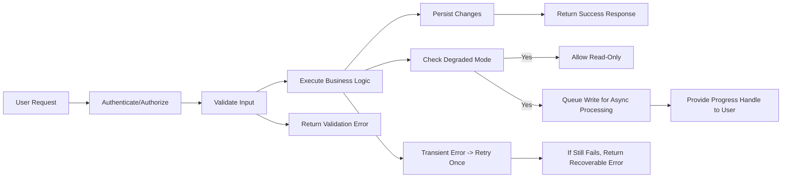
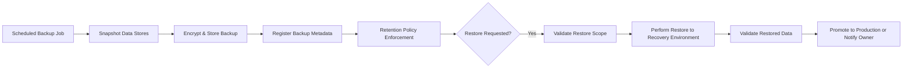

# Non-Functional Requirements — todoApp

## Executive Summary and Scope

todoApp shall provide a minimal, fast, and reliable backend for personal todo lists and lightweight sharing. These non-functional requirements define measurable expectations for performance, availability, scalability, durability, monitoring, operational behavior, and recoverability. Requirements are expressed in user-perceived terms and are testable by QA, SRE, and product teams.

Scope:
- Applies to core user-facing APIs supporting todo and list CRUD, mark complete/incomplete, list retrieval (including first-page pagination), authentication flows that affect access to these resources, and integration delivery behaviors that affect user experience (webhooks, notifications).
- Excludes low-level implementation choices such as specific cloud providers, encryption algorithms, or library selection; those remain engineering decisions.

Audience: Backend developers, SRE/DevOps, QA, Product, Security/Compliance.

## Definitions and Measurement Principles

- "Latency percentiles": 50th (median), 90th, 95th, 99th percentiles measured at the API edge.
- "Instant": median < 200 ms; 95th percentile <= 500 ms for typical interactive operations.
- "Fast": 95th percentile <= 1,000 ms.
- "Acceptable": 95th percentile <= 2,000 ms.
- MAU: Monthly Active Users (unique authenticated users per month).
- Peak concurrency: simultaneous active sessions during peak hour (business estimate = 5% of MAU).
- Normal load: defined by synthetic and RUM baselines derived from production MAU and peak concurrency targets.
- RPO (Recovery Point Objective) and RTO (Recovery Time Objective) are business-level targets for data loss tolerance and restore time respectively.

Measurement guidance:
- Use both synthetic tests (from representative geographies) and real-user monitoring (RUM) to measure percentiles.
- Measure availability as "successful completion of a core user transaction" (e.g., create-todo returns success and persisted state retrievable) rather than simple TCP connectivity.

## Core Performance Targets (EARS-formatted)

- WHEN an authenticated todoUser creates a single todo with a non-empty title, THE system SHALL persist the todo and SHALL return a success response with an item ID within the following targets: 50th percentile < 200 ms, 90th percentile < 350 ms, 95th percentile <= 500 ms, 99th percentile <= 1,200 ms under normal load.

- WHEN an authenticated todoUser toggles the completion state of a todo, THE system SHALL reflect the change and return acknowledgment within: 50th percentile < 200 ms, 95th percentile <= 500 ms under normal load.

- WHEN an authenticated todoUser requests the first page of a list with up to 1,000 items, THE system SHALL return the page within 95th percentile <= 1,000 ms under normal load.

- WHEN a guest or authenticated user reads a public list of up to 500 items, THE system SHALL return the response within 95th percentile <= 2,000 ms under normal load.

- IF the payload size or item count increases beyond specified targets (e.g., >1,000 items), THEN THE system SHALL paginate and SHALL return the first page within "fast" bounds (95th percentile <= 1,000 ms) and subsequent pages in similar bounds.

- WHEN bulk operations target <= 200 items, THE system SHALL acknowledge receipt within 2 seconds and SHALL complete 95% of item-level operations within 30 seconds for typical backend processing conditions.

Measurement and acceptance:
- Performance tests SHALL be run with synthetic clients representing expected MAU and peak concurrency. Acceptance requires meeting percentile targets across at least three representative test runs and verifying with RUM data in production-like traffic patterns.

## Scalability and Capacity Planning (EARS)

- WHERE the product plans for an initial target of 10,000 MAU, THE system SHALL support a peak concurrency of 5% of MAU (500 concurrent users) while meeting the performance targets above.

- WHEN MAU grows to 100,000, THE system SHALL scale to support peak concurrency (5% = 5,000 concurrent users) while preserving percentile targets for core operations.

- WHEN traffic surges reach 2x normal peak concurrency for up to 24 hours, THE system SHALL preserve read availability for authenticated users and process writes with controlled degradation (queueing, rate-limiting) while providing informative user messaging.

Capacity acceptance tests:
- Perform scalable load tests that ramp to 1x, 2x, and 4x peak concurrency. The system SHALL maintain SLOs at 1x and provide documented graceful degradation behavior at 2x and 4x.

## Availability, SLO/SLA, and Error Budget (EARS)

- THE service SHALL target an availability SLO of 99.9% per rolling 30-day window for core user-facing endpoints (create/read/update todos). Availability is measured as successful end-to-end completion of core transactions.

- WHEN the rolling 30-day availability falls below 99.9%, THEN the organization SHALL produce a remediation plan and SHALL pause non-essential feature rollouts until the plan reduces error-budget burn to acceptable levels.

Error budget policy:
- THE error budget is the allowable downtime or errors derived from the SLO. The Product and Operations teams SHALL use error budget consumption as a gate for releases: if the error budget is exceeded, non-critical releases SHALL be paused until stability is restored.

Incident classification (business rules):
- Severity-1 (Critical): Core create/update flows unavailable or degraded for >10% of MAU for >10 minutes. Action: immediate incident response and public statusupdate within 15 minutes.
- Severity-2 (High): Noticeable degradation (e.g., >1% error rate or 95th percentile latency breach) affecting a subset of users. Action: on-call acknowledgement within 10 minutes and mitigation.
- Severity-3 (Medium): Limited functionality loss for small user subsets. Action: triage during business hours.

Acceptance:
- SLOs shall be reviewed quarterly. A remediation plan with owners and timelines SHALL be created when SLOs are missed.

## Degraded-mode Behavior and Continuity Strategies (EARS)

- WHEN persistent backend write saturation or resource exhaustion is detected, THE system SHALL prioritize read access for authenticated users, SHALL queue write requests for asynchronous processing, and SHALL return user-facing messages describing degraded behavior and expected retry guidance.

- WHEN degraded write processing is queued, THE system SHALL provide a progress handle or job ID to the client and SHALL expose job completion status within 30 minutes for typical bulk sets.

- IF third-party delivery endpoints (webhooks, push gateways) are unavailable, THEN THE system SHALL retry deliveries for up to 24 hours with exponential backoff and SHALL notify the list owner or subscriber of persistent failures after the retry window.

Idempotency and deduplication:
- WHEN clients may re-send create requests, THE system SHALL accept an idempotency key and SHALL ensure duplicate visible items are not created. The use of an idempotency key is an implementation detail, but idempotent behavior from the user perspective is a business requirement.

## Backup, Retention, RTO/RPO, and Legal Holds (EARS)

- THE system SHALL retain soft-deleted user items (todos and lists) for a minimum of 30 calendar days during which owners may restore content.

- WHEN a user requests account deletion, THE system SHALL place the account in a scheduled-deletion state and SHALL permanently purge personal data after 30 calendar days unless a legal hold applies.

- THE business-level RPO target for critical user data is 4 hours and THE RTO target for restore to user-visible service in a catastrophic scenario is 24 hours. Operations SHALL define technical backup cadence and recovery procedures to meet these business targets.

- IF a legal or regulatory hold is active for specific data, THEN THE system SHALL suspend purge operations for the affected data and SHALL record the hold reason and owning case identifier in audit logs.

Backup drills:
- Operations SHALL perform restore drills at least quarterly for representative workloads and SHALL document outcomes, recovery time, and data integrity checks.

## Monitoring, Observability, and Alerting (EARS)

Instrumented signals (minimum):
- Endpoint latency histograms (per-route) including 50th/90th/95th/99th percentiles.
- Request success/error rates per endpoint.
- Persistence layer write latency and error rates.
- Background job queue sizes and max age of unprocessed messages.
- Authentication failure surge metrics.
- Integration delivery success rate (webhooks, email, push) and retry counts.

Alert thresholds (business-level):
- IF create-todo error rate > 1% for 5 consecutive minutes, THEN trigger a severity-2 alert.
- IF 95th percentile latency for create-todo > 1,000 ms for 10 consecutive minutes, THEN trigger a severity-2 alert.
- IF core availability < 99.5% for a 30-minute window, THEN trigger a severity-1 alert and begin incident response.

Escalation timelines:
- Severity-1: On-call SRE acknowledgment within 2 minutes; public status update within 15 minutes.
- Severity-2: Acknowledgment within 10 minutes; investigation and mitigation commences.
- Severity-3: Response within 8 business hours.

Dashboards and reporting:
- THE organization SHALL maintain SLO burn dashboards, latency percentile dashboards, and queue/backlog dashboards with 30/90/365-day historical views for trend analysis.

## Maintenance, Change Management and Communications (EARS)

- WHEN planned maintenance will impact user-visible availability, THE organization SHALL post a maintenance advisory at least 48 hours in advance that includes start time, expected duration, affected features, and rollback plan.

- IF maintenance may exceed 60 minutes of downtime, THEN Product and Operations leads SHALL approve the window and notify registered customers via email and the status page.

- WHEN emergency maintenance is required, THEN Operations SHALL notify stakeholders as soon as a mitigation is in place and SHALL publish a post-maintenance summary including impact and remediation.

Change gating:
- WHEN the error budget is exhausted, THE organization SHALL pause non-essential releases until SLOs are restored.

## Security & Privacy Operational Expectations (EARS)

- WHEN backups or logs contain personal data, THE organization SHALL restrict access to authorized roles and SHALL record access in audit logs retained for at least 365 days.

- WHEN a credential compromise or security incident is suspected, THEN the organization SHALL follow incident response procedures to contain, notify affected users, and comply with regulatory notification timelines.

- THE organization SHALL ensure operational artifacts (backups, logs, exports) are handled according to privacy commitments and regulatory obligations.

## Internationalization and Localization (EARS)

- WHERE a locale is declared production-supported, THE organization SHALL provide translations for >= 95% of user-facing strings and SHALL localize date/time formats and numeric formatting for that locale.

- WHEN enabling a new locale in production, THE organization SHALL run automated localization checks and SHALL require manual review for critical legal or privacy text.

Acceptance: Automated test coverage shall verify translation coverage and formatting for sample content.

## Error Handling, Retries, Idempotency, and Conflict Resolution (EARS)

- WHEN a transient backend error occurs for an idempotent operation, THE system SHALL retry once with exponential backoff and SHALL return a retryable error if the second attempt fails.

- WHEN a client may submit duplicate create requests, THE system SHALL provide idempotent create semantics so that a single logical item is created per idempotency key.

- WHEN concurrent updates occur on the same resource, THE system SHALL apply last-writer-wins by default and SHALL record the overwritten version in audit logs for at least 365 days to enable reconciliation.

- IF a higher-fidelity merge strategy is implemented for some resources, THEN acceptance tests SHALL include deterministic conflict scenarios and verify merge correctness.

## Acceptance Criteria and Test Cases

Performance tests:
- Test A: Create-Todo Latency — Simulate 1,000 concurrent authenticated users creating todos. Acceptance: 95th percentile latency <= 500 ms across three test runs and validated by RUM.
- Test B: List Retrieval — Retrieve lists with up to 1,000 items under representative load; Acceptance: 95th percentile <= 1,000 ms.
- Test C: Bulk Operation — Submit a 200-item bulk complete; Acceptance: acknowledgement <= 2s; 95% item completion <= 30s.

Availability and recovery tests:
- Test D: Failover Drill — Simulate a region failure and perform restore; Acceptance: service recovers core flows within RTO (24 hours) and data loss <= RPO (4 hours) for representative datasets.
- Test E: Backup Restore Drill — Restore representative user data and validate correctness quarterly.

Monitoring and alerting tests:
- Test F: Alerting — Inject synthetic errors to exceed alert thresholds and verify alert firing, on-call routing, and status update cadence.

Security and compliance tests:
- Test G: Data Deletion — Execute account deletion flow and verify soft-delete retention and final purge behavior subject to legal hold.
- Test H: Audit Access — Verify operational access to logs/backups is restricted and that accesses are recorded.

Localization tests:
- Test I: Locale Coverage — Automated checks show >=95% translation coverage and correct date/time formatting for each production locale.

## Diagrams (Mermaid)

Request handling and degraded-mode flow:

Backup and restore flow:

## Governance, Reporting and Traceability

- THE organization SHALL publish a quarterly non-functional report including MAU, peak concurrency, 50/90/95/99th percentile latencies for core actions, SLO burn rate, monthly uptime, incident summaries, and remediation progress.

- WHEN SLOs drift outside acceptable ranges, THEN the Product and Operations teams SHALL produce a remediation plan with owners, timeline, and acceptance criteria and SHALL pause experiments and non-critical rollouts until recovery is demonstrated.

Traceability mapping:
- Each acceptance test and SLO SHALL map to functional requirements in 04-functional-requirements.md and to KPIs in 01-service-overview.md. Implementation teams SHALL include linkages in sprint acceptance criteria.

## Appendix: Metric Names and Suggested Signals

- api.request.duration_ms.create_todo (histogram)
- api.request.duration_ms.update_todo
- api.request.duration_ms.get_list
- api.request.error_rate.create_todo
- persistence.write.latency_ms
- job_queue.max_age_seconds
- webhook.delivery.success_rate
- auth.failure_rate

# End of Non-Functional Requirements — todoApp

