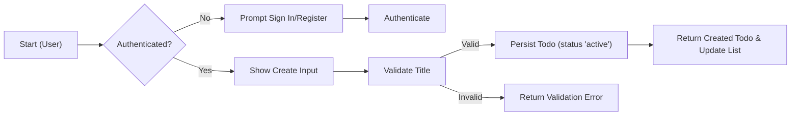
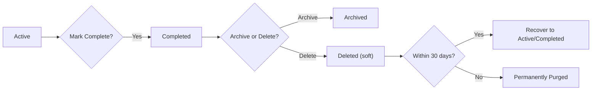

# 06 - Primary User Scenarios for todoApp

## Scope and Purpose
This file describes the required primary user scenarios for the todoApp MVP in business terms. It defines happy-path flows, EARS-formatted requirements, acceptance criteria, user-visible error handling, QA test cases, and measurable non-functional expectations. The content is written for product owners, backend developers, and QA teams to derive test cases and implementation behavior.

## Table of contents
- Assumptions and audience
- Roles and permissions
- Primary user stories
  - Register & Login
  - Create a todo
  - View/List todos
  - Edit a todo
  - Mark complete / incomplete
  - Delete and recover a todo
- EARS-formatted requirements (mapped)
- Acceptance criteria and measurable targets
- QA checklist and simple test cases
- Secondary flows and exceptions
- User-facing error messages and recovery steps
- Performance and non-functional expectations
- Mermaid diagrams
- Open decisions and glossary

## Assumptions and audience
- Audience: Product owners, backend developers, QA, support.
- Assumptions:
  - Authenticated accounts are required for persistence across devices (guest cannot persist todos).
  - Each todo is owned by exactly one user; no sharing in MVP.
  - Minimal attributes: title (required), description (optional), dueDate (optional), priority (optional: low/medium/high), createdAt, completedAt, status.
  - Soft-delete retention window: default 30 days (business default, confirmable).

## Roles and permissions (business-level)
- guest: view public landing and help. Cannot create or persist todos.
- user: registered authenticated user. Can create, read, update, mark complete/incomplete, soft-delete and recover their own todos.
- admin: operational role. Can suspend/reactivate accounts, view aggregated metrics, perform audited maintenance, and assist users; admin actions must be recorded in audit logs.

## Primary user stories and detailed happy-paths

### 1) Register & Login (Authentication)
Happy path:
- Visitor provides email and password and submits registration.
- System validates inputs, creates an account, optionally sends verification email, and allows authentication.
- User logs in, receives authenticated session enabling todo management.

EARS requirements:
- WHEN a visitor submits valid registration information, THE system SHALL create a new user account and allow authentication according to configured verification policy.
- WHEN a user submits valid login credentials, THE system SHALL authenticate the user and establish a session enabling CRUD operations on their todos.

Acceptance criteria:
- Registration with unused email and valid password returns success within 3 seconds.
- Login with correct credentials returns authenticated session within 2 seconds.
- Duplicate-email registration attempts return a clear error immediately.

Simple test cases:
- Register with fresh email → success, can login and create todo.
- Register with existing email → duplicate error.
- Login with wrong password → authentication error shown.

### 2) Create a todo (Quick Capture)
Happy path:
- Authenticated user enters a title (required) and optional fields and saves.
- System validates title (non-empty, max 250 chars), creates a todo with status "active", sets createdAt, and returns the created item.

EARS requirements:
- WHEN an authenticated user submits a new todo with a non-empty title, THE system SHALL create a TodoItem with status "active", set createdAt to the current timestamp, and return the created item to the caller.
- IF the submitted title is empty or whitespace-only, THEN THE system SHALL reject the create request and return a user-facing validation error specifying that "title" is required.

Acceptance criteria:
- Valid create: created todo appears in the user's default list within 2 seconds (95th percentile under normal conditions).
- Invalid title: user sees validation error and the item is not created.

Simple test cases:
- Create with title only (expect success)
- Create with empty title (expect validation error)
- Create with title length 300 (expect validation error for >250)

### 3) View / List todos
Happy path:
- Authenticated user requests their todo list.
- System returns user's active todos ordered newest-first by default, supporting optional filters for completed or deleted states.

EARS requirements:
- WHEN an authenticated user requests their todo list, THE system SHALL return only todos owned by that user ordered newest-first and will paginate results for large lists.

Acceptance criteria:
- First page (up to 50 items) returns within 1 second median and within 2 seconds at 95th percentile in normal conditions.
- Users never see other users' todos.

Test cases:
- User with 3 todos sees them newest-first.
- User with zero todos receives an empty-state message.

### 4) Edit a todo
Happy path:
- User opens their todo, edits fields (title, description, dueDate, priority), and saves.
- System validates and persists updates, updates updatedAt, and returns the updated item.

EARS requirements:
- WHEN an authenticated user updates a todo they own with valid values, THE system SHALL apply the changes and update the modification timestamp.
- IF a user attempts to edit a todo they do not own, THEN THE system SHALL deny the request and return an authorization error.

Acceptance criteria:
- Valid edits appear within 2 seconds for P95 under normal load.
- Unauthorized edits are rejected with clear message.

Test cases:
- Edit title successfully.
- Attempt to edit another user's todo → authorization error.

### 5) Mark complete / incomplete
Happy path:
- User toggles completion; system sets status to "completed" and records completedAt; uncomplete clears completedAt and returns to "active".

EARS requirements:
- WHEN an authenticated user marks a todo as completed, THE system SHALL set status to "completed", set completedAt to the current timestamp, and persist the change.
- WHEN an authenticated user marks a completed todo as incomplete, THE system SHALL set status to "active" and clear completedAt.

Acceptance criteria:
- Toggle actions reflected in UI within 1 second under typical conditions.

Test cases:
- Mark todo complete and verify completedAt exists.
- Mark complete then uncomplete and verify completedAt is cleared.

### 6) Delete and recover a todo
Happy path:
- User deletes a todo; system soft-deletes it, sets status "deleted" and DeletedAt, removes it from active list, and allows restore within retention window (30 days).

EARS requirements:
- WHEN an authenticated user deletes a todo they own, THE system SHALL mark the todo as "deleted", set DeletedAt to timestamp, and remove it from default active lists. THE system SHALL allow recovery within 30 days.
- WHEN a user requests restore of a deleted todo within retention period, THE system SHALL set status back to "active" (or "completed" if CompletedAt exists) and clear DeletedAt.

Acceptance criteria:
- Deleted items do not appear in active lists and are recoverable within retention window.
- Permanent purge happens only after retention window elapses (administrative purge accepted).

Test cases:
- Delete todo and verify absence from active list.
- Restore within 30 days → todo present.
- Attempt restore after 30 days → not recoverable.

## EARS-formatted requirements (summary mapping)
- WHEN a visitor registers with valid information, THE system SHALL create a user account and allow authentication.
- WHEN a user creates a todo with a valid title, THE system SHALL create a TodoItem with status "active" and set createdAt.
- IF a create/update request contains invalid input (empty title, invalid due date, invalid priority), THEN THE system SHALL return field-level validation errors describing the failure.
- WHEN a user attempts to access or modify a todo they do not own, THEN THE system SHALL deny the request and return an authorization error.
- WHEN a user deletes a todo, THE system SHALL soft-delete and preserve it for 30 days for recovery, and THE system SHALL permit admins to permanently purge per policy.

## Acceptance criteria and measurable targets
- Response time: primary actions (create/read/update/delete/toggle) SHALL reflect changes to the user within 2 seconds at the 95th percentile under normal load.
- List retrieval: first page (<=50 items) SHALL return within 1 second median and 2 seconds P95 under normal load.
- Validation: title SHALL be required and max 250 characters.
- Retention: deleted items SHALL be recoverable for 30 days.
- Auth: registration and login SHALL complete within 3 seconds and 2 seconds respectively under typical conditions.

## QA checklist and simple test cases
For each primary story, QA must validate: happy path success, common validation failures, unauthorized access, performance targets, and recovery behavior.

Example checklist entries:
- Registration success and duplicate-email rejection
- Login success and wrong-password handling
- Create todo with valid and invalid titles
- Edit todo owned vs not owned
- Mark complete/uncomplete state transitions and timestamps
- Delete → restore within retention window
- Deleted items purge after retention window (operational test)

## Secondary flows and exceptions

### Offline & Sync
- WHEN a user acts while offline, THE client SHALL queue changes locally and present a "pending sync" indicator. WHEN connectivity is restored, THE client SHALL attempt to sync queued changes and present success or conflict prompts.

### Concurrent edits and conflict handling
- IF two updates to the same field occur concurrently, THEN THE system SHALL surface a conflict to the user indicating both versions and choices to resolve (Keep Mine, Keep Other, Edit). For MVP a last-write-wins may be used with an operational log; however, user-visible conflict prompts are recommended.

### Rate limiting and abusive behavior
- WHEN a user exceeds write rate limits (e.g., 10 writes/min by default), THEN THE system SHALL return a rate-limit error with retry-after guidance.

## User-facing error messages and recovery steps
- Validation error: "Please enter a title. Title must be 1-250 characters." [Focus title input]
- Auth required: "Please sign in to manage your todos." [Sign In]
- Session expired: "Your session expired. Sign in again to continue. Your changes are preserved for retry." [Sign In]
- Offline pending: "You're offline. Changes are saved locally and will sync when you reconnect." [Retry Sync]
- Rate limit: "You're making requests too quickly. Please wait X seconds and try again." [Retry Later]
- Permanent delete: "This item has been permanently deleted and cannot be recovered." [Contact Support]

## Performance and non-functional expectations
- User-facing performance: P95 for primary actions <= 2 seconds; median list retrieval <= 300 ms for <=50 items.
- Availability: target 99.9% uptime for MVP; operations to define scheduled maintenance windows.
- Backup & retention: backups executed to meet RPO <= 1 hour and RTO <= 4 hours at business level; deleted-item retention 30 days.

## Mermaid diagrams
Create flow:

Lifecycle flow:

## Open decisions (to confirm with product)
- Confirm whether email verification is mandatory before enabling todo creation for new accounts.
- Confirm soft-delete retention window (default 30 days recommended).
- Decide whether conflict resolution for concurrent edits must offer interactive UI (recommended) or rely on server-side last-write-wins for MVP.
- Confirm exact rate-limit thresholds and account lockout policy for authentication failures.

## Glossary
- P95: 95th percentile
- Active: todo is visible in primary list and editable
- Completed: todo has been marked done; CompletedAt timestamp set
- Deleted: todo is soft-deleted and recoverable during retention window

