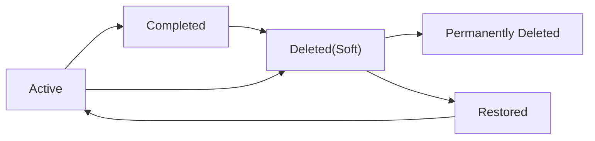

# todoApp — Requirements Analysis Report

## Executive Overview

todoApp provides a minimal, single-user-focused Todo list experience that enables fast capture, reliable persistence, and predictable task lifecycle management. The target audience for this report is product owners, backend developers, QA, and operations. The goal is to define the business-level requirements necessary to build an MVP that supports authenticated personal task lists with soft-delete recovery and basic administrative controls.

## Scope and Assumptions

- In scope (MVP): authenticated user accounts, create/read/update/delete (CRUD) for personal todos, mark complete/uncomplete, soft-delete with 30-day recovery window, optional fields (description, dueDate, priority), admin suspend/reactivate and audit logging.
- Out of scope (MVP): collaboration/sharing, tags/projects, complex recurrence, attachments, push/email reminders (deferred).
- Assumptions: authenticated persistence is required for cross-device sync; guests can view landing content only and cannot persist todos.

## Goals and Success Metrics (KPIs)

- Activation: >= 40% of new accounts create at least one todo within 7 days.
- Retention: 7-day retention >= 25%, 30-day retention >= 10% among users who created a todo.
- Time-to-first-task: median <= 2 minutes from registration.
- Reliability: create/update/delete success rate >= 99.5% under normal load.
- Performance: 95th percentile for common operations (create/list/update/delete) <= 2 seconds.

## User Roles and Personas

Roles (business-level):
- guest: view public content only. Cannot persist todos.
- user: authenticated person; owns todos; can create/read/update/delete/complete/recover their own todos.
- admin: operational role; can suspend/reactivate users, view aggregated metrics, and perform recovery/maintenance actions. Admin actions MUST be auditable.

Personas:
- Quick-Capture Carla: needs instant entry and simple completion toggles.
- Sync Sam: needs persistence across devices and reliable sign-in.
- Support Admin: needs audit trails and ability to suspend/reactivate accounts.

Permission matrix (business view):
- Create todo: guest ❌, user ✅, admin ✅ (audited)
- Read own todos: guest ❌, user ✅, admin ✅ (for support/audit)
- Update own todos: guest ❌, user ✅, admin ✅ (audited)
- Delete own todos: guest ❌, user ✅, admin ✅ (audited)
- Manage users: guest ❌, user ❌, admin ✅

## Primary User Scenarios (Happy Paths)

Scenario 1 — Register & Login
- WHEN a visitor registers with a valid email and password, THE system SHALL create an account (unverified or verified per business policy) and allow authentication.
- Acceptance: new user can sign in and persist todos.

Scenario 2 — Create Todo (Quick Capture)
- WHEN an authenticated user submits a new todo with a non-empty title, THE system SHALL persist a TodoItem with state "active" and createdAt timestamp and return it for immediate display.
- Acceptance: created todo appears in the list within 2 seconds for 95% of requests.

Scenario 3 — Edit Todo
- WHEN an authenticated user edits fields of a todo they own, THE system SHALL apply the changes and set updatedAt.
- Acceptance: updated fields are visible within 2 seconds.

Scenario 4 — Complete/Uncomplete
- WHEN an authenticated user toggles completion, THE system SHALL set the completed flag and completedAt (or clear it when uncompleting).
- Acceptance: toggles reflect in the UI and persistence within 2 seconds.

Scenario 5 — Delete and Recover
- WHEN an authenticated user deletes a todo, THE system SHALL mark it as "deleted" (soft-delete) and retain it for 30 days for recovery; within that window the user SHALL be able to restore the todo.
- Acceptance: deleted items are removed from active lists and appear in a recoverable view until permanence.

Scenario 6 — Admin Maintenance
- WHEN an admin suspends a user, THE system SHALL prevent the suspended user from authenticating and record the admin action in audit logs.
- Acceptance: suspended user cannot log in and action is auditable.

## Functional Requirements (EARS format)

Accounts & Authentication

- WHEN a visitor submits registration with valid credentials, THE system SHALL create a new user account and allow authentication according to the account verification policy.

- WHEN a user submits valid login credentials, THE system SHALL authenticate the user and issue session tokens to enable account-scoped operations.

- IF an unauthenticated actor attempts a todo-management action, THEN THE system SHALL deny the request and present an authentication-required message.

Todo Lifecycle

- WHEN an authenticated user creates a todo with a valid title, THE system SHALL persist a TodoItem with status "active", set createdAt to the current timestamp, and return the created item to the user.

- IF a create or update request contains an empty title, THEN THE system SHALL reject the request and return a validation error stating "Title is required".

- WHEN an authenticated user marks a todo complete, THE system SHALL set status to "completed" and set completedAt to the current timestamp.

- WHEN an authenticated user marks a completed todo as uncomplete, THE system SHALL set status to "active" and clear completedAt.

- WHEN an authenticated user deletes a todo, THE system SHALL mark it as "deleted" and retain it for a 30-day recovery window; after the retention window, THE system SHALL consider it eligible for permanent purge.

- WHEN a user requests a list of todos, THE system SHALL return only todos owned by that user, ordered newest-first by default, and SHALL support optional filtering by state (active/completed/deleted).

Administrative

- WHEN an admin performs an action that affects user data or account state, THE system SHALL record an audit entry including admin identifier, action type, target user, timestamp, and optional reason.

Validation & Input Constraints

- WHEN a title is provided, THE system SHALL accept non-empty strings up to 250 characters. Titles exceeding the limit SHALL be rejected with a validation error.

- WHEN a dueDate is provided, THE system SHALL accept ISO 8601 date-only or date-time values and SHALL validate the format.

Security & Privacy (business-level)

- WHEN a user requests account deletion, THE system SHALL follow the retention and deletion policy and remove or anonymize personal data within the stated business timeframe unless legal hold applies.

- WHILE a user is authenticated, THE system SHALL ensure that the user only sees todos they own.

## Authentication & Session Management (Business Guidance)

- Token model (business-level): THE system SHALL use access tokens for short-lived API access and refresh tokens for session continuation. Recommended business defaults: access token ~20 minutes, refresh token ~14 days. Exact implementation details (storage, signing) are left to implementers.

- WHEN a user requests to revoke all sessions, THE system SHALL invalidate refresh tokens and require re-authentication on all devices.

- WHEN an admin suspends an account, THE system SHALL invalidate active refresh tokens for that account.

## Non-Functional Requirements (Business Targets)

Performance
- WHEN a user performs a common operation (create/list/update/delete), THE system SHALL reflect the result and make it visible within 2 seconds for 95% of requests under normal load.

Availability & Reliability
- THE service SHALL target 99.9% uptime (monthly) for core user flows, excluding scheduled maintenance.

Backup & Recovery
- THE system SHALL maintain backups with an RPO <= 1 hour and an RTO <= 4 hours for critical data recovery for MVP-scale incidents.

Security & Compliance
- Admin audit logs SHALL be retained for at least 365 days.
- Passwords and secrets SHALL be protected per industry best practices (implementation detail to engineering).

Scalability & Rate Limiting
- THE system SHALL rate-limit write operations to protect service health; recommended MVP rate: 10 writes/min per user with clear errors and retry guidance.

## Data Flow & Lifecycle (Conceptual)

States: Active -> Completed -> Deleted(soft) -> Purged

Business rules:
- Soft-deleted items are recoverable for 30 days. After 30 days they become eligible for permanent purge.
- Archived behavior is optional and deferred to post-MVP decisions.

## Secondary Scenarios & Error Handling

Offline and Sync
- WHEN a user attempts to create/update while offline, THE system (or client) SHALL queue changes and attempt automatic synchronization when connectivity returns; the UI SHALL show a pending-sync indicator.

Conflict Resolution
- WHEN concurrent edits occur, THE system SHALL prefer last-writer-wins for MVP but SHALL surface conflicts to the user where an overwrite would lose visible work; future iterations should add explicit conflict resolution UI.

Validation Errors
- IF input validation fails, THEN THE system SHALL present a clear field-level message (e.g., "Title is required", "Due date format invalid").

Transient Failures
- IF a transient persistence error occurs, THEN THE system SHALL notify the user, preserve client-side input where possible, and advise retry.

Rate Limiting & Abuse
- WHEN rate limits are exceeded, THE system SHALL return a clear rate-limit error including a suggested retry delay.

Delete Undo
- WHEN a user deletes a todo, THE UI SHALL present an immediate undo affordance for 30 seconds to restore the item to Active.

## Acceptance Criteria and QA Mapping

For each primary scenario provide a concise acceptance test:
- Create Todo: Given authenticated user and valid title, when create is submitted, then the item appears in the list within 2 seconds.
- Edit Todo: Given ownership and valid edits, when edit submitted, then updated fields appear within 2 seconds.
- Complete Toggle: Given ownership, when toggled complete, then completedAt exists and item moves to completed view.
- Delete & Recover: Given ownership, when delete performed, then item removed from active list and recoverable within 30 days.
- Auth: Given valid credentials, when login performed, then user receives tokens and may perform CRUD.

## Open Decisions and Stakeholder Confirmations

- Email verification at sign-up: REQUIRED or OPTIONAL? Recommendation: require verification for production, optional for early testing.
- Soft-delete retention: default 30 days recommended; confirm with operations/legal.
- DueDate and Priority: include as optional in MVP or defer? Recommendation: include them as optional fields hidden behind "Add details".
- Undo window for delete: recommended 30 seconds; confirm desired UX.

## Appendix

Glossary: TodoItem, ownerId, active/completed/deleted, RPO, RTO, KPI definitions.

Change log template:
- Version: 1.0
- Date: YYYY-MM-DD
- Author: [product]
- Summary: Initial requirements analysis for todoApp MVP.

Contact points: Product Owner, Engineering Lead, QA Lead (placeholders to be filled by project team).

