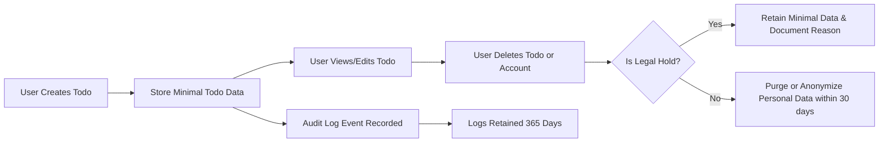
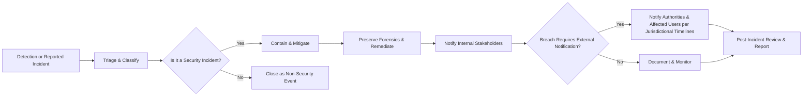

# 07 - Security, Privacy, and Compliance Requirements for todoApp

## 1. Document Purpose and Scope
This document defines business-level security, privacy, and regulatory compliance requirements for the todoApp service. It describes WHAT security and privacy outcomes the system must achieve, which legal obligations the service must satisfy, and which audit, logging, and incident response behaviors are expected. This document does not prescribe technical implementation details such as algorithms, specific libraries, or infrastructure choices.

This document provides business requirements only. All technical implementation decisions belong to developers and security engineers who translate these requirements into secure designs and controls.

## 2. Audience and Related Documents
Audience:
- Security and privacy teams
- Legal and compliance stakeholders
- Backend development team
- Operations and SRE teams
- Product owners and QA

Related documents:
- User Actor Definitions and Authentication Requirements (03-user-actors.md)
- Non-functional Requirements (06-non-functional-requirements.md)
- Functional Requirements (04-functional-requirements.md)
- Data Flow and Lifecycle (08-data-flow-and-lifecycle.md)

## 3. Executive Summary (Business Justification)
Business justification for these requirements:
- Trust and Liability Reduction: todoApp stores user-generated task data and optional metadata (due dates, priorities). Protecting personal data reduces legal risk and increases trust, which is essential for user retention.
- Market Differentiation: A clearly articulated privacy and compliance posture can be a differential for enterprise or privacy-conscious users.
- Minimum Viable Compliance: For initial launch, todoApp must satisfy basic cross-jurisdictional obligations (notice, rights to access and deletion, breach notification timelines) to avoid regulatory fines and reputational harm.

Success measures (business KPIs tied to these requirements):
- No regulatory findings for GDPR/CCPA within first 24 months of operation for covered users
- Time-to-notify users of a qualifying breach: within defined SLA (see Incident Response section)
- 100% of user access and deletion requests responded to within measurable SLA (see Acceptance Criteria)

## 4. Privacy Principles and Data Minimization
This section establishes the core privacy commitments and the minimum dataset that todoApp will collect, retain, and process.

### 4.1 Data Classification and Minimum Dataset
- Purpose: Establish which categories of data the service collects and why.
- Minimum dataset for normal user operation:
  - Account identifier (unique id); used only for identity and ownership purposes
  - Authentication credentials metadata (e.g., salt/verification state) — stored only to maintain authentication state
  - Todo items: title, optional description, completion status, optional due date, optional priority, optional tags
  - List metadata: list name, visibility setting (private/public), owner reference, collaborators reference
  - Audit metadata: timestamps for creation, modification, deletion; actor id responsible for change
  - Optional sharing metadata when a list is made public or shared with collaborators
  - Minimal contact information required for account management: email address for notifications and account recovery

### 4.2 Data Minimization Rules
WHEN a new user account is created, THE system SHALL collect only the minimum data required to operate the account and provide the service.

WHEN a user creates a todo item, THE system SHALL record only the fields explicitly provided by the user and the required audit metadata.

WHERE optional features (e.g., public sharing, email notifications) are enabled by the user, THE system SHALL collect only the additional data necessary to support that feature (e.g., public flag, recipient email), and SHALL provide a clear choice to the user.

### 4.3 Retention and Deletion Policies
THE system SHALL retain todo items and associated metadata only for as long as the user requires the service or until retention rules (e.g., account deletion, legal hold) apply.

WHEN an authenticated user requests deletion of their account, THE system SHALL mark the account and associated personal data for deletion and SHALL complete erasure of personal data within 30 calendar days, except to the extent retention is required by law or legitimate business needs (see exceptions below).

IF data is subject to a legal hold or active investigation, THEN THE system SHALL suspend deletion for the minimal period necessary and SHALL notify internal governance teams.

### 4.4 User Rights (Access, Portability, Deletion, Rectification)
The service makes the following business commitments regarding user rights:
- WHEN a user requests a copy of their personal data, THE system SHALL provide a machine-readable export of their personal data and todos within 30 calendar days.
- WHEN a user requests deletion, THE system SHALL delete or anonymize personal data within 30 calendar days unless a lawful exception applies.
- WHEN a user requests rectification of inaccurate personal data, THE system SHALL update the data and confirm the rectification to the requester within 14 calendar days.
- WHEN a user requests restriction of processing for their account, THE system SHALL implement the restriction for the specified data and comply with the request within 14 calendar days.

Authentication of Rights Requests: THE system SHALL require verification of identity prior to fulfilling requests that expose or modify personal data; the verification method is an implementation detail left to developers but the business requirement is that identity is verified to a reasonable assurance level before data is released or deleted.

## 5. Authentication and Authorization High-level Requirements
This section describes business-level requirements for how actors authenticate and what authorization behaviors the system must enforce.

### 5.1 Actor Responsibilities
- guest: May view public information and public lists only. Guests SHALL NOT be able to create or persist personal todos.
- todoUser: May register, authenticate, and perform actions on their own resources; may share lists and invite collaborators.
- admin: May perform moderation and user lifecycle actions required for compliance and abuse mitigation; admin SHALL NOT access private user content except as required for moderation and only when authorized and audited.

### 5.2 Session and Token Business Rules
THE system SHALL ensure that authenticated sessions expire after a bounded period of inactivity to reduce risk of unauthorized access. The specific technical token format and lifetimes are implementation matters; the business requirement is that session inactivity expiration be configurable and default to a conservative timeframe (for example, no longer than 30 days for persistent sessions and 30 minutes for interactive sessions) unless the user explicitly selects a longer persistent session option.

WHEN a user revokes access or logs out, THE system SHALL invalidate the subject's active sessions in a way that prevents use of those sessions for further access.

WHEN a credential reset is performed (password reset or equivalent), THE system SHALL invalidate all existing authentication sessions for the affected account unless the user explicitly retains certain devices via a recognized and authenticated flow.

### 5.3 Access Control and Permissioning
THE system SHALL implement ownership-based access controls for todo lists and items: only the owner and explicitly invited collaborators SHALL be able to modify a private list.

WHEN a list is marked as public, THE system SHALL allow read-only access to the public list without authentication, but write operations SHALL remain restricted to owner and collaborators.

WHEN an admin performs moderation actions that require access to user content, THE system SHALL record the action in the audit logs with actor id, reason, and timestamp and SHALL require that administrative access is justified by a business reason.

## 6. Regulatory Compliance Considerations
This section outlines the primary regulatory frameworks and the business obligations todoApp must satisfy.

### 6.1 GDPR (European Users)
- Territorial scope: For users residing in the EU or where processing activities fall under GDPR, THE service SHALL comply with GDPR obligations regarding lawful basis for processing, data subject rights, data minimization, and breach notification.

- Data Subject Rights: THE system SHALL provide mechanisms to exercise rights including access, rectification, erasure (right to be forgotten), restriction of processing, data portability, and objection to processing where applicable.

- Lawful Basis: THE business SHALL document the lawful basis for each processing activity (e.g., consent, contract performance) and SHALL be able to demonstrate compliance on request.

- Data Processing Agreements: WHERE third parties process personal data on behalf of todoApp, THE business SHALL require appropriate data processing agreements and due diligence.

### 6.2 CCPA / CPRA (California Residents)
- Business commitments: THE business SHALL respond to verifiable consumer requests to know, delete, and opt-out of sale (where applicable) within prescribed timeframes; for initial MVP, todoApp SHALL treat 'sale' narrowly and SHALL document any intent to monetize personal data.

- Opt-out and Do Not Sell: WHERE any business decision constitutes a sale under CCPA, THE system SHALL provide a do-not-sell mechanism and honor opt-out requests.

### 6.3 International Data Transfers
- WHERE personal data is transferred across borders, THE business SHALL document transfer mechanisms and ensure appropriate safeguards (e.g., contractual or other recognized legal instruments) when required by applicable law.

### 6.4 Minimal Legal Controls for Other Jurisdictions
- THE business SHALL track where users reside and ensure that country-specific obligations (e.g., breach notification timelines, local data residency requirements) are identified and handled by legal and operations teams.

## 7. Audit and Logging Requirements (Business-level)
This section establishes which events must be recorded and how the organization will handle audit data.

### 7.1 Events to Record
THE system SHALL record, at a minimum, the following event types with sufficient context to support security investigations and compliance audits:
- Authentication events: successful login, failed login, password reset requests, token revocations
- Authorization events: attempts to access protected resources that are denied, privilege escalation actions
- Resource lifecycle events: create, read, update, delete of lists and todos (including actor id and timestamps)
- Sharing and visibility changes: when a list is shared, made public, or collaborators are added/removed
- Administrative and moderation actions: user suspension, reactivation, content removal
- Data export and rights fulfillment events: when a user requests export, deletion, or rectification
- Incident and alert events: detection alerts, containment actions, and remediation steps

### 7.2 Retention, Access, and Protection for Logs
THE system SHALL retain security-relevant logs for a minimum of 365 days to support investigations and potential legal requirements.

WHERE logs contain personal data, THE system SHALL ensure that access to logs is limited to authorized roles and that access is recorded.

### 7.3 Audit Trail Integrity and Review Cadence
THE system SHALL support periodic reviews of audit trail data. THE business SHALL define a review cadence for access and administrative actions (for example: a quarterly review of privileged access actions and a monthly review of failed authentication spikes) and SHALL document findings and remediation steps.

## 8. Incident Response and User Notification Policies
This section defines what qualifies as an incident and the notification and remediation SLAs that todoApp commits to from a business perspective.

### 8.1 Incident Classification and Detection
- Business definition: A 'security incident' is any confirmed or suspected event that compromises the confidentiality, integrity, or availability of user data or the service.

- WHEN an event is detected that meets the business definition of a security incident, THE organization SHALL initiate the incident response process immediately.

### 8.2 Containment, Remediation, and Forensics
- WHEN an incident is confirmed, THE organization SHALL take reasonable steps to contain the incident, remediate the root cause, and restore normal operations.

- THE organization SHALL collect and preserve forensic evidence in a manner that maintains chain-of-custody sufficient for legal review when required. (This is a business obligation; the technical methods are out of scope for this document.)

### 8.3 Notification Timelines and Content
- When user personal data is compromised and the incident qualifies as a breach under applicable law, THE organization SHALL notify affected users without undue delay and in any case within regulatory timeframes required by applicable law.

- WHEN the data breach impacts users in jurisdictions covered by GDPR, THE organization SHALL notify the relevant supervisory authority within 72 hours of becoming aware of the breach, unless the breach is unlikely to result in a risk to the rights and freedoms of natural persons.

- WHEN the data breach impacts California residents in ways that trigger CCPA notification obligations, THEN THE organization SHALL follow the CCPA timing and verbiage requirements for notifications.

- Notifications to users SHALL include, at minimum: a description of the nature of the incident, the types of personal data affected, likely consequences, measures taken or planned to address the incident, and contact information for further inquiries.

### 8.4 Post-incident Review and Reporting
THE organization SHALL conduct a post-incident review for every confirmed incident to identify root cause, remediation effectiveness, and actions to prevent recurrence. THE organization SHALL document the review and track remediation tasks to completion.

## 9. Risk and Control Matrix (High-level)
This section maps common risks to required business controls. It is written to guide implementation planning and prioritization.

| Risk | Required Business Control | Acceptance Criteria |
|------|--------------------------|---------------------|
| Unauthorized access to private lists | Ownership-based access control; session expiration; logged admin access | Access attempts by unauthorized users are denied; logs show access attempts |
| Data exfiltration via export feature | Rights fulfillment verification; rate limiting for exports; export logging | Exports are only produced after verified requests; all exports are logged |
| Failure to respond to user rights requests | SLA-backed request handling, verification of requester identity | 95% of requests completed within defined SLA (30 days for export/deletion) |
| Unreported breach | Incident classification & notification process; regulatory timelines defined | Breaches requiring notification are reported within regulatory timelines |

## 10. Acceptance Criteria and Compliance Tests
This section lists measurable, business-level acceptance tests developers, QA, and auditors can use. Each acceptance item is phrased in testable terms.

- WHEN a user requests export of their data, THE system SHALL produce a machine-readable export within 30 calendar days and record the export event in audit logs.

- WHEN a user requests account deletion, THE system SHALL begin deletion of personal data within 30 calendar days (unless lawful hold applies) and SHALL record the deletion event in audit logs.

- WHEN an admin accesses a private user's content for moderation, THE system SHALL record the admin id, timestamp, and reason and make this record available for audit review.

- WHEN a user changes their password or resets credentials, THE system SHALL invalidate existing sessions per business session rules and SHALL log the event.

- THE system SHALL retain security-relevant logs for at least 365 days and SHALL allow authorized reviewers to export log summaries for audit.

## 11. Glossary
- Personal Data: Any information relating to an identified or identifiable natural person.
- Processing: Any operation performed on personal data, such as collection, storage, use, disclosure, or deletion.
- Data Controller / Data Processor: Legal roles to be assigned by the business; the todoApp business SHALL document these roles in contractual instruments.
- Legal Hold: A temporary suspension of data deletion due to legal or investigative requirements.

## 12. Mermaid Diagrams
Data lifecycle (conceptual):

Incident response flow (conceptual):

## 13. Constraints, Assumptions, and Out-of-Scope
- Constraints:
  - This document is business-level and does not mandate technical controls such as specific cryptographic algorithms, libraries, or infrastructure configurations.
  - Timelines (e.g., 30-day deletion) are business SLAs and may require legal review by jurisdiction.

- Assumptions:
  - The service operates globally; jurisdiction-specific obligations will be tracked by legal.
  - Users will be able to initiate rights requests via API or user interface (UI specifics are out of scope).

- Out-of-scope:
  - Implementation details for encryption, key management, specific logging tools, and API designs.

## 14. Statement on Document Scope and Developer Autonomy
This document defines business requirements only. All technical implementation decisions (architecture, APIs, data storage, encryption algorithms, logging frameworks, and other implementation details) are the responsibility of the development and security engineering teams.

> *Developer Note: This document defines business requirements only. All technical implementations (architecture, APIs, database design, etc.) are at the discretion of the development team.*
