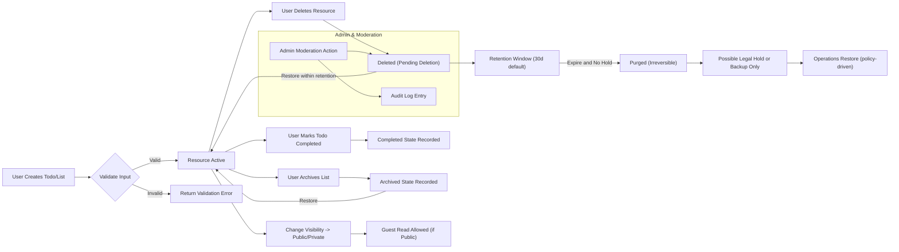
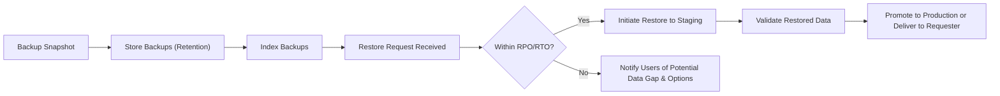

# Data Flow and Lifecycle - todoApp

## Executive Summary

todoApp manages user-created todo lists and individual todo items through a clearly defined lifecycle from creation to permanent purge. The lifecycle is designed to provide fast, deterministic user experiences while offering safety nets (soft-delete, restore), compliance controls (legal hold, audit trail), and operational recoverability (backup and restore). Each business rule below is measurable and testable using EARS phrasing where applicable to ensure unambiguous developer and QA acceptance.

## Business Rationale and Success Metrics

- Primary business goals:
  - Provide users with predictable and reversible control over their data to minimize accidental loss and support trust and retention.
  - Ensure compliance with legal and regulatory retention needs while providing straightforward user-driven deletion and export capabilities.
  - Maintain user-perceived performance for core operations.

- Success metrics (business-measurable):
  - Data restore success rate >= 99.9% for user-initiated restores within retention windows.
  - 95th percentile latency for common CRUD operations (create, update, toggle complete) < 500 ms under normal load.
  - Soft-delete restores completed within 24 hours for 99% of requests where synchronous restore is not possible.

## Actors and Ownership (Business Terms)

- todoUser: Authenticated user who creates and owns lists and todos. THE owner SHALL have exclusive rights to change visibility, invite collaborators, archive, delete, restore, and transfer ownership (subject to acceptance by the transferee).
- guest: Unauthenticated visitor who may view public lists only.
- collaborator: Registered user invited and accepted to a list with role-limited permissions (read-only or read-write as granted by the owner).
- admin: Platform operator with authorized moderation and legal/compliance actions (suspend/reactivate accounts, moderate content, apply legal holds). Admin actions SHALL be logged and auditable.

EARS sample:
- WHEN a new list is created by a todoUser, THE todoApp SHALL record the todoUser as the owner and SHALL set default visibility to "private".

## Conceptual Resource Model

- List: Business object representing collection of todos. Business-visible fields: title, description, visibility (private/shared-invite-only/public), ownerId, createdAt, updatedAt.
- Todo: Business object representing a task. Business-visible fields: title (required), description (optional), createdAt, updatedAt, completedFlag, completedAt (optional), dueDate (optional), priority (enum: low/medium/high/urgent), tags (0..10), softDeleteFlag, softDeleteTimestamp.

Business validation rules (examples):
- WHEN a todoUser creates a todo, THE todoApp SHALL require a non-empty title (1..200 chars) and SHALL trim whitespace. IF validation fails, THEN the system SHALL return a field-level error describing the issue.

## Lifecycle States (Business-level)

Resources move between the following states in business terms. All state transitions SHALL be auditable and timestamped.

- Active — default state after creation. Resource is visible to owner subject to visibility rules.
- Completed (Todo-specific sub-state) — completedFlag=true with completedAt timestamp recorded.
- Archived — owner-hidden from default views; restorable by owner.
- Deleted (Pending Deletion / Soft-Deleted) — hidden from default views; restorable by owner within retention window.
- Purged (Irreversible) — removed from normal recovery mechanisms; may persist in backups for legal reasons.
- SuspendedHold — administrative or legal hold applied to the account or resource; prevents purge and owner-initiated immediate purge until hold is released.

EARS-formulated rules (representative):
- WHEN a todoUser deletes a resource, THE todoApp SHALL set the resource state to "Deleted" and start the retention timer (default 30 days).
- IF a resource is marked "SuspendedHold", THEN THE todoApp SHALL disallow purge operations until the hold is removed and SHALL make the hold reason auditable.

## State Transition Table and Triggers

- Create -> Active
  - WHEN a todoUser creates a list or todo with valid inputs, THE todoApp SHALL persist the resource and set createdAt and updatedAt. Acceptance: the resource SHALL be visible to the owner within 500 ms for 95% of requests.

- Active -> Completed
  - WHEN the owner or an authorized collaborator marks a todo complete, THE todoApp SHALL set completedFlag=true and record completedAt.

- Active -> Archived
  - WHEN the owner archives the resource, THE todoApp SHALL set Archived and hide it from default views; owner may restore.

- Active/Archived -> Deleted (Soft-Delete)
  - WHEN the owner deletes the resource, THE todoApp SHALL transition it to Deleted and start the retention timer (default 30 days). Acceptance: resource becomes hidden immediately from default views.

- Deleted -> Active (Restore)
  - WHEN the owner restores within retention, THE todoApp SHALL reinstate the resource to Active (or Completed if previously completed) and clear deletion flags. Acceptance: restore acknowledged immediately and completed within 24 hours for 99% of cases.

- Deleted -> Purged
  - IF the retention timer expires and no legal hold applies, THEN THE todoApp SHALL purge the resource from primary systems and mark it as Purged. Acceptance: resource is not restorable through standard UI.

- Any State -> SuspendedHold
  - WHEN admin applies legal or moderation hold, THE todoApp SHALL record hold reason and prevent purge until hold removed.

- Ownership Transfer
  - WHEN owner initiates transfer and the target accepts, THEN THE todoApp SHALL change ownerId reliably and SHALL retain the previous owner as collaborator unless explicitly removed.

## Retention, Archival and Purge Policies (Business Defaults)

Default retention numeric values (business-configurable):
- Soft-delete retention window: 30 calendar days (default). WHERE paid tiers apply, THE organization MAY offer extended retention (e.g., 365 days).
- Archive retention: 365 days default for archived lists.
- Account deletion grace period: 30 calendar days before permanent purge.
- Immediate permanent delete (owner-initiated): Allowed only when no legal hold applies; THE todoApp SHALL begin purge within 7 calendar days and complete primary-store removal within that timeframe.

EARS rules (measurable):
- WHEN a todoUser deletes a resource, THE todoApp SHALL retain it in Deleted state for 30 days and SHALL allow restoration by the owner during that period.
- IF account deletion is requested, THEN THE todoApp SHALL mark the account pending deletion and proceed to permanent deletion after 30 days unless a legal hold exists.

## Backup and Restore Business Expectations

- THE business SHALL maintain backups sufficient to meet a business Recovery Point Objective (RPO) of 24 hours and a Recovery Time Objective (RTO) of 48 hours for full-service restores. Implementation details are out of scope.
- WHEN a user requests a self-service restore for a soft-deleted item within retention, THE todoApp SHALL complete the restore within 24 hours for 99% of requests; synchronous restores are preferred where possible for fast user recovery.
- WHEN operations perform a catastrophic restore, THE organization SHALL restore to a point no older than the RPO and SHALL notify affected users of any potential data-loss windows.

## Export, Portability and Compliance

- WHEN a todoUser requests an account export, THE todoApp SHALL produce a machine-readable export (lists, todos, timestamps, sharing metadata) within 30 calendar days and SHALL log the export event for audit.
- WHEN a todoUser requests deletion, THE todoApp SHALL honor the request within 30 calendar days and SHALL notify the user of any legal hold preventing deletion.

Acceptance: exports SHALL include all business-visible fields for the account at the export timestamp.

## Concurrency, Conflict Resolution and Idempotency (Business-Level)

- Default conflict policy: Last-writer-wins (LWW). THE todoApp SHALL record actor id and timestamp for each write so audit traces of overwrites exist.
- WHEN conflicts are likely to cause user confusion, THE todoApp SHALL surface conflict indicators and provide history access to the owner for manual reconciliation.
- Idempotency: WHEN a client submits a create operation with the same idempotency key, THE todoApp SHALL ensure only a single logical resource is created and return the same resource id.

EARS examples:
- IF two collaborators update the same todo field concurrently, THEN THE todoApp SHALL apply last-writer-wins and record both attempted changes in the audit trail.

## Admin and Moderation Rules

- WHEN an admin suspends an account, THE todoApp SHALL revoke modification rights for that account and SHALL make public lists unavailable to guests until review.
- WHEN admin removes content for policy reasons, THE todoApp SHALL transition the resource to Deleted and SHALL record the admin id, reason, and timestamp in audit logs.
- WHEN admin performs an irreversible purge for legal reasons, THEN THE todoApp SHALL log legal basis and notify the owner when permitted.

## Error Handling and User-Facing Recovery Flows

- Validation errors: IF required fields are missing or invalid, THEN THE todoApp SHALL reject with a clear, actionable error describing offending fields.
- Transient failures: IF transient backend errors occur during create/update, THEN THE todoApp SHALL allow idempotent retries and SHALL avoid duplicate visible items.
- Restore failures: IF a restore fails due to corruption or legal hold, THEN THE todoApp SHALL inform the owner, log the failure, and provide remediation options.

## Performance and SLA Expectations (User-Perceived)

- WHEN a todoUser performs core CRUD operations on a single todo, THE todoApp SHALL respond within 500 ms for 95% of requests under normal operating conditions.
- WHEN a restore is requested for a soft-deleted item, THE todoApp SHALL acknowledge immediately and SHALL complete successful restores within 24 hours for 99% of cases.

## Acceptance Criteria and Test Scenarios

Scenario 1 — Create and Visibility:
- GIVEN an authenticated todoUser
- WHEN the user creates a todo with valid title
- THEN THE todoApp SHALL persist the item and it SHALL appear in the owner's list within 500 ms for 95% of requests.

Scenario 2 — Soft Delete and Restore:
- GIVEN an owner deletes a todo
- WHEN the owner restores within 30 days
- THEN THE todoApp SHALL restore the item, including original timestamps, and it SHALL be visible to the owner; restore completes within 24 hours for 99% of cases.

Scenario 3 — Legal Hold prevents Purge:
- GIVEN a legal hold is applied to an account
- WHEN retention for a resource expires
- THEN THE todoApp SHALL NOT purge the resource and SHALL log the hold reason and actor.

Scenario 4 — Idempotent Create:
- GIVEN a client re-submits a create using the same idempotency key
- WHEN the server receives duplicate submissions
- THEN THE todoApp SHALL create only one todo and return the same resource id for both submissions.

## Mermaid Diagrams (Validated Syntax)

## Permission Matrix (Business Summary)

| Action | guest | owner (todoUser) | collaborator (read-only) | collaborator (read-write) | admin |
|---|:---:|:---:|:---:|:---:|:---:|
| View public list | ✅ | ✅ | ✅ | ✅ | ✅ |
| Create list/todo | ❌ | ✅ | ❌ | ✅ | ✅ (moderation) |
| Edit todo | ❌ | ✅ | ❌ | ✅ | ✅ (moderation) |
| Delete / Soft-delete | ❌ | ✅ | ❌ | ✅ (if granted) | ✅ (moderation/audit) |
| Restore deleted | ❌ | ✅ | ❌ | ❌ | ✅ (policy-driven) |
| Apply legal hold | ❌ | ❌ | ❌ | ❌ | ✅ (audit) |

## Governance and Policy Ownership

- THE Product Governance Board SHALL own lifecycle policy defaults (soft-delete retention, archive duration) and SHALL review policy annually.
- WHEN a retention policy changes that increases retention, THE Product Governance Board SHALL publish notice to users at least 30 days in advance and SHALL document business justification.

## Glossary

- Active, Archived, Deleted (Pending Deletion), Purged, SuspendedHold — lifecycle states defined above.
- RPO: Recovery Point Objective (business target).
- RTO: Recovery Time Objective (business target).
- LWW: Last-Writer-Wins (conflict resolution default).

## QA Checklist (Business Acceptance)

- Verify EARS-formatted requirements exist and are testable for create, delete, restore, purge, and legal hold.
- Confirm soft-deleted resources are hidden from default views and restorable within retention windows.
- Validate restore SLAs and typical restore times.
- Validate admin moderation actions are logged and auditable with reason and timestamp.
- Validate idempotent create behavior (client-generated idempotency keys) to prevent duplicates.

