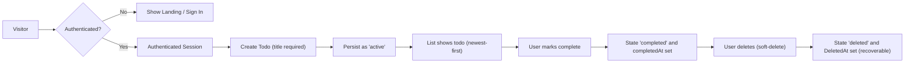
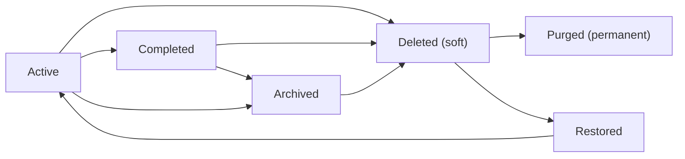

# 08 - Functional Requirements for todoApp (Enhanced)

## 1. Scope and purpose

This file defines the mandatory functional requirements for the minimal todoApp MVP. The primary focus is a single-user-per-account model where authenticated users can create, view, update, complete/uncomplete, soft-delete, and export personal todo items. Requirements are stated in business language and use EARS phrasing for testability. Implementation details such as database schemas, API endpoint signatures, or specific cryptographic libraries are intentionally omitted.

## 2. Audience and related documents

Primary audience: backend developers, QA engineers, product owners, and operations. Related artifacts:
- Service Overview (01-service-overview.md) — business goals and KPIs
- User Roles and Personas (05-user-roles-and-personas.md) — role definitions and authentication expectations
- Primary User Scenarios (06-primary-user-scenarios.md) — happy paths and user stories
- Data Flow and Lifecycle (10-data-flow-and-lifecycle.md) — lifecycle states and retention
- Non-Functional Requirements (09-non-functional-requirements.md) — performance and availability targets

## 3. MVP boundaries and non-goals

- In scope: authenticated user accounts, per-user todo CRUD, completion toggles, soft-delete with recoverability, basic admin maintenance (suspend/reactivate), audit logging for admin actions, optional export (CSV/plain text).
- Out of scope for MVP: sharing/collaboration, attachments, complex recurrence, advanced search and tags, push/email reminders (optional later), project/group features.

## 4. Roles and permission matrix (business-level)

Roles: guest, user, admin. Permission mapping (business view):

- Create todo: guest ❌ | user ✅ | admin ✅ (audited)
- Read own todos: guest ❌ | user ✅ | admin ✅ (audited, for support)
- Update own todos: guest ❌ | user ✅ | admin ✅ (audited)
- Delete (soft) own todos: guest ❌ | user ✅ | admin ✅ (audited)
- Hard purge permanently: guest ❌ | user ❌ | admin ✅ (audited)
- Suspend/reactivate account: guest ❌ | user ❌ | admin ✅

EARS enforcement: WHEN a user attempts an action, THE system SHALL enforce ownership and role-based permissions and SHALL deny unauthorized attempts with a clear authorization error.

## 5. Authentication and session management (business-level)

- WHEN a user registers, THE system SHALL create a user account record with accountStatus "active" unless business policy requires verification.
- WHEN a user authenticates successfully, THE system SHALL issue an access token (short-lived) and a refresh token (longer-lived) to enable the authenticated session.
- Token guidance (business-level): access token expiry recommended 15-30 minutes; refresh token expiry recommended 7-30 days. THE system SHALL support refresh token revocation to enable "sign out everywhere" semantics.
- WHEN an admin suspends an account, THE system SHALL reject new authentication attempts for that account and SHALL invalidate or deny refresh token renewals for the suspended account.
- WHEN a refresh token is revoked or expired, THE system SHALL require credentials re-entry to obtain new refresh tokens.

Acceptance metric: issuance/renewal failures and session revocations SHALL be visible to support logs and return user-facing messages within 2 seconds.

## 6. EARS-Formatted Functional Requirements

Account lifecycle

1. WHEN a visitor provides required registration fields and submits registration, THE system SHALL create a user account, set accountStatus to "active" (or "unverified" if email verification is required), record createdAt timestamp, and return a success acknowledgement.

2. IF a registration request uses an email already associated with an active account, THEN THE system SHALL reject the registration and return a duplicate-account validation error with a machine-readable error code (e.g., ERR_ACCOUNT_EXISTS).

3. WHEN a user requests password reset, THE system SHALL send a time-limited reset mechanism to the registered email address and SHALL expire the reset mechanism after 24 hours.

Authentication and authorization

4. WHEN a user submits valid credentials, THE system SHALL authenticate the user and issue tokens as described in Section 5; failure to authenticate SHALL result in an authentication error and increment local rate-limiting counters.

5. IF a user submits invalid credentials more than 10 times within a 15-minute window, THEN THE system SHALL apply a cooldown or temporary lockout policy and provide a user-facing message advising how to recover access.

Todo CRUD and lifecycle

6. WHEN an authenticated user submits a create-todo request with a non-empty title, THE system SHALL persist a new TodoItem with state "active", set createdAt to the current timestamp, associate ownerId to the requesting user, and return the created item for immediate display.

7. IF a create-todo request contains an empty or whitespace-only title or a title exceeding 250 characters, THEN THE system SHALL reject the request and return a validation error containing the human-friendly message "Title is required and must be 1-250 characters" and machine error code ERR_INVALID_TITLE.

8. WHEN an authenticated user requests a list of todos, THE system SHALL return only todos owned by that user, ordered newest-first by default, and SHALL provide optional query parameters to filter by state (active, completed, deleted) and to paginate results.

9. WHEN an authenticated user requests to update fields of a todo they own (title, description, dueDate, priority), THE system SHALL validate inputs and apply the permitted changes, updating updatedAt to the time of change. THE system SHALL reject attempts to update another user's todo with an authorization error.

10. WHEN an authenticated user marks an active todo as completed, THE system SHALL set state to "completed", set completedAt to the current timestamp, and record the action for potential audit/history purposes.

11. WHEN an authenticated user marks a completed todo as incomplete, THE system SHALL set state to "active" and clear completedAt.

12. WHEN an authenticated user deletes a todo, THE system SHALL set state to "deleted" (soft-delete), set deletedAt timestamp, remove it from the default active/completed lists immediately, and allow restoration by the owner within the retention window.

13. IF a deleted todo reaches the retention window expiration (business default 30 days), THEN THE system SHALL mark the item eligible for permanent purge and SHALL allow administrators to perform purges per policy. Permanent purge SHALL remove the item from general recovery paths.

Ownership and access control

14. WHEN any request attempts to access or modify a todo, THE system SHALL verify that the requestor is the owner or an administrator with auditable justification. THE system SHALL deny unauthorized access and return an authorization error.

Admin operations and auditing

15. WHEN an admin performs elevated actions (suspend/reactivate account, hard purge, act-as-user for troubleshooting), THE system SHALL record an audit entry containing adminId, timestamp, actionType, targetResource, and optional reason. Audit entries SHALL be retained for at least 365 days.

16. IF an admin performs user-data restore or manual purge, THEN THE system SHALL require an explicit reason in the admin interface and SHALL record the reason in the audit trail.

Optional and WHERE requirements

17. WHERE export is enabled, THE system SHALL allow a user to request an export of their todo items in CSV or newline-delimited text including CreatedAt, CompletedAt, DeletedAt timestamps; the export SHALL be generated within a reasonable time window (business default: within 1 hour) and be available for download with an expiry link.

18. WHERE priority or dueDate fields are used, THE system SHALL accept only allowed values and formats defined in Section 7 Input Validation.

## 7. Input validation rules (field-level)

Title
- WHEN a title is submitted, THE system SHALL require a trimmed string with length >=1 and <=250 characters. Error response: ERR_INVALID_TITLE with message "Title is required and must be 1-250 characters.".

Description
- WHEN a description is provided, THE system SHALL accept up to 4,000 characters. If longer, THE system SHALL reject with ERR_INVALID_DESCRIPTION and message "Description exceeds maximum length (4000 characters).".

DueDate
- WHEN a dueDate is provided, THE system SHALL accept ISO 8601 date or date-time (YYYY-MM-DD or YYYY-MM-DDThh:mm:ssZ) and SHALL validate business semantics (for example, optional warning if dueDate < createdAt). If format invalid, return ERR_INVALID_DUEDATE.

Priority
- WHEN a priority value is provided, THE system SHALL accept only the enumerated values "low", "medium", or "high". Invalid values return ERR_INVALID_PRIORITY.

Ownership fields
- ownerId SHALL be set by the system at create time and SHALL NOT be accepted from client input for create/update operations.

Error payload guidance (business-level)
- Error responses SHALL include: machine error code, human-friendly message, and optionally a field-level error map when relevant (e.g., { field: "title", code: "ERR_INVALID_TITLE" }).

## 8. Concurrency, conflict handling and offline considerations

Concurrency model (MVP)
- WHEN concurrent updates occur to the same todo, THE system SHALL use last-write-wins semantics at the attribute level for MVP and SHALL include updatedAt timestamps on responses so clients can detect potential overwrites.

Conflict detection
- WHERE feasible, THE system SHALL use optimistic concurrency control: if an update includes a client-provided version or updatedAt and the server detects a mismatch, THEN THE system SHALL reject the update with ERR_CONFLICT and include the latest server-side representation.

Offline/queued edits (client responsibility, MVP guidance)
- WHEN a client queues edits offline, THE system SHALL accept queued edits on reconnection and THE system SHALL surface any conflicts per the conflict detection rule above. Clients SHALL be instructed to surface merge/conflict resolution to users when ERR_CONFLICT is returned.

User-facing conflict messages
- "Your changes conflict with a more recent update. Review the latest version and reapply changes or choose to overwrite." Provide buttons: "View Latest", "Overwrite", "Cancel" (UI-level guidance).

## 9. Error handling, user-facing messages, and recovery

Validation errors
- WHEN validation fails, THE system SHALL return a 4xx response with machine error code and friendly message targeted to the failing field.

Authorization errors
- WHEN an unauthorized access is attempted, THE system SHALL return an authorization error message: "You are not authorized to perform this action." Include error code ERR_UNAUTHORIZED.

Transient operational failures
- IF an operation fails for transient reasons (storage unavailability, downstream error), THEN THE system SHALL return a retryable error and recommend client retry strategies with exponential backoff. User-facing message: "We couldn't save your changes right now. Please try again.".

Rate limiting
- WHEN a user exceeds write rate limits (business default: 10 writes/minute), THEN THE system SHALL return ERR_RATE_LIMIT and include Retry-After seconds; user-facing message: "You're making requests too quickly. Please wait X seconds and try again.".

Delete/undo
- WHEN a user deletes a todo, THE system SHALL provide an immediate undo affordance in the client for 30 seconds and SHALL retain the item in state "deleted" for the full retention window.

## 10. Non-functional acceptance criteria mapped to functional requirements

- Latency: WHEN a user performs create/update/delete/list requests under normal load, THE system SHALL present confirmation to the user within 2 seconds for 95% of requests and within 500 ms median for small operations.
- Durability: WHEN the system reports success for a create/update/delete, THEN that change SHALL survive service restarts and shall be included in backups per backup RPO described in the Non-Functional Requirements document.
- Auditability: WHEN an admin performs an elevated action, THEN an audit event shall be recorded and retained for 365 days.

Test assertions for acceptance tests
- CreateTodo performance test: 95th-percentile <= 2s for single create operation under typical MVP load.
- Data isolation test: two distinct users' lists do not include each other's todos in any tested scenario.
- Retention test: deleted item recoverable by owner within 30 days and irrecoverable after purge.

## 11. Acceptance tests and example test cases

Test Case: Create Todo (positive)
- Setup: Authenticate as user A.
- Steps: Submit create with title "Buy milk".
- Expect: Response success; todo appears in list within 2 seconds; createdAt timestamp present; ownerId equals user A.

Test Case: Create Todo (validation)
- Steps: Submit create with empty title.
- Expect: Validation error ERR_INVALID_TITLE returned; no todo created.

Test Case: Unauthorized access
- Steps: User A attempts to update User B's todo id.
- Expect: Authorization error ERR_UNAUTHORIZED and no modification applied.

Test Case: Soft-delete and restore
- Steps: Delete todo; use restore within 30 days.
- Expect: Item removed from active list immediately; restore returns item to active state and clears deletedAt.

Test Case: Conflict detection
- Steps: Load same todo in two clients; client1 updates title; client2 attempts to update based on stale updatedAt.
- Expect: Server returns ERR_CONFLICT to client2 with latest representation.

## 12. Data lifecycle and retention mapping (concise)

- WHEN a todo is soft-deleted, THE system SHALL mark deletedAt and retain the record for 30 days (business default) enabling owner restore.
- AFTER retention window, THE system SHALL make the item eligible for permanent purge by admin processes; permanent purge removes the item from general recovery and visible user paths.

## 13. Mermaid diagrams (corrected syntax)

Primary happy-path: Create -> Complete -> Delete

Todo lifecycle states diagram

Note: All labels use double quotes and nodes contain no extra spaces between bracket and opening quote.

## 14. Traceability and mapping to other documents

- Requirements referencing authentication and role behavior trace to 05-user-roles-and-personas.md.
- Lifecycle and retention requirements map to 10-data-flow-and-lifecycle.md.
- Non-functional acceptance criteria map to 09-non-functional-requirements.md.

## 15. Glossary and definitions

- TodoItem: conceptual task entity with mandatory title and optional description, dueDate, priority, and ownership.
- ownerId: system-assigned identifier referring to the owning user account.
- active/completed/deleted/archived: lifecycle states described throughout the package.
- ERR_*: machine-readable error code prefix for validation and operational errors.

## 16. Open decisions and assumptions (to confirm before implementation)

- Confirm whether email verification is mandatory at registration for MVP or optional.
- Confirm retention windows for deleted/archived items (defaults provided: 30 days deleted, 365 days archived).
- Confirm whether dueDate and priority are required for MVP or deferred to post-MVP.
- Confirm exact rate-limiting thresholds for write operations in production beyond MVP defaults.

## 17. Acceptance checklist

- [ ] All EARS-formatted requirements are present and testable
- [ ] Input validation rules are explicit and include machine error codes
- [ ] Admin actions are auditable and audit retention is defined
- [ ] Mermaid diagrams use correct syntax and quoted labels
- [ ] Performance acceptance criteria mapped to functional operations
- [ ] Example acceptance tests included for key flows

-- End of functional requirements --
