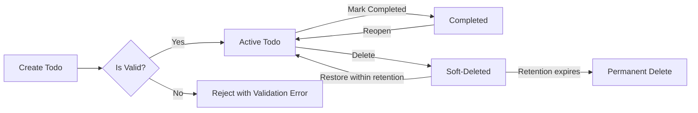
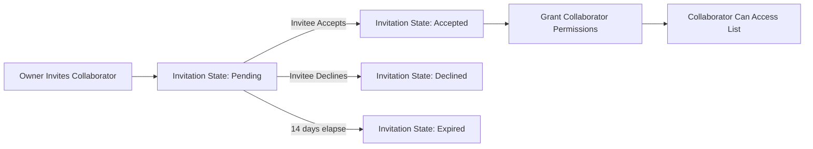

# 04-functional-requirements.md — Functional Requirements for todoApp

## Document Purpose and Audience

This document defines the complete set of business-level functional requirements for the todoApp backend. Its audience is backend developers, QA engineers, and product owners. It describes WHAT the system must do (behaviors, validations, user-visible outcomes), not HOW to implement those behaviors. All technical implementation decisions (architecture, APIs, data storage, libraries) are at the discretion of the development team.

## Scope and Assumptions

Scope:
- This document covers the minimum viable backend functionality required to operate a Todo list service that supports individual users, optionally shareable lists, and administrative moderation capabilities.
- Features covered: account-bound todo lists, individual todo items, list visibility and sharing, basic collaboration (invite/accept), metadata (due date, priority, tags), lifecycle operations (create, read, update, delete), marking complete/incomplete, and business-level retention/deletion rules.

Assumptions:
- Every persistent resource (user account, todo list, todo item) has a clearly defined owner in business terms.
- Authentication and session management are provided by the platform (see 03-user-actors.md for actor definitions and authentication expectations). This document describes authorized behaviors based on actor roles only.
- The minimal product supports single-user lists and optional list sharing with explicit acceptance for collaboration.
- The system must be usable by guests only for viewing public lists; creation and modification require authentication.

## Actors (business terms) and Permission Summary

Actors (from product definitions):
- guest: Unauthenticated visitor. May view public lists where list owner set visibility to public. Cannot create, modify, or delete persistent todos or lists.
- todoUser: Authenticated end user. Owns personal lists and todos. Can create, update, delete, share lists, invite collaborators, and accept invitations for lists they are invited to. Can mark todos complete/incomplete and set metadata.
- admin: Administrative operator with elevated privileges for moderation and user lifecycle actions (suspend/reactivate). Can remove content for abuse and access system usage data for moderation; admin actions are audit-worthy and subject to strict business rules.

Permission Matrix (business-level):

| Action | guest | todoUser (owner) | todoUser (collaborator) | admin |
|---|---:|---:|---:|---:|
| Create list | ❌ | ✅ | ❌ | ❌ (only as part of admin operations with audit) |
| Delete list | ❌ | ✅ (owner only) | ❌ | ✅ (moderation) |
| Create todo | ❌ | ✅ (owner or collaborator if granted write) | ✅ (if granted write on shared list) | ✅ (moderation) |
| Update todo | ❌ | ✅ (owner or collaborator with write) | ✅ (if granted write) | ✅ (moderation) |
| Delete todo | ❌ | ✅ (owner or collaborator with write) | ✅ (if granted write) | ✅ (moderation) |
| Mark complete/incomplete | ❌ | ✅ | ✅ (if granted write) | ✅ (moderation) |
| Share list (set visibility) | ❌ | ✅ (owner only) | ❌ | ✅ (moderation override) |
| Invite collaborator | ❌ | ✅ (owner only) | ❌ | ✅ (audit only) |
| View private list | ❌ | ✅ (owner or accepted collaborator) | ❌ | ✅ (as moderation action) |

Notes:
- "Collaborator" is a user explicitly invited and accepted to a list; collaborators may have read-only or read-write permissions as granted by the list owner.
- Admins are expected to follow moderation processes and should not routinely perform owner-level manipulations unless required for moderation or legal compliance; such actions must be auditable.

## Scope: Core Features

This section describes the mandatory business behaviors for core Todo and List features.

### 1) Todo Lists (conceptual)
- A todo list is a user-owned collection of todo items and metadata (title, description, visibility, default sort preference). A user may own multiple lists.
- THE todoApp SHALL allow a todoUser to create, rename, and delete todo lists they own.
- THE todoApp SHALL allow a todoUser to set visibility for each list to one of the following business states: "private", "shared-invite-only", or "public".
  - "private" means only owner and accepted collaborators may view the list.
  - "shared-invite-only" means the owner has invited specific users; only invited-and-accepted collaborators plus owner may view/act according to their permissions.
  - "public" means any guest or authenticated user may view the list; public lists are discoverable according to the platform's discovery features (outside scope of this document).

Business rules for list lifecycle:
- WHEN a todoUser deletes a list, THE system SHALL move the list into a "soft-deleted" state for a configurable retention period (default 30 days) before permanent deletion. During soft-deletion the owner may restore the list and its contained todos.
- IF the retention period elapses without owner restoration, THEN THE system SHALL permanently remove the list and its todos from active retention (see retention policies in Non-functional Requirements). (This is a business lifecycle rule, not a technical deletion schedule.)

### 2) Todo Items
- A todo item ("todo") belongs to exactly one list and has these business-visible attributes: title (required), description (optional), creation timestamp, last-updated timestamp, completed flag, completed timestamp (if completed), optional due date, optional priority, optional tags (0..N), and optional notes.

Input validation (business-level constraints):
- WHEN a todoUser creates a todo, THE system SHALL require a non-empty title with a maximum length of 200 characters. Titles that consist only of whitespace are invalid.
- WHERE a description is provided, THE system SHALL accept description text up to 4,000 characters.
- WHERE tags are provided, THE system SHALL allow up to 10 tags per todo and each tag SHALL be non-empty and up to 50 characters.
- WHERE a due date is provided, THE system SHALL accept a user-provided date/time in ISO 8601 format and SHALL interpret it in the user's timezone context (business rule). The due date may be a date-only or date-time value; if time is omitted, the due date represents the end of that calendar day in the user's timezone.
- WHERE priority is used, THE system SHALL accept one of these ordinal values: "low", "medium", "high", "urgent" (business-level enum).

Lifecycle behaviors for todos:
- WHEN a todoUser marks a todo as completed, THE system SHALL set the completed flag to true and record the completed timestamp.
- WHEN a todoUser marks a todo as incomplete, THE system SHALL clear the completed timestamp and set completed flag to false.
- THE system SHALL preserve historical metadata (creation and last-updated timestamps) for all todos for audit and user-facing history purposes.

Bulk operations:
- THE system SHALL allow a todoUser to perform bulk operations on sets of todos within a single list, specifically: bulk complete, bulk un-complete, bulk delete, and bulk change priority. Bulk operations shall report per-item success/failure and a final summary.

### 3) CRUD rules and concurrency expectations
- WHEN multiple users with write permission attempt to update the same todo concurrently, THE system SHALL ensure last-writer-wins as the default business rule, and SHALL surface conflict indicators to users when they retrieve the resource (e.g., last-modified timestamp changed). The implementation of conflict resolution is at developer discretion, but the business-visible outcome must be deterministic: the updated state must reflect one complete update and the system shall record the author and timestamp of the last successful update.
- IF preserving a user's local changes is required by business policy, THEN THE system SHALL provide an undo or versioning mechanism; this is optional for MVP and must be specified as an optional feature if implemented.

### 4) Metadata and Sorting
- THE system SHALL allow list-level default sort options to be: "created-descending", "due-ascending", "priority-descending", "manual-order".
- WHEN manual-order is selected, THE system SHALL preserve explicit item positions within the list and maintain them across CRUD operations and sharing events unless the owner changes order.

## Sharing and Visibility Rules

High-level rules:
- WHEN a todoUser sets a list to "public", THE system SHALL make read access to the list available to guests and authenticated users; the owner remains the only user able to change owner-scoped settings and invite collaborators unless they explicitly transfer ownership.
- WHEN a todoUser invites another user to a "shared-invite-only" list, THE system SHALL require acceptance by the invitee before granting collaborator access.
- WHERE the owner assigns collaborator permissions, THE system SHALL support at least two collaborator permission levels: "read-only" and "read-write". The default collaborator permission upon acceptance shall be "read-only" unless the owner explicitly chooses "read-write" during the invitation.

Invitation lifecycle:
- WHEN an owner sends an invitation to a collaborator, THE system SHALL track the invitation state as: "pending", "accepted", "declined", or "expired".
- IF an invitation remains "pending" for more than 14 days, THEN THE system SHALL expire the invitation automatically and notify the owner of expiration.
- THE system SHALL allow the owner to revoke a pending invitation at any time; revocation moves the invitation to "revoked" and prevents acceptance.

Public lists and discoverability:
- WHEN a list is public, THE system SHALL allow discovery mechanisms (search, explore) to surface the list per platform policies (search specifics are out of scope). Business rule: public lists may be indexed and displayed in discovery results; owners may opt-out of indexing for any public list.

Transfers of ownership:
- WHERE a list owner wants to transfer ownership to another registered user, THE system SHALL require explicit acceptance by the target user before effective transfer. Ownership transfers shall preserve list content and collaborator settings unless the owner modifies them during transfer.

## Collaboration Behaviors (business-level)

Collaborator rights and constraints:
- THE owner SHALL be able to assign collaborator permissions on a per-invite basis: "read-only" or "read-write".
- WHEN a collaborator is granted "read-write", THE system SHALL allow that collaborator to create, update, complete, and delete todos within the list, but not to change owner-only settings (visibility, owner transfer) unless explicitly delegated by the owner.
- WHEN a collaborator is granted "read-only", THE system SHALL allow that collaborator to view todos and add personal comments or annotations (optional future feature) that remain personal unless the owner elects to make them visible to all collaborators.

Audit and notifications (business expectations):
- THE system SHALL provide an audit trail of collaborator invitations, acceptances, revocations, and key moderation actions for ownership and moderation transparency.
- THE system SHALL offer notification concepts (owner-notified-on-invite-accepted, collaborator-notified-on-invite) as business behaviors; the delivery mechanism is out of scope for this document.

## Business Rules and Validation Logic (detailed)

Identity and ownership rules:
- THE system SHALL associate every created todo and list with the creating user's identity as the owner.
- WHEN a user account is suspended by an admin, THE system SHALL make all lists owned by that user inaccessible to guests and other users for view or modification, except as required for moderation or legal processes.

Input validation and rejection behaviors (examples with acceptance criteria):
- WHEN a todoUser submits a create-todo request with an empty title, THEN THE system SHALL reject the request and provide a clear user-facing error stating: "Title is required".
- WHEN a todoUser submits a title longer than 200 characters, THEN THE system SHALL reject the request and provide a clear user-facing error stating: "Title must be 200 characters or fewer".
- IF a due date is in the past relative to the user's current local date/time, THEN THE system SHALL allow creation but SHALL mark the todo with a business flag "past-due" and SHALL surface a warning to the user when viewing the list.
- WHEN tags exceed 10 items or a tag exceeds 50 characters, THEN THE system SHALL reject the operation with an error enumerating the offending tags.

Error categories and recovery:
- Recoverable client errors: invalid input, permission denied, resource-not-found — THE system SHALL return precise, actionable error messages and preserve user input where possible to allow quick correction.
- Business rule violations: operations that contradict business rules (e.g., attempting to change owner without acceptance) SHALL be rejected with descriptive messages and, when applicable, provide suggested next steps.

## Error Handling and Unwanted Behavior Requirements (EARS IF statements)

IF a guest attempts to create or modify any persistent resource, THEN THE system SHALL deny the action and surface an error message: "Authentication required" with a reference to account creation flow.

IF a todoUser attempts to access a private list they neither own nor were accepted into, THEN THE system SHALL deny access and return a user-facing message: "You do not have permission to view this list." The system SHALL indicate whether the user may request access (owner-visible option) where business policy allows.

IF a user attempts an operation but their account is suspended, THEN THE system SHALL deny all create/update/delete operations for that user and provide a message: "Account suspended" with information on appeals or contact support.

IF data validation fails for any attribute (title length, tags count, invalid priority value), THEN THE system SHALL reject the operation and return a structured list of validation errors describing the field and the reason for rejection.

IF an owner deletes a list, THEN THE system SHALL allow restoration by the owner during the retention window; after retention window expiration, THEN THE system SHALL make deletion permanent and irreversible from the user's perspective.

## Performance and User-Perceived Responsiveness Requirements

The following targets are stated in user-perceived terms and are considered acceptance criteria for feature behavior (implementation details to meet them are left to the engineering team):
- THE system SHALL provide an "instant" feel for primary CRUD actions on todos and lists. For common interactions (create, mark complete/incomplete, rename), "instant" is defined as the action completing and the user-visible result available within 500 milliseconds for median requests under normal load.
- THE system SHALL respond to read-only retrievals (fetching a small list of todos, up to 50 items) in under 500 milliseconds median under normal operating conditions.
- Bulk operations (bulk complete, bulk delete) SHALL provide progressive feedback: the initial summary response (success/failure counts and a job identifier if long-running) SHALL be provided within 2 seconds; final per-item outcomes may be delivered asynchronously if necessary but must be made available within 30 seconds for typical bulk sets of up to 200 items.
- THE system SHALL degrade gracefully: when immediate processing cannot be fulfilled within target times, THE system SHALL inform the user of the delay and provide a recovery path (e.g., retry tips or a status tracker).

## EARS-formatted Requirements (Comprehensive List)

Ubiquitous Requirements (always true):
- THE todoApp SHALL associate an owner with every list and todo.
- THE todoApp SHALL preserve creation and last-updated timestamps for all lists and todos.
- THE todoApp SHALL record audit events for owner transfers, collaborator invitations, and admin moderation actions.

Event-driven Requirements (WHEN):
- WHEN a todoUser creates a list, THE todoApp SHALL require a non-empty title with a maximum length of 200 characters.
- WHEN a todoUser sets list visibility to "public", THE todoApp SHALL make the list readable by guests and authenticated users.
- WHEN a todoUser invites another user to collaborate, THE todoApp SHALL create an invitation in state "pending" and notify the invitee via the platform's notification mechanism (delivery mechanism is out of scope).
- WHEN a todo is marked completed by a todoUser, THE todoApp SHALL set a completed timestamp and the completed flag.

State-driven Requirements (WHILE):
- WHILE a list is in "soft-deleted" state, THE todoApp SHALL prevent guests and non-owner users from viewing the list.

Unwanted Behavior Requirements (IF/THEN):
- IF a guest attempts to create or modify resources, THEN THE todoApp SHALL deny the action and provide an error indicating authentication is required.
- IF an invitation remains pending for more than 14 days, THEN THE todoApp SHALL move the invitation to "expired" and notify the owner.
- IF input validation fails for any user-supplied field, THEN THE todoApp SHALL reject the operation and return a structured list of validation errors explaining each failure.

Optional Feature Requirements (WHERE):
- WHERE collaborative comments are enabled, THE todoApp SHALL allow collaborators to add personal annotations to todos and indicate whether a note is private or shared.
- WHERE an owner requests permanent deletion immediately, THE todoApp SHALL offer an immediate purge option subject to legal and retention policies and only when explicitly confirmed by the owner.

## Acceptance Criteria and Example Scenarios

Each feature below includes clear, testable acceptance criteria.

Scenario A — Create Todo (happy path):
- Given: A todoUser owns a list and is authenticated.
- When: The user submits a create-todo action with title "Buy milk" and no due date.
- Then: The system SHALL create the todo in the specified list with completed=false, record creation and last-updated timestamps, and return a confirmation to the user. Acceptance criteria: the todo exists in the owner's list, title exactly matches "Buy milk", and creation timestamp is present.

Scenario B — Title Validation (error path):
- Given: A todoUser attempts to create a todo with an empty title.
- When: The create action is attempted.
- Then: THE system SHALL reject the creation and return a validation error with message "Title is required" and an error code for client-side mapping. Acceptance criteria: no todo is created; error payload identifies field "title" and reason.

Scenario C — Public List View by Guest:
- Given: A list is marked public by its owner.
- When: A guest requests to view the list contents.
- Then: THE system SHALL present the list items in their current state (inclusive of completed flags and due dates) and indicate the list owner. Acceptance criteria: guest can read items but cannot create or modify; any attempt to mutate returns "Authentication required".

Scenario D — Invitation Lifecycle:
- Given: Owner invites user B to shared-invite-only list.
- When: Invitation is sent.
- Then: THE system SHALL record invitation state "pending" and notify owner of sent invitation. If invitee accepts within 14 days, THEN THE system SHALL move invitation to "accepted" and grant permissions according to the invitation. Acceptance criteria: post-acceptance, invitee has expected read or write access.

Scenario E — Soft Delete and Restore:
- Given: Owner deletes a list.
- When: Delete action is confirmed by owner.
- Then: THE system SHALL move the list to "soft-deleted" state for 30 days and allow owner to restore. Acceptance criteria: during soft-deleted window, the list is not visible to guests or collaborators; after restore, list is visible again with preserved todos.

Scenario F — Bulk Complete with Partial Failure:
- Given: Owner selects 100 todos for bulk complete, 5 of which are already deleted.
- When: Bulk complete requested.
- Then: THE system SHALL mark 95 todos as completed, report 5 failures with reasons ("resource not found"), and provide a summary: "95 succeeded, 5 failed". Acceptance criteria: per-item status recorded; owner receives summary and details.

## Mermaid Diagrams

Todo lifecycle diagram (high-level):

Sharing flow diagram (invite acceptance):

(Remember: diagrams are conceptual; they show business states and transitions.)

## Success Criteria and Testable Metrics

- Feature completeness: All CRUD operations for lists and todos operate according to the acceptance criteria and EARS requirements specified above.
- Validation coverage: All fields (title, description, tags, priority, due date) enforce the stated business constraints and return clear, testable errors when violated.
- Sharing behavior: Invitation lifecycle behaves as specified (pending -> accepted/declined/expired) and permissions behave as described.
- Performance: Primary CRUD actions meet the user-perceived responsiveness targets in the Non-functional Requirements and the Performance section above.

## Glossary and Definitions

- Owner: The registered user who created a list and has primary control over owner-scoped settings.
- Collaborator: A registered user who has accepted an invitation to a shared list and has either read-only or read-write rights.
- Guest: Unauthenticated visitor.
- Soft-deleted: A temporary deletion state during which the owner may restore the resource within a retention window.
- Past-due: Business flag applied to a todo whose due date is earlier than the user's current local date/time.

## Document Constraints and Developer Autonomy Statement

This document defines business requirements only. All technical implementation decisions (architecture, APIs, database design, authentication implementation details, libraries, and deployment choices) are at the discretion of the development team.

