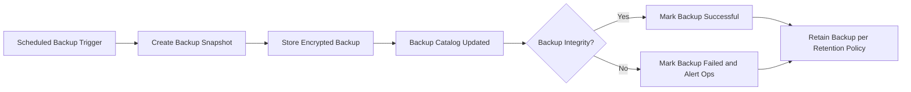
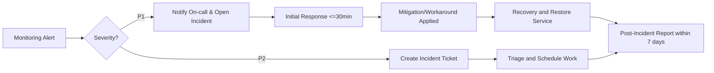

# 09-non-functional-requirements.md — Non-functional requirements for todoApp

This document provides business-level non-functional requirements for the minimal todoApp MVP. It defines measurable expectations for performance, availability, security, privacy, backup and recovery, monitoring, and compliance. This document provides business requirements only. All technical implementation decisions belong to the development team; developers retain autonomy over architecture, APIs, and data storage.

## 1. Purpose and scope

This document specifies the non-functional expectations (NFE) the todoApp must satisfy for the minimal viable product. The aim is to ensure users can reliably create, view, update, and delete their todo items with predictable performance and data protection guarantees. The scope covers user-facing performance, system availability, security and privacy obligations, backup and retention expectations, monitoring and incident response, capacity and rate-limiting, and compliance-related obligations.

Out of scope: low-level technical choices (programming languages, database engines, cloud providers), API endpoint specifications, or UI/UX behavior details.

## 2. Audience and related documents

Intended readers: operations, security, development leads, QA, and product owners. This document should be read together with the functional requirements (08-functional-requirements.md), the data lifecycle description (10-data-flow-and-lifecycle.md), and the primary and secondary user scenarios (06-primary-user-scenarios.md and 07-secondary-scenarios-and-exceptions.md).

## 3. Summary of measurable non-functional objectives

- WHEN a typical authenticated user performs a CRUD action on their todo list, THE todoApp SHALL return a user-visible success confirmation within 2 seconds. More specific targets:
  - Median response time for list requests (page size = 50): <= 300 ms (Recommended)
  - 95th percentile response time for common actions (create/read/update/delete): <= 2 seconds
  - Median acknowledgement for writes (create/update/delete): <= 500 ms
- THE todoApp SHALL meet availability target: 99.9% uptime per calendar month (Recommended)
- Backup/Recovery objectives (Recommended business defaults): RTO <= 4 hours; RPO <= 1 hour
- THE todoApp SHALL retain audit logs of administrative actions for 365 days
- THE todoApp SHALL provide a documented restore test cadence (quarterly recommended)

These objectives are measurable and intended to guide implementation and verification for MVP operations.

## 4. Performance requirements

WHEN a signed-in user performs a CRUD operation on a todo, THE todoApp SHALL process and reflect the change to the user within measurable latency targets:
- WHEN a user requests a paginated list of todos (page size = 50), THE todoApp SHALL return results with a median latency <= 300 ms and 95th percentile <= 2 seconds under normal load.
- WHEN a user creates, updates, or deletes a single todo, THE todoApp SHALL acknowledge success with median latency <= 500 ms and 95th percentile <= 2 seconds under normal load.
- WHEN a user toggles completion for a todo, THE todoApp SHALL reflect the change within 1 second under normal load.

Verification and test scenarios:
- Synthetic read test: 100 concurrent users performing 80% list requests and 20% writes; measure median and 95th percentile latencies for list and write operations.
- Synthetic write test: 50 concurrent users performing creates/updates/deletes; measure acknowledgement latencies.
- End-to-end user test: under representative network conditions (mobile 4G), create and list operations shall complete within 2 seconds 95% of the time.

Performance boundary conditions and graceful degradation:
- WHEN sustained load exceeds capacity, THE system SHALL degrade gracefully by prioritizing reads for authenticated users and queuing or throttling non-critical write operations.
- WHEN a graceful degradation is in effect, THE system SHALL surface a user-facing message that indicates degraded mode and suggest retry behavior.

## 5. Availability and reliability

WHEN the system is in normal operation, THE todoApp SHALL meet an availability target of 99.9% monthly uptime (Recommended). Scheduled maintenance SHALL be excluded from uptime calculations if communicated at least 24 hours in advance.

WHEN the service experiences an outage that affects user-facing operations, THE operations team SHALL classify incident severity and follow incident response targets in the Monitoring and Incident section.

Reliability and durability expectations:
- WHEN the system confirms a successful write, THE system SHALL ensure that write is durable subject to the RPO value defined in Backup and Recovery.
- WHEN scheduled maintenance is required, THE system SHALL minimize user disruption and provide advance notice.

## 6. Authentication & account protection (business-level)

EARS-formatted authentication and account protection requirements:
- WHEN a user attempts to authenticate with valid credentials, THE system SHALL successfully authenticate the user and issue session tokens per token management policy.
- WHEN a user fails authentication 10 times within a 15-minute window, THEN THE system SHALL place the account into a lockout state for a configurable cooldown period (Recommended default: 15 minutes) and SHALL provide a user-facing message explaining the lockout and recovery options.
- WHEN an admin suspends a user account, THE system SHALL prevent the suspended user from authenticating and SHALL invalidate active refresh tokens associated with that account within 30 seconds.
- WHEN a user requests to revoke all sessions, THE system SHALL invalidate all refresh tokens associated with that user within 30 seconds and require re-authentication for new sessions.

Token and session guidance (business defaults):
- Access token expiration: 20 minutes (Recommended)
- Refresh token expiration: 14 days (Recommended)
- The exact cryptographic and storage mechanisms are implementation details; the business requirement is that tokens support session revocation and server-side invalidation of refresh tokens.

Acceptance criteria:
- AC-AUTH-01: Given valid credentials, when the user authenticates, then the system issues tokens and the user can perform todo operations within 2 seconds.
- AC-AUTH-02: Given 10 failed login attempts within 15 minutes, when the threshold is exceeded, then the system locks the account and the user receives an explanatory message.
- AC-AUTH-03: Given an admin suspension, when the action is executed, then the user's active sessions are invalidated within 30 seconds.

## 7. Security & privacy (business-level)

WHEN user personal data is collected, THE system SHALL treat it as personal data and protect it accordingly. Specific business-level requirements:
- WHEN a user requests account deletion, THE system SHALL delete or irreversibly anonymize personal data within 30 calendar days of a validated request, subject to legal holds.
- WHEN admin actions affect user data, THE system SHALL record an auditable event containing at minimum: admin identifier, target user identifier, action type, timestamp, and optional reason. Audit logs SHALL be tamper-evident and retained for at least 365 days.
- THE system SHALL protect data in transit and at rest using industry-accepted cryptographic measures (implementation detail left to engineers), and SHALL ensure that backup copies are encrypted.

Password and credential policies (business defaults):
- Minimum password length: 8 characters with at least one letter and one number (Recommended).
- Multi-factor authentication (MFA): WHERE MFA is required by policy, THE system SHALL support MFA; MFA may be optional for MVP but shall be supported in design.

Privacy notices and DSARs:
- WHEN a user requests a copy of their data (DSAR), THE system SHALL provide a machine-readable export of their todos and associated metadata within 7 calendar days.

Acceptance criteria:
- AC-SEC-01: Given an admin action, when executed, then an audit entry with required fields is present and retrievable within 5 seconds for recent events.
- AC-SEC-02: Given a valid deletion request, when processed, then personal data is removed or anonymized within 30 days.

## 8. Backup, retention, and recovery

Business-level backup and recovery requirements:
- WHEN backups are configured, THE system SHALL capture backups at least hourly or capture transaction logs enabling an RPO of <= 1 hour (Recommended).
- WHEN a critical incident requires restore, THE system SHALL meet an RTO <= 4 hours (Recommended) for the minimal recoverable service that supports read and limited write operations.
- WHEN backups are successful, THE system SHALL log the backup results and surface failures to operations for remediation.
- THE system SHALL retain backups for at least 30 days for user data and retain audit logs for 365 days.

Restore testing and validation:
- THE operations team SHALL perform a restore test at least once per quarter and document the test results, including durations and any data gaps.

Data purge and retention rules (business defaults):
- WHEN a user deletes a todo, THEN THE system SHALL retain the todo in a "deleted" state for 30 days for possible user-initiated restore; after 30 days THE system SHALL permanently purge the data subject to legal holds.
- WHEN retention policies are adjusted, THEN THE system SHALL record the effective date and apply the new policy prospectively.

Acceptance criteria:
- AC-BACK-01: Given a backup schedule, when backups complete, then operations can provide evidence of hourly backups for the previous 30 days.
- AC-BACK-02: Given a restore test, when executed in a non-production environment, then the team demonstrates restore meets RTO <= 4 hours (recommended target) and documents any data loss relative to RPO.

## 9. Monitoring, logging & alerting, and incident response

Metrics and observability (business-level):
- WHEN monitoring is configured, THE system SHALL emit metrics for request rates, error rates, latency percentiles (p50/p95/p99), backup success/failure, authentication failures, and queue backlogs (if any).
- THE system SHALL expose dashboards for operations with 1-minute granularity for recent data and 5-minute aggregations for historic views.

Alerting and thresholds (business defaults):
- WHEN error rate for core user flows exceeds 1% for a rolling 5-minute window, THEN an alert SHALL be raised to the on-call operations team.
- WHEN median response time for core flows (create/list/update/delete) exceeds 2 seconds for 5 continuous minutes, THEN an alert SHALL be raised.
- WHEN backup failure occurs or restore test fails, THEN an alert SHALL be raised to operations immediately.

Incident classification and response targets:
- P1 (service-impacting): core todo operations are unavailable or erroring for >10% of users — initial response target <= 30 minutes; mitigation plan within 4 hours.
- P2 (degraded performance): core operations are slower than targets or >1% error rate for multiple minutes — initial response target <= 2 hours; mitigation plan within 24 hours.

Post-incident review:
- AFTER a P1 or P2 incident, THE operations team SHALL produce a post-incident report within 7 business days describing timeline, root cause, impact, and corrective actions.

Acceptance criteria and verification:
- AC-MON-01: Given configured alerts, when thresholds are crossed, then alerts are delivered to the on-call channel and acknowledged within the defined initial response targets.
- AC-MON-02: Given a quarterly restore test, when executed, then monitoring shows backup and restore metrics and any issues are recorded in the post-test report.

## 10. Capacity, rate limiting & scalability

Business-level capacity expectations for MVP:
- The service SHALL be designed to support an expected MVP baseline: 10,000 monthly active users (recommended planning figure) with headroom to scale to 2x expected peak traffic.

Rate limiting and abuse mitigation:
- WHEN a single user exceeds 10 write requests per minute, THEN the system SHALL throttle additional write requests for that user and return a rate-limit response indicating retry-after seconds.
- WHEN automated abuse is detected (e.g., 1,000 create requests in one minute from a single account), THEN the system SHALL temporarily suspend write privileges for that account pending review and notify support.

Scaling and graceful degradation:
- WHEN sustained load growth exceeds capacity, THEN THE system SHALL prioritize read operations for authenticated users and throttle non-critical background tasks (analytics, exports) until capacity is restored.

Acceptance criteria:
- AC-CAP-01: Given simulated traffic at 2x expected peak, when tests run, then system continues to serve reads with acceptable latency while writes are throttled according to policies.

## 11. Compliance and legal considerations

Data subject rights and export:
- WHEN a user requests export of their data for portability, THEN THE system SHALL provide a machine-readable export of their todos and associated metadata within 7 calendar days.
- WHEN a user requests deletion under applicable laws (e.g., GDPR), THEN THE system SHALL remove or anonymize personal data within 30 calendar days unless a legal hold applies.

Jurisdiction and data residency:
- FOR the MVP, THE system SHALL operate under a single default data jurisdiction chosen by stakeholders; any multi-region residency requirement SHALL be addressed in future work and documented as a separate project.

Record keeping:
- THE system SHALL maintain records of processing activities and consent where applicable sufficient to respond to regulatory inquiries.

Acceptance criteria:
- AC-COMP-01: Given a DSAR request, when processed, then the user receives a complete export of their data within 7 days.
- AC-COMP-02: Given a verified deletion request, when processed, then personal data is removed or anonymized within 30 days.

## 12. Error handling and user-facing failure modes

Catalog of key user-facing failure messages and recovery guidance (business-level):
- Offline save: "You're offline. Your change is saved locally and will sync automatically when your connection returns." Action: "Retry sync".
- Sync conflict: "A conflict occurred while syncing this todo. Review changes and choose which version to keep." Action: "Review conflict".
- Validation error: "There was a problem with your input: <reason>. Please correct and try again." Action: "Edit".
- Auth required: "Please sign in to continue." Action: "Sign In".
- Session expired: "Your session expired. Sign in to continue and resubmit your changes." Action: "Sign In".
- Rate limit: "You're making requests too quickly. Please wait <seconds> and try again." Action: "Retry later".
- Storage failure: "We couldn't save your change right now. Please try again." Action: "Retry".
- Delete undo: "Todo deleted. Undo" Action: "Undo".
- Permanent delete: "This item has been permanently deleted and cannot be recovered." Action: "Contact support".

EARS-formatted error handling requirements:
- IF a transient storage failure occurs during a create or update, THEN THE system SHALL inform the user within 2 seconds and preserve client-side input for retry.
- WHEN a user's session expires while they have in-progress edits, THEN THE system SHALL preserve the edit client-side and prompt the user to re-authenticate, allowing re-submission of the preserved edits.

Acceptance criteria:
- AC-ERR-01: Given a simulated storage error, when a user attempts to save, then the UI shows the storage failure message and preserves the input for retry.
- AC-ERR-02: Given session expiry mid-edit, when the user re-authenticates, then their preserved edits are available for resubmission.

## 13. Acceptance criteria and verification methods

Mapping key NFRs to verification approaches:
- Performance: Run synthetic load tests (see Performance section) and produce telemetry showing median and 95th percentile latencies meet targets.
- Availability: Monitor production uptime over rolling 30-day windows; verify availability meets the 99.9% target excluding scheduled maintenance.
- Backup/Restore: Execute quarterly restore tests and document RTO/RPO outcomes; demonstrate ability to recover user data and identify any data gaps.
- Security: Validate account lockout after failed attempts and audit logging for admin actions; conduct a baseline security scan.
- Compliance: Process sample DSAR and deletion requests and document timelines and outputs.

## 14. Diagrams (business-level)

Mermaid: Backup and restore workflow (business view)

Mermaid: Incident detection and response (business flow)

(Notes: All labels use double quotes for mermaid compatibility.)

## 15. Glossary and definitions
- RTO: Recovery Time Objective — maximum acceptable time to restore service after an outage.
- RPO: Recovery Point Objective — maximum acceptable age of data loss measured in time.
- P1/P2: Priority 1/2 incidents — classification used by operations.
- Median/95th percentile: statistical latency measures used to quantify performance.

## 16. Open decisions and assumptions

List of business choices requiring stakeholder confirmation (recommended defaults provided):
1. Email verification at registration: Recommended default — require verification before first todo creation.
2. Retention windows: Recommended default — 30 days for soft-deleted items, 365 days for archived items.
3. Token expiry defaults: Access token 20 minutes, Refresh token 14 days (recommended).
4. Backup frequency and RPO: Recommended default — hourly backups or transaction log capture to meet RPO <= 1 hour.
5. MVP capacity planning baseline: 10,000 monthly active users (recommended planning figure).

These recommendations can be overridden by stakeholders; changes must be versioned and recorded in document change log.

## 17. Change log and ownership
- Document owner: Product Manager (to be assigned)
- Change log template:
  - Version: X.Y
  - Date: YYYY-MM-DD
  - Author: [Name]
  - Summary: One-line summary of change

