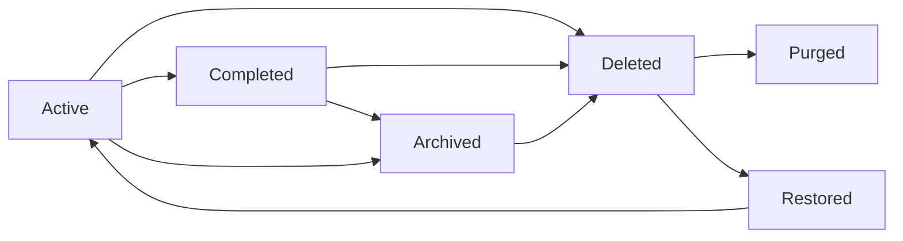

# 10 - Data Flow and Lifecycle — todoApp

## 1. Purpose and scope

Define the conceptual lifecycle of a todo item for todoApp and describe the user-driven events and system-driven transitions that move items through lifecycle states. The content is business-level and intended for backend developers, QA, product owners, and operations teams. No database schemas or detailed API contracts are included; the behavior described here is implementation-ready from a business rules perspective.

Audience: backend developers, QA engineers, product managers, and operations.

## 2. Conceptual entities and key attributes

TodoItem (conceptual attributes):
- todoId: stable business identifier for the item
- ownerId: reference to the owning user account (business concept)
- title: mandatory short text (non-empty)
- description: optional longer text
- createdAt: system timestamp when created
- updatedAt: system timestamp when last modified
- state: enumerated business state {"active","completed","archived","deleted"}
- dueDate: optional ISO 8601 date or date-time
- priority: optional enumeration {"low","medium","high"}
- completedAt: system timestamp when the item was completed (optional)
- archivedAt: timestamp when archived (optional)
- deletedAt: timestamp when soft-deleted (optional)
- auditMetadata: business-level audit stub (actorRole, actorId, actionType, timestamp, reason)

AuditRecord (conceptual attributes):
- actorRole: {"user","admin"}
- actorId: identifier of the acting account
- actionType: textual action descriptor (e.g., "delete","restore","suspendAccount")
- targetId: business identifier of affected resource (e.g., todoId)
- timestamp: when action occurred
- reason: optional short rationale provided by actor

Notes: These are conceptual attributes meant to make lifecycle rules unambiguous for implementation and QA; they are not a database schema.

## 3. Lifecycle overview

Primary states and the canonical flow for a todo item:
- Active → Completed → Archived/Deleted → Purged
- Active may transition directly to Deleted or Archived depending on user/admin action or automated policy.
- Completed items may be Archived or Deleted.

Mermaid state diagram of primary lifecycle:



## 4. State definitions (business terms)

- Active: The item is visible in the user's primary list and may be edited, completed, archived, or deleted by the owner.
- Completed: The owner marked the item done. Completed items remain visible in a completed view and may be reopened or archived.
- Archived: The item is intentionally moved out of the primary active/completed views for long-term retention. Archived items are recoverable within the archive retention window.
- Deleted: The item is soft-deleted; it is removed from normal user lists but retained for a configurable retention period for recovery or audit.
- Purged: The item has been permanently removed from user-visible storage and ordinary recovery is not available. Purged items may only be restored via documented backup/restore operational procedures if backups exist.

## 5. Allowed transitions and triggers (who/what can trigger)

- Create: Visitor with an authenticated account triggers creation → state becomes "active". (Owner: user)
- Complete: Owner toggles completion → "active" to "completed" (or vice versa for reopen)
- Archive: Owner or automated retention process moves item to "archived"
- Delete (soft-delete): Owner or admin moves item to "deleted"; removal from primary lists is immediate
- Restore: Owner or admin restores item from "deleted" within retention window → back to "active" or "completed" depending on completedAt
- Purge: Automated scheduled purge process or admin-initiated permanent delete moves "deleted" → "purged"

## 6. EARS-formatted business rules (core lifecycle events)

Creation and ownership
- WHEN an authenticated user submits a create-todo request with a non-empty title, THE system SHALL create a TodoItem with state "active", set createdAt to the current server timestamp, associate ownerId to the requesting user, and return the created item for the user's view.

- IF a create request omits title or provides a title that is only whitespace, THEN THE system SHALL reject the request and return a validation error indicating "title is required" and a machine-usable error code.

Validation rules (business-level)
- WHEN a user submits a title for creation or update, THE system SHALL accept titles up to 250 characters and SHALL reject longer titles with a validation error that identifies the field and maximum length.

- WHEN a user submits a description, THE system SHALL accept descriptions up to 4,000 characters; if the description exceeds 4,000 characters, THEN THE system SHALL reject the request and return a field-level validation error.

- WHEN a user provides a dueDate, THE system SHALL accept ISO 8601 date or date-time values and SHALL reject malformed date strings with a descriptive validation error.

Completion and reopen
- WHEN an authenticated owner marks an "active" item as complete, THE system SHALL set state to "completed", set completedAt to the current timestamp, and persist the change so it is visible to the owner within 2 seconds in normal operating conditions.

- WHEN an authenticated owner marks a "completed" item as incomplete, THE system SHALL set state to "active" and clear completedAt.

Delete and restore
- WHEN an authenticated owner requests deletion of a todo, THE system SHALL mark the item state as "deleted", set deletedAt to the current timestamp, immediately remove the item from default active/completed lists, and retain the item in deleted state for the configured retention window (default: 30 days).

- WHEN an authenticated owner requests restore of a todo that is in "deleted" state within the retention window, THE system SHALL set the item's state to "active" (or "completed" if completedAt is present) and clear deletedAt. THE system SHALL return confirmation to the owner within 2 seconds in typical conditions.

Purge policy
- IF a todo remains in "deleted" state after the retention window expires, THEN THE system SHALL schedule the item for purge and permanently remove it from ordinary user-visible storage according to the scheduled purge job. AFTER purge, the item SHALL be considered unrecoverable via standard user flows.

Admin actions and audit
- WHEN an admin performs any action that modifies the state or data of another user's todo (including restore and purge), THE system SHALL record an AuditRecord including actorRole="admin", actorId, actionType, targetId, timestamp, and reason, and SHALL retain audit records for at least 365 days.

Ownership enforcement
- WHEN any request attempts to read, modify, or delete a todo, THE system SHALL permit the action only if the requesting actor is the owner or an admin performing an auditable maintenance action; otherwise, THE system SHALL deny the request with an authorization error.

## 7. Conflict resolution and offline synchronization (business rules)

Conflict strategy overview (MVP default): last-writer-wins at the field level with explicit conflict notification to clients when concurrent changes would overwrite a more recent change. Where an offline client may queue changes, the server SHALL detect concurrent edits by comparing updatedAt timestamps and SHALL return a conflict response when the server-side updatedAt is newer than the client's base timestamp.

EARS rules:
- WHEN two updates for the same todo are submitted concurrently that modify the same field(s), THEN THE system SHALL detect the concurrency conflict and return a conflict response that includes the current server-side values and a conflict flag; the client SHALL present the user with options: "Keep Mine", "Keep Server", or "Merge Manually".

- WHEN updates affect disjoint fields, THEN THE system SHALL merge the updates automatically and record merged updatedAt; THE system SHALL notify the user that a merge occurred but shall not block the updates.

Offline sync behavior:
- WHEN a client queues changes locally due to lack of connectivity, THE client SHALL persist queued actions and mark them as "pending sync" in the UI. WHEN connectivity is restored, THE client SHALL attempt to synchronize queued actions in chronological order.

- WHEN queued changes are sent after reconnection, THE system SHALL apply non-conflicting changes immediately and SHALL return conflict responses for conflicting changes. THE client SHALL surface conflict resolution options to the user within 30 seconds of sync attempt.

Sync timing expectation (business-level):
- WHEN connectivity resumes, THE system SHALL accept queued changes and attempt to apply them; THE client should expect that queued changes will be accepted or a conflict will be surfaced within 30 seconds of reconnection in normal conditions.

User-facing indicators:
- WHEN an item has pending local changes not yet confirmed by the server, THE UI SHALL indicate "Pending Sync" and prevent silent data loss. The UI SHALL provide a "Retry Sync" control and an informative explanation for the pending state.

## 8. Input validation and error semantics

Validation rules (consolidated):
- Title: required, trimmed, 1..250 characters. Error message: "Title is required and must be 1-250 characters." Error code: ERR_VALIDATION_TITLE
- Description: optional, 0..4000 characters. Error code: ERR_VALIDATION_DESCRIPTION
- DueDate: optional, must be ISO 8601 date or date-time. Error code: ERR_VALIDATION_DUEDATE
- Priority: optional, allowed values {"low","medium","high"}. Error code: ERR_VALIDATION_PRIORITY

Error handling rules:
- IF an input validation fails, THEN THE system SHALL return a 4xx-style validation response including field-level messages and machine-usable error codes suitable for client display and automated testing.

- IF a transient server error prevents persistence, THEN THE system SHALL return a retryable error with guidance to retry and SHALL ensure the client can preserve unsaved input for resubmission.

## 9. Retention, backups, and recovery objectives

Retention defaults (recommendations for MVP):
- Deleted retention: 30 calendar days (soft-deleted items recoverable within this period).
- Archived retention: 365 calendar days before eligibility for purge (configurable by product).
- Audit log retention: 365 calendar days.

Backup and recovery objectives (business-level):
- RPO (Recovery Point Objective): <= 1 hour for user data during MVP operations.
- RTO (Recovery Time Objective): <= 4 hours for critical restore scenarios affecting user data availability.
- Backup cadence: create snapshots or transaction-log-based backups sufficient to meet RPO every hour; perform a full backup daily.
- Restore validation: perform a quarterly restore test in a non-production environment and document the result.

EARS statements for purge and backup:
- WHEN a scheduled purge job runs for items exceeding retention, THE system SHALL permanently remove the items from ordinary user-visible storage and SHALL log purge actions in the audit log with actorRole="system" and actionType="purge".

- WHEN a user requests account deletion, THE system SHALL mark user data for deletion and begin data removal according to retention and legal hold policies; where legal hold applies, THE system SHALL suspend automated purge until the hold is resolved.

## 10. Admin recovery and operational procedures (business steps)

Admin restore process (business-level steps):
1. Identify affected user and the approximate time window of the missing or deleted item.
2. Query audit logs for operations related to the item and confirm the item was soft-deleted and within retention.
3. IF the item is within retention (Deleted state and deletedAt within retention window), THEN the admin SHALL execute a restore action that sets state back to Active or Completed and SHALL record an AuditRecord with reason.
4. Notify the user: send a templated message describing the restore action and any potential data loss if partial.
5. IF the item is beyond retention, THEN the admin SHALL consult backups and attempt an operational restore per backup policies; IF restore is possible, admin SHALL inform user of partial recovery possibility and record the action in audit logs. IF restore is not possible, admin SHALL inform user and close the support ticket.

Audit requirements for admin actions:
- AuditRecord must include: admin identifier, timestamp, targetId, actionType, reason, and optionally a reference to backup snapshot if restored from backup.
- Audit log retention: 365 days minimum.

User communication templates (business-level):
- Successful restore: "We restored your todo from backup dated YYYY-MM-DD. Some recent changes may be missing. Contact support if you need further help."
- Cannot restore: "We were unable to restore the requested todo. It appears to be beyond the retention window. We recommend recreating the item; contact support if you believe this is an error."

## 11. Error handling and common recovery scenarios (user-facing)

Standard messages and recommended actions:
- Offline/Queued: "You're offline. Your change is saved locally and will sync when your connection returns. [Retry Sync]"
- Validation error: "There was a problem with your input: <field> - <reason>. Please correct and try again." (show field-level guidance)
- Authorization error: "You are not authorized to perform that action. You may only modify your own todos." (provide sign-in or contact support actions)
- Conflict detected: "A conflict occurred while saving this todo. Review the server version or keep your changes. [Keep Mine] [Keep Server] [Edit]"
- Permanent delete notice: "This item has been permanently deleted and cannot be recovered through the UI. Contact support for assistance." (support may attempt operational restore if backups exist)

## 12. Acceptance criteria and QA test matrix

Performance acceptance (business-level):
- GIVEN normal MVP load, WHEN an owner creates/updates/deletes/completes a todo, THEN the change SHALL be visible to the owner within 2 seconds in 95% of tests.

Functional acceptance cases (representative):
- Create success:
  - Steps: authenticate -> create todo(title="Buy milk") -> list todos
  - Expected: new todo appears with state "active", createdAt present
- Create validation:
  - Steps: authenticate -> create todo(title="")
  - Expected: validation error ERR_VALIDATION_TITLE returned
- Complete & reopen:
  - Steps: authenticate -> create todo -> mark complete -> list completed -> mark incomplete
  - Expected: completedAt recorded after complete, cleared after reopen
- Delete & restore:
  - Steps: authenticate -> create todo -> delete -> list active -> restore within retention
  - Expected: item removed from active list after delete; restored item reappears after restore
- Purge after retention:
  - Steps: create todo -> delete -> simulate passage > retention -> run purge job
  - Expected: item is purged and cannot be restored via standard UI
- Concurrency conflict:
  - Steps: simulate two clients loading same todo -> client A edits title -> client B edits title -> both submit
  - Expected: the second submit returns conflict response including server values and conflict flag

QA checklist: validate audit logging for admin restores, validate backup and restore test results, validate mermaid diagrams rendering in documentation, and ensure EARS requirements are fully automatable as acceptance tests.

## 13. Sequence diagrams (Mermaid)

Mark Complete sequence:

```mermaid
sequenceDiagram
  participant U as "User"
  participant C as "Client"
  participant S as "todoApp"
  U->>C: "User taps 'Complete' on todoId"
  C->>S: "POST /todos/{id}/complete"
  S-->>S: "Validate ownership and current state"
  alt ownership valid
    S-->>S: "Set state to \"completed\"; set completedAt"
    S-->>C: "200 OK with updated todo"
    C-->>U: "Show completed state"
  else ownership invalid
    S-->>C: "403 Forbidden"
    C-->>U: "Show authorization error"
  end
```

Delete and Restore sequence:

```mermaid
sequenceDiagram
  participant U as "User"
  participant C as "Client"
  participant S as "todoApp"
  U->>C: "User requests delete on todoId"
  C->>S: "DELETE /todos/{id}"
  S-->>S: "Validate ownership; set state='deleted' and deletedAt"
  S-->>C: "200 OK"
  C-->>U: "Show 'Deleted' and Offer 'Undo'"
  Note over C,S: "If user selects Undo within 30s"
  U->>C: "User taps 'Undo'"
  C->>S: "POST /todos/{id}/restore"
  S-->>S: "Validate within retention; set state='active' and clear deletedAt"
  S-->>C: "200 OK with restored todo"
  C-->>U: "Show restored item"
```

## 14. Open decisions and recommended defaults (to confirm with stakeholders)

- Email verification at registration: Recommended default = require email verification before enabling cross-device sync. Rationale: reduces account abuse and supports password recovery.
- Retention windows: Recommended defaults used above (deleted: 30 days; archived: 365 days). Confirm if legal/regulatory requirements require different values.
- Conflict resolution model: Recommended default = last-writer-wins with explicit conflict responses for same-field edits. Consider interactive merge only if product requires richer UX.
- Offline behavior: Recommended default = support queued changes with server-side conflict detection; full offline-first is optional and deferred.
- Priority and dueDate in MVP: Recommended to include dueDate (optional) and priority (optional) as user-provided metadata; both may be hidden behind "Add details" in UI to preserve quick-entry.

## 15. Glossary
- Owner: the authenticated user who owns the todo
- Deleted: soft-delete state where item is recoverable within retention
- Purged: permanent removal beyond ordinary recovery
- RPO: Recovery Point Objective
- RTO: Recovery Time Objective

## 16. Appendix — Example audit record (business-level)

Example audit record fields for admin or system actions:
- actorRole: "admin" or "system"
- actorId: "admin-123"
- actionType: "purge" | "restore" | "suspendAccount"
- targetId: "todo-98765"
- timestamp: "2025-10-07T00:00:00Z"
- reason: "User requested removal" (optional)


## 17. Final notes for implementation teams

All lifecycle behaviors above are specified in business terms and are intended to be directly implementable by backend teams. Developers retain implementation autonomy for technology choices (storage, queuing, token formats) but MUST implement the EARS-formatted rules, retention and audit obligations, validation rules, and conflict/restore flows as specified above so that QA can verify compliance and product stakeholders can accept the MVP.

