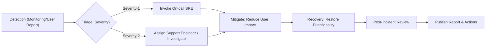
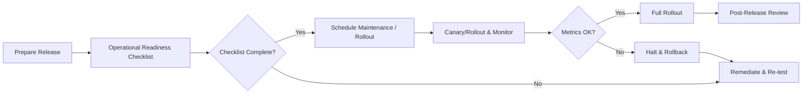

# 10-operations-and-maintenance.md — Operational Readiness, Monitoring, and Maintenance Requirements for todoApp

## Executive Summary

Operational commitments for todoApp prioritize fast, reliable user experiences for core todo flows (create, update, complete). The operations organization SHALL provide detection, mitigation, and recovery capabilities that preserve user trust and meet business-target SLOs. Primary targets: 99.95% availability for core user flows, 95th percentile latency < 500 ms for create/update operations, and clear incident response SLAs for acknowledgement and remediation.

## Purpose, Scope, and Assumptions

Purpose: Define business-level operational requirements and acceptance criteria for launching and operating the todoApp backend.

Scope:
- IN SCOPE: Production readiness, monitoring and alerting, incident response, on-call responsibilities, backup/restore expectations, maintenance windows and communication, change management, and post-incident reviews.
- OUT OF SCOPE: Specific tooling, infrastructure architecture, and low-level runbook commands.

Assumptions:
- The service supports key actors (guest, todoUser, admin) and core functionality as defined in Functional Requirements.
- Initial operational capacity planning targets an early MAU of 10,000 with scaling plans toward 100,000 MAU.

## Operational Roles and Responsibilities

Roles and core responsibilities (business-level):

- Operations Lead
  - THE Operations Lead SHALL own production readiness and maintenance coordination, and SHALL sign off on production releases after operational gate checks.
  - WHEN a major incident occurs, THE Operations Lead SHALL coordinate public communications and stakeholder briefings within 30 minutes of declaring a severity-1 incident.

- On-call SRE
  - WHEN a severity-1 alert fires, THE On-call SRE SHALL acknowledge the alert within 2 minutes and SHALL initiate triage and mitigation steps per the relevant playbook.
  - WHEN a severity-2 alert fires, THE On-call SRE SHALL acknowledge within 10 minutes and begin investigation.

- Support Engineer
  - WHEN a user-facing incident is detected, THE Support Engineer SHALL provide initial public-facing status updates and assist with user triage within 15 minutes of validation.
  - THE Support Engineer SHALL maintain incident timelines and coordinate customer communications for affected accounts.

- Product Owner
  - THE Product Owner SHALL make decisions on rollbacks, feature toggles, and prioritization during incidents and SHALL be available for decision-making within 30 minutes of escalation.

- Admin (Moderation)
  - WHEN administrative moderation actions are taken (suspend/reactivate user, remove content), THE admin SHALL record rationale and SHALL ensure the action is logged and auditable.

## Support and Escalation Paths (Tiered)

Tier definitions and escalation timelines:

- Tier 0 — Self-Service: Status page, knowledge base, and automated recovery tips for guests and users.
- Tier 1 — Support Engineer: Handles user-reported issues and account-level triage.
- Tier 2 — On-call SRE: Investigates alerts and applies mitigations for system degradation.
- Tier 3 — Engineering: Code or data fixes that require development work.

EARS escalation rules:
- WHEN a user report indicates a possible system-wide outage, THE Support Engineer SHALL escalate to On-call SRE within 10 minutes of receiving the report.
- WHEN On-call SRE identifies a severity-1 incident, THE On-call SRE SHALL escalate to Engineering (Tier 3) within 20 minutes if mitigation steps do not restore core functionality.
- IF an incident is unresolved after 4 hours, THEN THE Operations Lead SHALL convene a cross-functional incident review and notify senior stakeholders.

## Monitoring and Alerting Expectations

Instrumentation and metrics to monitor:
- Latency: track p50/p90/p95/p99 for create, update, read, and list retrieval operations.
- Error rate: percentage of failed user-facing requests per minute and rolling windows (1m/5m/15m).
- Authentication failures: rate of auth failures per account and globally.
- Queue/backlog length: processing lag for asynchronous jobs (notifications, imports, background purges).
- Resource saturation proxies: database connection pool exhaustion, storage I/O contention signals (business-level thresholds tied to user impact).
- Business metrics: number of active users, DAU/MAU ratios, and sign-up funnel health (for release impact monitoring).

Alert severity mapping and thresholds (recommended defaults):

- Severity-1 (Critical): Core create/update operations failing for >10% of requests for 10 consecutive minutes OR availability below 98% for 15 minutes.
  - WHEN a Severity-1 condition occurs, THE system SHALL generate a Severity-1 alert and THE On-call SRE SHALL acknowledge within 2 minutes and begin mitigation.
  - WHEN mitigation restores >90% functionality, THE On-call SRE SHALL update status and the Support Engineer SHALL publish a public status update within 15 minutes of mitigation.

- Severity-2 (High): Latency degradation where p95 latency exceeds target (500 ms) for create/update operations for 15 minutes OR error rate >1% for 5 minutes.
  - WHEN a Severity-2 condition occurs, THE system SHALL generate a Severity-2 alert and THE On-call SRE SHALL acknowledge within 10 minutes and commence investigation.

- Severity-3 (Medium): Non-critical degradations (e.g., background job backlog > threshold) or elevated error patterns affecting a small portion of users.
  - WHEN a Severity-3 condition occurs, THE system SHALL notify On-call SRE and THE Support Engineer SHALL investigate during business hours.

- Severity-4 (Low): Informational alerts such as minor configuration drifts or single-account failures.
  - WHEN a Severity-4 event occurs, THE system SHALL log the event and notify the Operations Lead for routine review.

Alerting behavior and response rules (EARS):
- WHEN an alert fires at any severity, THE system SHALL record the alert event and create an incident ticket in the tracking system.
- WHEN an alert is acknowledged, THE on-call engineer SHALL update the incident ticket with first-response actions and estimated ETA for resolution.
- IF alert escalation thresholds are met (e.g., severity-1 persists >20 minutes), THEN THE system SHALL auto-page secondary responders and the Operations Lead.

## Maintenance Windows and Communication Policies

Scheduling and notification rules:
- WHEN planned maintenance is required that may affect user experience, THE Operations Lead SHALL schedule it during a published maintenance window and SHALL notify users and stakeholders at least 48 hours in advance.
- WHEN maintenance will cause public downtime, THE Operations Lead SHALL publish the maintenance advisory including expected start time, duration, affected features, and rollback plan.
- IF maintenance runs longer than the announced window, THEN THE Operations Lead SHALL post an updated ETA within 30 minutes of realizing the extension.

Emergency maintenance rules:
- WHEN an emergency maintenance is required (security patch or critical fix), THEN THE Operations Lead SHALL notify stakeholders immediately and SHALL publish a follow-up communication within 1 hour describing impact and mitigation steps.

Maintenance automation and rollback gates (EARS):
- WHEN a release involves schema changes or irreversible migrations, THE system SHALL gate the release behind a rollback-tested plan and require Product Owner sign-off.
- IF the error budget is exhausted, THEN THE Product Owner SHALL halt non-critical releases until remediation reduces error budget consumption.

## On-call and Incident Management Expectations

Incident lifecycle (EARS-formatted):
- WHEN a potential incident is detected by monitoring or user reports, THE On-call SRE SHALL triage and classify the incident within 10 minutes.
- WHEN an incident is classified as Severity-1, THE On-call SRE SHALL initiate mitigation steps within 5 minutes and SHALL provide initial public status within 15 minutes.
- WHEN core functionality is restored, THE On-call SRE SHALL declare recovery and SHALL begin post-incident documentation within 2 hours.

Mitigation and recovery goals:
- THE team SHALL prioritize restoring write operations for authenticated users where possible before addressing non-essential background work.
- WHEN rollback is the chosen mitigation, THE Product Owner SHALL approve rollback actions within 30 minutes of the rollback recommendation.

Public communications cadence:
- WHEN a Severity-1 incident is ongoing, THE Support Engineer SHALL post status updates at least every 30 minutes until recovery is declared.
- AFTER recovery, THE Operations Lead SHALL publish a final incident summary within 72 hours and SHALL schedule the post-incident review within 5 business days.

## Runbooks and Playbooks

Required runbooks and playbook contents:
- Mandatory playbooks: Authentication outage, Create/Update failure, Database connectivity degradation, Notification delivery failure, Data corruption suspect, Backup/restore drill, Abuse/moderation incident.
- Each playbook SHALL include:
  - Symptom checklist that maps monitoring signals to the playbook
  - Immediate mitigation steps with expected outcomes
  - Escalation criteria and contact list with defined response times
  - Communication templates for internal and public status updates
  - Rollback criteria and safe rollback steps
  - Post-incident actions and evidence collection guidance

Review cadence:
- WHEN playbooks are created or materially changed, THE Operations Lead SHALL ensure they are reviewed and exercised (tabletop or drill) within 30 days.
- THE Operations Lead SHALL require a full runbook exercise for each top-tier playbook at least quarterly.

## Service Level Objectives and KPIs

Business SLOs (measurable):
- THE todoApp SHALL achieve 99.95% availability for core user flows (create/update/complete) measured monthly.
- THE todoApp SHALL have p95 latency < 500 ms for create/update operations for 95% of requests under normal load.
- THE system SHALL maintain an error rate < 0.5% for user-facing requests measured on a daily rolling basis.
- THE Operations team SHALL detect Severity-1 incidents within a mean time-to-detect (TTD) < 5 minutes.

Error budget policy (business rule):
- WHEN the monthly error budget is exhausted, THEN THE Product Owner SHALL freeze non-critical feature releases until the error budget is restored.

Reporting and review:
- WHEN any SLO is missed for a monthly reporting period, THE Operations Lead SHALL produce a remediation plan with owners and timelines within 7 business days.

## Backup, Retention and Data Lifecycle Policies

Backup and restore targets (business-level):
- THE business SHALL target an RPO of 4 hours and an RTO of 24 hours for full-service restoration in catastrophic scenarios as a business goal.
- FOR user-initiated restores (restore of soft-deleted items within retention window), THE system SHALL complete restoration within 24 hours.

Retention policy rules (EARS):
- WHEN a user deletes a resource, THE system SHALL retain the resource in a soft-deleted state for 30 calendar days during which the owner may restore it.
- IF an account deletion request is received, THEN THE system SHALL mark the account for deletion and SHALL purge personal data from primary systems within 30 calendar days unless a legal hold applies.
- WHERE legal hold applies, THEN THE system SHALL preserve the minimal required data until the hold is released and SHALL record the hold reason and owner in audit logs.

Backup testing and acceptance:
- WHEN backup and restore capability is implemented, THE Operations Lead SHALL execute a restore test at least quarterly and SHALL record the test outcomes, time to restore, and any data gaps.

## Change Management and Release Practices

Release gating and approval (EARS):
- WHEN a release is proposed for production, THE Operations Lead SHALL verify operational readiness checklist items are complete before approving the release.
- IF the service's error budget for the month is exhausted or below a safe threshold, THEN THE Product Owner SHALL disallow non-critical releases until the budget is replenished.

Emergency change rules:
- WHEN an emergency fix is required to remediate a security vulnerability or major outage, THEN THE Product Owner and Operations Lead SHALL coordinate immediate deployment and SHALL document the change with rationale and rollback plan within 24 hours after deployment.

Canary and rollback requirements:
- THE team SHALL use staged rollout or canary deployments for significant changes and SHALL monitor error budgets and key metrics during the rollout window.
- WHEN a canary shows metric regressions beyond thresholds, THEN THE system SHALL automatically halt the rollout and THE Product Owner SHALL evaluate rollback within 30 minutes.

## Post-Incident Review and Continuous Improvement

Post-incident requirements (EARS):
- WHEN a Severity-1 incident occurs, THE Operations Lead SHALL produce a post-incident report within 72 hours that includes timeline, root cause, mitigations, and corrective actions with owners.
- IF corrective actions are identified, THEN THE Operations Lead SHALL track remediation progress weekly until completion and SHALL report status to stakeholders.

Continuous improvement:
- THE team SHALL maintain a prioritized backlog of operational improvements derived from incident reviews and SHALL schedule regular releases for operational fixes.

## Risk Assessment and Mitigation Strategies

Top operational risks and controls:
- Risk: Data loss due to accidental purge — Control: soft-delete with 30-day retention, backup retention, and legal hold mechanism.
- Risk: Authentication outage — Control: replicated auth path, monitoring, and dedicated playbook for auth failure.
- Risk: Alert fatigue — Control: alert tuning, rate-limited paging, and regular review of alert thresholds and playbooks.
- Risk: Deployment regressions — Control: canary rollouts, error-budget gating, and automated rollback criteria.

## Readiness Checklist and Acceptance Criteria (Pre-Release)

The following items MUST be completed and accepted before a release to production:
- Monitoring coverage for core user flows (create/update/complete) with dashboards and alerts configured. (Acceptance: dashboards show synthetic transactions green in staging)
- Playbooks and runbooks for top 5 incident types are written and owned. (Acceptance: owners assigned and playbooks reviewed)
- Backup and restore process tested within last 90 days with documented results. (Acceptance: restore completes within RTO goal in test)
- Operational readiness sign-off by Operations Lead and Product Owner. (Acceptance: signed checklist entry in release artifact)
- On-call rotas and escalation contacts verified and reachable. (Acceptance: contact verification tests pass)
- Rollback plan and migration reversal steps documented and tested for schema changes. (Acceptance: rollback test passes in staging)

EARS-formatted pre-release requirements:
- WHEN an upcoming release is proposed, THE Operations Lead SHALL ensure the operational readiness checklist is completed and SHALL sign off before any production deployment.
- IF any checklist item fails, THEN THE release SHALL be blocked until the failure is remediated and sign-off is provided.

## Mermaid Diagrams

### Incident Response Flow

### Maintenance & Release Flow

## Appendix: Glossary, Alert Templates, and SLO Test Matrix

Glossary:
- TTD: Time to Detect
- TTA: Time to Acknowledge
- TTR: Time to Restore/Recover
- RPO: Recovery Point Objective
- RTO: Recovery Time Objective

Example alert template (public status update):
- Title: "Service Incident - [Short description]"
- Impact: "Describe user-visible impact and affected features"
- Mitigation: "Actions taken to mitigate and temporary workarounds"
- ETA: "Estimated time to resolution or next update"
- Contact: "Support contact or help center link"

SLO Test Matrix (examples):
- Test: Create todo latency
  - Method: Synthetic transaction from representative geos
  - Acceptance: p95 < 500 ms for 95% of checks over 7 days
- Test: Restore from backup
  - Method: Restore representative dataset in staging
  - Acceptance: Restore completes within RTO target and data integrity checks pass

End of operational requirements.