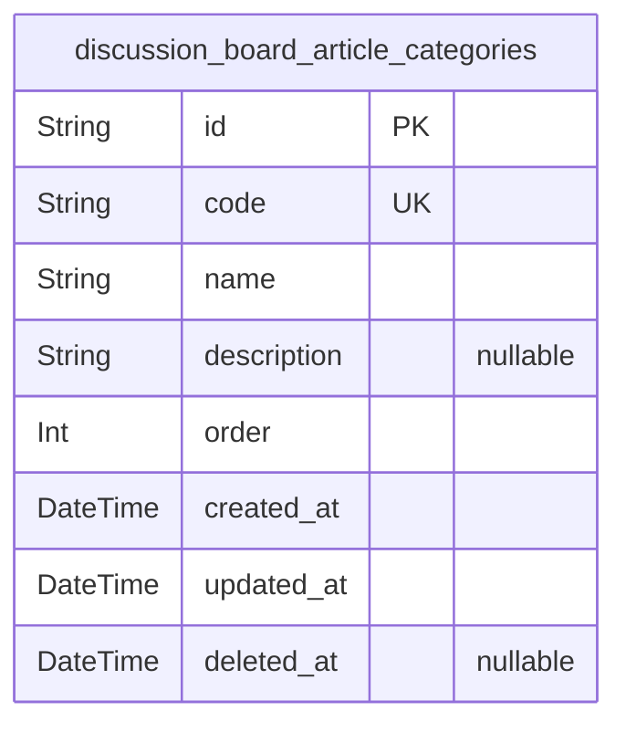
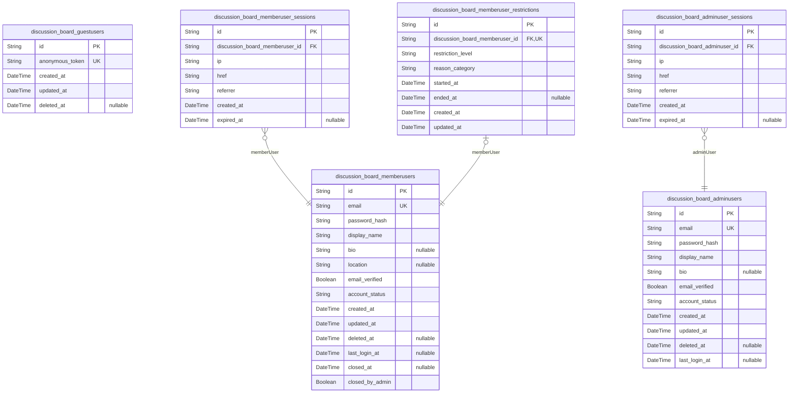
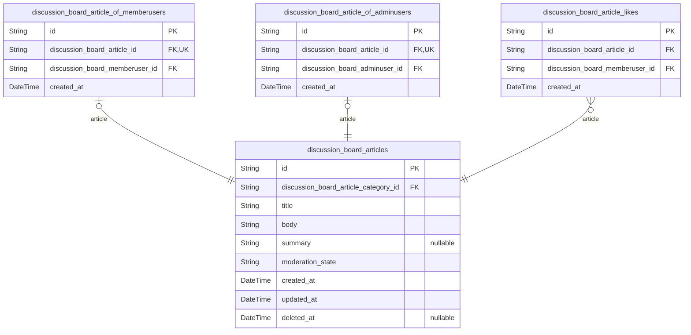
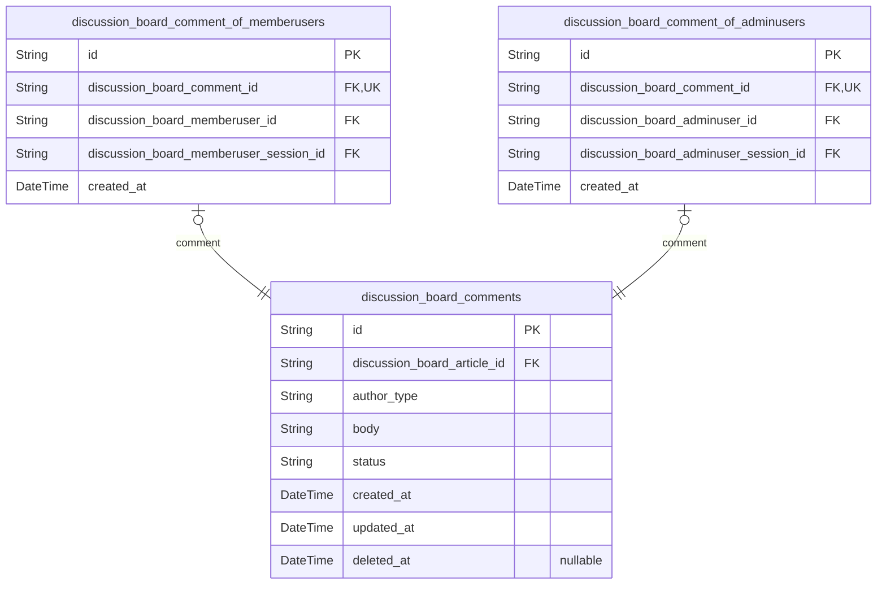
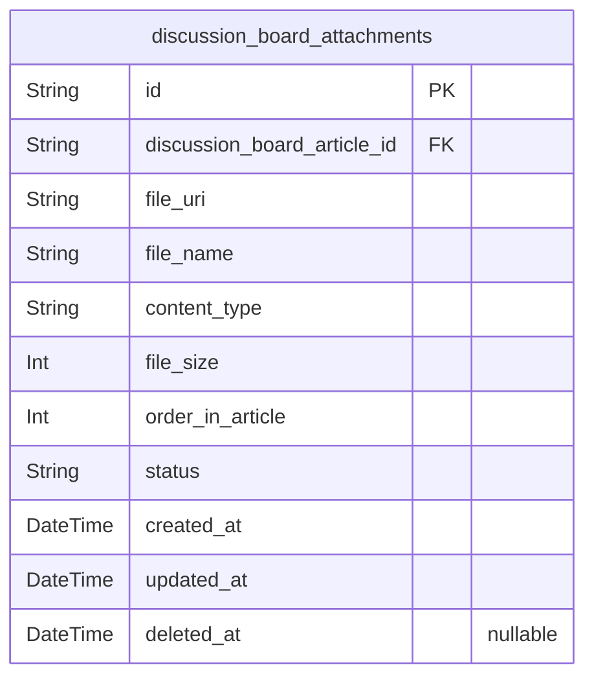
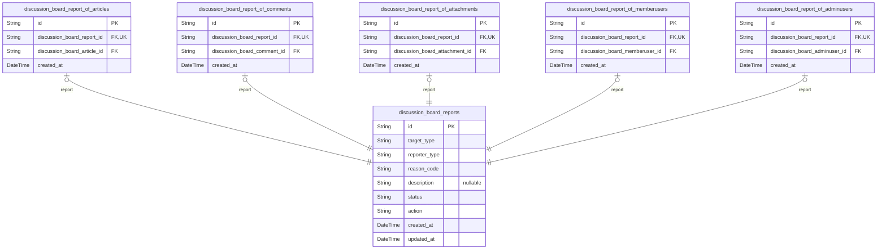
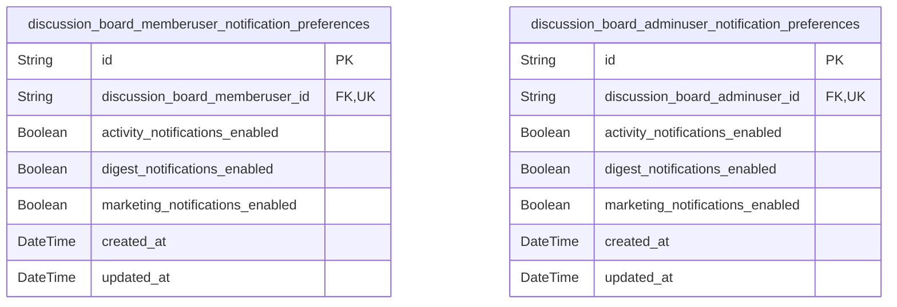

# Prisma Markdown

> Generated by [`prisma-markdown`](https://github.com/samchon/prisma-markdown)

- [Systematic](#systematic)
- [Actors](#actors)
- [Articles](#articles)
- [Comments](#comments)
- [Attachments](#attachments)
- [ModerationAndReports](#moderationandreports)
- [Notifications](#notifications)

## Systematic

### `discussion_board_article_categories`

Article category master data for the economic and political discussion
board.

This table stores normalized category definitions such as "Economy" or
"Politics" that are used to classify articles for browsing, filtering,
and reporting. Each category has a stable machine-friendly code and a
human-readable name so that application logic and external integrations
can rely on a consistent identifier while users see localized or readable
labels.

Categories are managed by administrators rather than end users. Articles
in [discussion_board_articles](#discussion_board_articles) will reference these categories
through a foreign key, ensuring consistent classification across the
system. Soft deletion via deleted_at allows categories to be retired
without breaking historical article data, while created_at and updated_at
support basic audit and ordering use cases.

Properties as follows:

- `id`
  > Primary Key. Unique identifier for each article category, generated as a
  > UUID to ensure global uniqueness across the system.
- `code`
  > Machine-friendly unique code for the category, such as "ECONOMY" or
  > "POLITICS".
  >
  > This value is used by backend logic, integrations, and configuration as a
  > stable identifier that does not change even if the display name is
  > edited.
- `name`
  > Human-readable name of the article category as displayed to users, such
  > as "Economy" or "Politics".
  >
  > This field is what users typically see in article creation forms and
  > filter dropdowns.
- `description`
  > Optional longer description of what the category is intended for.
  >
  > This text helps administrators and possibly users understand the scope or
  > examples of content that belong in the category.
- `order`
  > Integer value used to define the display order of categories in lists and
  > dropdowns.
  >
  > Lower numbers typically appear first. This allows administrators to
  > control the default ordering without relying solely on creation time or
  > name.
- `created_at`
  > Timestamp indicating when the category was created.
  >
  > Used for audit purposes and to support chronological listings where
  > needed.
- `updated_at`
  > Timestamp indicating when the category was last updated.
  >
  > Updated whenever the category’s editable fields (such as name or
  > description) change.
- `deleted_at`
  > Nullable timestamp indicating when the category was soft-deleted or
  > retired.
  >
  > When this field is non-null, the category should no longer be offered for
  > new article assignment, but existing articles may continue to reference
  > it for historical integrity.

## Actors

### `discussion_board_guestusers`

Guest user placeholder accounts for unauthenticated visitors.

Represents optional persisted identities for guests when the system
chooses to maintain long-lived guest records, for example for future
migration to full member accounts or to correlate anonymous activity
under privacy rules.

In the current business requirements, guests do not authenticate or hold
permissions beyond read-only access, so this table remains minimal and is
rarely manipulated directly by user-facing APIs.

Properties as follows:

- `id`: Primary key. Uniquely identifies a guest user placeholder record.
- `anonymous_token`
  > Opaque token or fingerprint that represents this guest user across
  > visits. Used only if the system chooses to persist guest identity for
  > correlation or migration.
- `created_at`: Timestamp when this guest user record was created.
- `updated_at`: Timestamp when this guest user record was last updated.
- `deleted_at`
  > Soft deletion timestamp. When set, this guest user record is considered
  > closed or no longer in active use.

### `discussion_board_memberusers`

Registered member accounts for the discussionBoard service.

Stores authentication credentials, basic profile fields, and high-level
lifecycle state for member users who create and manage their own
articles, comments, and attachments.

This table underpins permissions and moderation behavior, including
account status flags that interact with restriction policies and
suspension rules defined in the business requirements.

Properties as follows:

- `id`: Primary key. Uniquely identifies a member user account.
- `email`
  > Member email address used as the primary contact field and login
  > identifier. Must be unique among member users.
- `password_hash`
  > Hashed credential used for authenticating the member user. Plain-text
  > passwords are never stored.
- `display_name`
  > Public display name or nickname shown alongside articles and comments
  > created by this member user.
- `bio`
  > Optional short self-introduction text that the member can provide on
  > their profile.
- `location`
  > Optional free-text field representing geographic location or main
  > interest area, treated as plain descriptive text.
- `email_verified`: Indicates whether the member user has completed email verification.
- `account_status`
  > High-level lifecycle state of the account, such as active, suspended,
  > closed, or banned. Used together with restriction records to enforce
  > behavior.
- `created_at`: Timestamp when this member user account was created.
- `updated_at`: Timestamp when this member user account record was last updated.
- `deleted_at`
  > Soft deletion timestamp. When set, the account is considered closed from
  > a business perspective while historical content may remain.
- `last_login_at`
  > Timestamp of the last successful login for this member user, used for
  > account lifecycle and security monitoring.
- `closed_at`
  > Timestamp when the account was explicitly closed, either by the member
  > user or by an administrator.
- `closed_by_admin`
  > Flag indicating whether the closure was initiated by an administrator
  > instead of the account owner.

### `discussion_board_adminusers`

Administrator accounts for managing content and users in discussionBoard.

Stores authentication credentials, basic profile fields, and lifecycle
state for administrative users who can moderate content, process reports,
and manage member accounts.

Admin accounts have broader permissions but are still subject to standard
authentication and audit requirements.

Properties as follows:

- `id`: Primary key. Uniquely identifies an administrator account.
- `email`
  > Administrator email address used for authentication and critical
  > notifications. Must be unique among administrators.
- `password_hash`
  > Hashed credential used to authenticate the administrator. Plain-text
  > passwords are never stored.
- `display_name`
  > Public or semi-public display name used when this administrator creates
  > content or appears in audit trails.
- `bio`: Optional short profile or role description for this administrator account.
- `email_verified`: Indicates whether the administrator has completed email verification.
- `account_status`
  > Lifecycle state for the administrator account, such as active, suspended,
  > or closed, used for access control.
- `created_at`: Timestamp when this administrator account was created.
- `updated_at`: Timestamp when this administrator account record was last updated.
- `deleted_at`
  > Soft deletion timestamp. When set, the administrator account is no longer
  > usable, while audit references remain valid.
- `last_login_at`: Timestamp of the last successful login for this administrator account.

### `discussion_board_memberuser_sessions`

Session records for authenticated memberUser accounts.

Captures minimal connection context for each member session, including
IP, entry URL, and referrer, to support audit trails and basic security
analysis.

This table follows the global session table pattern and is treated as a
subsidiary entity used only for tracing and not for direct business
workflows.

Properties as follows:

- `id`: Primary key. Uniquely identifies a member user session.
- `discussion_board_memberuser_id`
  > Reference to the member user who owns this session. {@link
  > discussion_board_memberusers.id}.
- `ip`: IP address from which the member user established this session.
- `href`: Full URL that the user accessed when this session was created.
- `referrer`
  > Referrer URL, if any, that led the user into the application for this
  > session.
- `created_at`: Timestamp when this session was created.
- `expired_at`
  > Timestamp when this session was considered expired or terminated. Null
  > while still active.

### `discussion_board_adminuser_sessions`

Session records for authenticated adminUser accounts.

Stores minimal session context for administrators, capturing connection
data needed for auditing privileged operations and monitoring admin
activity.

Follows the global session table pattern and acts as a subsidiary entity
referenced from admin logic but not directly manipulated by end users.

Properties as follows:

- `id`: Primary key. Uniquely identifies an admin user session.
- `discussion_board_adminuser_id`
  > Reference to the administrator who owns this session. {@link
  > discussion_board_adminusers.id}.
- `ip`: IP address from which the admin user established this session.
- `href`: Full URL that the administrator accessed when this session was created.
- `referrer`
  > Referrer URL, if any, that led the administrator into the application for
  > this session.
- `created_at`: Timestamp when this admin session was created.
- `expired_at`
  > Timestamp when this admin session was considered expired or terminated.
  > Null while still active.

### `discussion_board_memberuser_restrictions`

Current restriction state for each memberUser account.

Represents simple moderation-driven account restrictions such as posting
restriction or full block, which determine whether a member user may
create articles, comments, or attachments.

This table holds at most one active restriction record per member user
and includes metadata for reason categorization and timing; it is managed
by administrative workflows when applying or lifting restrictions.

Properties as follows:

- `id`: Primary key. Uniquely identifies a restriction record for a member user.
- `discussion_board_memberuser_id`
  > Reference to the member user subject to this restriction. One restriction
  > record per member user. [discussion_board_memberusers.id](#discussion_board_memberusers).
- `restriction_level`
  > Level of restriction applied to the member user, such as
  > posting_restriction or full_block.
- `reason_category`
  > High-level category describing why the restriction was applied, for
  > example repeated_violations, hate_abuse, or spam_advertising.
- `started_at`: Timestamp when this restriction became effective for the member user.
- `ended_at`
  > Timestamp when this restriction was lifted. Null while the restriction
  > remains active.
- `created_at`: Timestamp when this restriction record was created.
- `updated_at`: Timestamp when this restriction record was last updated.

## Articles

### `discussion_board_articles`

Core articles representing economic and political discussion topics.

This table stores the primary discussion objects that users browse,
search, read, create, edit, and delete. Each record represents one
article with its title, body, optional summary, category assignment,
moderation state, and audit timestamps.

Authorship is modeled through subtype tables {@link
discussion_board_article_of_memberusers} and {@link
discussion_board_article_of_adminusers}, allowing either a member user or
an admin user to own the article without using nullable polymorphic
foreign keys.

Articles are subject to moderation and can move between business states
such as Active, Hidden, and Deleted. Soft deletion is implemented using
the deleted_at field, while moderation_state records the current
visibility state from a business perspective.

Articles are linked to categories via {@link
discussion_board_article_categories} to support simple filtering and
navigation. Per-member like engagement is represented in {@link
discussion_board_article_likes}. Any aggregated metrics or counters for
views or likes should be implemented in separate materialized views, not
in this primary table.

Properties as follows:

- `id`: Primary key of the article. Unique identifier for each discussion article.
- `discussion_board_article_category_id`
  > Foreign key referencing the category of this article. {@link
  > discussion_board_article_categories.id}. Each article belongs to exactly
  > one primary category.
- `title`
  > Human-readable title of the article. Must be non-empty and respect
  > minimum and maximum length constraints for article titles.
- `body`
  > Main body text of the article. Contains the full discussion content
  > written by the author and must satisfy length constraints defined for
  > article bodies.
- `summary`
  > Optional short plain-text summary of the article. Used in listings or
  > previews and limited to a small maximum length. Nullable when no summary
  > is provided.
- `moderation_state`
  > Business moderation state of the article. Expected values conceptually
  > include "Active", "Hidden", and "Deleted" to represent visibility and
  > moderation decisions. Enforcement of allowed values is handled in
  > application logic.
- `created_at`
  > Timestamp when the article was first created. Used for sorting lists and
  > audit purposes.
- `updated_at`
  > Timestamp of the most recent successful update to the article content or
  > metadata. Equal to created_at for never-edited articles.
- `deleted_at`
  > Timestamp when the article was logically deleted from a data-retention
  > perspective. Nullable; when set, the article should be treated as Deleted
  > in business workflows and excluded from normal listings.

### `discussion_board_article_of_memberusers`

Authorship subtype linking articles to member users.

This table represents the ownership of articles created by regular member
users. Each record connects exactly one article in {@link
discussion_board_articles} with exactly one member user in {@link
discussion_board_memberusers}.

The 1:1 relationship between an article and this subtype is enforced with
a unique constraint on discussion_board_article_id, ensuring that a given
article has at most one memberUser author record. Articles authored by
admins use the separate [discussion_board_article_of_adminusers](#discussion_board_article_of_adminusers)
table.

This design follows the main-entity plus subtype pattern to avoid
nullable polymorphic foreign keys and to keep ownership constraints
explicit at the database level.

Properties as follows:

- `id`: Primary key of the member user authorship record.
- `discussion_board_article_id`
  > Foreign key referencing the article authored by a member user. {@link
  > discussion_board_articles.id}. Unique to enforce a 1:1 relationship
  > between an article and this subtype row.
- `discussion_board_memberuser_id`
  > Foreign key referencing the member user who authored the article. {@link
  > discussion_board_memberusers.id}. Many articles can be authored by the
  > same member user.
- `created_at`
  > Timestamp when this authorship link was created. Typically identical to
  > the article creation time for member-authored articles.

### `discussion_board_article_of_adminusers`

Authorship subtype linking articles to admin users.

This table represents the ownership of articles created by
administrators. Each record connects exactly one article in {@link
discussion_board_articles} with exactly one admin user in {@link
discussion_board_adminusers}.

The 1:1 relationship between an article and this subtype is enforced with
a unique constraint on discussion_board_article_id, ensuring that a given
article has at most one adminUser author record. Articles authored by
regular members use the separate {@link
discussion_board_article_of_memberusers} table.

Using this subtype avoids nullable polymorphic foreign keys, keeping
authorship constraints and relations explicit and fully normalized.

Properties as follows:

- `id`: Primary key of the admin user authorship record.
- `discussion_board_article_id`
  > Foreign key referencing the article authored by an admin user. {@link
  > discussion_board_articles.id}. Unique to enforce a 1:1 relationship
  > between an article and this subtype row.
- `discussion_board_adminuser_id`
  > Foreign key referencing the admin user who authored the article. {@link
  > discussion_board_adminusers.id}. Many articles can be authored by the
  > same admin user.
- `created_at`
  > Timestamp when this authorship link was created. Typically identical to
  > the article creation time for admin-authored articles.

### `discussion_board_article_likes`

Per-member like engagement records for articles.

This table stores individual like actions performed by member users on
articles. Each record represents that a specific member user has liked a
specific article, with a creation timestamp for audit and ordering.

A unique composite constraint on (discussion_board_article_id,
discussion_board_memberuser_id) ensures that a member user can like a
given article at most once. Removing a like can be modeled by deleting
the corresponding row.

This structure supports queries such as whether a member has liked a
particular article, listing all likes made by a member, and aggregating
like counts per article. Only member users can like articles; admin users
can moderate content but do not require separate like ownership modeling.

Properties as follows:

- `id`: Primary key of the article like record.
- `discussion_board_article_id`
  > Foreign key referencing the liked article. {@link
  > discussion_board_articles.id}. Many likes can reference the same article.
- `discussion_board_memberuser_id`
  > Foreign key referencing the member user who liked the article. {@link
  > discussion_board_memberusers.id}. Many likes can be created by the same
  > member user.
- `created_at`
  > Timestamp when the like was created. Used for audit trails and ordering
  > of engagement activity.

## Comments

### `discussion_board_comments`

Top-level text comments attached directly to discussion board articles.

This model stores the core business data for each comment, including its
article relationship, text body, author type discriminator, moderation
status, and lifecycle timestamps.

Each comment belongs to exactly one article and is authored either by a
member user or an admin user via the polymorphic ownership pattern. The
concrete author relationship details are held in the subsidiary tables
[discussion_board_comment_of_memberusers](#discussion_board_comment_of_memberusers) and {@link
discussion_board_comment_of_adminusers}.

Moderation uses a simple status field (for example, Active, Hidden,
Deleted) together with soft deletion to control visibility in lists and
article views while preserving auditability for administrators.

Properties as follows:

- `id`
  > Primary key of the comment. Uniquely identifies a discussion comment
  > record.
- `discussion_board_article_id`
  > Foreign key to the article this comment belongs to. {@link
  > discussion_board_articles.id}. The comment is always attached to a
  > single, existing article.
- `author_type`
  > Logical type of the comment author. Expected values include "member" for
  > member users and "admin" for admin users. Used for quick filtering and
  > must be consistent with the corresponding ownership subtype table entry.
- `body`
  > Text content of the comment. Must be non-empty and within
  > business-defined length limits (for example, up to 5,000 visible
  > characters).
- `status`
  > Business-level moderation status of the comment. Typical values:
  > "Active", "Hidden", or "Deleted". Controls visibility to regular users
  > while allowing administrators to review handled content.
- `created_at`
  > Timestamp when the comment was created. Used for ordering and audit
  > trails.
- `updated_at`
  > Timestamp when the comment was last updated. Updated whenever the body or
  > moderation-related fields change.
- `deleted_at`
  > Soft deletion timestamp. When set, indicates that the comment is
  > logically deleted and should be excluded from normal user views while
  > still remaining in storage for audit or recovery purposes.

### `discussion_board_comment_of_memberusers`

Ownership subtype entity that links a comment to its member user author
and the creating session.

This model implements the polymorphic ownership pattern for comments
authored by regular member users. Each row represents a 1:1 extension of
[discussion_board_comments](#discussion_board_comments) for comments whose actor type is a
member user.

It records the member account that authored the comment, the session
context at creation time, and a timestamp, allowing precise audit of
which member and which session produced the comment without nullable
foreign keys on the main comment table.

Properties as follows:

- `id`: Primary key of the member user comment ownership record.
- `discussion_board_comment_id`
  > Foreign key to the base comment entity. {@link
  > discussion_board_comments.id}. Enforced as unique to ensure a strict 1:1
  > relationship for member-authored comments.
- `discussion_board_memberuser_id`
  > Foreign key to the member user account that authored the comment. {@link
  > discussion_board_memberusers.id}. Always required for member-authored
  > comments.
- `discussion_board_memberuser_session_id`
  > Foreign key to the member user session associated with the comment
  > creation. [discussion_board_memberuser_sessions.id](#discussion_board_memberuser_sessions). Captures
  > connection context such as IP and referrer at creation time.
- `created_at`
  > Timestamp when this ownership record was created. Typically matches the
  > creation time of the underlying comment and is used for audit and
  > traceability.

### `discussion_board_comment_of_adminusers`

Ownership subtype entity that links a comment to its admin user author
and the creating session.

This model implements the polymorphic ownership pattern for comments
authored by admin users. Each row represents a 1:1 extension of {@link
discussion_board_comments} for comments whose actor type is an
administrator.

It records the admin account that authored the comment, the session
context at creation time, and a timestamp so that administrative
commentary can be audited separately from member commentary without
nullable foreign keys on the main comment table.

Properties as follows:

- `id`: Primary key of the admin user comment ownership record.
- `discussion_board_comment_id`
  > Foreign key to the base comment entity. {@link
  > discussion_board_comments.id}. Enforced as unique to ensure a strict 1:1
  > relationship for admin-authored comments.
- `discussion_board_adminuser_id`
  > Foreign key to the admin user account that authored the comment. {@link
  > discussion_board_adminusers.id}. Always required for admin-authored
  > comments.
- `discussion_board_adminuser_session_id`
  > Foreign key to the admin user session associated with the comment
  > creation. [discussion_board_adminuser_sessions.id](#discussion_board_adminuser_sessions). Captures
  > connection context such as IP and referrer at creation time.
- `created_at`
  > Timestamp when this ownership record was created. Typically matches the
  > creation time of the underlying comment and is used for audit and
  > traceability of administrative actions.

## Attachments

### `discussion_board_attachments`

File attachments associated with discussion board articles.

This table stores metadata for images and documents that are attached to
individual articles in the economic/political discussion board. Each row
represents a single file that belongs to exactly one article, and the
attachment has no lifecycle independent of its parent article.

The model records user-visible filename, MIME-like content type, file
size, a display order within the parent article, and a URI pointing to
the stored object. It also tracks a simple moderation status that aligns
with article/content states such as Active, Hidden, and Deleted, as well
as standard temporal audit fields.

Attachments are always managed through article operations or
administration tools and are not directly searchable as a standalone
resource for end users. They follow the visibility of their parent
article while allowing administrators to hide or delete individual files
when necessary.

Properties as follows:

- `id`: Primary key. Unique identifier for the attachment record.
- `discussion_board_article_id`
  > Parent article that this attachment belongs to. {@link
  > discussion_board_articles.id}.
- `file_uri`
  > URI location of the stored file object. Used by the application to
  > retrieve or stream the attachment content.
- `file_name`
  > Original or user-visible file name of the attachment. May be normalized
  > for safety while remaining recognizable to users.
- `content_type`
  > MIME-like content type of the attachment, such as "image/jpeg" or
  > "application/pdf". Used to decide preview vs download behavior.
- `file_size`
  > Size of the attachment file in bytes. Used for enforcing per-file and
  > per-article size limits and for displaying approximate size to users.
- `order_in_article`
  > Display order index of this attachment within its parent article. Lower
  > values are shown earlier in attachment lists.
- `status`
  > Moderation and lifecycle status of the attachment. Typical values mirror
  > content states such as "active", "hidden", or "deleted" as defined by
  > business rules.
- `created_at`
  > Timestamp when the attachment record was created. Represents the time the
  > file was first associated with the article.
- `updated_at`
  > Timestamp when the attachment record was last updated. Updated whenever
  > metadata or status changes.
- `deleted_at`
  > Soft deletion timestamp. When set, indicates the attachment is considered
  > deleted for business purposes even if metadata is retained internally.

## ModerationAndReports

### `discussion_board_reports`

Central entity representing a single user report about an article,
comment, or attachment.

Each row captures the reporting user type, target content type, reason
category, optional free-text explanation, and the current moderation
status and action chosen by administrators.

Moderation workflows use this table as the primary queue for reviewing
reported content, changing statuses from submitted through in_review to
resolved, and applying actions such as keeping, hiding, deleting content,
or restricting the owning member user.

Reports are append-only audit records; they are not soft-deleted, and
their lifecycle is independent from the lifecycle of the underlying
content or reporting account.

Properties as follows:

- `id`: Primary key of the report. Uniquely identifies a single report instance.
- `target_type`
  > Discriminator describing which type of content this report targets.
  > Typical values are "article", "comment", or "attachment" and are enforced
  > at the application layer.
- `reporter_type`
  > Discriminator describing which actor type submitted the report. Typical
  > values are "memberuser" or "adminuser" and are enforced at the
  > application layer.
- `reason_code`
  > Machine-friendly code representing the primary reason category for this
  > report. Example values include "hate_abuse", "harassment", "spam",
  > "off_topic", "dangerous_misleading", and "other". Validation for allowed
  > values is handled in the application.
- `description`
  > Optional free-text explanation provided by the reporter to clarify the
  > reason. Required by business rules when reason_code is "other", but
  > stored as nullable at schema level.
- `status`
  > Current workflow status of the report. Typical values are "submitted",
  > "in_review", or "resolved". Used to drive admin report queues and
  > filtering.
- `action`
  > Administrative decision applied in response to this report. Example
  > values include "none", "keep", "hide_content", "delete_content", and
  > "restrict_user". Business rules determine valid combinations with status.
- `created_at`: Timestamp when the report was created and submitted by the reporting user.
- `updated_at`
  > Timestamp when the report was last updated, typically when an admin
  > changes status or action.

### `discussion_board_report_of_articles`

Link entity that associates a report with a specific article.

Each row connects exactly one [discussion_board_reports](#discussion_board_reports) record to
exactly one [discussion_board_articles](#discussion_board_articles) record, enforcing a 1:1
relationship between the report and its article target while allowing
many reports per article overall.

This table exists purely to normalize the polymorphic target relationship
for article-type reports and is always managed through the main report or
article workflows.

Properties as follows:

- `id`
  > Primary key of the article-report link. Uniquely identifies the
  > association between a report and an article.
- `discussion_board_report_id`
  > Foreign key referencing the report that targets an article. Enforces that
  > each report links to at most one article association. {@link
  > discussion_board_reports.id}.
- `discussion_board_article_id`
  > Foreign key referencing the article that was reported. Multiple reports
  > can reference the same article through separate link rows. {@link
  > discussion_board_articles.id}.
- `created_at`
  > Timestamp when this report-to-article association was created. Typically
  > matches the report creation time but is stored separately for
  > consistency.

### `discussion_board_report_of_comments`

Link entity that associates a report with a specific comment.

Each row connects exactly one [discussion_board_reports](#discussion_board_reports) record to
exactly one [discussion_board_comments](#discussion_board_comments) record, enforcing a 1:1
relationship between the report and its comment target while permitting
many reports for the same comment.

This table normalizes the polymorphic target relationship for
comment-type reports and is always manipulated via the main report or
comment management flows.

Properties as follows:

- `id`
  > Primary key of the comment-report link. Uniquely identifies the
  > association between a report and a comment.
- `discussion_board_report_id`
  > Foreign key referencing the report that targets a comment. Enforces that
  > each report links to at most one comment association. {@link
  > discussion_board_reports.id}.
- `discussion_board_comment_id`
  > Foreign key referencing the comment that was reported. Multiple reports
  > can reference the same comment through separate link rows. {@link
  > discussion_board_comments.id}.
- `created_at`: Timestamp when this report-to-comment association was created.

### `discussion_board_report_of_attachments`

Link entity that associates a report with a specific attachment belonging
to an article.

Each row connects exactly one [discussion_board_reports](#discussion_board_reports) record to
exactly one [discussion_board_attachments](#discussion_board_attachments) record, maintaining a
1:1 relationship between the report and its attachment target while
allowing multiple reports per attachment.

This table isolates attachment-specific relationships so that the main
report entity does not require nullable foreign keys for different target
types.

Properties as follows:

- `id`
  > Primary key of the attachment-report link. Uniquely identifies the
  > association between a report and an attachment.
- `discussion_board_report_id`
  > Foreign key referencing the report that targets an attachment. Ensures at
  > most one attachment association per report. {@link
  > discussion_board_reports.id}.
- `discussion_board_attachment_id`
  > Foreign key referencing the attachment that was reported. Many reports
  > can reference the same attachment via different link rows. {@link
  > discussion_board_attachments.id}.
- `created_at`: Timestamp when this report-to-attachment association was created.

### `discussion_board_report_of_memberusers`

Link entity that associates a report with a member user as the reporting
actor.

Each row connects exactly one [discussion_board_reports](#discussion_board_reports) record to
exactly one [discussion_board_memberusers](#discussion_board_memberusers) record, forming a 1:1
relationship between the report and its memberUser reporter while still
allowing a single member user to submit many reports.

This table normalizes the polymorphic reporter relationship for member
users and ensures there are no nullable reporter foreign keys on the main
report entity.

Properties as follows:

- `id`
  > Primary key of the member-user reporter link. Uniquely identifies the
  > association between a report and its memberUser reporter.
- `discussion_board_report_id`
  > Foreign key referencing the report submitted by a member user. Ensures at
  > most one memberUser association per report. {@link
  > discussion_board_reports.id}.
- `discussion_board_memberuser_id`
  > Foreign key referencing the member user account that filed the report. A
  > single member user can be associated with many reports. {@link
  > discussion_board_memberusers.id}.
- `created_at`: Timestamp when this report-to-memberUser association was created.

### `discussion_board_report_of_adminusers`

Link entity that associates a report with an admin user as the reporting
actor.

While most reports are expected from member users, administrators may
also file reports when acting as regular users. Each row connects one
[discussion_board_reports](#discussion_board_reports) record to one {@link
discussion_board_adminusers} record, enforcing a 1:1 relationship between
the report and its adminUser reporter.

This table complements [discussion_board_report_of_memberusers](#discussion_board_report_of_memberusers) to
fully normalize the polymorphic reporter relationship across actor types.

Properties as follows:

- `id`
  > Primary key of the admin-user reporter link. Uniquely identifies the
  > association between a report and its adminUser reporter.
- `discussion_board_report_id`
  > Foreign key referencing the report submitted by an admin user. Ensures at
  > most one adminUser association per report. {@link
  > discussion_board_reports.id}.
- `discussion_board_adminuser_id`
  > Foreign key referencing the admin user account that filed the report. A
  > single admin user can be associated with many reports. {@link
  > discussion_board_adminusers.id}.
- `created_at`: Timestamp when this report-to-adminUser association was created.

## Notifications

### `discussion_board_memberuser_notification_preferences`

Notification preference settings for a single member user account.

Stores per-member configuration flags controlling which categories of
notifications the system is allowed to send, such as activity on the
user’s own content, digest summaries, and optional marketing or
non-essential announcements.

Each record is strictly associated with exactly one {@link
discussion_board_memberusers} row, forming a 1:1 relationship so that
every member user can have at most one preference set.

Business logic uses these flags at send time to decide whether to deliver
a notification, while mandatory service announcements remain governed by
global policy rather than stored preferences.

Properties as follows:

- `id`: Primary key of the member user notification preferences record.
- `discussion_board_memberuser_id`
  > Owner member user account whose notification preferences are stored in
  > this row. [discussion_board_memberusers.id](#discussion_board_memberusers).
- `activity_notifications_enabled`
  > Indicates whether the member user wishes to receive notifications about
  > activity on their own content, such as replies to their articles or
  > comments.
- `digest_notifications_enabled`
  > Indicates whether the member user wishes to receive periodic digest or
  > summary notifications that aggregate recent relevant activity.
- `marketing_notifications_enabled`
  > Indicates whether the member user allows optional marketing-style or
  > non-essential announcement notifications, separate from mandatory service
  > announcements.
- `created_at`
  > Timestamp recording when this notification preference record was first
  > created.
- `updated_at`
  > Timestamp recording when this notification preference record was last
  > updated.

### `discussion_board_adminuser_notification_preferences`

Notification preference settings for a single admin user account.

Stores per-admin configuration flags controlling which categories of
notifications the system is allowed to send, such as notifications about
activity on the admin’s own content, digest summaries, and optional
marketing or non-essential announcements.

Each record is strictly associated with exactly one {@link
discussion_board_adminusers} row, forming a 1:1 relationship so that
every admin user can have at most one preference set.

While administrators must still receive mandatory service and policy
communications, these flags allow fine-tuning of non-essential categories
and reduce noise for operational accounts.

Properties as follows:

- `id`: Primary key of the admin user notification preferences record.
- `discussion_board_adminuser_id`
  > Owner admin user account whose notification preferences are stored in
  > this row. [discussion_board_adminusers.id](#discussion_board_adminusers).
- `activity_notifications_enabled`
  > Indicates whether the admin user wishes to receive notifications about
  > activity on content they authored, such as replies to their articles or
  > comments.
- `digest_notifications_enabled`
  > Indicates whether the admin user wishes to receive periodic digest or
  > summary notifications that aggregate recent relevant activity or
  > moderation-relevant events.
- `marketing_notifications_enabled`
  > Indicates whether the admin user allows optional marketing-style or
  > non-essential announcement notifications, separate from mandatory service
  > or operator-critical messages.
- `created_at`
  > Timestamp recording when this notification preference record was first
  > created.
- `updated_at`
  > Timestamp recording when this notification preference record was last
  > updated.
