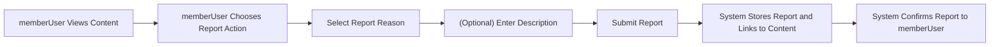
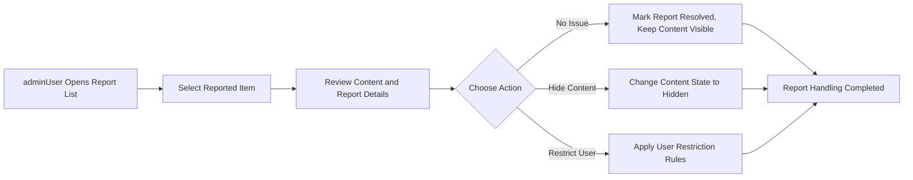

# Content Moderation and Reporting Rules for discussionBoard

## 1. Introduction and Scope

This document defines the business requirements for content moderation and reporting in the **discussionBoard** service, a simple economic/political discussion board. It focuses on how problematic content is reported and handled, and what powers administrators have over content and users. The goal is to keep the board civil and manageable without introducing complex or multi-level workflows.

This document describes **what** the system should do from a business perspective, not **how** it should be implemented technically. All implementation details such as APIs, storage models, database schemas, and infrastructure choices are left to the development team.

### 1.1 In-Scope

- Reporting inappropriate content by users.
- Admin handling of reported content.
- Business rules for content removal and restoration.
- Simple rules for blocking or restricting users.
- User-visible behavior related to moderation decisions.

### 1.2 Out-of-Scope

- Multi-level approval chains or complex review queues.
- Integration with external moderation services or legal authorities.
- Jurisdiction-specific legal compliance rules.
- Detailed technical mechanisms for authentication, logging, or auditing.

## 2. Moderation Objectives

The moderation system exists to keep economic and political discussions constructive, safe, and focused on the intended topics while remaining simple to operate.

### 2.1 Goals

- Support free and active discussion of economic and political topics.
- Prevent harassment, hate speech, spam, and clearly off-topic or abusive content.
- Provide a straightforward way for users to report problematic content.
- Give administrators clear and simple powers to act quickly on problematic content and users.

### 2.2 Success Criteria

- Most visible content on the board follows basic civility and topic rules.
- Problematic content can be reported and handled in a small number of steps.
- Users understand that content may be removed and accounts may be restricted when rules are clearly violated.

Representative EARS requirements:

- THE moderation process SHALL 유지되는 토론의 기본 예의와 주제 적합성을 보장하는 방향으로 동작한다.
- THE moderation process SHALL 가능한 단순한 단계 수로 신고와 조치를 완료하도록 정의된다.

## 3. Actors and Responsibilities (Business View)

### 3.1 Actors

- **guestUser**: Unauthenticated visitor.
- **memberUser**: Registered user who can create and manage own articles and comments.
- **adminUser**: Administrator who can manage all content and users.

### 3.2 Responsibilities Related to Moderation

- THE guestUser SHALL 콘텐츠 열람과 검색만 수행하고 신고나 제재 대상이 되는 행위는 할 수 없도록 간주된다.
- THE memberUser SHALL 자신이 부적절하다고 판단하는 글과 댓글, 첨부파일을 신고할 수 있는 주체로 간주된다.
- THE adminUser SHALL 신고된 콘텐츠와 관련 계정을 검토하고, 유지·숨김·삭제·제한 조치를 결정하는 주체로 간주된다.

## 4. Reporting Inappropriate Content

This section defines how problematic content is reported by memberUser actors.

### 4.1 Reportable Content

Reportable content types:
- Articles
- Comments
- Attachments (images or files) associated with articles

EARS requirements:

- THE reporting feature SHALL 기사, 댓글, 첨부파일 중 게시판에 노출되는 모든 콘텐츠 유형을 신고 대상으로 허용한다.
- THE reporting feature SHALL guestUser 가 아닌 memberUser 에게만 제공된다.

### 4.2 Report Reasons

Reports must use a small, fixed set of reasons to keep the system simple. Example categories:
- Hate or abusive content
- Harassment or personal attacks
- Spam or advertising
- Off-topic or low-value content
- Dangerous or misleading information (economic/political)
- Other (free-text reason)

EARS requirements:

- THE reporting feature SHALL 사전에 정의된 제한된 신고 사유 목록을 제공한다.
- WHEN memberUser 가 신고를 생성할 때, THE reporting feature SHALL 신고 사유 목록에서 하나의 기본 사유를 선택하도록 요구한다.
- WHERE 신고 사유로 "Other" 가 선택된 경우, THE reporting feature SHALL 사용자가 추가 설명을 입력하도록 요구한다.

### 4.3 Reporting Flow (User Perspective)

High-level user flow:
1. memberUser views content.
2. memberUser triggers a report action on a specific article, comment, or attachment.
3. memberUser selects a reason and optionally provides a short description.
4. The system records the report and marks the target as having at least one report.

EARS requirements:

- WHEN memberUser 가 특정 콘텐츠에 대해 신고 액션을 선택하면, THE reporting feature SHALL 해당 콘텐츠 유형과 식별자, 신고자, 신고 시각을 포함한 신고 요청 정보를 입력받는다.
- WHEN memberUser 가 신고 사유와 필요한 설명을 제출하면, THE reporting feature SHALL 신고를 저장하고 동일 콘텐츠에 대한 기존 신고 건수에 1건을 더한 상태를 만든다.
- WHEN 신고가 성공적으로 접수되면, THE reporting feature SHALL 신고자에게 신고가 접수되었음을 알리는 결과를 제공한다.

### 4.4 Reporting Flow Diagram

## 5. Admin Handling of Reports

This section defines what adminUser can do with reported content and how the process stays linear and simple.

### 5.1 Report Review

Admin users should see reported items in a simple list with basic information.

EARS requirements:

- THE report handling process SHALL 신고된 콘텐츠를 최근 신고 시각 기준으로 정렬된 단일 목록으로 제공한다.
- WHEN adminUser 가 신고 목록을 조회하면, THE report handling process SHALL 각 신고 건마다 대상 콘텐츠 유형, 일부 내용 요약, 신고 사유, 신고 건수, 신고 시각 정보를 포함하여 제공한다.

### 5.2 Review Actions

For each reported item, adminUser must be able to choose from a limited set of actions to keep the workflow linear:
- Take no action (dismiss report, content stays visible).
- Hide or remove the content from general users.
- Apply or update restrictions on the content owner.

EARS requirements:

- WHEN adminUser 가 신고 건을 열람하면, THE report handling process SHALL 신고 대상 콘텐츠의 전체 내용과 신고 정보 요약을 제공한다.
- WHEN adminUser 가 신고 건에 대해 "문제 없음" 결정을 선택하면, THE report handling process SHALL 해당 신고 건의 상태를 처리 완료로 표시하고 콘텐츠를 그대로 유지한다.
- WHEN adminUser 가 신고 건에 대해 "콘텐츠 숨김" 결정을 선택하면, THE report handling process SHALL 해당 콘텐츠를 일반 사용자에게 노출되지 않는 상태로 전환한다.
- WHEN adminUser 가 신고 건에 대해 "계정 제재" 결정을 선택하면, THE report handling process SHALL 관련 memberUser 에 대해 정의된 제재 규칙을 적용한다.

### 5.3 Admin Handling Flow Diagram

## 6. Content Removal and Restoration Rules

Content may move between visible and non-visible states based on moderation decisions.

### 6.1 Content States (Business-Level)

For the purposes of moderation, content is considered to be in one of the following states:
- **Active**: Visible to all users with normal access.
- **Hidden**: Not visible to general users, but still retained for possible review or restoration.
- **Deleted**: Considered permanently removed according to business rules.

EARS requirements:

- THE moderation policy SHALL 콘텐츠 상태를 "Active", "Hidden", "Deleted" 의 세 가지 비즈니스 상태로 구분한다.
- WHEN 콘텐츠가 처음 게시되면, THE moderation policy SHALL 그 상태를 "Active" 로 설정한다.

### 6.2 Rules for Hiding Content

Content may be set to Hidden as a result of admin decisions.

EARS requirements:

- WHEN adminUser 가 신고 검토 결과 해당 콘텐츠가 게시판 규칙을 위반했다고 판단하지만 향후 참고를 위해 보존할 필요가 있다고 판단하면, THE moderation policy SHALL 콘텐츠 상태를 "Hidden" 으로 변경하고 일반 사용자에게 표시하지 않는다.
- WHILE 콘텐츠 상태가 "Hidden" 인 동안, THE moderation policy SHALL guestUser 와 일반 memberUser 에게 해당 콘텐츠를 목록이나 상세 조회 결과에서 제외한다.

### 6.3 Rules for Deleting Content

Some content may be considered fully removed in business terms.

EARS requirements:

- WHEN adminUser 가 특정 콘텐츠를 더 이상 보관할 필요가 없다고 판단하면, THE moderation policy SHALL 그 콘텐츠를 "Deleted" 상태로 전환한다.
- WHILE 콘텐츠 상태가 "Deleted" 인 동안, THE moderation policy SHALL 어떤 사용자에게도 해당 콘텐츠를 노출하지 않는다.

### 6.4 Restoration Rules

Only Hidden content may be restored.

EARS requirements:

- WHEN adminUser 가 이전에 "Hidden" 처리된 콘텐츠가 규칙 위반이 아님을 재검토를 통해 확인하면, THE moderation policy SHALL 콘텐츠 상태를 다시 "Active" 로 변경한다.
- IF 콘텐츠 상태가 "Deleted" 인 경우, THEN THE moderation policy SHALL adminUser 에게도 복구 옵션을 제공하지 않는다.

## 7. Blocking or Restricting Users (Simple Rules)

This section defines minimal, simple rules for limiting abusive users. The focus is on clarity, not granularity.

### 7.1 Types of Restrictions

To keep the model simple, only two levels of user restriction are defined:
- **Posting Restriction**: The user can read content but cannot create new articles or comments.
- **Full Block**: The user cannot log in or access member-only functions.

EARS requirements:

- THE user restriction policy SHALL memberUser 에 대한 제재 수준을 "Posting Restriction" 과 "Full Block" 두 가지로만 정의한다.
- WHILE memberUser 에게 "Posting Restriction" 이 적용된 상태인 동안, THE user restriction policy SHALL 해당 사용자가 새 글 작성과 댓글 작성을 할 수 없도록 한다.
- WHILE memberUser 에게 "Full Block" 이 적용된 상태인 동안, THE user restriction policy SHALL 해당 사용자가 로그인 기반 기능을 이용할 수 없도록 한다.

### 7.2 Triggers for Restrictions

Restrictions are applied based on repeated or severe violations, evaluated by adminUser.

EARS requirements:

- WHEN adminUser 가 동일 memberUser 에게서 반복적인 규칙 위반 신고가 다수 접수되었음을 확인하면, THE user restriction policy SHALL 최소한 "Posting Restriction" 수준의 제재를 검토 대상으로 간주한다.
- WHEN adminUser 가 특정 위반 행위가 극도로 심각하거나 악의적이라고 판단하면, THE user restriction policy SHALL 즉시 "Full Block" 수준의 제재를 허용한다.

### 7.3 Applying and Lifting Restrictions

EARS requirements:

- WHEN adminUser 가 특정 memberUser 에 대해 제재 결정을 저장하면, THE user restriction policy SHALL 해당 제재 유형과 시작 시점을 기록한다.
- WHILE 제재가 유효한 상태인 동안, THE user restriction policy SHALL 관련 사용자의 행동을 정의된 범위 내에서 차단한다.
- WHEN adminUser 가 memberUser 의 제재를 해제하기로 결정하면, THE user restriction policy SHALL 이후 요청에 대해 제재가 적용되지 않도록 상태를 변경한다.

## 8. Error and Edge-Case Behavior (Moderation-Related)

This section focuses on user-facing behavior in typical moderation-related edge cases.

### 8.1 Interactions with Hidden or Deleted Content

EARS requirements:

- IF memberUser 가 이미 "Hidden" 상태인 콘텐츠를 직접 주소를 통해 조회하려고 시도하면, THEN THE moderation behavior SHALL 해당 콘텐츠가 더 이상 볼 수 없음을 명확한 안내 메시지와 함께 전달한다.
- IF memberUser 가 이미 "Deleted" 상태인 콘텐츠에 접근을 시도하면, THEN THE moderation behavior SHALL 콘텐츠가 존재하지 않거나 삭제되었음을 나타내는 결과만 제공한다.

### 8.2 Reporting Already Handled Content

EARS requirements:

- IF memberUser 가 이미 "Hidden" 또는 "Deleted" 상태로 처리된 콘텐츠에 대해 신고를 시도하면, THEN THE moderation behavior SHALL 추가 신고를 허용하지 않고 콘텐츠가 이미 처리되었음을 안내한다.

### 8.3 Actions by Restricted Users

EARS requirements:

- IF "Posting Restriction" 상태의 memberUser 가 새 글을 작성하려고 시도하면, THEN THE moderation behavior SHALL 작성 시도를 거부하고 제재 상태와 제약 범위를 설명하는 메시지를 제공한다.
- IF "Full Block" 상태의 memberUser 가 인증이 필요한 기능에 접근하려고 시도하면, THEN THE moderation behavior SHALL 접근을 허용하지 않고 계정이 차단 상태임을 설명하는 메시지를 제공한다.

## 9. Performance and Simplicity Expectations

Moderation and reporting must feel responsive but remain operationally simple.

EARS requirements:

- WHEN memberUser 가 신고를 제출하면, THE moderation process SHALL 신고 접수 결과를 사람이 느끼기에 거의 즉시 확인할 수 있을 정도의 시간 안에 제공한다.
- WHEN adminUser 가 신고 목록을 열람하면, THE moderation process SHALL 일반적인 신고 건수 범위에서 목록을 지연 없이 제공하도록 설계된다.
- THE moderation process SHALL 신고와 제재 관련 기능을 단일 단계 또는 소수의 직선적인 단계로 구성하여 복잡한 분기나 다단계 승인 절차를 포함하지 않는다.

## 10. Summary of Key Business Rules

- memberUser 는 게시된 기사, 댓글, 첨부파일에 대해 제한된 신고 사유 목록을 사용하여 간단한 절차로 신고를 할 수 있어야 한다.
- adminUser 는 신고된 콘텐츠를 단일 목록에서 확인하고, 각 항목에 대해 "문제 없음", "콘텐츠 숨김", "계정 제재" 중 하나를 선택하는 직선적인 절차로 처리해야 한다.
- 콘텐츠는 "Active", "Hidden", "Deleted" 의 세 가지 상태로 구분되며, Hidden 상태는 복구 가능하지만 Deleted 상태는 비즈니스 관점에서 복구 불가능하게 간주한다.
- 사용자 제재는 "Posting Restriction" 과 "Full Block" 의 두 수준만 존재하며, 반복적이거나 심각한 규칙 위반에 대해 adminUser 가 재량으로 적용한다.
- 모든 에러와 엣지 케이스에서 시스템은 사용자가 현재 콘텐츠나 계정 상태를 이해할 수 있도록 명확하고 예측 가능한 결과를 제공해야 한다.

These rules provide the business foundation for moderation and reporting in discussionBoard. The development team retains full autonomy to design the technical architecture, APIs, data structures, and storage mechanisms that satisfy these requirements.