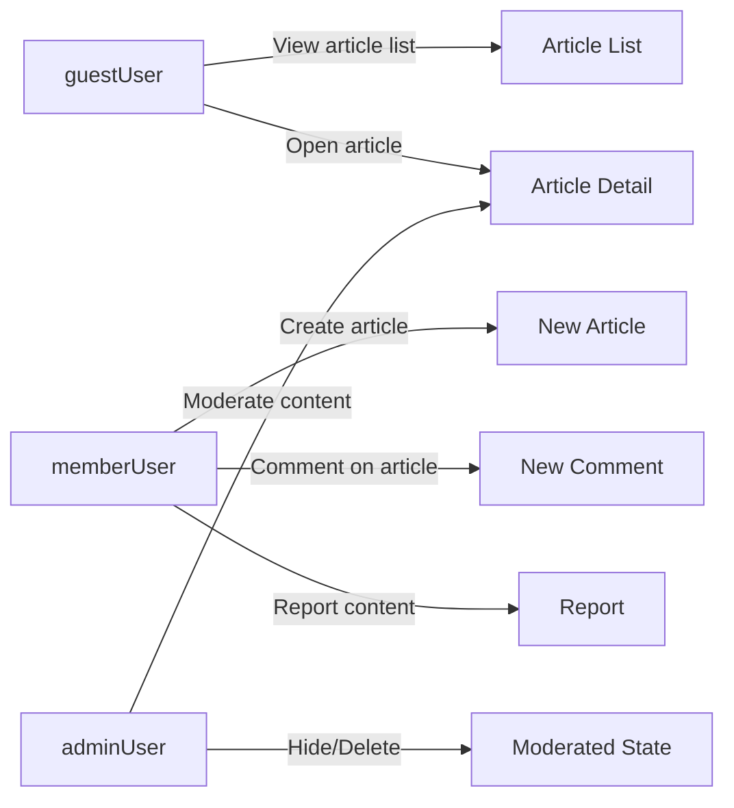

# Functional Requirements – Simple Economic/Political Discussion Board

## 1. Purpose and Scope

The **discussionBoard** service is a simple online discussion board focused on economic and political topics. Users post text articles, optionally attach images or files to support their arguments, and discuss through comments.

The goal of this requirements document is to define the **minimal** business behavior that backend developers must support so that:
- guest visitors can browse and read discussions,
- registered members can post and manage their own content,
- administrators can keep the board civil with light moderation,
- the overall feature set remains small and easy to maintain.

This document describes **what** the system shall do in business terms and intentionally avoids **how** it is implemented (no database schemas, API shapes, or technology choices).

## 2. User Actors (Business View)

The board uses three simple actor types.

### 2.1 guestUser

- Unauthenticated visitor.
- Browses public content without an account.

Requirements:
- THE discussionBoard service SHALL treat any user without a valid logged-in session as a **guestUser**.
- THE discussionBoard service SHALL allow guestUser to view public article lists, article details, and public comments.
- IF a guestUser attempts to perform a member-only action (creating, editing, deleting articles or comments, uploading attachments, reporting content), THEN THE discussionBoard service SHALL deny the action and indicate that login is required.

### 2.2 memberUser

- Registered and logged-in user.
- Main participant in article posting and commenting.

Requirements:
- THE discussionBoard service SHALL treat any authenticated non-admin account as a **memberUser**.
- THE discussionBoard service SHALL allow memberUser to create, edit, and delete their own articles.
- THE discussionBoard service SHALL allow memberUser to create, edit, and delete their own comments.
- THE discussionBoard service SHALL allow memberUser to attach files and images to their own articles within defined limits.

### 2.3 adminUser

- Administrator responsible for simple moderation.

Requirements:
- THE discussionBoard service SHALL treat designated admin accounts as **adminUser**.
- THE discussionBoard service SHALL allow adminUser to view, hide, or delete any article, comment, or attachment according to moderation rules.
- THE discussionBoard service SHALL allow adminUser to restrict or suspend memberUser accounts using simple rules.

## 3. Articles

Articles are the main discussion items. Each article is a text post about an economic or political topic, optionally with attachments.

### 3.1 Creating Articles

Business behavior:
- Only memberUser and adminUser can create articles.
- Each article has a title and body; attachments are optional.

Requirements:
- WHEN a memberUser initiates article creation, THE discussionBoard service SHALL allow that memberUser to enter a non-empty title and non-empty body text.
- THE discussionBoard service SHALL require each article to have exactly one author (memberUser or adminUser).
- WHEN a memberUser submits an article with valid required fields, THE discussionBoard service SHALL create the article, associate it with the author, and mark it as visible to all users by default.
- IF a guestUser attempts to create an article, THEN THE discussionBoard service SHALL reject the request and indicate that login is required.
- IF the submitted title or body is missing or only whitespace, THEN THE discussionBoard service SHALL reject the article and return clear validation errors.

Minimal length constraints (to avoid empty noise):
- WHEN an article title is shorter than a small minimum (for example 3 characters), THE discussionBoard service SHALL reject the submission and indicate that the title is too short.
- WHEN an article body is shorter than a small minimum (for example 10 characters), THE discussionBoard service SHALL reject the submission and indicate that the body is too short.

### 3.2 Editing Articles

Business behavior:
- Authors can edit their own articles.
- Admins can edit any article.

Requirements:
- WHEN the author memberUser of an article requests to edit it, THE discussionBoard service SHALL allow editing of the title and body under the same validation rules as creation.
- WHEN an adminUser requests to edit any article, THE discussionBoard service SHALL allow the edit under the same validation rules as creation.
- IF a memberUser who is not the author attempts to edit an article, THEN THE discussionBoard service SHALL deny the action and indicate insufficient permission.
- WHEN an article edit succeeds, THE discussionBoard service SHALL update the article and store an "updated" timestamp.

### 3.3 Deleting Articles

Business behavior:
- Authors can delete their own articles.
- Admins can delete or hide any article.

Requirements:
- WHEN the author memberUser of an article requests deletion, THE discussionBoard service SHALL mark that article as deleted and prevent it from appearing in normal article lists and search results.
- WHEN an adminUser requests deletion or hiding of any article, THE discussionBoard service SHALL remove the article from normal lists and mark it as unavailable to guestUser and memberUser.
- IF a memberUser who is not the author attempts to delete an article, THEN THE discussionBoard service SHALL deny the action and indicate insufficient permission.
- WHEN any actor attempts to open a deleted or hidden article, THE discussionBoard service SHALL respond with a simple message that the article is not available.

### 3.4 Viewing Articles

Requirements:
- THE discussionBoard service SHALL allow guestUser, memberUser, and adminUser to view any article that is not deleted or hidden.
- WHEN a user opens an article, THE discussionBoard service SHALL show at least the article title, body, author identifier (for example, display name), creation time, updated time (if edited), and any visible attachments and comments.
- WHEN an article cannot be found or is not visible to the current actor, THE discussionBoard service SHALL return a clear "not available" result instead of partial or confusing data.

## 4. Comments

Comments are simple text replies directly attached to an article. No nested threads or complex structures are required.

### 4.1 Creating Comments

Requirements:
- WHEN a memberUser views an article that is open for discussion, THE discussionBoard service SHALL allow that memberUser to submit a non-empty comment.
- WHEN a memberUser submits a comment with non-empty text, THE discussionBoard service SHALL create the comment and associate it with the article and the author.
- IF a guestUser attempts to create a comment, THEN THE discussionBoard service SHALL reject the request and indicate that login is required.
- IF the comment text is empty or only whitespace, THEN THE discussionBoard service SHALL reject the comment and indicate that the comment cannot be empty.

### 4.2 Editing Comments

Requirements:
- WHEN a memberUser attempts to edit a comment they authored, THE discussionBoard service SHALL allow the edit under the same basic validation rules as creation.
- WHEN an adminUser attempts to edit any comment, THE discussionBoard service SHALL allow the edit under the same validation rules as creation.
- IF a memberUser attempts to edit a comment they did not author, THEN THE discussionBoard service SHALL deny the action and indicate insufficient permission.
- WHEN a comment is edited successfully, THE discussionBoard service SHALL update the comment and store an "updated" timestamp.

### 4.3 Deleting Comments

Requirements:
- WHEN a memberUser requests deletion of a comment they authored, THE discussionBoard service SHALL remove that comment from the visible comment list for the article.
- WHEN an adminUser requests deletion of any comment, THE discussionBoard service SHALL remove that comment from the visible comment list.
- IF a memberUser attempts to delete a comment they did not author, THEN THE discussionBoard service SHALL deny the action and indicate insufficient permission.
- WHEN a user views an article whose comments include deleted items, THE discussionBoard service SHALL either omit deleted comments entirely or show a simple placeholder according to a single consistent rule.

### 4.4 Viewing Comments

Requirements:
- WHEN any actor views an article, THE discussionBoard service SHALL show comments for that article in a consistent order (for example oldest first or newest first, chosen once and applied consistently).
- THE discussionBoard service SHALL show for each visible comment at least the text, author identifier, and creation time.
- THE discussionBoard service SHALL not show the original text of comments that have been deleted or hidden for moderation.

## 5. Attachments (Images and Files)

Attachments are simple files linked **only to articles**, not to comments.

### 5.1 Attaching Files to Articles

Requirements:
- WHEN a memberUser creates an article, THE discussionBoard service SHALL allow that memberUser to upload zero or more attachments (images or files) up to a small maximum number.
- WHEN a memberUser edits their own article, THE discussionBoard service SHALL allow that memberUser to add new attachments and remove existing attachments from that article.
- IF a memberUser attempts to modify attachments on an article they do not own, THEN THE discussionBoard service SHALL deny the action and indicate insufficient permission.
- WHEN an adminUser edits any article, THE discussionBoard service SHALL allow that adminUser to remove attachments that violate rules.

### 5.2 Viewing and Downloading Attachments

Requirements:
- WHEN any actor views an article, THE discussionBoard service SHALL show a list of visible attachments for that article with at least a filename and indication of type (for example, image or document).
- WHEN a user selects a visible attachment, THE discussionBoard service SHALL allow that user to download or view the file, subject to basic access rules.
- WHEN an attachment is missing, deleted, or blocked, THE discussionBoard service SHALL indicate that the file is not available instead of failing silently.

### 5.3 Simple Limits and Validation

Requirements:
- THE discussionBoard service SHALL enforce a simple maximum number of attachments per article (for example, a small integer such as 5 or 10).
- THE discussionBoard service SHALL enforce a simple maximum file size per attachment suitable for a small discussion board.
- THE discussionBoard service SHALL accept only a small, fixed set of common file types (for example jpeg, png, pdf, basic office files).
- IF an upload exceeds type, size, or count limits, THEN THE discussionBoard service SHALL reject that attachment and provide a short message explaining why.

## 6. Browsing, Listing, and Search (Minimal)

The board needs only basic ways to find and navigate content.

### 6.1 Article List

Requirements:
- WHEN any actor opens the main board view, THE discussionBoard service SHALL show a list of recent visible articles sorted by creation time descending (newest first).
- THE discussionBoard service SHALL show for each listed article at least the title, author identifier, creation time, and simple engagement indicators (for example, comment count).
- THE discussionBoard service SHALL return article lists in pages of fixed size so that lists remain fast and predictable.
- IF a requested page has no articles, THEN THE discussionBoard service SHALL return an empty list without treating it as an error.

### 6.2 Simple Filtering and Search

Requirements:
- WHERE the board supports categories or tags, THE discussionBoard service SHALL allow users to filter the article list by category.
- WHEN a user enters a short keyword search, THE discussionBoard service SHALL return visible articles whose title or body reasonably match the search text.
- IF a search or filter finds no matching articles, THEN THE discussionBoard service SHALL return an empty list and a simple "no results" indication.

## 7. Simple Moderation Touchpoints

Full moderation rules are described elsewhere, but a few core behaviors affect everyday use of articles, comments, and attachments.

Requirements:
- WHEN a memberUser views any article or comment, THE discussionBoard service SHALL allow that memberUser to submit a basic report if they believe the content violates rules.
- WHEN an adminUser reviews reported content, THE discussionBoard service SHALL allow that adminUser to hide or delete the content with one action.
- WHEN content is hidden or deleted for moderation, THE discussionBoard service SHALL ensure that guestUser and memberUser cannot see the original text or file content.

## 8. Error Handling (High-Level)

The board should behave simply and predictably when something goes wrong.

Requirements:
- WHEN a request fails validation (for example, missing title, empty comment, or invalid attachment), THE discussionBoard service SHALL keep the user’s entered text available and return clear messages about which fields need correction.
- WHEN a user attempts an action they do not have permission for, THE discussionBoard service SHALL deny the action and show a short, non-technical permission message.
- WHEN a user tries to access an article, comment, or attachment that no longer exists or is hidden, THE discussionBoard service SHALL respond with a simple "not available" style message instead of a technical error.

## 9. Minimal Non-Functional Expectations

Non-functional expectations are kept deliberately simple and user-centered.

Requirements:
- WHEN users browse article lists or open an article, THE discussionBoard service SHALL respond within a short time that feels like normal web browsing under typical load.
- WHEN users submit articles, comments, or attachments, THE discussionBoard service SHALL indicate success or failure quickly so that users do not assume their action was lost.
- THE discussionBoard service SHALL keep user sessions stable enough that memberUser can read and post several items without being unexpectedly logged out.

## 10. Simple Flow Diagram

The following diagram gives a minimal overview of the main interactions.

These requirements define a **minimal, straightforward** behavior set for the economic/political discussion board. They are intended to be sufficient for developers to implement a working backend without introducing complex, large-scale features or workflows.