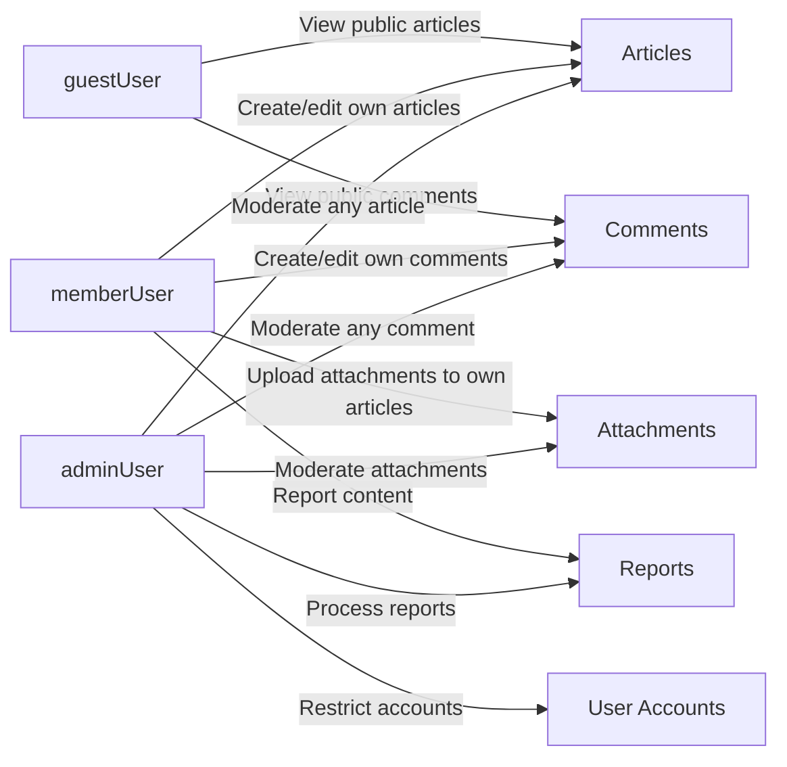

# User Actors and Permissions Requirements for discussionBoard

## 1. Introduction

### 1.1 Purpose
THE purpose of the user-actors and permissions requirements SHALL be to define, in business terms, who can do what in the **discussionBoard** service, which is a simple economic/political discussion board that supports image and file attachments on articles.

THE user-actors and permissions requirements SHALL provide implementation-ready business rules so backend developers can design authentication and authorization behavior without ambiguity, while retaining full autonomy over technical implementation details.

### 1.2 Scope
THE scope of the user-actors and permissions requirements SHALL include:
- Actor definitions and their responsibilities.
- Permissions and restrictions for each actor on articles, comments, attachments, reporting, and simple administration.
- Business rules about ownership, visibility, and basic abuse prevention.
- User-facing behavior when permissions are insufficient.

THE scope of the user-actors and permissions requirements SHALL exclude:
- Specific authentication technologies, protocols, tokens, or libraries.
- Database schemas, tables, or internal identifiers.
- API endpoint definitions and payload formats.
- Frontend layout or visual design details.

### 1.3 Relationship to Other Requirements
WHEN developers need overall service context, THE discussionBoard service overview SHALL be used to understand purpose and scope.

WHEN developers implement article, comment, and attachment behavior, THE user-actors and permissions requirements SHALL be applied consistently alongside the functional requirements for articles, comments, and attachments.

WHEN developers implement moderation behavior, THE user-actors and permissions requirements SHALL be interpreted together with the content moderation and domain-specific business rules.

## 2. Service Context and Design Principles

### 2.1 Service Context
THE discussionBoard service SHALL provide a simple web-based space for economic and political discussions where users:
- Post text articles.
- Attach images and files to articles.
- Comment on articles.
- Report problematic content for admin review.

### 2.2 Simplicity Principles
THE discussionBoard role and permission model SHALL remain small and easy to understand.

THE discussionBoard role model SHALL consist only of `guestUser`, `memberUser`, and `adminUser` without nested roles or configurable per-user permissions.

WHERE a choice exists between a simpler permission rule and a more complex rule, THE discussionBoard service SHALL prefer the simpler rule that still protects content and users adequately.

## 3. User Actor Definitions

### 3.1 guestUser
A **guestUser** is an unauthenticated visitor who has no account session.

THE guestUser actor SHALL:
- Represent people who have not logged in.
- Have read-only access to public content.
- Have no ability to create, edit, or delete content.
- Have no ability to report content.

### 3.2 memberUser
A **memberUser** is a registered, authenticated user.

THE memberUser actor SHALL:
- Represent people who have an account and are logged in.
- Be the primary creator of articles and comments.
- Be the only actor type (besides adminUser) that can upload attachments.

### 3.3 adminUser
An **adminUser** is a trusted administrator with broad moderation and management powers.

THE adminUser actor SHALL:
- Represent staff or operators of the discussionBoard.
- Have access to all content for moderation and housekeeping.
- Have the ability to restrict or suspend memberUser accounts according to business rules.

## 4. Authentication and Session Concept (Business View)

### 4.1 Actor Determination
WHEN a person has not logged in, THE discussionBoard service SHALL treat that person as a guestUser.

WHEN a person successfully logs in with valid account credentials, THE discussionBoard service SHALL treat that person as either a memberUser or an adminUser for the duration of a valid session, depending on the account’s assigned role.

WHEN a logged-in user logs out, THE discussionBoard service SHALL treat subsequent requests from that user as requests from a guestUser.

### 4.2 Session Lifetime (From User Perspective)
WHILE a session remains valid, THE discussionBoard service SHALL allow the user to perform all actions permitted to that actor type without repeatedly asking for credentials.

IF a session expires based on business rules, THEN THE discussionBoard service SHALL:
- Treat the user as a guestUser for that request and later requests.
- Deny any action that requires memberUser or adminUser status.

WHEN a protected action is attempted during or after session expiration, THE discussionBoard service SHALL behave as if a guestUser attempted that action.

### 4.3 Role-Based Permission Evaluation
WHEN the discussionBoard service evaluates permissions for a request, THE discussionBoard service SHALL base the decision on:
- The current actor type (guestUser, memberUser, or adminUser).
- The content ownership relationship.
- Any applicable restriction status (such as suspended memberUser) defined in account rules.

## 5. Permissions by Actor (Narrative)

Permissions are grouped by feature area: browsing, articles, comments, attachments, moderation, and reporting.

### 5.1 Browsing and Viewing Content

#### guestUser
WHEN a guestUser accesses public parts of the service, THE discussionBoard service SHALL allow the guestUser to:
- View lists of public articles.
- View full content of public articles, including visible comments and attachment metadata.

WHEN a guestUser attempts to view content that is restricted by moderation or access rules, THE discussionBoard service SHALL deny access and indicate that the content is not available.

#### memberUser
THE memberUser actor SHALL have all browsing capabilities of guestUser.

WHEN a memberUser has access to content that is visible only to logged-in users (if such a rule exists), THE discussionBoard service SHALL allow the memberUser to view that content.

WHERE business rules allow special views of hidden content to an author, THE discussionBoard service SHALL allow a memberUser to see clearly labeled information about their own hidden content while keeping it hidden from other users.

#### adminUser
THE adminUser actor SHALL have all browsing capabilities of memberUser.

WHEN an adminUser requests content that is hidden or deleted from regular users, THE discussionBoard service SHALL allow the adminUser to view that content where it is retained for moderation or audit.

### 5.2 Article Creation and Management

#### guestUser
WHEN a guestUser attempts to create, edit, or delete any article, THE discussionBoard service SHALL deny the action and indicate that sign-up or login is required.

#### memberUser
WHEN a memberUser submits a valid article creation request, THE discussionBoard service SHALL:
- Create a new article.
- Associate that article with the memberUser as owner.

WHEN a memberUser attempts to edit one of their own articles that is not locked by moderation, THE discussionBoard service SHALL allow the edit subject to validation rules.

IF a memberUser attempts to edit an article owned by a different user, THEN THE discussionBoard service SHALL deny the edit and indicate that they lack permission.

WHEN a memberUser attempts to delete one of their own articles, THE discussionBoard service SHALL allow deletion or soft deletion according to business rules.

IF a memberUser attempts to delete another user’s article, THEN THE discussionBoard service SHALL deny the request and indicate insufficient permissions.

#### adminUser
WHEN an adminUser creates an article, THE discussionBoard service SHALL treat that article as owned by the adminUser account and SHALL allow later moderation by any adminUser.

WHEN an adminUser attempts to edit any article, THE discussionBoard service SHALL allow the edit subject to content validation rules.

WHEN an adminUser attempts to delete or hide any article, THE discussionBoard service SHALL allow that action according to moderation and retention rules.

### 5.3 Comment Creation and Management

#### guestUser
WHEN a guestUser attempts to create, edit, or delete comments, THE discussionBoard service SHALL deny the action and indicate that sign-up or login is required.

#### memberUser
WHEN a memberUser submits a valid comment on an existing article, THE discussionBoard service SHALL create the comment and associate it with that memberUser as owner.

WHEN a memberUser attempts to edit one of their own comments that is not locked by moderation, THE discussionBoard service SHALL allow the edit within defined validation rules.

IF a memberUser attempts to edit a comment owned by another user, THEN THE discussionBoard service SHALL deny the action and indicate insufficient permissions.

WHEN a memberUser attempts to delete one of their own comments, THE discussionBoard service SHALL allow deletion or soft deletion according to business rules.

IF a memberUser attempts to delete a comment owned by another user, THEN THE discussionBoard service SHALL deny the action and indicate insufficient permissions.

#### adminUser
WHEN an adminUser attempts to create a comment, THE discussionBoard service SHALL create the comment and associate it with the adminUser as owner for traceability.

WHEN an adminUser attempts to edit any comment, THE discussionBoard service SHALL allow the edit subject to validation rules.

WHEN an adminUser attempts to delete or hide any comment, THE discussionBoard service SHALL allow that action according to moderation rules.

### 5.4 Attachment Usage

#### guestUser
WHEN a guestUser views an article, THE discussionBoard service SHALL allow the guestUser to see attachment metadata and to access visible attachments for that article.

WHEN a guestUser attempts to upload, modify, or delete attachments, THE discussionBoard service SHALL deny the action and indicate that sign-up or login is required.

#### memberUser
WHEN a memberUser is creating a new article, THE discussionBoard service SHALL allow the memberUser to upload attachments and associate them with that new article, subject to attachment rules.

WHEN a memberUser edits one of their own articles, THE discussionBoard service SHALL allow the memberUser to add, remove, or replace attachments for that article within defined limits.

IF a memberUser attempts to modify attachments on an article that they do not own, THEN THE discussionBoard service SHALL deny the action and indicate insufficient permissions.

#### adminUser
WHEN an adminUser views any article, THE discussionBoard service SHALL allow the adminUser to see and access all attachments for that article.

WHEN an adminUser decides that an attachment violates rules, THE discussionBoard service SHALL allow the adminUser to remove or block access to that attachment, even if the article itself remains visible.

### 5.5 Reporting and Moderation

#### guestUser
WHEN a guestUser encounters problematic content, THE discussionBoard service SHALL not allow the guestUser to submit a formal report through the reporting feature.

#### memberUser
WHEN a memberUser decides that an article, comment, or attachment violates rules, THE discussionBoard service SHALL allow the memberUser to submit a report that includes:
- The content type and identifier.
- The chosen reason category.
- Optional additional description.

WHEN a memberUser submits a report, THE discussionBoard service SHALL record the report and SHALL not grant the memberUser any direct moderation power over the reported content.

#### adminUser
WHEN an adminUser views the report list, THE discussionBoard service SHALL allow the adminUser to:
- Review reports and underlying content.
- Mark reports as processed.
- Hide, delete, or leave content as-is.
- Apply simple account restrictions.

## 6. Permission Matrix

### 6.1 Actions
The following actions are used in the matrix and correspond to business behaviors.

| ID  | Action Name                         | Business Description                                                  |
|-----|-------------------------------------|------------------------------------------------------------------------|
| A1  | View article list                   | View public list of articles with basic information                    |
| A2  | View article detail                 | View full article text with metadata                                   |
| A3  | View comments                       | View comments under an article                                        |
| A4  | Create article                      | Create a new article                                                  |
| A5  | Edit own article                    | Edit an article owned by the current user                             |
| A6  | Delete own article                  | Delete an article owned by the current user                           |
| A7  | Edit any article                    | Edit an article owned by any user                                     |
| A8  | Delete or hide any article          | Delete or hide an article owned by any user                           |
| B1  | Create comment                      | Add a comment to an article                                           |
| B2  | Edit own comment                    | Edit a comment owned by the current user                              |
| B3  | Delete own comment                  | Delete a comment owned by the current user                            |
| B4  | Edit any comment                    | Edit a comment owned by any user                                      |
| B5  | Delete or hide any comment          | Delete or hide a comment owned by any user                            |
| C1  | Upload attachments to own article   | Upload attachments while creating or editing own article              |
| C2  | Modify attachments of own article   | Add or remove attachments on own article                              |
| C3  | Modify attachments of any article   | Add or remove attachments on any article                              |
| D1  | View or download attachments        | Access attachment content from an article                             |
| E1  | Report content                      | Submit a report for an article, comment, or attachment                |
| F1  | View all reports                    | View list of submitted reports                                        |
| F2  | Process reports                     | Change report status and take moderation actions                      |
| G1  | Apply account restrictions          | Apply suspension or restriction to a member account                   |

### 6.2 Matrix by Actor

| Action ID | guestUser | memberUser                         | adminUser |
|-----------|-----------|-------------------------------------|----------|
| A1        | ✅        | ✅                                  | ✅       |
| A2        | ✅        | ✅                                  | ✅       |
| A3        | ✅        | ✅                                  | ✅       |
| A4        | ❌        | ✅                                  | ✅       |
| A5        | ❌        | ✅ (only own articles)              | ✅ (any) |
| A6        | ❌        | ✅ (only own articles)              | ✅ (any) |
| A7        | ❌        | ❌                                  | ✅       |
| A8        | ❌        | ❌                                  | ✅       |
| B1        | ❌        | ✅                                  | ✅       |
| B2        | ❌        | ✅ (only own comments)              | ✅ (any) |
| B3        | ❌        | ✅ (only own comments)              | ✅ (any) |
| B4        | ❌        | ❌                                  | ✅       |
| B5        | ❌        | ❌                                  | ✅       |
| C1        | ❌        | ✅ (only on own articles)           | ✅ (any) |
| C2        | ❌        | ✅ (only on own articles)           | ✅ (any) |
| C3        | ❌        | ❌                                  | ✅       |
| D1        | ✅ (if article visible) | ✅                  | ✅       |
| E1        | ❌        | ✅                                  | ✅       |
| F1        | ❌        | ❌                                  | ✅       |
| F2        | ❌        | ❌                                  | ✅       |
| G1        | ❌        | ❌                                  | ✅       |

THE permission matrix for discussionBoard SHALL be treated as an authoritative summary for high-level allowed actions per actor.

## 7. Typical Action Scenarios

### 7.1 guestUser Browsing and Attempting to Post

WHEN a guestUser arrives at the board, THE discussionBoard service SHALL allow viewing article lists and individual article pages with comments.

WHEN a guestUser triggers an action to create an article or comment, THE discussionBoard service SHALL deny the operation and SHALL explain that only registered members can post.

WHEN a guestUser attempts to upload attachments, THE discussionBoard service SHALL deny the operation and SHALL indicate that sign-up or login is required.

### 7.2 memberUser Participating in Discussions

WHEN a memberUser logs in successfully, THE discussionBoard service SHALL treat subsequent actions as performed by that memberUser.

WHEN a memberUser creates an article, THE discussionBoard service SHALL:
- Store the article with that memberUser as owner.
- Make the article visible to other users unless moderated.

WHEN a memberUser edits their own article, THE discussionBoard service SHALL allow the memberUser to change article fields and manage attachments within validation and attachment rules.

IF a memberUser attempts to edit or delete someone else’s article, THEN THE discussionBoard service SHALL deny the action with a clear permission error.

WHEN a memberUser comments on an article, THE discussionBoard service SHALL create the comment, link it to the article, and attribute it to the memberUser.

WHEN a memberUser edits or deletes one of their own comments, THE discussionBoard service SHALL apply changes subject to validation and moderation rules.

### 7.3 adminUser Moderating Content and Users

WHEN an adminUser logs in, THE discussionBoard service SHALL recognize the adminUser role and SHALL grant access to moderation capabilities.

WHEN an adminUser reviews reported content, THE discussionBoard service SHALL allow the adminUser to:
- Open any article, comment, or attachment referenced by reports.
- Hide or delete problematic content.
- Apply or lift account restrictions.

WHEN an adminUser hides an article or comment, THE discussionBoard service SHALL remove that content from normal listings and SHALL follow hidden-content display rules for all actors.

WHEN an adminUser applies an account restriction to a memberUser, THE discussionBoard service SHALL enforce that restriction consistently across all actions that the restricted memberUser attempts.

## 8. Business Rules and Constraints on Permissions

### 8.1 Ownership Rules

THE discussionBoard service SHALL define ownership of articles, comments, and attachments by associating each with the account that created it.

WHEN a permission decision depends on ownership, THE discussionBoard service SHALL compare the current actor with the stored owner.

IF the current actor is the owner and has role memberUser or adminUser, THEN THE discussionBoard service SHALL treat the content as own content for that actor.

IF the current actor is not the owner and is not an adminUser, THEN THE discussionBoard service SHALL treat the content as content owned by another user and SHALL enforce restrictions accordingly.

### 8.2 Visibility Rules

THE discussionBoard service SHALL treat newly created articles and comments as publicly visible by default unless moderated.

WHEN content is hidden or deleted due to moderation, THE discussionBoard service SHALL:
- Prevent guestUser and regular memberUsers from viewing the hidden or deleted content.
- Allow adminUser to access the content where retained for moderation.

WHERE business rules allow authors to see their own hidden content, THE discussionBoard service SHALL clearly mark such content as hidden and SHALL not allow the author to unhide it without adminUser action.

### 8.3 Simple Abuse Prevention

WHERE simple rate limits or spam-prevention rules exist, THE discussionBoard service SHALL enforce them per memberUser account without adding extra roles.

WHEN a memberUser exceeds allowed posting frequency, THE discussionBoard service SHALL block additional posts temporarily and SHALL explain that posting is temporarily limited.

WHEN a memberUser repeatedly violates content rules, THE discussionBoard service SHALL allow adminUser to restrict or suspend that account using the account and moderation rules.

## 9. Error and Denial Behavior for Permissions

### 9.1 Access Denied by Role

IF a guestUser attempts any action that requires a memberUser or adminUser role, THEN THE discussionBoard service SHALL:
- Deny the action.
- Communicate that sign-up or login is required.

IF a memberUser attempts an admin-only action (such as suspending another account or hiding someone else’s content), THEN THE discussionBoard service SHALL:
- Deny the action.
- Communicate that only administrators can perform that action.

### 9.2 Access Denied by Ownership

IF a memberUser attempts to edit or delete content they did not create and they are not an adminUser, THEN THE discussionBoard service SHALL:
- Deny the operation.
- Communicate that they lack permission to modify content owned by others.

### 9.3 Content Not Available

IF any actor attempts to access content that does not exist or is no longer available, THEN THE discussionBoard service SHALL:
- Respond as though the content is not available.
- Avoid leaking internal details about whether the content ever existed or why it is unavailable.

## 10. Non-Functional Expectations Related to Permissions

### 10.1 Performance

WHEN a user performs a permission-sensitive action such as creating content, editing content, or accessing attachments, THE discussionBoard service SHALL evaluate permissions quickly enough that users do not perceive any extra delay beyond normal content loading.

### 10.2 Security

THE discussionBoard service SHALL enforce permission checks on every operation that changes content, uploads attachments, or applies moderation, regardless of how the request is made.

IF a user attempts to bypass normal flows by crafting abnormal requests, THEN THE discussionBoard service SHALL still rely on role and ownership rules to allow or deny the action.

### 10.3 Consistency

THE discussionBoard service SHALL apply the same permission rules across all interfaces and flows, so that users experience consistent behavior for the same actions.

WHEN permission rules change due to business decisions, THE discussionBoard service SHALL update all affected flows to maintain consistency.

## 11. Mermaid Diagram – Actor Permission Overview

THE actor-permission overview diagram SHALL be interpreted as a high-level visualization only and SHALL not override the detailed requirements in the preceding sections.