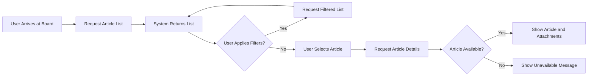
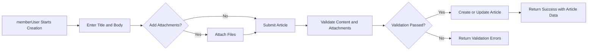
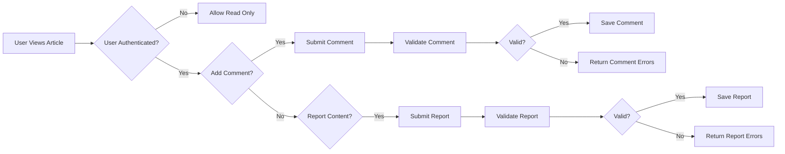

# Main User Flows for Economic/Political Discussion Board

## 1. Introduction

This document describes the main user flows for the **discussionBoard** service, a simple economic and political discussion board. It focuses on day-to-day behaviors from the user perspective and provides clear, testable requirements for backend developers.

The flows covered here are:
- Browsing articles
- Reading an article with attachments
- Creating and editing an article
- Commenting on articles
- Reporting inappropriate content

All flows are intentionally straightforward and minimal. The goal is to enable basic but reliable discussion functionality without complex workflows or advanced social features.

This document defines **what** the system must do from a business and user-flow perspective. It does **not** define **how** to implement these behaviors in terms of APIs, data models, or user interface design.

## 2. Assumptions and Scope

### 2.1 In-Scope

- Day-to-day user journeys for:
  - Browsing and locating discussion content
  - Reading articles and seeing attachments
  - Creating, editing, and deleting articles (for the author)
  - Creating, editing, and deleting comments (for the author)
  - Reporting articles and comments as inappropriate
- Behavior as experienced by different actors (guestUser, memberUser, adminUser)
- High-level business rules that apply within these flows
- Requirements expressed in EARS format for implementability and testability

### 2.2 Out-of-Scope

- Detailed backend or frontend technical design
- API endpoint definitions, request/response formats, or database schemas
- Layout of screens, position of buttons, or visual/interaction design details
- Complex moderation or multi-stage approval workflows

### 2.3 General Assumptions

- The discussion board is a single, shared space for economic/political discussions, potentially organized by simple categories or tags.
- Users can filter or sort lists of articles in a simple way (for example by recency or basic keyword search).
- Attachments are associated only with articles, not with comments.
- Only minimal content moderation and reporting exists, keeping flows linear and easy to reason about.

## 3. User Actors and Their Role in Flows (Summary)

This section summarizes how each actor interacts with the flows. Detailed permissions are defined in the separate [User Actors and Permissions Document](./02-user-actors-and-permissions.md).

### 3.1 guestUser

- Unauthenticated visitor.
- Typical actions:
  - Browse lists of articles.
  - Read full articles and view their comments.
  - View attachment metadata and download publicly allowed files.
  - Use simple search or filters.
- Cannot create, edit, or delete content.
- Cannot report content.

### 3.2 memberUser

- Registered user with a personal account.
- Typical actions:
  - All actions available to guestUser.
  - Create new articles and upload attachments.
  - Edit or delete own articles.
  - Add, edit, and delete own comments.
  - Report articles and comments.

### 3.3 adminUser

- Administrative user responsible for moderation and basic board management.
- Typical actions:
  - All actions available to memberUser.
  - Remove or restore any article, comment, or attachment.
  - Review and act on reported content.
  - Apply simple restrictions to users at business-rule level (detailed in other documents).

## 4. Browsing Articles Flow

This section describes how users, mainly guestUser and memberUser, navigate through lists of articles.

### 4.1 Narrative Flow Description

1. A user arrives at the main discussion board entry point.
2. The system presents a list of articles, usually sorted by newest first.
3. The user may move through pages of results or load more results.
4. The user may apply simple filters such as:
   - Category (for example: "Economy", "Politics"), if categories exist in the service.
   - Basic keyword search in title or content.
5. The user selects an article to read in detail.
6. If there are no articles based on the current filters, the user sees an empty state message instead of a list.

This flow should feel predictable and consistent for all users, with no hidden states or complex navigation logic.

### 4.2 Browsing Requirements (EARS)

#### 4.2.1 Article Listing

- THE browsing feature SHALL display articles in a list sorted by most recent creation time first by default.
- THE browsing feature SHALL display for each article at least title, high-level metadata (such as author pseudonym and creation time), and basic engagement indicators if available (such as count of comments).
- THE browsing feature SHALL limit each page or batch of results to a reasonable fixed number of articles to keep responses fast and predictable.

#### 4.2.2 Pagination and Navigation

- WHEN a user requests the first page of articles, THE browsing feature SHALL return the first batch of articles using the default sort order.
- WHEN a user requests a subsequent page of articles, THE browsing feature SHALL return the next batch of articles consistent with the current filters and sort order.
- IF a user requests a page that has no results, THEN THE browsing feature SHALL return an empty list and indicate that no more articles are available.

#### 4.2.3 Filtering and Search

- WHEN a user applies a category filter, THE browsing feature SHALL restrict the article list to articles that belong to the selected category.
- WHEN a user performs a keyword search, THE browsing feature SHALL restrict the article list to articles whose searchable fields reasonably match the query.
- IF a search or filter results in zero matching articles, THEN THE browsing feature SHALL return an empty list and indicate that no articles match the criteria without treating this as an error.

#### 4.2.4 Performance Expectations

- WHEN a user requests an article list page under normal load, THE browsing feature SHALL respond within a short time that feels immediate for typical users.
- WHILE the browsing feature processes list requests, THE system SHALL avoid performing expensive operations that would noticeably delay the response for normal-sized result sets.

#### 4.2.5 Permissions Applied to Browsing

- THE browsing feature SHALL allow guestUser, memberUser, and adminUser to access public article lists.
- WHERE an article is restricted or removed according to moderation rules, THE browsing feature SHALL omit or appropriately mark that article based on business rules defined in related documents.

## 5. Reading Article with Attachments Flow

This section describes how users view full article content and associated attachments.

### 5.1 Narrative Flow Description

1. From the article list, a user selects a specific article.
2. The system retrieves the article details, including full text, metadata, and any associated attachments.
3. The system displays the article body and its comments.
4. The system also displays a list of attachments linked to the article, including at least the file name and size, and optionally additional metadata such as type.
5. The user may choose to download or open an attachment.
6. If an attachment no longer exists or is restricted, the system handles this in a predictable way rather than failing silently.

### 5.2 Reading Article Requirements (EARS)

#### 5.2.1 Article Details

- WHEN a user requests to view an article, THE article viewing feature SHALL return the article body, metadata, and a list of its comments consistent with permission rules.
- IF the requested article has been removed or is not visible to the user, THEN THE article viewing feature SHALL indicate that the article is unavailable instead of returning partial or misleading data.

#### 5.2.2 Attachment Listing

- WHEN an article is successfully retrieved, THE attachment feature SHALL return a list of associated attachments with at least file name and size for each visible attachment.
- WHERE an attachment is not visible to a specific actor due to business rules, THE attachment feature SHALL omit that attachment from the returned list for that actor.

#### 5.2.3 Attachment Access

- WHEN a user initiates a download or viewing action for a visible attachment, THE attachment feature SHALL provide access to the file content subject to permission checks.
- IF an attachment has been deleted after being listed, THEN THE attachment feature SHALL respond with a clear indication that the file is no longer available.
- IF a user who lacks permission attempts to access an attachment, THEN THE attachment feature SHALL deny access and indicate that permission is insufficient.

#### 5.2.4 Permissions Applied to Reading

- THE article viewing feature SHALL allow guestUser, memberUser, and adminUser to read any article that is not restricted by business or moderation rules.
- WHERE an article is visible only to specific actors, THE article viewing feature SHALL ensure that unauthorized actors do not receive the article content or associated attachments.

## 6. Creating and Editing Article Flow

This section covers how a memberUser creates and manages their own articles, including basic handling of attachments within that process. adminUser shares these abilities but may have additional moderation capabilities described in other documents.

### 6.1 Narrative Flow Description: Creating an Article

1. A memberUser decides to create a new article.
2. The system allows the user to provide required fields such as title and body, and optional fields such as category and tags if supported.
3. The user may attach one or more files to the article, within defined limits.
4. The user submits the article creation request.
5. The system validates the content and attachments according to predefined rules.
6. If validation passes, the system creates the article and associates the attachments.
7. The system returns a success response including the created article information.

### 6.2 Narrative Flow Description: Editing an Article

1. A memberUser or adminUser views an article.
2. If the current user is the article author (or has admin privileges), the system allows editing.
3. The user modifies title, body, category, or other allowed fields.
4. The user may add new attachments or remove existing ones within allowed limits.
5. The user submits the article update request.
6. The system validates the updated content and attachments.
7. If validation passes, the system saves the updated article and attachment state.
8. The system returns the updated article information.

### 6.3 Narrative Flow Description: Deleting an Article

1. A memberUser or adminUser views an article they are allowed to remove.
2. The user triggers article deletion.
3. The system confirms that the user has permission and performs the removal according to business rules (for example, soft deletion).
4. The article is no longer visible in standard browsing and reading flows, except as allowed by admin-specific views.

### 6.4 Article Creation Requirements (EARS)

#### 6.4.1 Permissions and Preconditions

- WHERE the actor is a memberUser or adminUser, THE article management feature SHALL allow initiating article creation.
- WHERE the actor is a guestUser, THE article management feature SHALL deny article creation and indicate that authentication is required.

#### 6.4.2 Validation of Required Fields

- WHEN a memberUser submits a new article, THE article management feature SHALL require a non-empty title.
- WHEN a memberUser submits a new article, THE article management feature SHALL require a non-empty body of text.
- IF a submitted article is missing required fields or includes invalid values, THEN THE article management feature SHALL reject creation and return clear validation errors for each offending field.

#### 6.4.3 Attachment Handling During Creation

- WHERE attachments are included in article creation, THE article management feature SHALL associate each valid attachment with the new article.
- IF an attachment does not meet business-defined validation rules such as size or type limits, THEN THE article management feature SHALL reject that attachment and report the specific error while allowing other valid attachments to proceed where possible.
- WHERE no attachments are provided, THE article management feature SHALL still allow article creation.

### 6.5 Article Editing Requirements (EARS)

#### 6.5.1 Ownership and Permissions

- WHERE the actor is the article author, THE article management feature SHALL allow editing of the article content while the article remains active and not locked by moderation rules.
- WHERE the actor is an adminUser, THE article management feature SHALL allow editing of any article unless restricted by higher-level policies.
- IF an actor who is neither the author nor an adminUser attempts to edit an article, THEN THE article management feature SHALL deny the edit and indicate that the actor lacks permission.

#### 6.5.2 Editable Fields and Validation

- WHEN an article edit is submitted, THE article management feature SHALL validate updated fields using the same rules as for creation.
- IF an edit changes previously valid content into invalid content, THEN THE article management feature SHALL reject the update and preserve the existing article state until a valid update is provided.

#### 6.5.3 Attachment Management During Editing

- WHEN an article edit includes removal of one or more attachments, THE article management feature SHALL disassociate and remove those attachments according to attachment rules.
- WHEN an article edit includes new attachments, THE article management feature SHALL validate and associate these attachments in the same way as during creation.
- IF attachment changes exceed allowed limits, THEN THE article management feature SHALL reject the specific changes that violate limits and report clear errors.

### 6.6 Article Deletion Requirements (EARS)

- WHERE the actor is the article author or an adminUser, THE article management feature SHALL allow deletion of the article according to business rules.
- IF a deletion request is received for an article that is already deleted or not visible, THEN THE article management feature SHALL treat the request idempotently and indicate that the article is not available.
- WHEN an article is deleted, THE article management feature SHALL ensure that the article no longer appears in normal browsing and reading flows for regular users.

## 7. Commenting Flow

This section describes how memberUser and adminUser participate in discussions through comments.

### 7.1 Narrative Flow Description: Creating a Comment

1. A user reads an article.
2. If the user is a memberUser or adminUser and commenting is allowed for the article, the system allows adding a comment.
3. The user enters the comment text.
4. The user submits the comment.
5. The system validates the comment length and content according to simple rules.
6. If validation passes, the system saves the comment and associates it with the article and the commenting user.
7. The system returns the newly created comment and includes it in the article’s comment list.

### 7.2 Narrative Flow Description: Editing and Deleting Comments

1. A user views an article’s comments.
2. For each comment that belongs to the current user, the system allows editing or deleting.
3. The user edits the text or requests deletion.
4. The system validates edits using the same rules as for creation.
5. If edit validation passes, the system updates the comment.
6. If deletion is confirmed, the system removes the comment according to business rules.

### 7.3 Comment Requirements (EARS)

#### 7.3.1 Permissions

- WHERE the actor is a memberUser or adminUser, THE commenting feature SHALL allow creating comments on visible articles that accept comments.
- WHERE the actor is a guestUser, THE commenting feature SHALL deny comment creation and indicate that authentication is required.
- IF comments are globally disabled for an article due to moderation or configuration, THEN THE commenting feature SHALL deny creation of new comments and indicate that comments are closed.

#### 7.3.2 Validation Rules

- WHEN a comment is submitted, THE commenting feature SHALL require non-empty text.
- WHERE maximum comment length is defined, THE commenting feature SHALL reject comments that exceed this length and indicate that the text is too long.

#### 7.3.3 Ordering and Visibility

- THE commenting feature SHALL present comments in a consistent order, typically by creation time from oldest to newest or newest to oldest depending on the chosen business rule.
- WHERE a comment is deleted according to business rules, THE commenting feature SHALL ensure it no longer appears in standard article comment lists for regular users.

#### 7.3.4 Editing and Deleting by Author

- WHERE the actor is the author of a comment, THE commenting feature SHALL allow editing and deletion of that comment while it is not locked by moderation rules.
- IF an actor attempts to edit or delete a comment they did not author and they are not an adminUser, THEN THE commenting feature SHALL deny the request and indicate insufficient permissions.

## 8. Reporting Content Flow

This section describes how memberUser (and adminUser acting as a regular user) can report problematic content and how adminUser interacts with that flow at a high level.

### 8.1 Narrative Flow Description: Submitting a Report

1. A memberUser reads an article or comment.
2. The user decides that the content violates discussion rules (for example, hate speech, spam, or off-topic content).
3. The user initiates a report action on the specific article or comment.
4. The system allows the user to provide a simple reason or select a reason category.
5. The user submits the report.
6. The system records the report linked to the specific content and reporting user.
7. The system confirms that the report has been received.

### 8.2 Narrative Flow Description: Admin Handling of Reports

1. An adminUser accesses the list of open reports.
2. The system presents basic information about each report and links to the reported content.
3. The adminUser reviews the reported article or comment.
4. Based on business rules, the adminUser may:
   - Dismiss the report as not valid.
   - Remove or restrict the content.
   - Apply a simple restriction to the user who created the content, as defined in other documents.
5. The system updates the status of the report accordingly.
6. The system ensures that content removal or restriction is reflected in browsing, reading, and commenting flows.

### 8.3 Reporting Requirements (EARS)

#### 8.3.1 Permissions to Report

- WHERE the actor is a memberUser or adminUser, THE reporting feature SHALL allow submitting reports on visible articles and comments.
- WHERE the actor is a guestUser, THE reporting feature SHALL deny report creation and indicate that authentication is required.

#### 8.3.2 Report Submission

- WHEN a report is submitted, THE reporting feature SHALL require identification of the specific article or comment being reported.
- WHEN a report is submitted, THE reporting feature SHALL require at least a basic reason field, either as free text or a selected category.
- IF a report submission is missing required information, THEN THE reporting feature SHALL reject the report and return clear validation errors.

#### 8.3.3 Report Handling by Admin

- WHERE the actor is an adminUser, THE reporting feature SHALL allow viewing the list of reports with key details and status.
- WHEN an adminUser changes the status of a report, THE reporting feature SHALL persist the new status and ensure subsequent views display the updated status.
- WHEN an adminUser removes or restricts content based on a report, THE content moderation rules SHALL ensure that the content is no longer shown to regular users in browsing and reading flows.

## 9. Cross-Cutting Business Rules in Flows

### 9.1 Authentication and Session Behavior

- THE discussionBoard service SHALL treat guestUser, memberUser, and adminUser differently according to their permissions in each flow.
- WHEN a request requires authentication, THE discussionBoard service SHALL validate the session or credentials before performing the requested action.
- IF authentication is invalid or expired, THEN THE discussionBoard service SHALL deny the action and indicate that the user must authenticate again.

### 9.2 Ownership and Authorization

- THE discussionBoard service SHALL associate each article and comment with its author so that ownership rules can be applied consistently.
- WHEN an operation is restricted to the content owner or adminUser, THE discussionBoard service SHALL verify the actor’s identity and role before performing the operation.
- IF an actor lacks the necessary role or ownership, THEN THE discussionBoard service SHALL deny the operation and provide an appropriate permission error.

### 9.3 Consistent Feedback Patterns

- THE discussionBoard service SHALL provide clear success or failure outcomes for all create, update, delete, and report operations.
- IF an operation fails due to validation, THEN THE discussionBoard service SHALL return field-level error messages where applicable.
- IF an operation fails due to permissions or unavailable content, THEN THE discussionBoard service SHALL indicate the general reason without revealing confidential internal details.

### 9.4 Performance and Reliability Expectations

- WHEN users perform common actions such as browsing articles, reading an article, posting a comment, or submitting a report, THE discussionBoard service SHALL respond within a time window that feels smooth for normal users under typical load.
- WHILE handling user flows, THE discussionBoard service SHALL avoid behaviors that cause inconsistent results, such as returning outdated content immediately after a successful update.

## 10. Mermaid Flow Diagrams

The following diagrams summarize the major flows in this document. They are conceptual and focus on business steps rather than technical design.

### 10.1 Browsing and Reading Articles

### 10.2 Creating and Editing Article with Attachments

### 10.3 Commenting and Reporting

## 11. Success Criteria for Flows

The flows in this document are considered successfully implemented when all the following conditions hold:

- Browsing:
  - THE browsing feature SHALL consistently return ordered article lists with predictable page sizes.
  - IF users apply filters or search, THEN THE browsing feature SHALL return results that respect those criteria or an empty result set with a clear indication.

- Reading and Attachments:
  - WHEN users select an article, THE article viewing feature SHALL either present the full article and visible attachments or clearly indicate that the article is unavailable.
  - IF users attempt to access a deleted or restricted attachment, THEN THE attachment feature SHALL return an explicit error instead of failing silently.

- Creating and Editing Articles:
  - WHEN memberUser or adminUser submits valid article data, THE article management feature SHALL create or update the article and make it visible in browsing flows.
  - IF invalid data is submitted, THEN THE article management feature SHALL return detailed validation errors without creating inconsistent states.

- Commenting:
  - WHERE commenting is allowed, THE commenting feature SHALL reliably create, edit, and delete comments according to ownership rules.
  - IF commenting is not allowed or the user is not authenticated, THEN THE commenting feature SHALL deny comment creation with a clear reason.

- Reporting:
  - WHEN memberUser or adminUser submits a valid report, THE reporting feature SHALL record it and make it accessible to adminUser for handling.
  - WHEN adminUser updates report status or removes content based on a report, THE updated state SHALL be reflected across browsing, reading, commenting, and reporting flows.

This document provides business-level requirements for the main user flows of the discussionBoard service. All technical implementation decisions, including architecture, API design, and data modeling, are the responsibility of the development team and are intentionally left open so that the team can choose the most appropriate solutions.