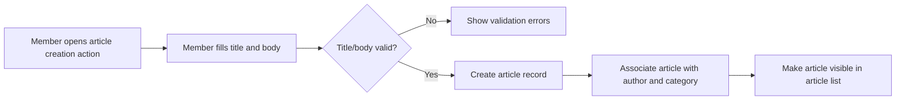
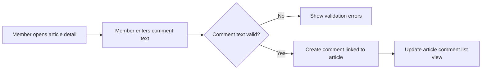
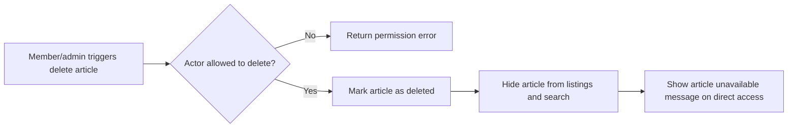

# Functional Requirements – Articles and Comments

## 1. Introduction

This document defines the business-level functional requirements for **articles** and **comments** in the simple economic/political discussion board service named **discussionBoard**. The focus is on what the system must support for creating, reading, updating, deleting, listing, sorting, searching, and filtering articles and comments, expressed in clear, testable natural language.

The service is intentionally **simple and minimal**. Requirements in this document avoid complex workflows, multi-level hierarchies, rich social features, or advanced engagement mechanisms. Everything described here is intended to be straightforward to implement and easy for end users to understand.

This document describes **what** the system must do from a business perspective and from the user’s point of view. It does **not** prescribe **how** developers should implement these behaviors internally.

## 2. Scope and Context

### 2.1 In-Scope
- Functional behavior related to:
  - Articles (discussion topics) on economic and political subjects.
  - Comments on articles.
  - Simple engagement on articles (view counts and an optional simple reaction, if included).
  - Listing and sorting of articles and comments.
  - Searching and filtering of articles.
- Behavior for the following actors:
  - `guestUser` (unauthenticated visitor).
  - `memberUser` (registered participant).
  - `adminUser` (administrator and moderator).

### 2.2 Out-of-Scope (for This Document)
- Technical authentication mechanisms, token handling, or session management.
- Detailed attachment behavior (covered in the dedicated attachments document).
- Detailed content moderation workflows (covered in the moderation and domain rules documents).
- UI design, layout, and visual components.
- API specifications, database schemas, or infrastructure design.

## 3. Actors and Assumptions

### 3.1 Actors
- `guestUser`
  - Unauthenticated visitor who can read public content and navigate the board but cannot create or modify content.
- `memberUser`
  - Registered user who can create, edit, and delete their own articles and comments, subject to business rules.
- `adminUser`
  - Administrator who can manage and moderate all articles and comments.

### 3.2 General Assumptions
- Articles and comments are public by default and visible to all actors, unless removed for moderation reasons.
- The discussion board is focused on economic and political topics but remains a **generic** discussion space without region‑specific legal enforcement encoded in requirements.
- Attachments are associated with articles, not with comments; comments are text-only.

## 4. Article Management Requirements

### 4.1 Article Creation

#### 4.1.1 Core Behavior
- THE discussionBoard SHALL allow `memberUser` to create new articles with a title and body text.

- WHEN `memberUser` submits a request to create an article with valid required fields, THE discussionBoard SHALL create a new article and associate it with that `memberUser` as the author.
- WHEN `memberUser` successfully creates an article, THE discussionBoard SHALL make that article immediately visible in the article listing for all actors, unless moderation rules require a different state.
- WHEN `guestUser` attempts to create an article, THE discussionBoard SHALL reject the action and inform that login is required.

#### 4.1.2 Required and Optional Fields
- THE discussionBoard SHALL require each article to have a non-empty title written by the author.
- THE discussionBoard SHALL require each article to have non-empty body text written by the author.
- THE discussionBoard SHALL store the creation timestamp for each article.
- THE discussionBoard SHALL associate each article with exactly one author `memberUser`.

- WHEN `memberUser` submits an article title shorter than 3 visible characters, THE discussionBoard SHALL reject the creation request and return a clear validation error for the title.
- WHEN `memberUser` submits an article title longer than 200 visible characters, THE discussionBoard SHALL reject the creation request and return a clear validation error for the title.
- WHEN `memberUser` submits body text shorter than 10 visible characters, THE discussionBoard SHALL reject the creation request and return a clear validation error for the body.
- WHEN `memberUser` submits body text longer than 20,000 visible characters, THE discussionBoard SHALL reject the creation request and return a clear validation error for the body.

- WHERE `memberUser` provides an optional plain-text short summary between 0 and 300 visible characters, THE discussionBoard SHALL store and display that summary alongside the article where appropriate.

#### 4.1.3 Topic and Category Basics
- THE discussionBoard SHALL allow each article to be assigned to exactly one primary category such as "Economy" or "Politics".

- WHEN `memberUser` creates an article and selects a valid category from the allowed set, THE discussionBoard SHALL store that category with the article.
- WHEN `memberUser` omits a category while categories are mandatory, THE discussionBoard SHALL reject the creation request with a clear validation error for the category.

### 4.2 Article Viewing

#### 4.2.1 Visibility and Access
- THE discussionBoard SHALL allow all actors (`guestUser`, `memberUser`, `adminUser`) to view published articles that are not removed or restricted.
- THE discussionBoard SHALL display article title, body text, author identifier, creation timestamp, and any edit timestamps when showing an article.

- WHEN any actor opens an article page, THE discussionBoard SHALL retrieve and display the article details together with its associated comments and basic engagement counts.
- WHEN an article has been removed or hidden due to moderation, THE discussionBoard SHALL prevent regular `guestUser` and `memberUser` from viewing the original content and SHALL show a clear indication that the article is unavailable.

#### 4.2.2 View Count
- THE discussionBoard SHALL maintain a view count for each article to track how many times the article has been accessed.

- WHEN any actor successfully loads an article detail view, THE discussionBoard SHALL increment the article’s view count by one, subject to simple duplicate‑view handling chosen by developers.

### 4.3 Article Editing

#### 4.3.1 Permissions
- THE discussionBoard SHALL allow only the author `memberUser` and `adminUser` to edit an article’s content.

- WHEN a `memberUser` attempts to edit an article they authored, THE discussionBoard SHALL allow modification of the title, body text, category, and optional summary within the same validation rules as creation.
- WHEN a `memberUser` attempts to edit an article authored by another user, THE discussionBoard SHALL reject the request and return a permission error.
- WHEN an `adminUser` attempts to edit any article, THE discussionBoard SHALL allow the edit, subject to the same validation rules as creation.
- WHEN a `guestUser` attempts to edit any article, THE discussionBoard SHALL reject the request and return a permission error.

#### 4.3.2 Edit Tracking
- THE discussionBoard SHALL store an "updated at" timestamp whenever an article is edited.
- THE discussionBoard SHALL preserve the original author of the article even after edits.

- WHEN an article has been edited at least once, THE discussionBoard SHALL indicate in article views that the article was edited and show the last updated time.

### 4.4 Article Deletion

#### 4.4.1 Permissions
- THE discussionBoard SHALL allow the author `memberUser` to delete their own articles.
- THE discussionBoard SHALL allow `adminUser` to delete any article.

- WHEN a `memberUser` requests deletion of an article they authored, THE discussionBoard SHALL mark the article as deleted and remove it from standard article listings while keeping necessary audit information internally.
- WHEN a `memberUser` requests deletion of an article they did not author, THE discussionBoard SHALL reject the request and return a permission error.
- WHEN an `adminUser` requests deletion of any article, THE discussionBoard SHALL mark the article as deleted and remove it from standard article listings.
- WHEN a `guestUser` attempts to delete an article, THE discussionBoard SHALL reject the request and return a permission error.

#### 4.4.2 Behavior After Deletion
- WHEN an article is marked as deleted, THE discussionBoard SHALL prevent that article from appearing in default article listings and search results for `guestUser` and `memberUser`.
- WHEN an actor tries to access a deleted article by direct link, THE discussionBoard SHALL show a clear message that the article is no longer available.

### 4.5 Simple Engagement on Articles

The board remains intentionally simple and does not require complex reaction systems. A minimal “like” or “upvote” mechanism is optional.

- WHERE the service is configured to support a simple “like” action, THE discussionBoard SHALL allow each `memberUser` to either like or unlike an article, counting at most one like per member per article.

- WHEN `memberUser` performs a like action on an article, THE discussionBoard SHALL increase the article’s like count by one if that user has not liked it before.
- WHEN `memberUser` performs an unlike action on an article they previously liked, THE discussionBoard SHALL decrease the article’s like count by one.
- WHEN `guestUser` attempts to like or unlike an article, THE discussionBoard SHALL reject the request and indicate that login is required.

## 5. Comment Management Requirements

Comments are simple, flat replies associated directly with an article. No nested replies or threading depth beyond a single level is required.

### 5.1 Comment Creation

#### 5.1.1 Core Behavior
- THE discussionBoard SHALL allow `memberUser` to add comments to existing articles.

- WHEN `memberUser` submits a comment with valid content on an existing article, THE discussionBoard SHALL create the comment and associate it with that article and the author `memberUser`.
- WHEN `guestUser` attempts to submit a comment, THE discussionBoard SHALL reject the request and indicate that login is required.
- WHEN `memberUser` submits a comment for an article that does not exist or is deleted, THE discussionBoard SHALL reject the request and indicate that the target article is unavailable.

#### 5.1.2 Validation Rules
- THE discussionBoard SHALL require comment body text to be non-empty.
- THE discussionBoard SHALL store a creation timestamp for each comment.

- WHEN `memberUser` submits comment text shorter than 1 visible character after trimming, THE discussionBoard SHALL reject the request with a clear validation error for the comment text.
- WHEN `memberUser` submits comment text longer than 5,000 visible characters, THE discussionBoard SHALL reject the request with a clear validation error for the comment text.

### 5.2 Comment Viewing

- THE discussionBoard SHALL display comments associated with an article underneath that article for all actors.
- THE discussionBoard SHALL show for each comment its body text, author identifier, and creation timestamp.

- WHEN any actor views an article, THE discussionBoard SHALL load and show the comments for that article, respecting the ordering rules defined in section 6.2.
- WHEN a comment has been removed for moderation or by deletion, THE discussionBoard SHALL prevent `guestUser` and `memberUser` from viewing the removed text and SHALL show a clear indication that the comment is unavailable.

### 5.3 Comment Editing

#### 5.3.1 Permissions
- THE discussionBoard SHALL allow only the author `memberUser` and `adminUser` to edit a comment.

- WHEN a `memberUser` attempts to edit a comment that they authored, THE discussionBoard SHALL allow the edit, enforcing the same text length validation rules as comment creation.
- WHEN a `memberUser` attempts to edit a comment they did not author, THE discussionBoard SHALL reject the request with a permission error.
- WHEN an `adminUser` attempts to edit any comment, THE discussionBoard SHALL allow the edit, enforcing the same validation rules.
- WHEN a `guestUser` attempts to edit any comment, THE discussionBoard SHALL reject the request with a permission error.

#### 5.3.2 Edit Tracking
- THE discussionBoard SHALL store an "updated at" timestamp whenever a comment is edited.
- THE discussionBoard SHALL preserve the original author of a comment even after edits.

- WHEN a comment has been edited at least once, THE discussionBoard SHALL indicate in comment displays that the comment was edited and show the last updated time.

### 5.4 Comment Deletion

#### 5.4.1 Permissions
- THE discussionBoard SHALL allow the author `memberUser` to delete their own comments.
- THE discussionBoard SHALL allow `adminUser` to delete any comment.

- WHEN a `memberUser` requests deletion of a comment they authored, THE discussionBoard SHALL mark the comment as deleted and remove its text from standard views while keeping necessary audit information internally.
- WHEN a `memberUser` requests deletion of a comment they did not author, THE discussionBoard SHALL reject the request with a permission error.
- WHEN an `adminUser` requests deletion of any comment, THE discussionBoard SHALL mark the comment as deleted and remove its text from standard views.
- WHEN a `guestUser` attempts to delete any comment, THE discussionBoard SHALL reject the request with a permission error.

#### 5.4.2 Behavior After Deletion
- WHEN a comment is deleted, THE discussionBoard SHALL prevent that comment from appearing as normal content in the comment list and SHALL show an appropriate placeholder or hide it entirely according to the chosen consistent strategy.

## 6. Listing and Sorting Requirements

### 6.1 Article Listing

#### 6.1.1 Basic List Behavior
- THE discussionBoard SHALL provide a list of articles accessible to all actors.

- WHEN any actor requests the main article list without filters, THE discussionBoard SHALL return only articles that are not deleted and not restricted by moderation.
- WHEN any actor navigates to a specific page of the article list, THE discussionBoard SHALL return that page of results.

#### 6.1.2 Sorting
- THE discussionBoard SHALL support sorting the article list by newest first.

- WHEN any actor requests the article list without specifying a sort order, THE discussionBoard SHALL sort articles by creation time descending (newest first).
- WHERE the service supports alternative simple sort options (such as oldest first or most viewed), THE discussionBoard SHALL apply the selected sort order consistently to the returned list.

#### 6.1.3 Pagination
- THE discussionBoard SHALL return article lists in pages of a fixed size to avoid returning all articles at once.

- WHEN any actor requests a page beyond the last available page of articles, THE discussionBoard SHALL return an empty list and indicate that no more articles are available.

### 6.2 Comment Ordering Under an Article

- THE discussionBoard SHALL order comments under an article in a consistent and predictable way.

- WHEN any actor views an article’s comments, THE discussionBoard SHALL sort the comments by creation time ascending so that older comments appear first, unless a different simple order is configured.
- WHERE the service is configured to show newest comments first, THE discussionBoard SHALL sort the comments by creation time descending.

## 7. Search and Filter Requirements

### 7.1 Article Search

#### 7.1.1 Search Inputs
- THE discussionBoard SHALL allow actors to search articles by a text query that matches the title and body text.

- WHEN an actor submits a search query shorter than 2 visible characters, THE discussionBoard SHALL reject the search request with a clear validation error indicating that the search query is too short.
- WHEN an actor submits a search query of acceptable length, THE discussionBoard SHALL return a list of articles where the title or body contains the query text, subject to visibility and deletion rules.

#### 7.1.2 Search Result Behavior
- WHEN search results are returned, THE discussionBoard SHALL sort them by relevance or by newest first according to a simple, consistent rule selected by the development team.
- WHEN no articles match a valid search query, THE discussionBoard SHALL return an empty list and indicate that no results were found.

### 7.2 Article Filtering

- THE discussionBoard SHALL allow articles to be filtered by category.

- WHEN an actor applies a category filter, THE discussionBoard SHALL return only articles belonging to the selected category and not deleted or restricted.
- WHERE a date-range filter is supported, THE discussionBoard SHALL return only articles whose creation timestamp falls within the specified range.

## 8. Business Rules and Validation

This section summarizes key cross-cutting business rules for articles and comments.

- THE discussionBoard SHALL store for each article and comment the author, creation timestamp, and last updated timestamp (if edited).
- THE discussionBoard SHALL ensure that only `memberUser` and `adminUser` can create, edit, or delete articles and comments.
- THE discussionBoard SHALL ensure that `guestUser` can only read publicly available content and cannot perform write operations.

- WHEN a user attempts any modification (edit or delete) on an article or comment they do not own and are not an `adminUser`, THE discussionBoard SHALL reject the request with a clear permission error.
- WHEN an `adminUser` performs a modification on any article or comment, THE discussionBoard SHALL log that the action was performed by an administrator.

- THE discussionBoard SHALL enforce maximum and minimum length constraints on article titles, article bodies, and comment bodies as defined in sections 4.1 and 5.1.
- WHEN any user submits text input containing only whitespace characters for required fields, THE discussionBoard SHALL treat it as empty and SHALL apply the relevant validation errors.

## 9. Error Handling and Edge Behaviors (Articles/Comments Specific)

This section focuses on error and edge behaviors relating to articles and comments; a separate document describes broader error handling.

- WHEN any actor attempts to access an article that never existed, THE discussionBoard SHALL respond as if the article is not found and SHALL not leak any internal identifiers.
- WHEN any actor attempts to access a comment that never existed, THE discussionBoard SHALL respond as if the comment is not found.

- WHEN any actor accesses an article or comment that has been deleted or hidden, THE discussionBoard SHALL prevent the original text from being displayed and SHALL show a simple, consistent indication of unavailability.

- WHEN two edit attempts happen on the same article or comment nearly at the same time, THE discussionBoard SHALL apply a simple and deterministic rule such as last write wins, chosen by the developers, and SHALL avoid partial or corrupted content.

## 10. Performance and Usability Expectations (Articles/Comments)

These requirements express performance from the user’s perspective without specifying implementation metrics.

- THE discussionBoard SHALL return article lists quickly enough that users perceive navigation between pages as responsive.
- THE discussionBoard SHALL show article details and associated comments quickly enough that users do not feel the system is stalled under normal load.

- WHEN a user submits an article creation or comment creation request with valid data, THE discussionBoard SHALL confirm success or show validation errors within a short and predictable time.
- WHEN a user performs a search with a valid query, THE discussionBoard SHALL present search results or a “no results” indication within a short and predictable time.

## 11. Mermaid Diagrams of Key Flows

### 11.1 Article Creation Flow

### 11.2 Comment Creation Flow

### 11.3 Article Deletion Flow

## 12. Success Criteria

- THE discussionBoard SHALL allow `memberUser` to manage their own articles and comments end to end (create, read, update, delete) in a simple and predictable way.
- THE discussionBoard SHALL allow `guestUser` to comfortably browse, search, and read articles and comments without write capabilities.
- THE discussionBoard SHALL allow `adminUser` to manage and moderate all articles and comments while respecting the simple rules defined in this document.
- THE discussionBoard SHALL implement listing, sorting, and search in a way that enables users to find and navigate content efficiently without advanced or complex features.

These functional requirements for articles and comments are business-facing and intentionally minimal. Technical implementation details, including architecture, APIs, database design, and internal algorithms, are the responsibility of the development team implementing the discussionBoard service.