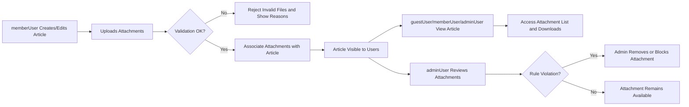

# Functional Requirements for Attachments

## 1. Purpose and Scope

The attachment feature in **discussionBoard** exists to let article authors add supporting images and files (such as charts or reports) to economic and political posts. Attachments are intentionally simple and always belong to articles, never to comments.

Scope:
- In-scope: attaching images and files to articles, viewing and downloading attachments, enforcing simple limits and permissions.
- Out-of-scope: advanced features such as attachment versioning, inline file editing, collaborative document editing, or standalone file repositories.

THE discussionBoard service SHALL keep attachment behavior minimal and predictable so that both users and developers can understand it easily.

## 2. Context and Relationship to Articles

### 2.1 Attachment Role

- THE attachment feature SHALL treat attachments as supplementary resources that help explain, illustrate, or document the article’s economic or political content.
- THE attachment feature SHALL only allow attachments that are linked to a single parent article; attachments SHALL NOT exist independently without an article.

### 2.2 Relationship Rules

- THE attachment feature SHALL associate each attachment with exactly one article.
- WHEN an article is visible to a user according to article visibility rules, THE attachment feature SHALL allow that user to see the list of attachments that remain available for that article.
- WHEN an article becomes hidden or deleted according to moderation or deletion rules, THE attachment feature SHALL prevent regular users from accessing attachments belonging to that article.

### 2.3 Actors in the Attachment Context

Actors:
- guestUser – unauthenticated visitor.
- memberUser – registered user with an account.
- adminUser – administrator with moderation powers.

Actor capabilities in attachment context (high level):
- THE attachment feature SHALL allow guestUser to view attachments of public articles but SHALL NOT allow guestUser to upload or manage attachments.
- THE attachment feature SHALL allow memberUser to upload and manage attachments only on articles they own.
- THE attachment feature SHALL allow adminUser to view and remove attachments for any article as part of moderation and housekeeping.

## 3. Business Purpose and High-Level Rules

### 3.1 Business Purpose

- THE attachment feature SHALL support articles by allowing authors to provide numeric data, graphs, reference documents, and other supporting files.
- THE attachment feature SHALL NOT attempt to interpret attachment content; it SHALL simply store and serve files according to rules in this document.

### 3.2 Core Rules

- THE attachment feature SHALL support at least common web image formats for charts and diagrams (for example, JPEG and PNG) and at least one common document format (for example, PDF) for reports.
- THE attachment feature SHALL keep attachment operations optional; authors SHALL be able to create and edit articles without uploading any attachments.

## 4. Permissions and Responsibilities

### 4.1 Actor Permissions (Narrative)

guestUser:
- THE attachment feature SHALL allow guestUser to see the list of attachments for any article that is public and active.
- THE attachment feature SHALL allow guestUser to download or open attachments from public articles, subject to basic security checks and file type rules.
- THE attachment feature SHALL prevent guestUser from uploading, replacing, or deleting attachments.

memberUser:
- THE attachment feature SHALL allow memberUser to upload attachments when creating an article they own.
- THE attachment feature SHALL allow memberUser to upload additional attachments when editing an article they own, within defined limits.
- THE attachment feature SHALL allow memberUser to remove attachments from an article they own while editing it.
- THE attachment feature SHALL prevent memberUser from modifying attachments on articles they do not own.

adminUser:
- THE attachment feature SHALL allow adminUser to view all attachments, including those belonging to hidden or moderated articles, where needed for moderation.
- THE attachment feature SHALL allow adminUser to remove or disable access to any attachment that violates rules, without requiring deletion of the parent article.

### 4.2 Permission Matrix

| Action ID | Action Description                                    | guestUser | memberUser (own article) | memberUser (others' article) | adminUser |
|----------|--------------------------------------------------------|-----------|---------------------------|-------------------------------|-----------|
| AT1      | View list of attachments on visible article            | ✅        | ✅                        | ✅                            | ✅        |
| AT2      | Download or open attachment of visible article         | ✅        | ✅                        | ✅                            | ✅        |
| AT3      | Upload attachment during article creation              | ❌        | ✅                        | N/A                           | ✅        |
| AT4      | Upload attachment while editing existing article       | ❌        | ✅                        | ❌                            | ✅        |
| AT5      | Remove attachment from article                         | ❌        | ✅ (own only)             | ❌                            | ✅        |
| AT6      | Modify attachment metadata (e.g., display name/order)  | ❌        | ✅ (own only)             | ❌                            | ✅        |

THE permission matrix for attachments SHALL remain consistent with the overall role and permission model used for articles and comments.

## 5. Upload and Association Rules

### 5.1 Eligibility and Preconditions

- WHEN the actor is guestUser, THE attachment feature SHALL deny all upload attempts and SHALL indicate that only members can upload files.
- WHEN the actor is memberUser and is creating a new article, THE attachment feature SHALL allow the actor to upload one or more attachments and associate them with the new article request.
- WHEN the actor is memberUser and is editing an existing article they own, THE attachment feature SHALL allow the actor to upload additional attachments, subject to defined limits.
- WHEN the actor is memberUser and attempts to upload an attachment to an article they do not own, THE attachment feature SHALL deny the upload and SHALL indicate that they cannot modify attachments on others’ articles.
- WHEN the actor is adminUser and is creating or editing any article, THE attachment feature SHALL allow the adminUser to upload attachments and associate them with that article.

### 5.2 Association with Articles

- WHEN an attachment upload succeeds as part of article creation, THE attachment feature SHALL associate the attachment with the new article so that it becomes available once the article is successfully created.
- IF an article creation request fails validation or is cancelled, THEN THE attachment feature SHALL ensure that any uploaded attachments associated only with that failed request are not left visible to any user.
- WHEN an attachment upload succeeds as part of article editing, THE attachment feature SHALL immediately associate the attachment with the existing article so that users with access to the article can see and access it.
- THE attachment feature SHALL ensure that each attachment is linked to exactly one article and SHALL NOT share a single attachment record across multiple articles.

### 5.3 Attachment Ordering and Metadata

- THE attachment feature SHALL maintain a simple, deterministic order for attachments on each article, such as upload order or a user-defined order index.
- WHEN an article with attachments is displayed, THE attachment feature SHALL preserve the chosen attachment order in the list presented to users.
- THE attachment feature SHALL store and display a user-visible filename for each attachment; where necessary, filenames MAY be truncated or normalized to remove unsafe characters while remaining recognizable to users.

## 6. Viewing and Downloading Attachments

### 6.1 Listing Attachments

- WHEN a user views an article that has attachments, THE attachment feature SHALL return a list of all attachments that are still available and visible for that article.
- THE attachment feature SHALL include, for each attachment, at least:
  - User-visible filename.
  - File type or a simple type indicator (for example, image or document).
  - File size, where this information is easily available.

### 6.2 Access Control During Viewing/Downloading

- WHEN an article is publicly visible, THE attachment feature SHALL allow guestUser, memberUser, and adminUser to download or open attachments linked to that article, unless those attachments have been individually removed or blocked.
- WHEN an article is hidden or deleted for moderation reasons, THE attachment feature SHALL prevent guestUser and normal memberUser from viewing or downloading attachments for that article.
- WHERE adminUser has access to hidden or moderated articles, THE attachment feature SHALL also allow adminUser to access attachments linked to those articles.

### 6.3 Behavior by File Type

- WHERE an attachment is recognized as an image, THE attachment feature SHALL allow it to be previewed or displayed inline by the client application, subject to size and performance considerations.
- WHERE an attachment is a non-image file (for example, PDF or office document), THE attachment feature SHALL allow users to download it or open it using normal file-handling mechanisms, without requiring inline editing.

### 6.4 Performance Expectations

- WHEN an article with attachments is loaded, THE attachment feature SHALL provide attachment metadata quickly enough that users perceive the list appearing alongside or shortly after the article body.
- WHEN a user initiates a download or open action on an attachment, THE attachment feature SHALL begin serving the file promptly so that users perceive a direct response.

## 7. Limits and Validation Rules

### 7.1 Allowed File Types

- THE attachment feature SHALL accept a limited set of allowed file types to keep the board safe and manageable.
- WHEN a user attempts to upload a file type outside the allowed set, THE attachment feature SHALL reject the upload and SHALL indicate that the file type is not supported.

### 7.2 File Size Limits

- THE attachment feature SHALL enforce a maximum file size per attachment, expressed as a reasonable upper bound for a simple discussion board.
- WHEN a user attempts to upload a file larger than the allowed maximum size, THE attachment feature SHALL reject the upload and SHALL indicate that the file is too large.
- WHERE multiple attachments are uploaded for the same article, THE attachment feature SHALL enforce a maximum total attachment size per article.
- WHEN an upload would cause the total size of attachments for an article to exceed the allowed maximum, THE attachment feature SHALL reject that upload and SHALL indicate that the attachment size limit for the article has been reached.

### 7.3 Maximum Number of Attachments per Article

- THE attachment feature SHALL enforce a maximum number of attachments that may be associated with a single article.
- WHEN a user attempts to upload an extra attachment after the article already has the maximum allowed number, THE attachment feature SHALL reject only the new attachment and SHALL indicate that the attachment count limit has been reached.

### 7.4 Filename and Metadata Rules

- THE attachment feature SHALL allow filenames to be derived from the uploaded files while removing or replacing characters that are clearly unsafe or not supported.
- WHEN a filename exceeds a configured maximum length, THE attachment feature SHALL either truncate or normalize the displayed name while preserving the file itself and SHALL ensure that users can still distinguish it from other attachments.

### 7.5 Validation Feedback

- WHEN an attachment upload fails due to file type, size, count, or filename limits, THE attachment feature SHALL:
  - Reject the specific attachment.
  - Leave other valid attachments and article content unchanged.
  - Provide a concise message stating which rule was violated (for example, file too large or type not supported).

## 8. Attachment Management and Deletion

### 8.1 Managing Attachments During Article Edit

- WHEN a memberUser edits an article they own, THE attachment feature SHALL display the current list of attachments so the author can review them.
- WHEN a memberUser chooses to remove an attachment from their own article while editing, THE attachment feature SHALL disassociate the attachment from the article and SHALL prevent it from being listed or downloaded in normal article views.
- WHEN a memberUser attempts to remove an attachment from an article they do not own, THE attachment feature SHALL deny the request and SHALL indicate that they cannot modify attachments on someone else’s article.

### 8.2 Admin Moderation of Attachments

- WHEN adminUser reviews an article, THE attachment feature SHALL allow adminUser to see all attachments linked to that article, including those already flagged or reported.
- WHEN adminUser decides that a particular attachment violates content or safety rules, THE attachment feature SHALL allow adminUser to remove or disable that attachment without requiring removal of the article itself.
- WHEN adminUser removes an attachment, THE attachment feature SHALL ensure that it no longer appears in the public attachment list and SHALL prevent regular users from downloading it.

### 8.3 Behavior When Articles Are Hidden or Deleted

- WHEN an article is hidden or soft-deleted by moderation, THE attachment feature SHALL treat its attachments as not accessible to guestUser and normal memberUser.
- WHERE adminUser has tools to review hidden or deleted articles, THE attachment feature SHALL allow adminUser to continue seeing and managing those attachments for moderation or audit purposes.

## 9. Error and Edge-Case Behavior (Attachment-Specific)

### 9.1 Missing or Corrupted Attachment Files

- WHEN an attachment record exists but the underlying file cannot be retrieved (for example, missing or corrupted file), THE attachment feature SHALL:
  - Prevent the file from being downloaded.
  - Indicate that the attachment is unavailable or missing.
  - Continue to display the article and any other valid attachments normally.

### 9.2 Permission Errors

- WHEN guestUser or a memberUser without the required permissions attempts to upload, remove, or change attachments, THE attachment feature SHALL deny the action and SHALL indicate that they do not have permission to manage attachments.
- WHEN a user attempts to download an attachment belonging to an article they are not allowed to view, THE attachment feature SHALL deny access and SHALL indicate that the content is not available.

### 9.3 Partial Upload Failures

- WHEN multiple attachments are uploaded together and some fail validation, THE attachment feature SHALL:
  - Accept and associate only the attachments that pass validation.
  - Clearly identify which attachments failed and why.
  - Avoid leaving users uncertain about which files were accepted.

### 9.4 Rate Limiting and Abuse Protection

- WHERE basic rate limits are configured for uploads (for example, maximum number of attachments per user over a time period), THE attachment feature SHALL enforce these limits to reduce abuse.
- WHEN a user exceeds an upload rate limit, THE attachment feature SHALL reject further uploads during the limit period and SHALL indicate that uploads are temporarily restricted.

## 10. Non-Functional Expectations (Attachment Feature)

### 10.1 Performance

- THE attachment feature SHALL handle typical attachment sizes quickly enough that users perceive uploads and downloads as responsive under normal network conditions.
- WHEN the system is under moderate load, THE attachment feature SHALL continue to provide timely access to attachment lists and downloads consistent with the overall performance expectations of discussionBoard.

### 10.2 Reliability

- THE attachment feature SHALL store attachment data in a way that minimizes the risk of data loss under normal operation.
- WHEN transient errors occur during upload or download, THE attachment feature SHALL fail gracefully, informing users that the operation could not be completed and recommending a retry.

### 10.3 Security (Business-Level)

- THE attachment feature SHALL treat all uploaded files as untrusted content and SHALL avoid executing them on the server.
- THE attachment feature SHALL avoid exposing internal storage paths or infrastructure details in URLs or error messages.
- WHEN attachments are removed for moderation or safety reasons, THE attachment feature SHALL prevent any further standard access by regular users.

## 11. Mermaid Overview Diagram

## 12. Summary of Key Rules and Success Criteria

Key rules:
- Attachments always belong to one article and never stand alone.
- Only memberUser (for their own articles) and adminUser may upload or remove attachments.
- guestUser and memberUser can view and download attachments for articles they are allowed to see.
- Clear limits apply to file types, sizes, and attachment counts, with understandable validation feedback.
- Attachment behavior follows article visibility and moderation rules.

Success criteria:
- WHEN authors use attachments in normal workflows, THE attachment feature SHALL allow them to upload, list, and remove attachments without confusion.
- WHEN visitors browse articles, THE attachment feature SHALL consistently present valid attachments and handle missing or restricted files with clear messages.
- WHEN rule violations or technical issues occur, THE attachment feature SHALL behave predictably, protect users, and keep the overall experience simple and stable.