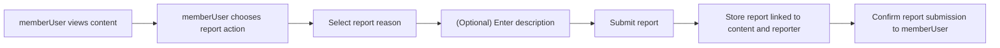
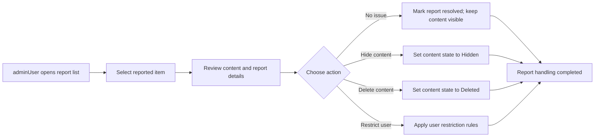

# Content Moderation and Reporting Rules for discussionBoard

## 1. Introduction and Scope

This document defines the business requirements for content moderation and reporting in the **discussionBoard** service, a simple economic/political discussion board. It focuses on how problematic content is reported and handled, and what powers administrators have over content and users. The goal is to keep the board civil and manageable without introducing complex or multi-level workflows.

This document describes **what** the system should do from a business perspective, not **how** it should be implemented technically. All implementation details such as APIs, storage models, database schemas, and infrastructure choices are left to the development team.

### 1.1 In-Scope

- Reporting inappropriate content by users.
- Admin handling of reported content.
- Business rules for content removal and restoration.
- Simple rules for blocking or restricting users.
- User-visible behavior related to moderation decisions.

### 1.2 Out-of-Scope

- Multi-level approval chains or complex review queues.
- Integration with external moderation services or legal authorities.
- Jurisdiction-specific legal compliance rules.
- Detailed technical mechanisms for authentication, logging, or auditing.

## 2. Moderation Objectives

The moderation system exists to keep economic and political discussions constructive, safe, and focused on the intended topics while remaining simple to operate.

### 2.1 Goals

- THE moderation process for discussionBoard SHALL support free and active discussion of economic and political topics within clear civility and safety boundaries.
- THE moderation process for discussionBoard SHALL prevent and reduce visible content that is clearly abusive, hateful, threatening, or spam.
- THE moderation process for discussionBoard SHALL remain simple and linear so that reporting and actions can be completed in a small number of steps.

### 2.2 Success Criteria

- THE moderation process for discussionBoard SHALL achieve a state where most visible content follows basic civility and topic rules.
- THE moderation process for discussionBoard SHALL allow problematic content to be reported and handled in a small number of predictable steps.
- THE moderation process for discussionBoard SHALL ensure that users understand that content may be removed and accounts may be restricted when rules are clearly violated.

## 3. Actors and Responsibilities (Business View)

### 3.1 Actors

- **guestUser**: Unauthenticated visitor.
- **memberUser**: Registered user who can create and manage own articles and comments.
- **adminUser**: Administrator who can manage all content and users.

### 3.2 Responsibilities Related to Moderation

- THE guestUser actor SHALL only view publicly visible content and SHALL NOT have the ability to file reports or apply moderation actions.
- THE memberUser actor SHALL be the primary reporter of problematic content and SHALL be able to submit reports about articles, comments, and attachments.
- THE adminUser actor SHALL be responsible for reviewing reports, deciding whether content or accounts violate rules, and applying the corresponding actions (keep, hide, delete, restrict user).

## 4. Reporting Inappropriate Content

This section defines how problematic content is reported by memberUser actors.

### 4.1 Reportable Content

Reportable content types:
- Articles.
- Comments.
- Attachments (images or files) associated with articles.

EARS-style requirements:

- THE reporting feature for discussionBoard SHALL allow memberUser and adminUser actors to submit reports for any visible article, comment, or attachment.
- THE reporting feature for discussionBoard SHALL NOT allow guestUser actors to submit reports.

### 4.2 Report Reasons

Reports must use a small, fixed set of reasons to keep the system simple. Example categories:
- Hate or abusive content.
- Harassment or personal attacks.
- Spam or advertising.
- Off-topic or low-value content.
- Dangerous or explicitly harmful content.
- Other (free-text explanation).

EARS-style requirements:

- THE reporting feature for discussionBoard SHALL provide a predefined list of report reason categories that is short and easy to understand.
- WHEN a memberUser submits a report, THE reporting feature for discussionBoard SHALL require the selection of exactly one main report reason from the predefined list.
- WHERE a memberUser selects an "Other" reason, THE reporting feature for discussionBoard SHALL require a short free-text explanation from that memberUser.

### 4.3 Reporting Flow (User Perspective)

High-level user flow:
1. memberUser views content.
2. memberUser triggers a report action on a specific article, comment, or attachment.
3. memberUser selects a reason and optionally provides a short description.
4. The system records the report and marks the target as having at least one report.

EARS-style requirements:

- WHEN a memberUser chooses to report a specific piece of content, THE reporting feature for discussionBoard SHALL capture the content type, content identifier, reporter, reason, optional explanation, and time of report.
- WHEN a memberUser submits a completed report, THE reporting feature for discussionBoard SHALL store the report and increase the total report count for that content by one.
- WHEN a report is successfully stored, THE reporting feature for discussionBoard SHALL present a clear confirmation to the reporting memberUser that the report has been received.

### 4.4 Reporting Flow Diagram

## 5. Admin Handling of Reports

This section defines what adminUser can do with reported content and how the process stays linear and simple.

### 5.1 Report Review

Admin users should see reported items in a simple list with basic information.

EARS-style requirements:

- THE report handling feature for discussionBoard SHALL present reported items in a single list view ordered by most recent report time by default.
- WHEN an adminUser opens the report list, THE report handling feature for discussionBoard SHALL display for each report at least the content type, a short summary or snippet of the content, report reason, number of reports for that content, and time of the latest report.

### 5.2 Review Actions

For each reported item, adminUser must be able to choose from a limited set of actions to keep the workflow linear:
- Take no action (dismiss report, content stays visible).
- Hide the content from general users.
- Delete the content permanently.
- Apply or update restrictions on the content owner.

EARS-style requirements:

- WHEN an adminUser opens a specific report, THE report handling feature for discussionBoard SHALL show the full content, the reporting information, and any existing moderation status for that content.
- WHEN an adminUser marks a report as "no issue", THE report handling feature for discussionBoard SHALL set the report status to resolved and SHALL leave the content in its current visible state.
- WHEN an adminUser chooses to hide the content in response to a report, THE report handling feature for discussionBoard SHALL change the content state to Hidden and SHALL prevent guestUser and regular memberUser actors from seeing that content.
- WHEN an adminUser chooses to delete the content in response to a report, THE report handling feature for discussionBoard SHALL change the content state to Deleted and SHALL treat that content as permanently removed from normal access.
- WHEN an adminUser chooses to restrict the content owner in response to a report, THE report handling feature for discussionBoard SHALL apply the configured user restriction level (for example, posting restriction or full block) as defined in the user restriction rules.
- WHEN an adminUser completes an action on a report, THE report handling feature for discussionBoard SHALL mark the report as processed and SHALL make its final state visible in admin reporting views.

### 5.3 Admin Handling Flow Diagram

## 6. Content Removal and Restoration Rules

Content may move between visible and non-visible states based on moderation decisions.

### 6.1 Content States (Business-Level)

For the purposes of moderation, content is considered to be in one of the following states:
- **Active**: Visible to all users with normal access.
- **Hidden**: Not visible to general users, but still retained for possible review or restoration.
- **Deleted**: Considered permanently removed from normal use from a business perspective.

EARS-style requirements:

- THE moderation policy for discussionBoard SHALL classify each article, comment, and attachment into one of the three moderation states: Active, Hidden, or Deleted.
- WHEN content is first created and accepted, THE moderation policy for discussionBoard SHALL set the moderation state of that content to Active.

### 6.2 Rules for Hiding Content

Content may be set to Hidden as a result of admin decisions.

EARS-style requirements:

- WHEN an adminUser decides that content violates rules but should be retained for possible reference, THE moderation policy for discussionBoard SHALL allow the adminUser to change the moderation state of that content to Hidden.
- WHILE content is in the Hidden state, THE moderation policy for discussionBoard SHALL prevent guestUser and regular memberUser actors (other than adminUser and any explicitly allowed roles) from viewing that content in lists or detail views.
- WHILE content is in the Hidden state, THE moderation policy for discussionBoard SHALL allow adminUser actors to view that content with a clear indication that it is Hidden.

### 6.3 Rules for Deleting Content

Some content may be considered fully removed in business terms.

EARS-style requirements:

- WHEN an adminUser decides that content should no longer be stored from a business perspective, THE moderation policy for discussionBoard SHALL allow the adminUser to change the moderation state of that content to Deleted.
- WHILE content is in the Deleted state, THE moderation policy for discussionBoard SHALL prevent all actors, including adminUser, from accessing the content through normal content views.
- THE moderation policy for discussionBoard SHALL treat Deleted content as not restorable through regular moderation tools.

### 6.4 Restoration Rules

Only Hidden content may be restored.

EARS-style requirements:

- WHEN an adminUser later determines that previously Hidden content does not violate rules, THE moderation policy for discussionBoard SHALL allow the adminUser to change the moderation state of that content back to Active.
- IF content is in the Deleted state, THEN THE moderation policy for discussionBoard SHALL NOT provide any restoration option for that content in standard moderation flows.

## 7. Blocking or Restricting Users (Simple Rules)

This section defines minimal, simple rules for limiting abusive users. The focus is on clarity, not granularity.

### 7.1 Types of Restrictions

To keep the model simple, only two levels of user restriction are defined:
- **Posting Restriction**: The user can read content but cannot create new articles or comments.
- **Full Block**: The user cannot use member-only functions, including sign-in for participation.

EARS-style requirements:

- THE user restriction policy for discussionBoard SHALL define two restriction levels for memberUser accounts: Posting Restriction and Full Block.
- WHILE a memberUser account is under Posting Restriction, THE user restriction policy for discussionBoard SHALL allow that memberUser to sign in and read content but SHALL prevent that memberUser from creating articles, creating comments, or uploading attachments.
- WHILE a memberUser account is under Full Block, THE user restriction policy for discussionBoard SHALL prevent that memberUser from using member-only features, including posting content and any interactive participation defined for members.

### 7.2 Triggers for Restrictions

Restrictions are applied based on repeated or severe violations, evaluated by adminUser.

EARS-style requirements:

- WHEN an adminUser observes that a memberUser has accumulated repeated confirmed violations within a defined time window, THE user restriction policy for discussionBoard SHALL treat that memberUser as eligible for at least a Posting Restriction.
- WHEN an adminUser determines that specific behavior by a memberUser is extremely severe or malicious (for example, repeated hate content or severe abuse), THE user restriction policy for discussionBoard SHALL allow the adminUser to apply a Full Block immediately.

### 7.3 Applying and Lifting Restrictions

EARS-style requirements:

- WHEN an adminUser applies a restriction to a memberUser account, THE user restriction policy for discussionBoard SHALL record the restriction level, the time it starts, and a reason category for internal reference.
- WHILE a restriction is active, THE user restriction policy for discussionBoard SHALL enforce the defined limitations on that memberUser’s actions.
- WHEN an adminUser chooses to lift a restriction, THE user restriction policy for discussionBoard SHALL remove the restriction and SHALL allow the memberUser to resume normal permitted actions.

## 8. Error and Edge-Case Behavior (Moderation-Related)

This section focuses on user-facing behavior in typical moderation-related edge cases.

### 8.1 Interactions with Hidden or Deleted Content

EARS-style requirements:

- IF any actor attempts to access content whose state is Hidden and that actor is not permitted to view Hidden content, THEN THE moderation behavior for discussionBoard SHALL respond with a clear indication that the content is not available to that actor.
- IF any actor attempts to access content whose state is Deleted, THEN THE moderation behavior for discussionBoard SHALL respond as if the content does not exist or has been deleted, without revealing internal details.

### 8.2 Reporting Already Handled Content

EARS-style requirements:

- IF a memberUser attempts to report content that is already in the Hidden or Deleted state, THEN THE moderation behavior for discussionBoard SHALL prevent the new report from being stored and SHALL indicate that the content has already been handled or is no longer available.

### 8.3 Actions by Restricted Users

EARS-style requirements:

- IF a memberUser under Posting Restriction attempts to create an article, create a comment, or upload an attachment, THEN THE moderation behavior for discussionBoard SHALL deny the action and SHALL clearly indicate that the account is currently restricted from posting.
- IF a memberUser under Full Block attempts to sign in or perform any member-only action, THEN THE moderation behavior for discussionBoard SHALL deny the action and SHALL indicate that the account is blocked.

## 9. Performance and Simplicity Expectations

Moderation and reporting must feel responsive but remain operationally simple.

EARS-style requirements:

- WHEN a memberUser submits a report under normal service conditions, THE moderation process for discussionBoard SHALL confirm that the report has been received within a short time that feels immediate to typical users.
- WHEN an adminUser opens the report list under normal service conditions, THE moderation process for discussionBoard SHALL return the list of reports without noticeable delay for typical report volumes.
- THE moderation process for discussionBoard SHALL keep the number of steps to handle a report small and linear, using simple actions such as keep, hide, delete, or restrict user, without multi-stage approval chains.

## 10. Summary of Key Business Rules

- THE reporting feature for discussionBoard SHALL allow memberUser and adminUser actors to report any visible article, comment, or attachment using a short list of predefined reasons.
- THE report handling feature for discussionBoard SHALL provide adminUser actors with a single, ordered list of reported content and SHALL allow each item to be resolved by choosing a simple action such as keep, hide, delete, or restrict user.
- THE moderation policy for discussionBoard SHALL classify content into Active, Hidden, or Deleted states and SHALL define clear rules for transitions between these states.
- THE user restriction policy for discussionBoard SHALL define only two restriction levels (Posting Restriction and Full Block) and SHALL allow adminUser actors to apply and remove these restrictions based on repeated or severe rule violations.
- THE moderation behavior for discussionBoard SHALL provide clear, predictable responses for attempts to access Hidden or Deleted content, for attempts to report already handled content, and for actions initiated by restricted users.

These rules provide the business foundation for moderation and reporting in the simple economic/political discussionBoard service. The development team retains full autonomy to design the technical architecture, APIs, data structures, and storage mechanisms that satisfy these requirements.