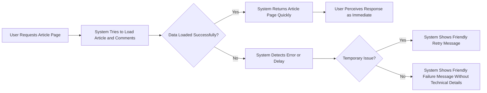
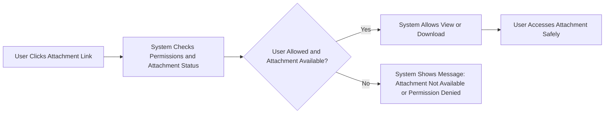

# Non-Functional Requirements for Simple Economic/Political Discussion Board

## 1. Introduction

This document defines the non-functional requirements of the **discussionBoard** service, a simple economic/political discussion board. It focuses on how the system should behave from a quality and user-experience perspective rather than what features it offers.

The scope of this document includes four major quality areas:
- Performance expectations
- Availability and reliability expectations
- Basic security and privacy expectations
- Data retention and deletion expectations

All requirements are written in business-oriented terms so that backend developers can freely choose technical implementations. Requirements are expressed using EARS syntax where applicable, with keywords (WHEN, WHILE, IF, THEN, WHERE, THE, SHALL) in English and descriptions in natural English.

The system serves three actors:
- guestUser: unauthenticated visitors who browse public content
- memberUser: registered members who create and manage their own content
- adminUser: administrators who manage users and content

Non-functional requirements apply across these actors unless explicitly scoped to a specific actor.

---

## 2. Performance Expectations

This section defines how responsive and efficient the system must feel from the user perspective. No concrete infrastructure or numeric throughput targets are mandated; instead, the focus is on perceived responsiveness and predictability for a simple discussion board.

### 2.1 General Responsiveness

- THE discussionBoard service SHALL provide responses that feel quick and predictable for common actions like listing articles, opening an article, posting comments, and uploading typical attachments.

- WHEN a user loads the main article list of a board, THE discussionBoard service SHALL present the list in a way that feels responsive and does not leave the user waiting without visible progress.

- WHEN a user opens a specific article including its comments and attachment metadata, THE discussionBoard service SHALL return the article content in a way that feels nearly immediate for typical article sizes.

- WHEN a user performs a simple search or filter operation on articles (such as searching by keyword, category, or basic time range), THE discussionBoard service SHALL return matching results in a way that feels similar in speed to loading the default list view.

- WHEN a user submits a new article, THE discussionBoard service SHALL confirm creation in a way that feels immediate, without requiring the user to refresh manually.

- WHEN a user submits a new comment, THE discussionBoard service SHALL confirm creation and make the comment visible in the article view in a way that feels immediate.

### 2.2 Perceived Time Boundaries (User-Oriented)

This subsection defines performance in terms of user perception rather than strict numeric latency metrics.

- THE discussionBoard service SHALL handle common read actions (viewing lists and individual articles with comments) fast enough that users perceive them as "instant" or only a brief pause.

- THE discussionBoard service SHALL handle common write actions (posting or editing articles/comments without attachments) fast enough that users perceive them as only a short moment and not as a long wait.

- WHEN a user uploads a small or moderate attachment file (for example, typical document or image sizes for web use), THE discussionBoard service SHALL handle the upload in a way that gives clear feedback that progress is occurring and does not appear stalled.

- WHEN a user attempts an action that may naturally take longer (such as uploading larger attachments within allowed limits), THE discussionBoard service SHALL make it clear that the action is in progress so that users do not interpret the delay as a system failure.

### 2.3 List Size and Pagination Behavior

- THE discussionBoard service SHALL present article lists and comment lists in manageable page sizes so that users do not experience long waits due to excessively large result sets.

- WHEN a user navigates between pages of article lists, THE discussionBoard service SHALL load the next page in a way that feels similar in speed to the initial list load.

- WHEN a user navigates between pages of comments on a long discussion, THE discussionBoard service SHALL load those pages in a way that feels similar in speed to loading the article itself.

- WHERE the number of available results is large, THE discussionBoard service SHALL use simple, predictable pagination rather than continuous, hard-to-control loading behaviors from the user’s perspective.

### 2.4 Performance Under Moderate Load

The system is intended to be simple and will not assume extremely high traffic levels, but it must remain usable under moderate, realistic usage.

- WHILE the discussionBoard service is under typical daily usage with multiple concurrent guestUser and memberUser actions, THE discussionBoard service SHALL maintain response characteristics that align with the responsiveness expectations described in this section.

- IF the discussionBoard service experiences unusually high activity beyond typical expectations (for example, during a sudden influx of visitors due to a hot topic), THEN THE discussionBoard service SHALL degrade gracefully by still allowing reading and basic actions rather than failing entirely, even if some operations become slower or temporarily restricted.

- IF performance-related protection measures are applied (for example, rate limiting or temporary restrictions on heavy operations), THEN THE discussionBoard service SHALL communicate this to users in clear, user-friendly messages rather than failing silently.

---

## 3. Availability and Reliability Expectations

This section describes how consistently the system should be available and how it should behave when failures or maintenance occur.

### 3.1 General Availability

- THE discussionBoard service SHALL be available for use by guestUser, memberUser, and adminUser for the majority of normal days, reflecting a stable and reliable discussion space.

- WHEN users access the service during normal hours, THE discussionBoard service SHALL respond rather than showing generic server failure or browser errors.

- WHILE scheduled maintenance is in progress, THE discussionBoard service SHALL display clear maintenance information instead of leaving users with unexplained errors.

### 3.2 Behavior During Failures

- IF an internal error occurs while processing a request, THEN THE discussionBoard service SHALL respond with a user-friendly error message that does not expose internal technical details.

- IF a user attempts to repeat the same request after a transient failure, THEN THE discussionBoard service SHALL allow the retry and behave consistently, avoiding duplicated side effects wherever possible.

- IF the discussionBoard service temporarily cannot access certain data needed to complete a request (for example, an article list or attachment metadata), THEN THE discussionBoard service SHALL inform the user that the data is temporarily unavailable and suggest trying again later, without implying permanent loss.

- IF a previously available article, comment, or attachment becomes unavailable due to deletion, moderation, or data retention policies, THEN THE discussionBoard service SHALL handle this as a predictable scenario, as defined in the error-handling document, rather than as an unexpected system error.

### 3.3 Session and State Reliability

- THE discussionBoard service SHALL treat user sessions and authentication state in a stable way such that users are not unexpectedly logged out during normal activity.

- WHEN a memberUser performs a series of actions in a short period (for example, posting an article followed by several comments), THE discussionBoard service SHALL preserve the memberUser’s authenticated state for the duration of those actions.

- IF a user session expires based on business rules, THEN THE discussionBoard service SHALL require the user to sign in again and provide a clear message indicating that the session expired.

### 3.4 Consistency of Data from User Perspective

- THE discussionBoard service SHALL present a consistent view of data during typical operations, so that users do not see contradictory states (for example, an article showing as both present and deleted in different parts of the interface).

- WHEN a memberUser submits an article or comment and receives a success confirmation, THE discussionBoard service SHALL ensure that subsequent views of the relevant list or article reflect the submitted content.

- IF a write operation partially fails (for example, article saved but attachment upload failed), THEN THE discussionBoard service SHALL provide clear information about which parts succeeded and which failed, guiding the user on how to proceed.

### 3.5 Maintenance Windows and Changes

- WHERE scheduled maintenance or significant changes are planned, THE discussionBoard service SHALL provide advance notice to users in a way that can be communicated through the service itself or other agreed channels.

- WHILE scheduled maintenance is ongoing, THE discussionBoard service SHALL either be unavailable with a clear maintenance message or operate in a restricted but predictable mode, rather than failing randomly.

---

## 4. Basic Security and Privacy Expectations

This section defines high-level security and privacy expectations from a user’s point of view. It does not specify technical authentication mechanisms or cryptographic details; those are left to the development team.

### 4.1 Protection of User Accounts

- THE discussionBoard service SHALL protect memberUser and adminUser accounts such that other parties cannot impersonate them through normal usage of the service.

- WHEN a memberUser or adminUser signs in with valid credentials, THE discussionBoard service SHALL recognize them as the correct account owner for the duration of a valid session.

- IF a user provides incorrect sign-in information, THEN THE discussionBoard service SHALL refuse access and provide a generic error message without revealing which specific part of the credentials was wrong.

- IF suspicious authentication behavior is detected based on business rules (for example, repeated failed sign-in attempts from the same source), THEN THE discussionBoard service SHALL apply protective measures such as temporary blocking or additional verification steps as defined by the development team, and present user-friendly explanations whenever possible.

### 4.2 Access Control to Content

- THE discussionBoard service SHALL ensure that only authorized actors can perform write or moderation actions on content according to the permissions defined in the user-actors document.

- WHEN a guestUser browses the discussionBoard service, THE discussionBoard service SHALL allow viewing of public articles and related public comments but SHALL prevent creation, editing, or deletion of content.

- WHEN a memberUser attempts to edit or delete their own articles or comments, THE discussionBoard service SHALL allow the action if it meets the business rules for editing and deletion time windows.

- IF a memberUser attempts to modify content that does not belong to them, THEN THE discussionBoard service SHALL deny the action and clearly indicate that they do not have permission.

- WHEN an adminUser manages content or users, THE discussionBoard service SHALL allow broader actions (such as removing problematic content or managing accounts) in alignment with moderation and account rules.

### 4.3 Protection of Personal and Sensitive Information

The service is simple, but it still must respect basic privacy expectations.

- THE discussionBoard service SHALL store and process personal information (such as email addresses and any profile data) in a way that is not visible to other regular users unless explicitly designed as public information (for example, a public display name).

- WHEN displaying user-related information with articles or comments (such as author name), THE discussionBoard service SHALL use only the information that is explicitly intended to be public, such as a chosen display name or anonymized identifier.

- IF a user changes their profile information (for example, display name), THEN THE discussionBoard service SHALL update future displays of authored content to show the new public information, according to business rules for historical content.

- IF a user requests account closure under the account rules, THEN THE discussionBoard service SHALL handle personal information in a manner consistent with the data retention and deletion expectations, avoiding unnecessary retention of identifiable personal details.

### 4.4 Handling of Attachments from Security and Privacy View

- THE discussionBoard service SHALL treat uploaded attachments as potentially untrusted files and SHALL not expose hidden technical metadata or internal file paths to end users.

- WHEN a user accesses an attachment, THE discussionBoard service SHALL allow only viewing or downloading behaviors that are safe from a typical user perspective, without executing uploaded files on the server side.

- IF an attachment is detected or flagged as inappropriate or unsafe according to business rules or moderation processes, THEN THE discussionBoard service SHALL prevent further standard access to it and provide replacement messaging (for example, indicating that the attachment was removed or blocked).

- WHERE file type or size restrictions are defined in the attachments requirements, THE discussionBoard service SHALL enforce these restrictions consistently and provide clear feedback when a file is rejected.

### 4.5 Privacy of Activity and Logs (User-Oriented)

- THE discussionBoard service SHALL limit visibility of internal activity logs to adminUser and system operators, ensuring that regular users cannot access detailed logs of other users’ actions.

- WHEN logs or activity records are used for moderation or troubleshooting, THE discussionBoard service SHALL treat them as internal information and SHALL not expose them in full to regular users.

- WHERE basic activity information is shown to users (for example, timestamps of posts or edits), THE discussionBoard service SHALL restrict this to information that is clearly relevant to the discussion context and not to internal system operations.

---

## 5. Data Retention and Deletion Expectations

This section describes how long different kinds of data should be kept and how they should be handled when deleted, from a user-experience perspective. Exact technical deletion mechanisms are left to the development team.

### 5.1 Articles and Comments

- THE discussionBoard service SHALL retain articles and comments for as long as they remain relevant to the discussionBoard’s purpose, unless removed due to moderation decisions or user actions allowed by business rules.

- WHEN a memberUser deletes their own article within allowed rules, THE discussionBoard service SHALL remove it from normal browsing and searching in a way that makes it clear to other users that the content is no longer available.

- WHEN a memberUser deletes their own comment within allowed rules, THE discussionBoard service SHALL remove it from normal article viewing so that it does not appear in the visible comment list.

- IF an article or comment is removed by adminUser for moderation reasons, THEN THE discussionBoard service SHALL hide it from normal views and apply replacement messaging or indicators according to moderation rules, making it clear that the content was removed by moderation rather than simply missing.

- WHERE soft-deletion rules are applied for operational reasons, THE discussionBoard service SHALL behave as if the content is deleted from the user perspective, even if it remains internally for a limited period.

### 5.2 Attachments

- THE discussionBoard service SHALL retain attachments only while they are associated with existing articles or comments and remain within the allowed retention period and rules.

- WHEN an article or comment that owns attachments is deleted by business rules, THE discussionBoard service SHALL treat the associated attachments as no longer normally accessible to users.

- IF an attachment is removed due to moderation action, THEN THE discussionBoard service SHALL prevent regular users from downloading it and SHALL indicate that the attachment is no longer available.

- WHERE data retention policies require eventual removal of orphaned or outdated attachments, THE discussionBoard service SHALL ensure that users do not see broken or misleading links; instead, it SHALL present clear messages that the attachment has expired or was removed.

### 5.3 User Accounts and Profile Data

- THE discussionBoard service SHALL retain memberUser and adminUser account information for as long as the account remains active or in a suspended-but-not-closed state, following the business rules for account management.

- WHEN a memberUser requests account closure according to the account rules, THE discussionBoard service SHALL remove or anonymize personal profile information to the extent defined by business policies, while allowing discussion content retention rules to remain in effect.

- WHERE account closure policies allow past articles and comments to remain visible, THE discussionBoard service SHALL ensure that any remaining content no longer exposes detailed personal identifying information beyond what is allowed (for example, using an anonymized label instead of a personal name).

- IF an account is suspended or blocked, THEN THE discussionBoard service SHALL prevent sign-in and certain actions according to suspension rules but SHALL keep enough internal information to manage the suspension and possible reinstatement.

### 5.4 Logs and System Records

- THE discussionBoard service SHALL retain internal logs and system records for a period sufficient to support troubleshooting, security monitoring, and moderation, consistent with simple and reasonable operational needs.

- WHERE logs contain identifiers that could be linked to individual users, THE discussionBoard service SHALL treat these logs as non-public and SHALL avoid exposing them in ways that allow other regular users to track or profile individuals.

- IF log retention periods are reached, THEN THE discussionBoard service SHALL allow or perform removal or anonymization of older log entries such that they are no longer directly linked to individuals while still supporting aggregate analysis if required.

### 5.5 Consistency of Deletion Behavior

- THE discussionBoard service SHALL apply deletion and retention rules consistently for all users of the same type to avoid confusion or a perception of unfair treatment.

- WHEN data is deleted or anonymized according to retention rules, THE discussionBoard service SHALL ensure that remaining references to that data do not mislead users into believing it still exists.

- IF a user attempts to access data that has been removed by retention or deletion policies, THEN THE discussionBoard service SHALL respond with a clear message that the data is no longer available rather than a generic error.

---

## 6. Non-Functional Requirements Summary (Checklist)

This section provides a concise checklist-style summary for reference. Each bullet corresponds to detailed requirements in previous sections.

### 6.1 Performance Checklist

- THE discussionBoard service SHALL provide quick, predictable responses for common read and write actions.
- THE discussionBoard service SHALL make uploads feel responsive and show progress or clear feedback.
- THE discussionBoard service SHALL use manageable pagination for large lists.
- THE discussionBoard service SHALL degrade gracefully under unusual spikes in activity and communicate any protective limits.

### 6.2 Availability and Reliability Checklist

- THE discussionBoard service SHALL be stably available during normal usage periods.
- THE discussionBoard service SHALL show clear maintenance messages during scheduled downtime.
- THE discussionBoard service SHALL provide user-friendly error messages without exposing internal details.
- THE discussionBoard service SHALL keep user sessions stable and predictable.
- THE discussionBoard service SHALL show consistent data states after successful operations.

### 6.3 Security and Privacy Checklist

- THE discussionBoard service SHALL protect user accounts from unauthorized access.
- THE discussionBoard service SHALL enforce content access permissions based on actor type.
- THE discussionBoard service SHALL limit exposure of personal information to what is explicitly intended as public.
- THE discussionBoard service SHALL treat attachments as potentially untrusted and prevent unsafe behaviors.
- THE discussionBoard service SHALL keep detailed activity logs non-public and restricted.

### 6.4 Data Retention and Deletion Checklist

- THE discussionBoard service SHALL retain articles and comments as long as appropriate and clearly indicate when content is removed.
- THE discussionBoard service SHALL handle attachments consistently with their related content and retention policies.
- THE discussionBoard service SHALL provide clear rules for account closure, suspension, and anonymization of data.
- THE discussionBoard service SHALL manage logs with reasonable retention and privacy constraints.
- THE discussionBoard service SHALL present clear messages when data is no longer available due to deletion or retention rules.

---

## 7. Mermaid Diagrams of Key Quality Scenarios

### 7.1 Performance and Error Handling for Article View

### 7.2 Privacy-Aware Access to Attachment

These diagrams illustrate how performance, reliability, and security/privacy expectations combine to shape observable behavior of the discussionBoard service in common scenarios.
